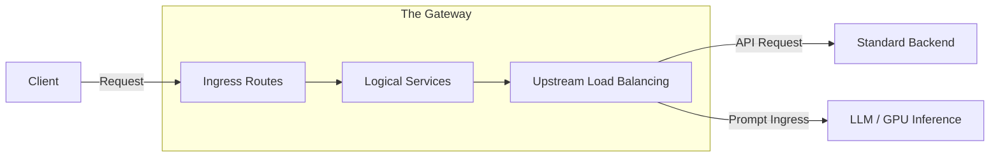
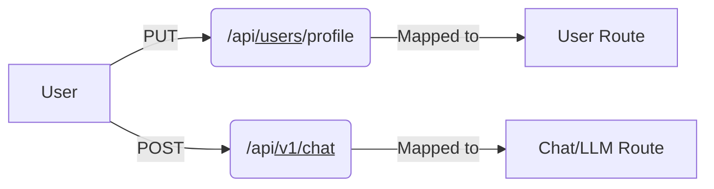
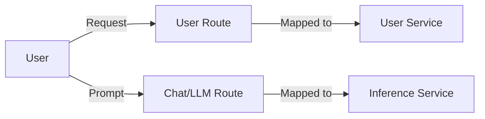
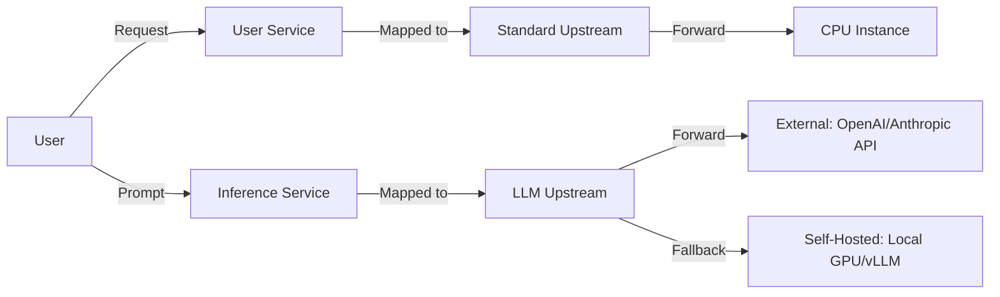
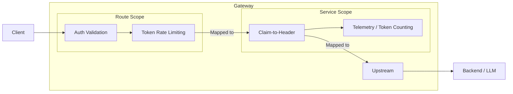
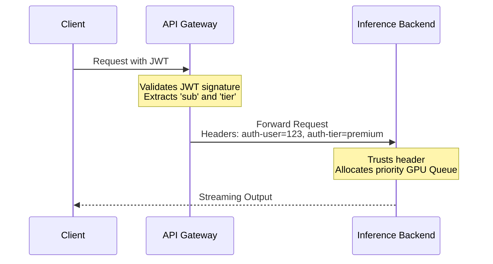

  

    <h1 style="font-size: 3.8rem; line-height: 1.2; margin-bottom: 0.5em;">Gateways, Guardrails & the Reality of GenAI Systems</h1>
    

      By Susmit Vengurlekar (@susmitpy)
    

  

---
src: ./pages/disclaimer.md
---

---
src: ./pages/about.md
---

---
src: ./pages/ice_breaker.md
---

---

# 🗺️ Agenda

Here is our roadmap for the next ~ 33 minutes:

<v-clicks>

* 🚀 **[25 min] Core Concepts & GenAI:** API / AI Gateways, AuthN/Z, and LLM Observability
* ❓ **[1 min] Promotion:** Mandatory ForQuiz plug 
* 🔑 **[2 min] Key Takeaways:** Spoiler, Nothing related to the talk
* 🎤 **[5 min] Q & A:** You ask, someone from audience answers

</v-clicks>

---

# 💥 The Problem: Microservice & GenAI Sprawl

Building a single-tenant GenAI app is easy. Scaling it to production is hard.

<v-clicks>

* 💸 **The Single-Tenant Trap:** GenAI without AuthN/Z leads to untracked costs and "bill shock". You cannot rate-limit what you cannot attribute!
* 🕵️ **The Black Box:** Without observability, an LLM agent stuck in a loop or hallucinating is impossible to debug.
* 🔁 **Duplication of Effort:** Implementing Auth, JWT validation, and Token Tracking in *every single service*.
* 🔗 **Tight Coupling:** Hardcoding LLM providers (OpenAI, Anthropic) directly into business logic.

</v-clicks>

---

  <b class="text-xl text-pink-400">🙋‍♂️ Audience Question:</b> How many of you have deployed an LLM app and accidentally left it open to unlimited API calls? Be honest! 😅

---

# 🌉 Anatomy of a Gateway (API & AI)

A single entry point, abstracting backend architecture and AI models.

---

# 🌉 Anatomy of a Gateway

## 1. Ingress Routes

Mapping external requests to internal boundaries (Traditional & AI).

---

# 🌉 Anatomy of a Gateway

## 2. Logical Services

Abstracting the compute. Is it a database CRUD app, or an AI Model?

---

# 🌉 Anatomy of a Gateway

## 3. Upstream Load Balancing

Separating CPU workloads from GPU workloads and external providers.

---

# 🔐 Authentication vs Authorization in GenAI

Identity, Access, and Cost Allocation.

<v-clicks>

* 🛡️ **Authentication (AuthN):** Verifying identity.
    * *Example:* Checking a password, validating a JWT signature.
    * *Gateway Role:* Ideal. Validate tokens centrally.

* 🔑 **Authorization (AuthZ):** Determining permissions.
    * *Example:* Can user X view record Y? Can POST to `/payments` to create payment ?
    * *Gateway Role:* Basic RBAC (Role-Based Access Control) is possible. Fine-grained, business-logic-heavy AuthZ usually stays in the backend.

</v-clicks>

---

# 🎟️ The JWT Lifecycle

<b>Gateway Role:</b> Validate JWT centrally. If token is invalid, drop the request before hitting expensive GPU instances.

<v-clicks>

* 🧠 **Authorization (AuthZ) & Multi-Tenancy in GenAI:**
    * *Standard:* Can user X view record Y?
    * *GenAI:* Is this tenant allowed to use the `GPT-4` route, or only `Llama-3-8B`? Are they within their **token rate-limit** quota? 
    * *Security:* AuthZ prevents one compromised tenant from exhausting your entire organization's LLM API budget.

</v-clicks>

---

# 🔌 The Middleware/Plugin Pattern for Microservices

 

---

# 💉 Claim-to-Header Injection (Tenant Allocation)

---

# 📊 Observability (LLMOps)

Gaining visibility into the GenAI black box.

<v-clicks>

* 📝 **Logs:** Not just errors. Tracking prompts, responses, and tool outputs (with PII masking at the gateway).
* 📈 **Metrics (The GenAI Additions):** 
    * *Latency:* **TTFT** (Time to First Token) vs Total Generation Time.
    * *Usage:* Input Tokens, Output Tokens, Cost per Tenant.
* 🕸️ **Traces:** Journey of a request across distributed systems. Crucial for debugging slow RAG pipelines or erratic Agents.
* 🛡️ **Gateway Advantage:** The Gateway initiates the distributed trace (OpenTelemetry) and standardizes token metrics regardless of whether the backend is OpenAI or a self-hosted GPU.

</v-clicks>

---

# 🕵️‍♂️ Tracing Agents & Sandboxes

Distributed tracing (OpenTelemetry) makes complex Agent loops observable.

```mermaid
gantt
    dateFormat  s
    axisFormat  %S
    title OpenTelemetry Trace: Agent execution
    
    section Orchestrator
    Agent Planning               :a1, 1, 2s

    section LLM / GPU Node
    Reason & Select Tools    :a2, 2, 3s
    Agentic RAG Loop           :a3, 5, 5s
    Write Code in Sandbox           :a4, 10, 4s
    Synthesize Output       :a5, 17, 3s
    
    section Code Sandbox
    Spin up Container            :a6, 3, 10s
    Execute Python Tool          :a7, 14, 3s
```

Span Attributes attached: Agent ID, Tool Name, Container ID, Container Resources, Host Instance, Token Count, Latency.

---

# 📦 Containerization & Isolation

* 🐳 **Docker Containers:** Package the application code, ensuring consistent execution.

<v-clicks>

* 🏖️ **GenAI Sandboxing:** 
    * Agents that write and execute code *must* do so in isolated, ephemeral sandbox containers (without network access to your DB!).
* 🚦 **Gateway Networking Strategy:**
    * Gateway sits on the "external" edge.
    * CPU Orchestration / Backends sit on internal networks.
    * Self-hosted GPU instances and Agent Sandboxes are highly restricted, isolated nodes. The Gateway ensures strict AuthZ before any traffic reaches them.

</v-clicks>

---

# 🌍 The Open-Source Landscape

Abstracting these concerns is a community-wide effort.

  

    <h2 class="text-cyan-400 mb-4 border-b border-gray-700 pb-2">🚦 Gateways & Orchestration</h2>
    <ul>
      <li><b>Kong API Gateway / LiteLLM</b></li>
      <li><b>Envoy Proxy</b> (Istio, Gloo)</li>
      <li><b>vLLM / Ollama</b> (Self-hosted Inference)</li>
    </ul>
  

  

    <h2 class="text-pink-400 mb-4 border-b border-gray-700 pb-2">📊 Observability (LLMOps)</h2>
    <ul>
      <li><b>OpenTelemetry</b> (Traces & Tokens)</li>
      <li><b>OpenObserve</b> (Logs/Traces/Metrics)</li>
      <li><b>Langfuse / Arize</b> (GenAI specific)</li>
      <li><b>Prometheus & Grafana</b></li>
    </ul>
  

---
layout: center
class: text-center
---

# 💻 Output

Let's see the end result

And not 'Kyu, kaha, kaise'

  
  

    <a href="https://github.com/susmitpy/docker-kong-fastapi-otel-openobserve" class="text-xl font-mono text-cyan-400 hover:text-pink-400 transition-colors">
      Scan for GitHub Repo
    </a>
  

---
src: ./pages/forquiz.md
---

---

# 🔑 Key Takeaway #1

<v-click>

  

    Fundamentals &gt; Syntax
  

  

    for vs while ≠ fundamental
  

  

    Understanding iteration + mutation = fundamental
  

</v-click>

---

# 🔑 Key Takeaway #2

<v-click>

  

    HI &gt;&gt; AI
  

  

    "Is my architecture solid?" ≠ valid prompt
  

  

    There is no "solid". Architecture is about trade-offs requiring conceptual knowledge & practicality.
  

</v-click>

---

# 🔑 Key Takeaway #3

<v-click>

  

    

    
  

  

    

      "AI connects existing dots. Humans create new ones."
    

    

      An LLM sees hardware as compute power. It takes  human curiosity  and out-of-the-box  Jugaad  to look at e-waste and create a  Jakaas  masterpiece.
    

  

</v-click>

---

# 🔑 Key Takeaway #4

<v-click>

  AI is learning, 
  Are you ?

</v-click>

---
src: ./pages/connect.md
---

---
src: ./pages/qa.md
---