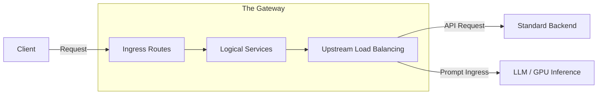
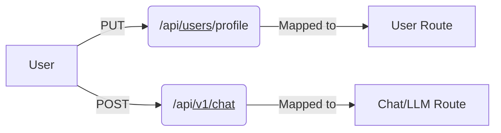
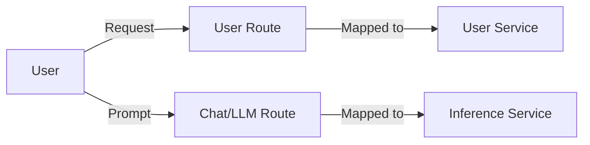
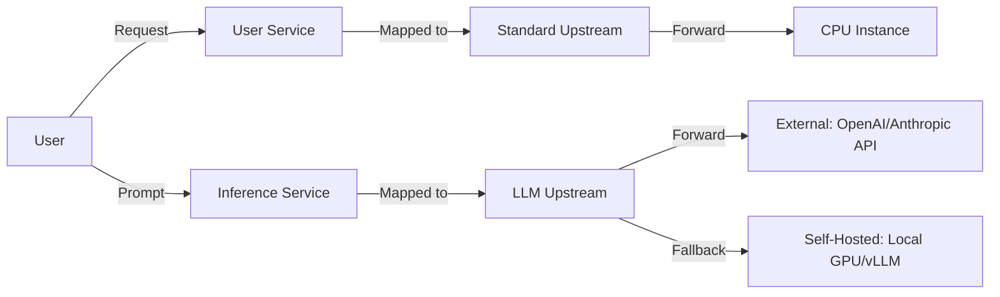
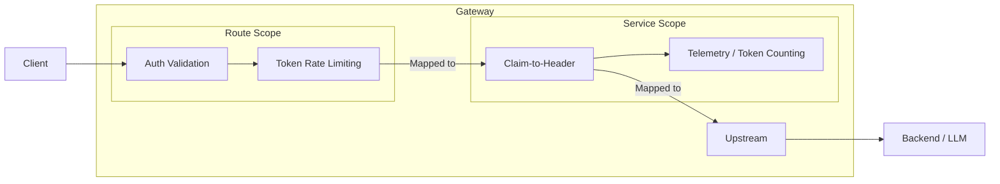
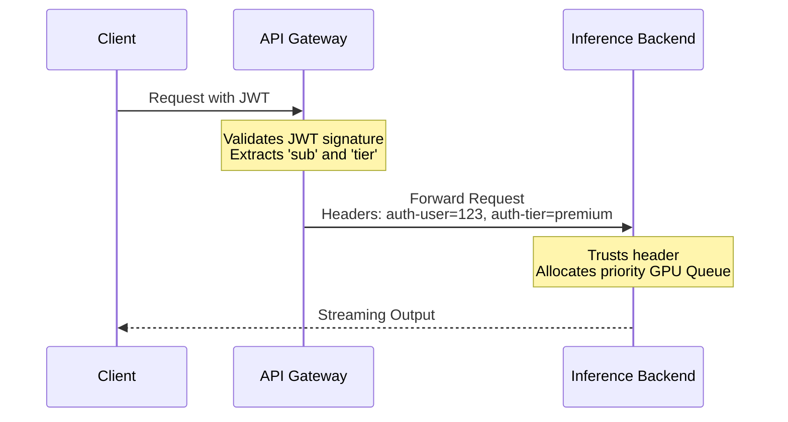

# Abstracting Cross-Cutting Concerns 

 

 AuthN/Z and Observability at the GenAI Edge 

 

### By Susmit Vengurlekar (@susmitpy)

---
src: ./pages/disclaimer.md
---

---
src: ./pages/bug.md
---

---
src: ./pages/about.md
---

---
src: ./pages/ice_breaker.md
---

---

# Agenda

How we'll spend our ~ 30 minutes together:

<v-clicks>

* **[20 min] Core Concepts & GenAI:** API / AI Gateways, AuthN/Z, and LLM Observability
* **[5 min] Demo:** Seeing it in action (Kong, FastAPI, OpenObserve)
* **[5 min] Q & A:** Your questions

</v-clicks>

---

# The Problem: Microservice & GenAI Sprawl

Building a single-tenant GenAI app is easy. Scaling it to production is hard.

* **The Single-Tenant Trap:** GenAI without AuthN/Z (multi-tenancy) leads to untracked costs and "bill shock". You cannot rate-limit or bill what you cannot attribute.
* **The Black Box:** Without observability, an LLM agent stuck in a loop or hallucinating is impossible to debug.
* **Duplication of Effort:** Implementing Auth, JWT validation, and Token Tracking in every single service or AI script.
* **Tight Coupling:** Hardcoding LLM providers (OpenAI, Anthropic) vs. self-hosted GPU inferences directly into business logic.

---

# Anatomy of a Gateway (API & AI)

A single entry point, abstracting backend architecture and AI models.

---

# Anatomy of a Gateway

## Ingress Routes

Mapping external requests to internal boundaries (Traditional & AI).

---

# Anatomy of a Gateway

## Logical Services

Abstracting the compute. Is it a database CRUD app, or an AI Model?

---

# Anatomy of a Gateway

## Upstream Load Balancing (The GenAI Split)

Separating CPU workloads from GPU workloads and external providers.

---

# Authentication vs Authorization in GenAI

Identity, Access, and Cost Allocation.

<v-clicks>

* **Authentication (AuthN):** Verifying identity.
    * *Example:* Checking a password, validating a JWT signature.
    * *Gateway Role:* Ideal. Validate tokens centrally.

* **Authorization (AuthZ):** Determining permissions.
    * *Example:* Can user X view record Y? Can POST to /payments to create payment ?
    * *Gateway Role:* Basic RBAC (Role-Based Access Control) is possible. Fine-grained, business-logic-heavy AuthZ usually stays in the backend.

</v-clicks>

---

# The JWT Lifecycle
Gateway Role:* Validate JWT centrally. If token is invalid, drop the request before hitting expensive GPU instances.

* **Authorization (AuthZ) & Multi-Tenancy:**
    * *Standard:* Can user X view record Y?
    * *GenAI:* Is this tenant allowed to use the `GPT-4` route, or only `Llama-3-8B`? Are they within their **token rate-limit** quota? 
    * *Security:* AuthZ prevents one compromised tenant from exhausting your entire organization's LLM API budget.

</v-clicks>

---

# The Middleware/Plugin Pattern

 

---

# Claim-to-Header Injection (Tenant Allocation)

---

# Observability (LLMOps)

Gaining visibility into the GenAI black box.

<v-clicks>

* **Logs:** Not just errors. Tracking prompts, responses, and tool outputs (with PII masking at the gateway).
* **Metrics (The GenAI Additions):** 
    * *Latency:* **TTFT** (Time to First Token) vs Total Generation Time.
    * *Usage:* Input Tokens, Output Tokens, Cost per Tenant.
* **Traces:** Journey of a request across distributed systems. Crucial for debugging slow RAG pipelines or erratic Agents.
* **Gateway Advantage:** The Gateway initiates the distributed trace (OpenTelemetry) and standardizes token metrics regardless of whether the backend is OpenAI or a self-hosted GPU.

</v-clicks>

---

# Tracing Agents & Sandboxes

Distributed tracing (OpenTelemetry) makes complex Agent loops observable.

```mermaid
gantt
    dateFormat  s
    axisFormat  %S
    title OpenTelemetry Trace: Agent execution
    
    section Gateway
    Inbound Request (API)        :a1, 0, 10s
    
    section Orchestrator
    Agent Planning               :a2, 1, 2s
    
    section LLM / GPU Node
    LLM: Reason & Select Tool    :a3, 2, 4s
    LLM: Synthesize Output       :a6, 8, 10s
    
    section Code Sandbox
    Spin up Container            :a4, 4, 5s
    Execute Python Tool          :a5, 5, 8s
```

<b>Span Attributes attached:</b> Agent ID, Tool Name, Container ID, Host Instance, Token Count, Latency.

---

# Containerization & Isolation

* **Docker Containers:** Package the application code, ensuring consistent execution.

<v-clicks>

* **GenAI Sandboxing:** 
    * Agents that write and execute code *must* do so in isolated, ephemeral sandbox containers (without network access to your DB!).
* **Gateway Networking Strategy:**
    * Gateway sits on the "external" edge.
    * CPU Orchestration / Backends sit on internal networks.
    * Self-hosted GPU instances and Agent Sandboxes are highly restricted, isolated nodes. The Gateway ensures strict AuthZ before any traffic reaches them.

</v-clicks>

---

# The Open-Source Landscape

Abstracting these concerns is a community-wide effort.

  

    <h2>Gateways & Orchestration</h2>
    <ul>
      <li><b>Kong API Gateway / LiteLLM</b></li>
      <li><b>Envoy Proxy</b> (Istio, Gloo)</li>
      <li><b>vLLM / Ollama</b> (Self-hosted Inference)</li>
    </ul>
  

  

    <h2>Observability (LLMOps)</h2>
    <ul>
      <li><b>OpenTelemetry</b> (Traces & Tokens)</li>
      <li><b>OpenObserve</b> (Logs/Traces/Metrics)</li>
      <li><b>Langfuse / Arize</b> (GenAI specific)</li>
      <li><b>Prometheus & Grafana</b>/docker-kong-fastapi-otel-openobserve">https://github.com/susmitpy/docker-kong-fastapi-otel-openobserve</a>
  

  

    
  

---

<h1>Demo</h1>
<Youtube id="KHkabnbNmHQ" class="mx-auto my-auto w-full h-full p-4"/>

---
src: ./pages/connect.md
---

---
src: ./pages/qa.md
---