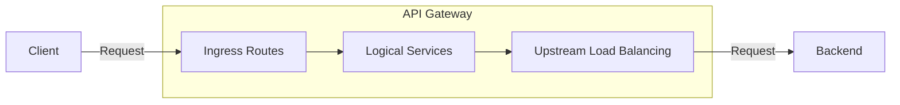
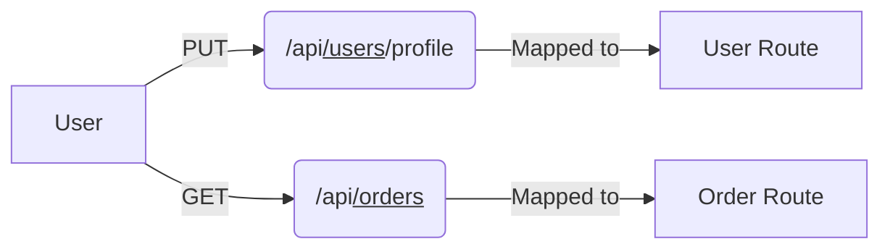
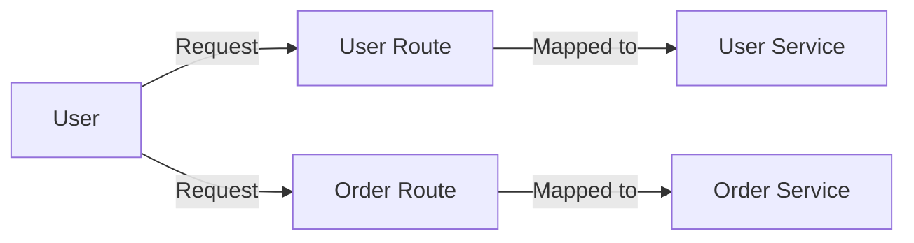
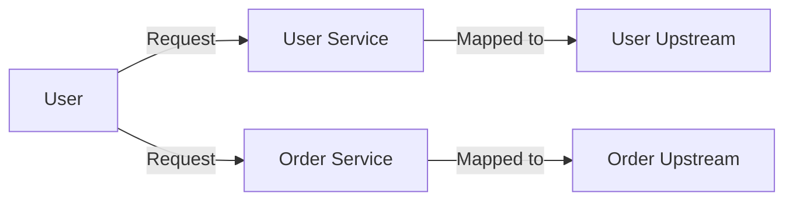
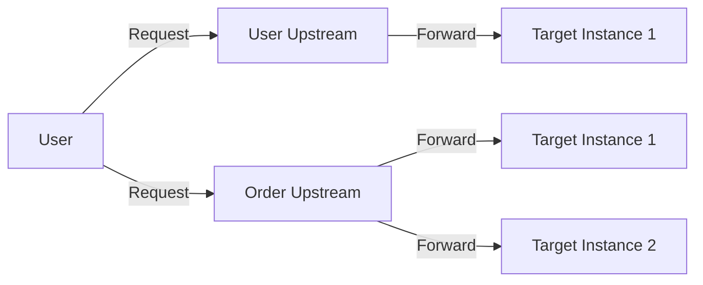
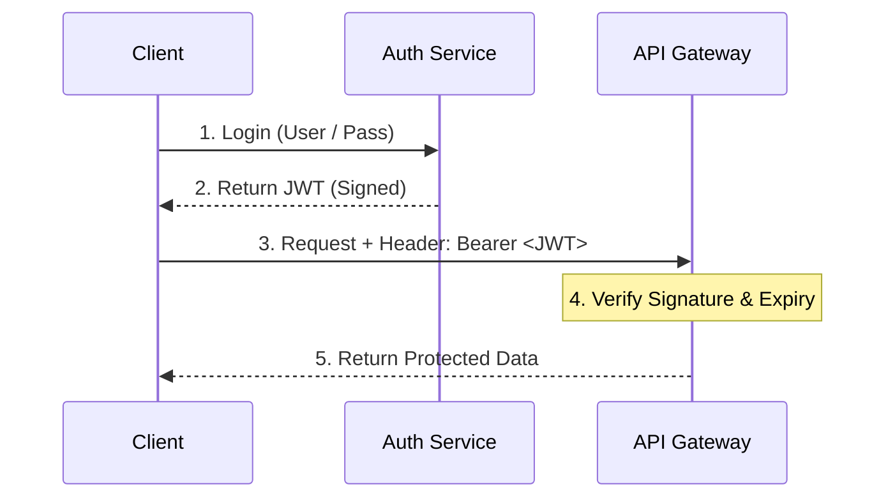
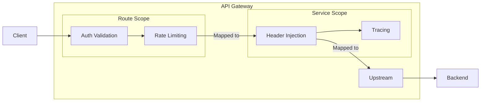
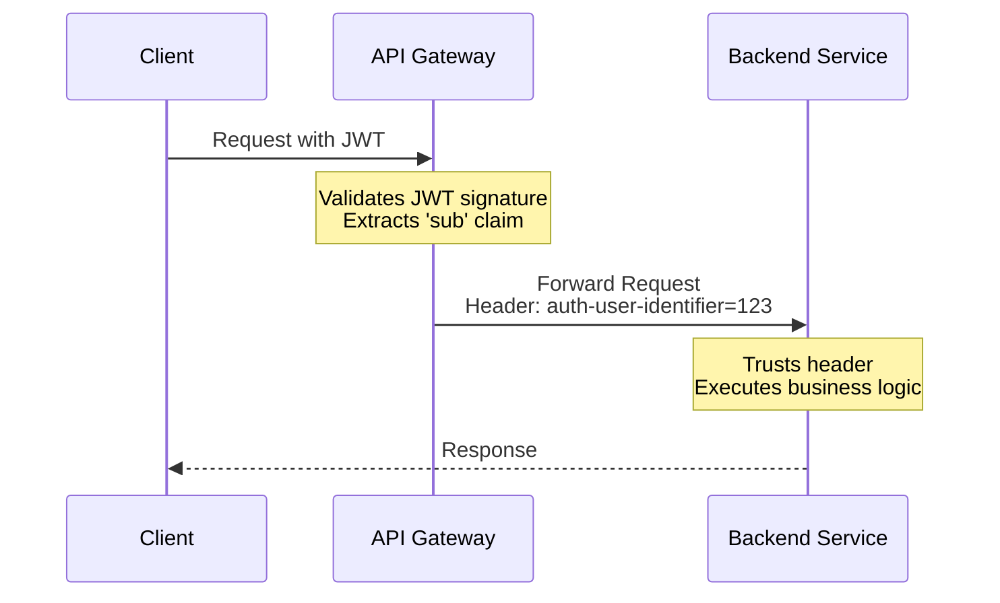
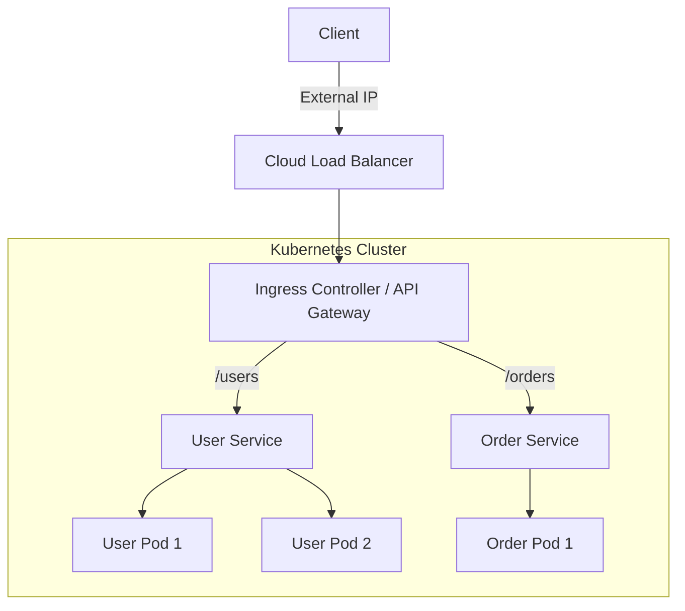
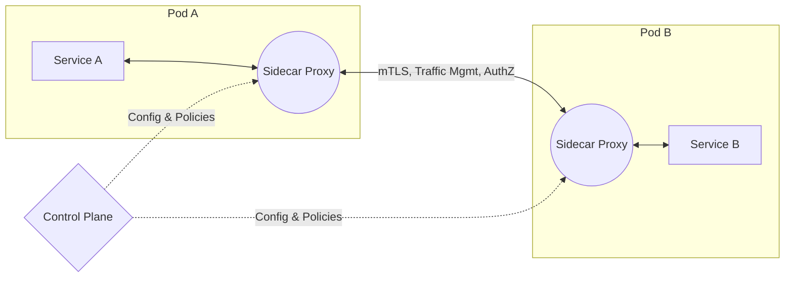

# Abstracting Cross-Cutting Concerns 

 

 AuthN/Z and Observability 

 

### By Susmit Vengurlekar (@susmitpy)

---
src: ./pages/disclaimer.md
---

---
src: ./pages/bug.md
---

---
src: ./pages/about.md
---

---
src: ./pages/ice_breaker.md
---

---

# Agenda

How we'll spend our ~ 30 minutes together:

<v-clicks>

* **[20 min] Core Concepts:** API Gateways, AuthN/Z, and Observability
* **[5 min] Demo:** Seeing it in action (Kong, FastAPI, OpenObserve)
* **[5 min] Q & A:** Your questions

</v-clicks>

---

# The Problem: Microservice Sprawl

Managing complexity of cross-cutting concerns.

* **Duplication of Effort:** Implementing Auth logic, JWT validation, and Telemetry in every single service.
* **Language-Agnostic Nightmares:** Maintaining consistent middleware across Python, Go, Node.js, and Java.
* **Security Risks:** Higher chance of misconfiguration and inconsistent security policies.
* **Tight Coupling:** Business logic becomes intertwined with infrastructure concerns.

---

# Anatomy of an API Gateway

An API Gateway acts as a single entry point, abstracting away the backend architecture.

---

# Anatomy of an API Gateway

## Ingress Routes

Mapping external requests to internal logical boundaries.

---

# Anatomy of an API Gateway

## Logical Services

Defining abstract backend components independent of physical locations.

---

# Anatomy of an API Gateway

## Upstream Load Balancing

Managing physical targets and health checks for logical services.

---

# Anatomy of an API Gateway

## Upstream Targets

Routing to the actual compute instances running the code.

---

# Authentication vs Authorization

Who are you vs. What can you do?

<v-clicks>

* **Authentication (AuthN):** Verifying identity.
    * *Example:* Checking a password, validating a JWT signature.
    * *Gateway Role:* Ideal. Validate tokens centrally.

* **Authorization (AuthZ):** Determining permissions.
    * *Example:* Can user X view record Y? Can POST to /payments to create payment ?
    * *Gateway Role:* Basic RBAC (Role-Based Access Control) is possible. Fine-grained, business-logic-heavy AuthZ usually stays in the backend.

</v-clicks>

---

# The JWT Lifecycle

---

# Anatomy of an API Gateway

## The Middleware/Plugin Pattern

 

---

# Claim-to-Header Injection

---

# Observability

Gaining visibility into the black box.

<v-clicks>

* **Logs:** Discrete events (e.g., "Request failed with 500").
* **Metrics:** Aggregated data (e.g., "Latency is 50ms", "Error rate is 2%").
* **Traces:** Journey of a request across distributed systems.
* **Gateway Advantage:** The Gateway is perfectly positioned to generate baseline metrics and initiate distributed traces (OpenTelemetry) before traffic even hits your services.

</v-clicks>

---

# Containerization & Networking

* **Docker Containers:** Package the application code and dependencies, ensuring consistent execution.

<v-clicks>

* **Docker Networks:** Virtual networks that allow containers to communicate securely.
* **Gateway Networking:**
    * Gateway sits on an "external" network.
    * Backends sit on "internal" networks.
    * The Gateway bridges the gap, enforcing that clients *must* pass through it to reach the backends.

</v-clicks>

---

# Kubernetes: Ingress & API Gateway

---

# Kubernetes: Service Mesh

---

# The Open-Source Landscape

Abstracting these concerns is a community-wide effort.

  

    <h2>API Gateways</h2>
    <ul>
      <li><b>Envoy Proxy</b> (Istio, Gloo)</li>
      <li><b>Kong API Gateway</b></li>
      <li><b>Apache APISIX</b></li>
      <li><b>Tyk</b></li>
    </ul>
  

  

    <h2>Observability</h2>
    <ul>
      <li><b>OpenTelemetry</b> (The standard)</li>
      <li><b>Prometheus</b> (Metrics)</li>
      <li><b>Jaeger</b> (Tracing)</li>
      <li><b>OpenObserve</b> (Logs/Traces/Metrics)</li>
      <li><b>Grafana</b> (Visualization)</li>
    </ul>
  

---

# Let's see these concepts in action via an open-source stack

<h2>API Gateway with FastAPI, OpenTelemetry and OpenObserve in Docker </h2>

  

    <a href="https://github.com/susmitpy/docker-kong-fastapi-otel-openobserve">https://github.com/susmitpy/docker-kong-fastapi-otel-openobserve</a>
  

  

    
  

---

<h1>Demo</h1>
<Youtube id="KHkabnbNmHQ" class="mx-auto my-auto w-full h-full p-4"/>

---
src: ./pages/connect.md
---

## We both are from DG Ruparel College, Mumbai
 

  

    <SlidevVideo autoplay>
      <source src="/ruparel meme.mp4" type="video/mp4" />
    </SlidevVideo>
  

  

    
  

---
src: ./pages/qa.md
---