# AWS Lambda in Action: Exploring Use Cases & a CDK Deployment

### By Susmit Vengurlekar (@susmitpy)

<div class="text-xs text-gray-400 absolute bottom-10 left-0 right-0 text-center">
Gentle Reminder: Start screen recording
</div>

---
src: ./pages/disclaimer.md
---

---
src: ./pages/bug.md
---

---
src: ./pages/about.md
---

---

# Agenda

1.  What is AWS Lambda?
2.  When to Use It (and When *Not* To)
3.  Lambda's Many Faces: Integrations Galore
4.  Enter the CDK: Infrastructure as Code, Simplified
5.  CDK Demo 1: Scheduled Environment Control
6.  CDK Demo 2: GitHub Actions-Powered Deployments
7.  Beyond the Demos: More Use Cases
8.  Q&A

<style>
li {
    font-size: 1.8rem;
}
</style>

---

# What is AWS Lambda?

- Serverless compute service.  Run code without provisioning or managing servers.
- Event-driven.  Responds to triggers from various AWS services.
- Pay-per-use.  You're only charged for the compute time you consume.
- Automatic scaling.  Lambda handles scaling up and down based on demand.
- Supports multiple languages: Node.js, Python, Java, Go, Ruby, .NET, and custom runtimes.

<style>
li {
    font-size: 1.7rem;
}
</style>

---

# When to Use Lambda

- **Event-driven tasks:** Processing data from S3, DynamoDB, Kinesis, etc.
- **API backends:** Building serverless APIs with API Gateway.
- **Scheduled tasks:** Running cron jobs or scheduled processes.
- **Microservices:** Implementing individual microservice functions.
- **Real-time stream processing:**  Analyzing data streams from Kinesis or DynamoDB.
- **Chatbots and voice assistants:**  Powering conversational interfaces.
- **IoT backends:**  Processing data from IoT devices.

<style>
li {
    font-size: 1.65rem;
}
</style>

---

# When *NOT* to Use Lambda

- **Long-running processes:**  Lambda has a maximum execution time (15 minutes).
- **Stateful applications:**  Lambda functions are stateless.  Use external services (like DynamoDB or ElastiCache) for state management.
- **Workloads requiring specific OS or hardware:**  Lambda runs on a standard Amazon Linux environment.  For specialized needs, consider EC2 or ECS.
- **Extremely high-frequency, low-latency tasks:** While Lambda scales well, there's a small cold start latency.  For ultra-low latency, consider dedicated servers.
- **Cost-prohibitive workloads:** While pay-per-use is often cheaper, *very* high-volume, constant workloads *might* be cheaper on reserved EC2 instances.  Do the math!

<style>
li {
    font-size: 1.42rem;
}
</style>

---

#  MEME Slide

Suggest Meme: "One does not simply manage servers anymore" (Lord of the Rings meme)
Image: /one_does_not.jpg

---


# Lambda's Integration Ecosystem:  A Whirlwind Tour

<v-clicks>

<div class="flex items-center justify-center h-full">
<h2>

We're about to explore how Lambda integrates with a *ton* of AWS services.

Fasten your seatbelts!

</h2>
</div>

</v-clicks>

---

## API Gateway Integration

- **The Classic Combo:** Build serverless APIs.
- **RESTful APIs, HTTP APIs, WebSockets:**  Lambda can handle various API types.
- **Request/Response Transformation:**  Customize requests and responses.
- **Authentication & Authorization:**  Integrate with Cognito or custom authorizers.
- **Usage Plans & Throttling:**  Control API access and prevent abuse.

<style>
li {
    font-size: 1.7rem;
}
</style>

---

#### API Gateway + Lambda: Use Case

<div class="text-xl mb-4">


**Scenario:** A user requests data via an API. API Gateway routes the request to a Lambda function, which fetches the data from DynamoDB and returns it.

</div>

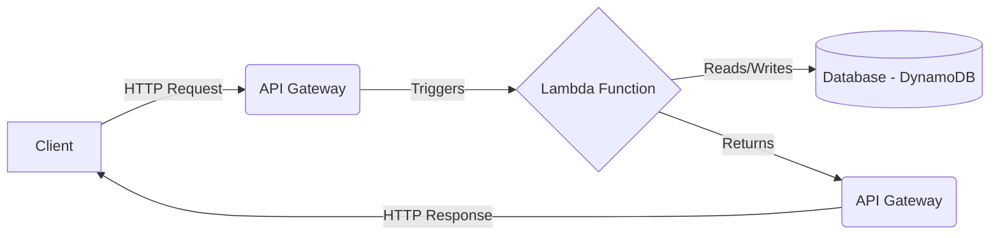

---

## Function URL

- **Dedicated HTTP(S) endpoint:**  Directly invoke a Lambda function via a URL.
- **Simpler than API Gateway (for some cases):**  Good for simple, single-function APIs.
- **Built-in CORS support:**  Easily handle cross-origin requests.
- **IAM authentication (optional):**  Secure your function URL.

<style>
li {
    font-size: 1.7rem;
}
</style>


---

#### Function URL: Use Case

<div class="text-xl mb-4">


**Scenario:**  A simple web application directly calls a Lambda function via its Function URL to perform a calculation or retrieve data.

</div>


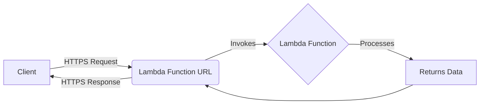

---

## Direct Invocation

- **Invoke Lambda synchronously or asynchronously.** Using the AWS SDK or CLI.
- **Synchronous:**  Wait for the function to complete and return a response.
- **Asynchronous:**  Lambda queues the event and returns immediately.
- **Great for testing and development:**  Directly invoke functions without external triggers.
- **Programmatic control:** Invoke functions from other applications or services.

<style>
li {
    font-size: 1.7rem;
}
</style>


---

#### Direct Invocation : Use Case

<div class="text-xl mb-4">

**Scenario:** A backend service directly calls a Lambda Function to execute specific business logic.
</div>

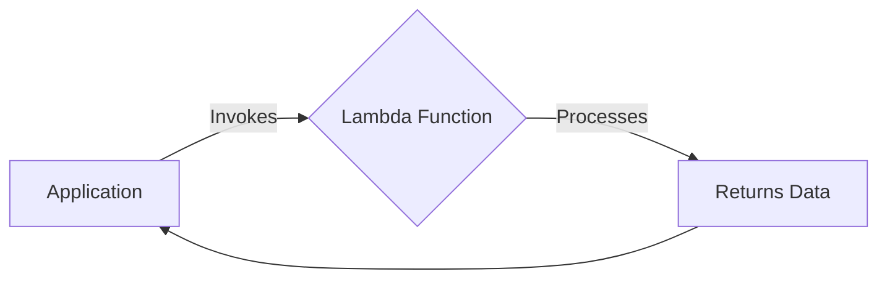

---

## Scheduled Invocation (EventBridge Scheduler)

- **Run functions on a schedule:**  Like a serverless cron job.
- **Fixed rate or cron expression:**  Flexible scheduling options.
- **Automated tasks:**  Database backups, report generation, system maintenance.
- **Time-based triggers:**  Start/stop resources, send notifications.

<style>
li {
    font-size: 1.7rem;
}
</style>

---

#### Scheduled Invocation: Use Case

<div class="text-xl mb-4">

**Scenario:** A Lambda function is triggered every night at midnight to perform database backups.
</div>

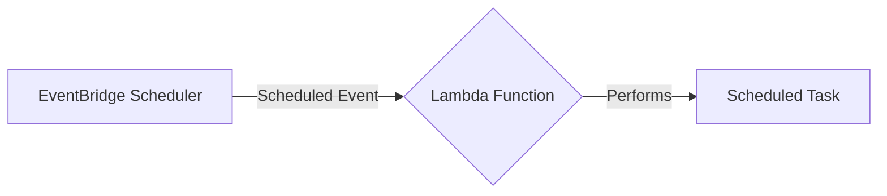

---

## S3 Event Trigger

- **Respond to events in S3 buckets:**  Object creation, deletion, modification.
- **Image processing:**  Resize images when they're uploaded.
- **Data validation:**  Check files for correctness upon upload.
- **ETL pipelines:**  Trigger data processing workflows.
- **Fine-grained control:**  Filter events based on prefixes, suffixes, and metadata.

<style>
li {
    font-size: 1.7rem;
}
</style>

---

#### S3 Event Trigger: Use Case

<div class="text-xl mb-4">

**Scenario:**  A user uploads an image to an S3 bucket.  This triggers a Lambda function to resize the image and create thumbnails.
</div>

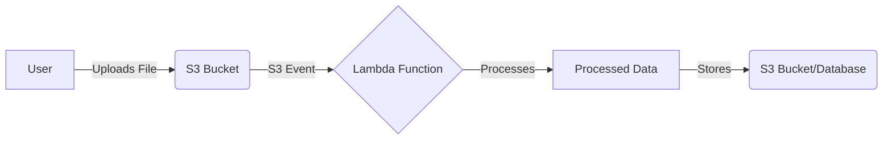

---

## Step Functions

- **Orchestrate complex workflows:**  Define state machines with multiple steps.
- **Coordinate multiple Lambda functions:**  Pass data between functions.
- **Error handling and retries:**  Build robust, fault-tolerant workflows.
- **Branching and parallel execution:**  Create complex logic flows.
- **Visual workflow designer:**  Easily create and manage state machines.

<style>
li {
    font-size: 1.7rem;
}
</style>

---

#### Step Functions: Use Case

<div class="text-xl mb-4">

**Scenario:**  An order processing workflow.  A Lambda function processes the order, then a choice state checks the payment status.  Based on the status, either a shipping Lambda or a notification Lambda is invoked.
</div>

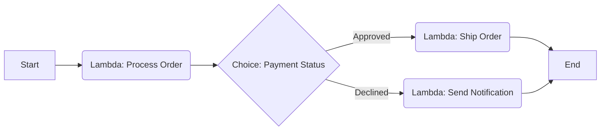

---

## Kinesis Data Streams

- **Process real-time data streams:**  Analyze streaming data from various sources.
- **Clickstream analysis:**  Track user activity on websites and applications.
- **IoT sensor data:**  Process data from connected devices.
- **Financial data feeds:**  Analyze stock prices or transaction data.
- **Scalable and fault-tolerant:**  Kinesis handles high-throughput data streams.

<style>
li {
    font-size: 1.7rem;
}
</style>

---

#### Kinesis Data Streams: Use Case

<div class="text-xl mb-4">

**Scenario:**  IoT devices send sensor data to a Kinesis stream.  Lambda functions process the data in real-time, performing anomaly detection and storing results in a database.
</div>

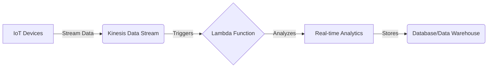

---

## Amazon Data Firehose
- **Load streaming data into data lakes, data stores, and analytics services.**
- **Fully managed**
- **Real-time transformation of streaming data with AWS Lambda**

<style>
li {
    font-size: 1.7rem;
}
</style>

---

#### Amazon Data Firehose: Use Case

<div class="text-xl mb-4">

**Scenario:** Kinesis Data Firehose receives streaming data, optionally transforms it using a Lambda function, and loads it into destinations like S3, Redshift, or Elasticsearch.
</div>

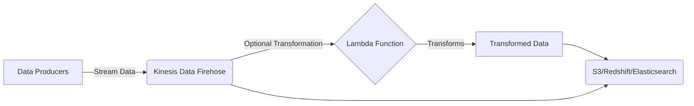
---

## EventBridge (Pipes and Rules)

- **Event bus for serverless applications:**  Connect services and route events.
- **Event rules:**  Trigger Lambda functions based on matching events.
- **Event enrichment (Pipes):**  Transform events before invoking Lambda.
- **Decoupled architecture:**  Services don't need to know about each other.
- **Custom events:**  Publish your own events to the bus.
- **Integration with SaaS applications:**  Receive events from third-party services.

<style>
li {
    font-size: 1.64rem;
}
</style>

---

#### EventBridge: Use Case

<div class="text-xl mb-4">

**Scenario:**  Application A publishes a custom event to EventBridge.  An event rule triggers a Lambda function. Another pipe transforms the event, then triggers a *different* Lambda function.
</div>

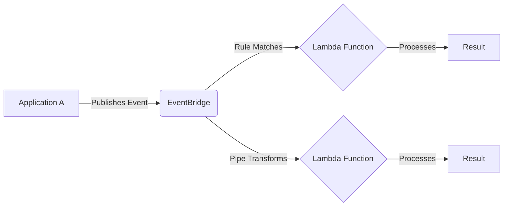

---

## DynamoDB Streams

- **Capture changes to DynamoDB tables:**  Inserts, updates, deletes.
- **Real-time data replication:**  Replicate data to other services.
- **Auditing and logging:**  Track changes to your data.
- **Triggering actions:**  Send notifications or update other systems.
- **Ordered stream of changes:**  Events are delivered in the order they occurred.

<style>
li {
    font-size: 1.7rem;
}
</style>

---

#### DynamoDB Streams: Use Case

<div class="text-xl mb-4">

**Scenario:**  An application writes data to a DynamoDB table.  A DynamoDB stream triggers a Lambda function to send a notification whenever a new item is added.
</div>

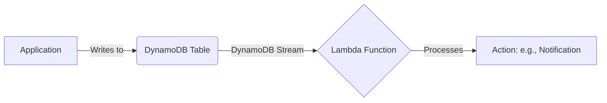

---

## API Gateway Authorizer

- **Control access to your API Gateway APIs:**  Authorize requests before they reach your backend.
- **Custom authorization logic:**  Use Lambda to implement your own authorization rules.
- **Token-based authentication:**  Validate JWTs or other tokens.
- **Caching:**  Cache authorization results to reduce latency.
- **Integration with Cognito or other identity providers.

<style>
li {
    font-size: 1.7rem;
}
</style>

---

#### API Gateway Authorizer: Use Case

<div class="text-xl mb-4">

**Scenario:**  A client sends a request to an API Gateway API.  A Lambda authorizer validates the user's token before allowing access to the backend Lambda function.
</div>

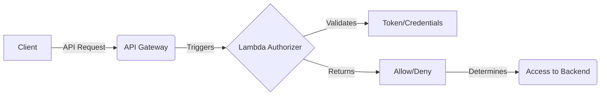

---

## Lambda@Edge

- **Run Lambda functions at CloudFront edge locations:**  Customize content delivery.
- **Improve performance:**  Reduce latency by processing requests closer to users.
- **A/B testing:**  Route traffic to different versions of your application.
- **Request/response manipulation:**  Modify headers, rewrite URLs, generate dynamic content.
- **Security:**  Implement custom security logic at the edge.

<style>
li {
    font-size: 1.7rem;
}
</style>

---

#### Lambda@Edge: Use Case

<div class="text-xl mb-4">

**Scenario:**  A user requests a webpage.  A Lambda@Edge function at the CloudFront edge location personalizes the content based on the user's location or device.
</div>

```mermaid
graph LR
    A[User] -- Request --> B(CloudFront Edge Location)
    B -- Triggers --> C{Lambda@Edge Function}
    C -- Modifies --> D[Request/Response]
    C -- Origin Request --> E[Origin Server]
     E -- Origin Response --> C
    B -- Returns --> A[Modified Content]
    class B,C fill:#f9f,stroke:#333,stroke-width:2px
```

---

## SQS (Simple Queue Service)

- **Decouple and scale microservices:**  Use SQS queues to send messages between services.
- **Asynchronous processing:**  Lambda functions process messages from the queue.
- **Batch processing:**  Process multiple messages in a single Lambda invocation.
- **Dead-letter queues:**  Handle failed messages.
- **Standard and FIFO queues:**  Choose the right queue type for your needs.

<style>
li {
    font-size: 1.7rem;
}
</style>

---

#### SQS: Use Case

<div class="text-xl mb-4">

**Scenario:**  An application sends messages to an SQS queue.  A Lambda function is triggered to process each message, performing tasks like sending emails or updating a database.
</div>

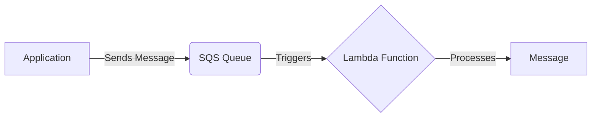

---

## SNS (Simple Notification Service)

- **Publish/subscribe messaging:**  Send messages to multiple subscribers.
- **Fan-out pattern:**  A single message can trigger multiple Lambda functions.
- **Mobile push notifications:**  Send notifications to mobile devices.
- **Email and SMS notifications:**  Send messages via email and SMS.
- **Integration with other AWS services:**  Receive notifications from CloudWatch, CloudTrail, etc.

<style>
li {
    font-size: 1.7rem;
}
</style>

---

#### SNS: Use Case

<div class="text-xl mb-4">

**Scenario:**  An application publishes a message to an SNS topic.  This triggers multiple Lambda functions, each performing a different task (e.g., sending an email, updating a database, and logging the event).
</div>

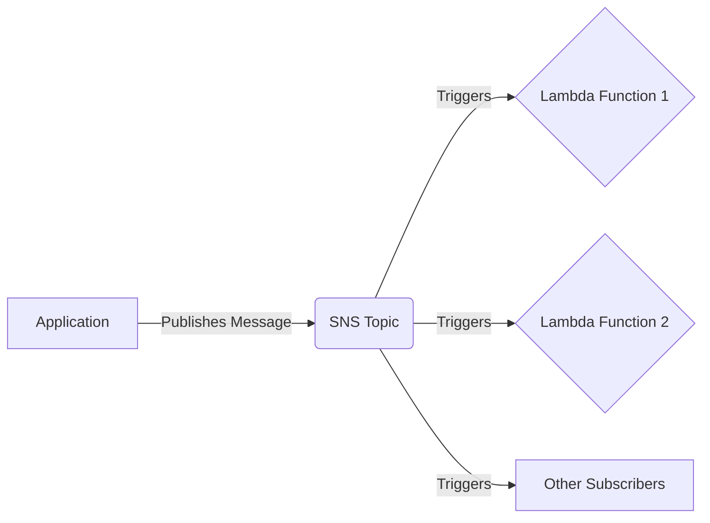

---

#  MEME Slide

Suggest Meme: "I have no idea what I'm doing" (dog at computer) - Transitioning to CDK.  Humorously acknowledge the complexity.
Image: /no_idea.jpg

---

# Enter the CDK: Infrastructure as Code, Simplified

- **Define your cloud infrastructure in code:**  Use familiar programming languages (TypeScript, Python, Java, .NET, Go).
- **Higher-level abstractions:**  CDK Constructs simplify infrastructure definition.
- **Reusable components:**  Create and share your own custom Constructs.
- **Predictable deployments:**  CDK uses CloudFormation under the hood.
- **Integrated with AWS services:**  Easily define Lambda functions, API Gateway, databases, and more.

<style>
li {
    font-size: 1.65rem;
}
</style>

---


# Why CDK?

- **Infrastructure as Code (IaC):**  Manage infrastructure with code, enabling version control, repeatability, and automation.
- **Developer-Friendly:**  Use familiar programming languages, reducing the learning curve compared to YAML/JSON.
- **Abstraction:**  CDK Constructs provide higher-level building blocks, simplifying complex configurations.
- **Code Reusability:**  Create and share custom Constructs for common patterns.
- **Type Safety:**  Benefit from compile-time checks and IDE support (with languages like TypeScript).
- **CloudFormation Integration:**  CDK synthesizes CloudFormation templates, leveraging its robust deployment engine.
- **Diffing and Rollbacks:**  Easily see changes before deployment and rollback if needed.

<style>
li {
    font-size: 1.25rem;
}
</style>

---

# Why NOT CDK

- **Learning Curve:** While developer-friendly, there's still a learning curve to understand CDK concepts and best practices.
- **Abstraction Overhead:** The abstractions can sometimes obscure underlying CloudFormation details.
- **Maturity:** While mature, CDK is newer than CloudFormation, and some edge cases or new features might not be immediately available.
- **Language Choice:** If your team is not comfortable with the supported languages, it might not be the best fit.
- **Debugging:** Debugging CDK code can sometimes be more challenging than debugging raw CloudFormation templates.

<style>
li {
    font-size: 1.4rem;
}
</style>

---

# CDK Demo 1: Scheduled Environment Control

**Scenario:** Automatically start and stop development environments (EC2 instances) during non-working hours to save costs.

**Components:**

*   **EventBridge Rule:**  Scheduled using a cron expression (e.g., "0 18 ? * MON-FRI *" for 6 PM weekdays).
*   **Lambda Function(s):**
    *   One function to start instances.
    *   One function to stop instances.
* **IAM Role**: Allow the required permissions to start/stop instances.

<style>
li {
    font-size: 1.7rem;
}
</style>

---

#### CDK Demo 1: Diagram

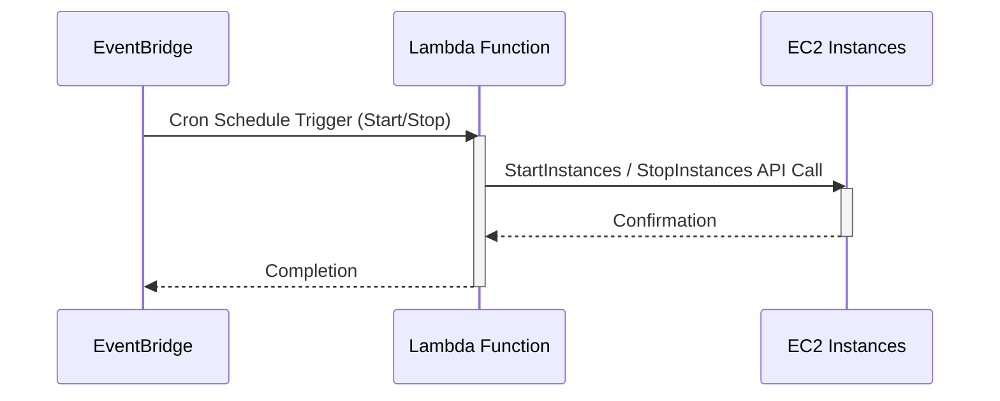

---

## CDK Demo 1: Interactive Code Demo

### *[Switch to your code repository and walk through the CDK code for Demo 1]*

**Key areas to highlight:**

*   IAM Role setup (permissions).
*   Lambda function definitions (runtime, handler, code location).
*   EventBridge rule configuration (cron expression).
*   Environment variables (if used).
*   Explain the logic within the Lambda functions themselves (the `index.js` or `index.py` files).

<style>
li {
    font-size: 1.7rem;
}
</style>

---

# CDK Demo 2: GitHub Actions Deployment

**Scenario:**  A GitHub Actions workflow triggers a Lambda function via a Function URL.  The Lambda function uses SSM Run Command to execute a script on an EC2 instance, updating the codebase from a GitHub release.

**Components:**

*   **Lambda Function:** With a Function URL.  IAM authentication enabled.
*   **IAM Role (for Lambda):** Permissions to invoke SSM Run Command.
*   **IAM Role (for EC2 Instance):**  Permissions to be managed by SSM.
*   **SSM Document:** Defines the script to be executed on the EC2 instance.
*   **GitHub Actions Workflow:**  Uses `aws-actions/lambda-invoke-function` to call the Function URL.

<style>
li {
    font-size: 1.6rem;
}
</style>

---

#### CDK Demo 2: Diagram

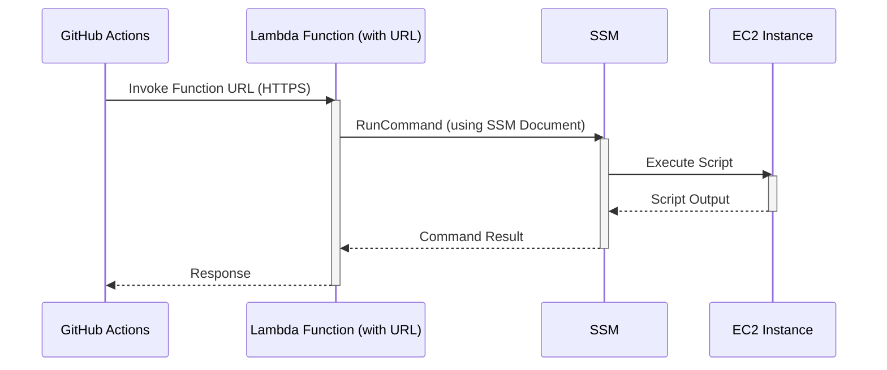

---

## CDK Demo 2: Interactive Code Demo

### *[Switch to your code repository and walk through the CDK code for Demo 2]*

**Key areas to highlight:**

*   IAM Role setup (for both Lambda and EC2).
*   Lambda function definition (including Function URL configuration with `AWS_IAM` auth).
*   SSM Document definition (the script content).
*   Environment variables.
*   Explain the Lambda function's logic (how it interacts with SSM).
*   **Briefly show (or mention) the GitHub Actions workflow YAML file** and how it uses the `aws-actions/lambda-invoke-function` action.  This is important to connect the CDK code to the GitHub Actions part.

<style>
li {
    font-size: 1.3rem;
}
</style>


---

# Beyond the Demos:  More Use Cases to Explore

*   **Serverless Image Recognition:**  Combine S3 triggers, Lambda, and Rekognition to automatically tag images.
*   **Real-time Log Processing:** Use Kinesis Data Streams, Lambda, and CloudWatch Logs to analyze logs in real time.
*   **IoT Data Pipeline:** Build a pipeline for processing data from IoT devices using IoT Core, Kinesis, Lambda, and DynamoDB.
*   **Serverless Chatbot:**  Combine API Gateway, Lambda, and Lex to create a chatbot.
*   **Scheduled Data Exports:**  Use EventBridge Scheduler and Lambda to export data from DynamoDB to S3 on a regular basis.

<style>
li {
    font-size: 1.4rem;
}
</style>

---

# Conclusion

*   Lambda is a powerful and versatile serverless compute service.
*   It integrates with a wide range of AWS services, enabling a vast array of use cases.
*   CDK simplifies the creation and management of Lambda-based infrastructure.
*   Start small, experiment, and explore the possibilities!

<style>
li {
    font-size: 1.7rem;
}
</style>

---
src: ./pages/connect.md # Same Connect Slide
---

---
src: ./pages/qa.md # Same Q&A Slide
---