# AWS Lambda in Action: Exploring Use Cases & a CDK Deployment

### By Susmit Vengurlekar (@susmitpy)

<div class="text-xs text-gray-400 absolute bottom-10 left-0 right-0 text-center">
Gentle Reminder: Start screen recording
</div>

---
src: ./pages/disclaimer.md
---

---
src: ./pages/bug.md
---

---
src: ./pages/about.md
---

---

# Agenda

1.  What is AWS Lambda?
2.  When to Use It (and When *Not* To)
3.  Lambda's Integration Ecosystem
4.  Enter the CDK: Infrastructure as Code, Simplified
5.  CDK Demo: Scheduled Environment Control
6.  Q&A

<style>
li {
    font-size: 1.8rem;
}
</style>

---

# What is AWS Lambda?

- Serverless compute service.  Run code without provisioning or managing servers.
- Event-driven.  Responds to triggers from various AWS services.
- Pay-per-use.  You're only charged for the compute time you consume.
- Direct HTTP endpoint.  Using function URLs.
- Supports multiple languages: Node.js, Python, Java, Ruby, .NET, and custom runtimes.

<style>
li {
    font-size: 1.7rem;
}
</style>

---

# When to Use Lambda

- **Event-driven tasks:** Processing data from S3, DynamoDB, Kinesis, etc.
- **API backends:** Building serverless APIs with API Gateway.
- **Scheduled tasks:** Running cron jobs or scheduled processes.
- **Microservices:** Implementing individual microservice functions.
- **Real-time stream processing:**  Analyzing data streams from Kinesis or DynamoDB.
- **Imagination is the limit!:**  Be sure to evaluate the trade-offs.

<style>
li {
    font-size: 1.65rem;
}
</style>

---

# When *NOT* to Use Lambda

- **Long-running processes:**  Lambda has a maximum execution time (15 minutes).
- **Stateful applications:**  Lambda functions are stateless.  Use external services (like DynamoDB or ElastiCache) for state management.
- **Extremely high-frequency, low-latency tasks:** While Lambda scales well, there's a small cold start latency.  For ultra-low latency, consider dedicated servers.
- **Cost-prohibitive workloads:** While pay-per-use is often cheaper, *very* high-volume, constant workloads *might* be cheaper on reserved EC2 instances.  Do the math!

<style>
li {
    font-size: 1.42rem;
}
</style>

---
layout: image
image: /aws_lambda/manage_servers.jpg
backgroundSize: contain
---

---


# Lambda's Integration Ecosystem 🚀

<div class="flex items-center justify-center h-full">
<h2 class="text-center mb-40">

Get ready for a Toofani tour <br><br> of <br><br> Lambda's integration capabilities!
</h2>
</div>

<style>
h1 {
    font-size: 2.5em;
    margin-bottom: 1.5em;
}
h2 {
    font-size: 1.8em;
    min-height: 150px;
}
</style>


---

## API Gateway Integration

- **The Classic Combo:** Build serverless APIs.
- **RESTful APIs, HTTP APIs, WebSockets:**  Lambda can handle various API types.
- **Request/Response Transformation:**  Customize requests and responses.
- **Usage Plans:**  Configure Rate, Burst, and Quota limits.

<style>
li {
    font-size: 1.7rem;
}
</style>

---

#### API Gateway WebSocket + Lambda: Use Case

<div class="text-xl mb-4">

**Scenario:** A client establishes a WebSocket connection. API Gateway routes different message types (connect, message, disconnect) to Lambda functions that handle real-time communication.

</div>

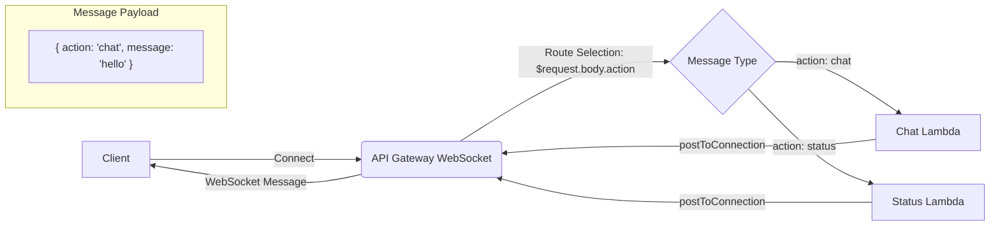

<div class="text-sm mt-2">
API Gateway reads request.body.action to determine which Lambda to invoke based on configured routes
</div>

---

## Function URL

- **Dedicated HTTPS endpoint:**  Directly invoke a Lambda function via a URL.
- **Simpler than API Gateway (for some cases):**  Good for simple, single-function APIs.
- **Built-in CORS support:**  Easily handle cross-origin requests.
- **IAM authentication (optional):**  Secure your function URL.

<style>
li {
    font-size: 1.7rem;
}
</style>


---

#### Function URL: Use Case

<div class="text-xl mb-4">


**Scenario:**  A simple web application directly calls a Lambda function via its Function URL to perform a calculation or retrieve data.

</div>


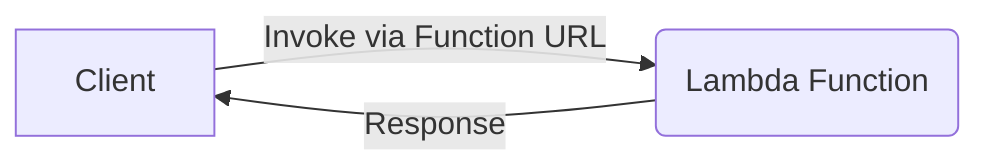

---

## Direct Invocation

- **Invoke Lambda synchronously or asynchronously.** Using the AWS SDK or CLI.
- **Synchronous:**  Wait for the function to complete and return a response.
- **Asynchronous:**  Lambda queues the event and returns immediately.
- **Great for testing and development:**  Directly invoke functions without external triggers.
- **Programmatic control:** Invoke functions from other applications or services.

<style>
li {
    font-size: 1.7rem;
}
</style>


---

#### Direct Invocation : Use Case

<div class="text-xl mb-4">

**Scenario:** A backend service directly calls a Lambda Function to execute specific business logic.
</div>

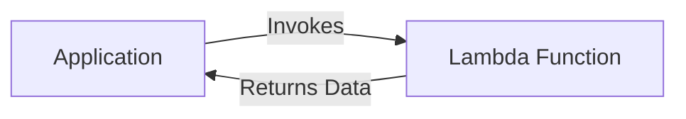

---

## Scheduled Invocation (EventBridge Scheduler)

- **Run functions on a schedule:**  Like a serverless cron job.
- **Fixed rate or cron expression:**  Flexible scheduling options.
- **Automated tasks:**  Database backups, report generation, system maintenance.
- **Time-based triggers:**  Start/stop resources, send notifications.

<style>
li {
    font-size: 1.7rem;
}
</style>

---

#### Scheduled Invocation: Use Case

<div class="text-xl mb-4">

**Scenario:** A Lambda function is triggered every night at midnight to perform database backups.
</div>

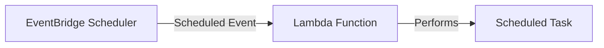

---

## S3 Event Trigger

- **Respond to events in S3 buckets:**  Object creation, deletion, modification.
- **Image processing:**  Resize images when they're uploaded.
- **Data validation:**  Check files for correctness upon upload.
- **Fine-grained control:**  Filter events based on prefixes, suffixes, and metadata.

<style>
li {
    font-size: 1.7rem;
}
</style>

---

#### S3 Event Trigger: Use Case

<div class="text-xl mb-4">

**Scenario:**  A user uploads an image to an S3 bucket.  This triggers a Lambda function to resize the image and create thumbnails.
</div>

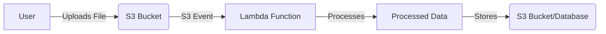

---

## Step Functions

- **Orchestrate complex workflows:**  Define state machines with multiple steps.
- **Coordinate multiple Lambda functions:**  Pass data between functions.
- **Error handling and retries:**  Build robust, fault-tolerant workflows.
- **Branching and parallel execution:**  Create complex logic flows.
- **Visual workflow designer:**  Easily create and manage state machines.

<style>
li {
    font-size: 1.7rem;
}
</style>


---

#### Step Functions: Use Case

<div class="text-xl mb-4">

**Scenario:**  An order processing workflow.  A Lambda function processes the order, then a choice state checks the payment status.  Based on the status, either a shipping Lambda or a notification Lambda is invoked.
</div>

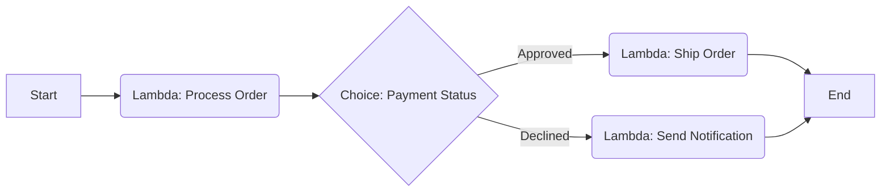

---

## Kinesis Data Streams

- **Process real-time data streams:**  Analyze streaming data from various sources.
- **Clickstream analysis:**  Track user activity on websites and applications.
- **IoT sensor data:**  Process data from connected devices.
- **Financial data feeds:**  Analyze stock prices or transaction data.
- **Scalable and fault-tolerant:**  Kinesis handles high-throughput data streams.

<style>
li {
    font-size: 1.7rem;
}
</style>

---

#### Kinesis Data Streams: Use Case

<div class="text-xl mb-4">

**Scenario:**  IoT devices send sensor data to a Kinesis stream.  Lambda functions process the data in real-time, performing anomaly detection and storing results in a database.
</div>

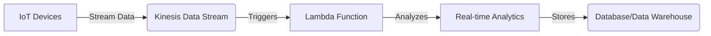

---

## Amazon Data Firehose
- **Load streaming data into data lakes, data stores, and analytics services.**
- **Fully managed**
- **Real-time transformation of streaming data with AWS Lambda**

<style>
li {
    font-size: 1.7rem;
}
</style>

---

#### Amazon Data Firehose: Use Case

<div class="text-xl mb-4">

**Scenario:** Amazon Data Firehose receives streaming data, optionally transforms it using a Lambda function, and loads it into destinations like S3, Redshift, or Elasticsearch.
</div>

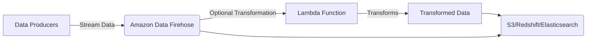
---

## EventBridge (Pipes and Rules)

- **Event bus for serverless applications:**  Connect services and route events.
- **Event rules:**  Trigger Lambda functions based on matching events.
- **Event enrichment (Pipes):**  Transform events before invoking Lambda.
- **Decoupled architecture:**  Services don't need to know about each other.
- **Custom events:**  Publish your own events to the bus.
- **Integration with SaaS applications:**  Receive events from third-party services.

<style>
li {
    font-size: 1.64rem;
}
</style>

---

#### EventBridge: Use Case

<div class="text-xl mb-4">

**Scenario:** Application A publishes a custom event to EventBridge. An event rule triggers a Lambda function. A pipe filters the event using JSON pattern matching, enriches it via Lambda, then sends to a destination.
</div>

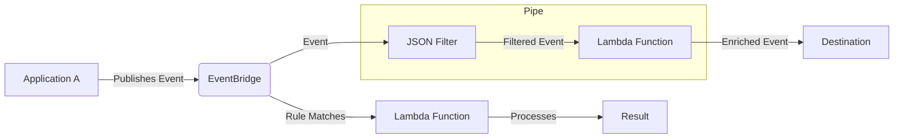

---

## DynamoDB Streams

- **Capture changes to DynamoDB tables:**  Inserts, updates, deletes.
- **Real-time data replication:**  Replicate data to other services.
- **Auditing and logging:**  Track changes to your data.
- **Triggering actions:**  Send notifications or update other systems.
- **Ordered stream of changes:**  Events are delivered in the order they occurred.

<style>
li {
    font-size: 1.7rem;
}
</style>

---

#### DynamoDB Streams: Use Case

<div class="text-xl mb-4">

**Scenario:**  An application writes data to a DynamoDB table.  A DynamoDB stream triggers a Lambda function to send a notification whenever a new item is added.
</div>

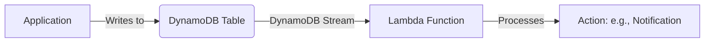

---

## API Gateway Authorizer

- **Control access to your API Gateway APIs:**  Authorize requests before they reach your backend.
- **Custom authorization logic:**  Use Lambda to implement your own authorization rules.
- **Token-based authentication:**  Validate JWTs or other tokens.
- **Caching:**  Cache authorization results to reduce latency.

<style>
li {
    font-size: 1.7rem;
}
</style>

---

#### API Gateway Authorizer: Use Case

<div class="text-xl mb-4">

**Scenario:**  A client sends a request to an API Gateway API.  A Lambda authorizer validates the user's token before allowing access to the backend Lambda function.
</div>

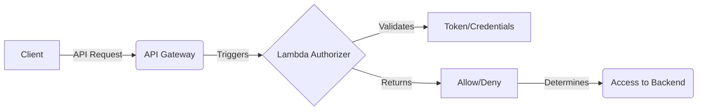

---

## Lambda@Edge & CloudFront Functions - Request/Response Flow

```mermaid
graph LR
    A[User] --> B[Viewer Request]
    B --> C[Origin Request]
    C --> D[Origin]
    D --> E[Origin Response]
    E --> F[Viewer Response]
    F --> A
    
    subgraph "Edge Location"
    B
    F
    end
    
    subgraph "Regional"
    C
    E
    end

    subgraph Functions
    B -.- G[CloudFront Functions]
    B -.- H[Lambda@Edge]
    C -.- H
    E -.- H
    F -.- G
    F -.- H
    end
```

<style>
li { font-size: 1.4rem; }
.grid { margin-top: 1rem; }
</style>


---

## Lambda@Edge & CloudFront Functions

- **Lambda@Edge:** Run Lambda functions at CloudFront edge or regional locations
- **CloudFront Functions:** Lightweight JavaScript at edge locations only
- **Request/Response Lifecycle:** Both intercept and modify requests/responses
- **Use Cases:** A/B testing, personalization, URL rewrites, authentication

<div class="grid grid-cols-2 gap-4">
<div>

**CloudFront Functions**
- Viewer Request/Response only
- Sub-millisecond execution
- JavaScript only
- Edge locations
- Simple tasks

</div>
<div>

**Lambda@Edge**
- All four event types
- Up to 30s execution
- Node.js/Python
- Edge or regional
- Complex processing

</div>
</div>

---

## SQS (Simple Queue Service)

- **Decouple and scale microservices:**  Use SQS queues to send messages between services.
- **Asynchronous processing:**  Lambda functions process messages from the queue.
- **Batch processing:**  Process multiple messages in a single Lambda invocation.
- **Dead-letter queues:**  Handle failed messages.

<style>
li {
    font-size: 1.7rem;
}
</style>

---

#### SQS: Use Case

<div class="text-xl mb-4">

**Scenario:**  An application sends messages to an SQS queue.  A Lambda function is triggered to process each message, performing tasks like sending emails or updating a database.
</div>

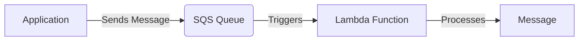

---

## SNS (Simple Notification Service)

- **Publish/subscribe messaging:**  Send messages to multiple subscribers.
- **Fan-out pattern:**  A single message can trigger multiple Lambda functions.
- **Mobile push notifications:**  Send notifications to mobile devices.
- **Email and SMS notifications:**  Send messages via email and SMS.
- **Integration with other AWS services:**  Receive notifications from CloudWatch, CloudTrail, etc.

<style>
li {
    font-size: 1.7rem;
}
</style>

---

#### SNS: Use Case

<div class="text-xl mb-4">

**Scenario:**  An application publishes a message to an SNS topic.  This triggers multiple Lambda functions, each performing a different task (e.g., sending an email, updating a database, and logging the event).
</div>

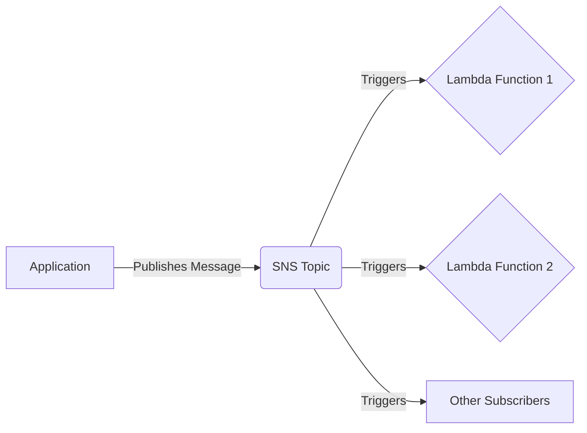

---
layout: image
image: /aws_lambda/no_idea.jpg
backgroundSize: contain
---

---

# Enter the CDK: Infrastructure as Code, Simplified

- **Define your cloud infrastructure in code:**  Use familiar programming languages (TypeScript, Python, Java, .NET, Go).
- **Higher-level abstractions:**  CDK Constructs simplify infrastructure definition.
- **Reusable components:**  Create and share your own custom Constructs.
- **Predictable deployments:**  CDK uses CloudFormation under the hood.
- **Integrated with AWS services:**  Easily define Lambda functions, API Gateway, databases, and more.

<style>
li {
    font-size: 1.65rem;
}
</style>

---


# Why CDK?

- **Infrastructure as Code (IaC):**  Manage infrastructure with code, enabling version control, repeatability, and automation.
- **Developer-Friendly:**  Use familiar programming languages, reducing the learning curve compared to YAML/JSON.
- **Abstraction:**  CDK Constructs provide higher-level building blocks, simplifying complex configurations.
- **Code Reusability:**  Create and share custom Constructs for common patterns.
- **Type Safety:**  Benefit from compile-time checks and IDE support (with languages like TypeScript).
- **CloudFormation Integration:**  CDK synthesizes CloudFormation templates, leveraging its robust deployment engine.
- **Diffing and Rollbacks:**  Easily see changes before deployment and rollback if needed.

<style>
li {
    font-size: 1.25rem;
}
</style>

---

# Why NOT CDK

- **Learning Curve:** While developer-friendly, there's still a learning curve to understand CDK concepts and best practices.
- **Abstraction Overhead:** The abstractions can sometimes obscure underlying CloudFormation details.
- **Language Choice:** If your team is not comfortable with the supported languages, it might not be the best fit.

<style>
li {
    font-size: 1.4rem;
}
</style>


---

# CDK Demo: Scheduled Environment Control

*   **EventBridge Rule:**  Scheduled using a cron expression (e.g., "30 17 ? * MON-FRI *" for 11 pm IST).
*   **Lambda Function(s):**
    *   One function to start instances.
    *   One function to stop instances.
* **IAM Role**: Allow the required permissions to start/stop instances.
* **Function URL**: For midnight urge to test something.

<style>
li {
    font-size: 1.7rem;
}
</style>

---

#### CDK Demo: Diagram

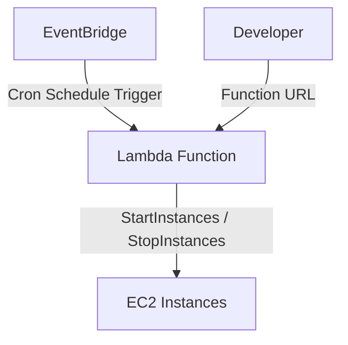


<style>
    .mermaid {
        display: flex;
        align-items: center;
        justify-content: center;
    }
</style>

--- 

# Let's See Some Code!

<div class="flex items-center justify-between">
    
    <div class="text-2xl break-words w-1/3 pl-1">
        https://github.com/susmitpy/aws_cdk_example
    </div>
</div>


---

# When it comes to AWS CDK
<div class="grid grid-cols-2 gap-4">
    <div class="flex items-center flex-col justify-center">
        <h1 class="text-3xl">Developer Journey</h1>
    </div>
    <div>
        
    </div>
</div>

---

# Conclusion

*   Lambda is a powerful and versatile serverless compute service.
*   It integrates with a wide range of AWS services, enabling a vast array of use cases.
*   CDK simplifies lambda deployments: though it's just one tool in it's toolbox.
*   Start small, experiment, and explore the possibilities!

<style>
li {
    font-size: 1.7rem;
}
</style>

---
src: ./pages/connect.md # Same Connect Slide
---

---
src: ./pages/qa.md # Same Q&A Slide
---