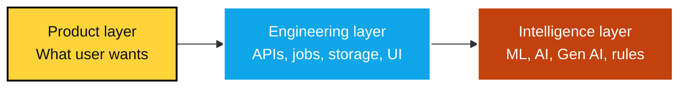
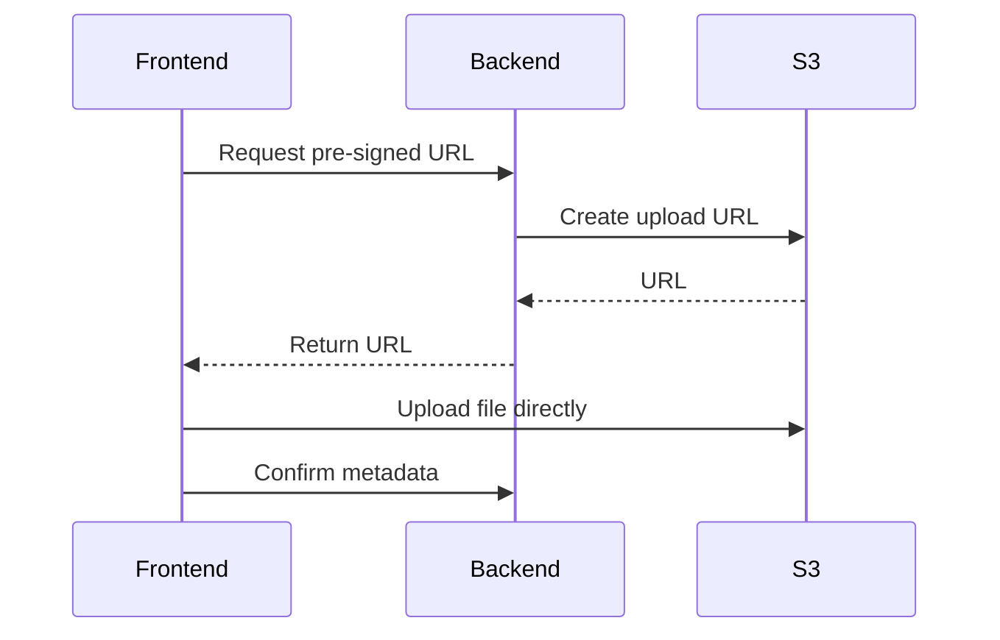
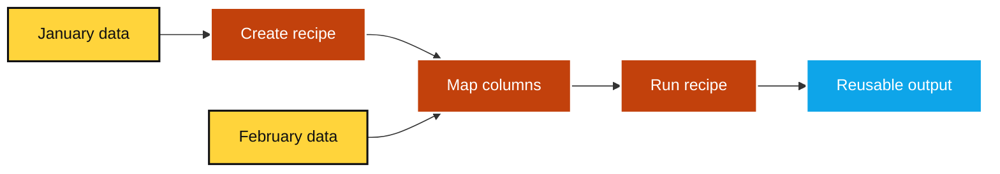
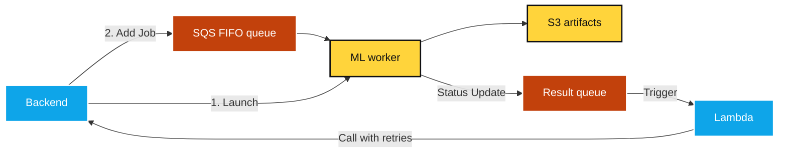
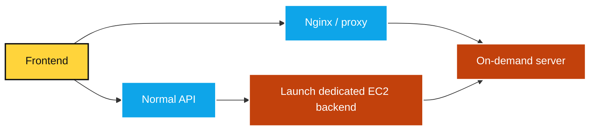
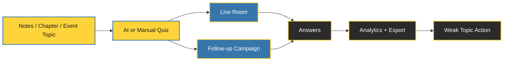

<style>
:root {
  --slidev-theme-primary: #FFFFFF;
  --slidev-theme-secondary: #FFD43B;
  --slidev-theme-accent: #38BDF8;
  --slidev-theme-highlight: #C2410C;
  --slidev-theme-danger: #EF4444;
  --slidev-theme-success: #22C55E;
  --slidev-theme-background: #101012;
  --slidev-theme-surface: #1D1D22;
  --slidev-theme-surface-2: #292933;
  --slidev-theme-foreground: #E8E8E8;
  --slidev-code-background: rgba(13, 17, 23, 0.95);
}

.slidev-layout {
  background: var(--slidev-theme-background);
  color: var(--slidev-theme-foreground);
  font-size: 1.05rem;
}

.slidev-layout h1 {
  color: var(--slidev-theme-primary);
  font-weight: 900;
  letter-spacing: -0.04em;
  line-height: 1.05;
}

.slidev-layout h2 {
  color: var(--slidev-theme-secondary);
  font-weight: 800;
  letter-spacing: -0.02em;
}

.slidev-layout h3 {
  color: var(--slidev-theme-accent);
  font-weight: 800;
}

.slidev-layout p,
.slidev-layout li {
  color: var(--slidev-theme-foreground);
  line-height: 1.45;
}

.slidev-layout strong,
.slidev-layout b {
  color: var(--slidev-theme-secondary);
}

.slidev-layout code {
  color: #F8FAFC;
  background: var(--slidev-code-background);
  border-radius: 6px;
  padding: 0.15rem 0.35rem;
}

.slidev-code {
  border: 2px solid #3B82F6;
  border-radius: 14px;
  box-shadow: 0 14px 34px rgba(0,0,0,0.35);
}

a {
  color: var(--slidev-theme-accent);
  text-decoration: none;
}

.card {
  background: var(--slidev-theme-surface);
  border: 2px solid #343442;
  border-radius: 18px;
  padding: 1rem 1.15rem;
  box-shadow: 0 14px 34px rgba(0,0,0,0.35);
}

.card-yellow {
  background: #FFD43B;
  color: #101012;
  border-radius: 18px;
  padding: 1rem 1.15rem;
  font-weight: 800;
  box-shadow: 0 14px 34px rgba(0,0,0,0.35);
}

.card-blue {
  background: #0EA5E9;
  color: #FFFFFF;
  border-radius: 18px;
  padding: 1rem 1.15rem;
  font-weight: 800;
  box-shadow: 0 14px 34px rgba(0,0,0,0.35);
}

.card-orange {
  background: #C2410C;
  color: #1F2937;
  border-radius: 18px;
  padding: 1rem 1.15rem;
  font-weight: 800;
  box-shadow: 0 14px 34px rgba(0,0,0,0.35);
}

.tag {
  display: inline-block;
  background: #292933;
  border: 1px solid #454552;
  border-radius: 999px;
  padding: 0.35rem 0.7rem;
  margin: 0.15rem;
  color: #F8FAFC;
  font-weight: 700;
}

.kicker {
  color: var(--slidev-theme-secondary);
  text-transform: uppercase;
  font-size: 0.8rem;
  letter-spacing: 0.16em;
  font-weight: 900;
}

.big-number {
  color: var(--slidev-theme-secondary);
  font-size: 3rem;
  line-height: 1;
  font-weight: 900;
}

.source {
  position: absolute;
  bottom: 1.2rem;
  left: 3.2rem;
  right: 3.2rem;
  color: #A5A5B5;
  font-size: 0.63rem;
  line-height: 1.25;
}

.meme-card {
  background: #FFFFFF;
  color: #111827;
  border: 4px solid #111827;
  border-radius: 22px;
  padding: 1.2rem;
  font-weight: 900;
  box-shadow: 0 16px 42px rgba(0,0,0,0.4);
}

.meme-card .top {
  border-bottom: 3px solid #111827;
  padding-bottom: 0.7rem;
  margin-bottom: 0.7rem;
}

.footer-mini {
  position: absolute;
  bottom: 1.1rem;
  right: 3.2rem;
  color: #77778A;
  font-size: 0.7rem;
}

.section-title {
  font-size: 3.4rem;
  line-height: 1;
}

.two-col {
  display: grid;
  grid-template-columns: 1fr 1fr;
  gap: 1rem;
}

.three-col {
  display: grid;
  grid-template-columns: repeat(3, 1fr);
  gap: 0.9rem;
}

.small-list li {
  margin: 0.2rem 0;
}

ul {
  display: flex;
  flex-direction: column;
  gap: 12px;
}   

.slidev-layout li {
    font-size: 1.5rem;
    line-height: 2rem;
}

.grid .card,
.grid .card-yellow,
.grid .card-blue,
.grid .card-orange,
.grid .meme-card,
.grid .card p,
.grid .card-yellow p,
.grid .card-blue p,
.grid .card-orange p,
.grid .meme-card p {
    font-size: 1.5rem;
    line-height: 2rem;
}

.bottom-note {
    position: absolute; bottom: 2rem; left: 3.2rem; right: 3.2rem;
}

 
</style>

<div class="h-full flex flex-col justify-center items-center text-center">
  <h1 style="font-size: 4.2rem; color: white !important; text-shadow: 3px 3px 0 #0EA5E9;">Backend, Data Science and AI</h1>
  <h2 class="mt-4" style="font-size: 2rem; background: transparent !important;">From college projects to industry systems</h2>
  <div class="mt-10 card" style="width: 720px;">
    <div class="text-2xl font-bold text-white">Susmit Vengurlekar</div>
    <div class="mt-2 text-lg">Data Scientist & Solutions Architect</div>
    <div class="mt-4">
      <span class="tag">Backend</span>
      <span class="tag">Data Science</span>
      <span class="tag">AI</span>
      <span class="tag">Gen AI</span>
    </div>
  </div>
</div>

<!--how backend, data, ML, and Gen AI come together in real systems. -->

---
layout: full
---

# What this session is really about

## Not just "how to use AI"

<div class="two-col mt-8">
  <div class="card">
    <h3>Today we will unpack</h3>
    <ul>

<li>How real data + AI systems are built</li>
<li>Why fundamentals still matter</li>
<li>What I built in XBoost</li>
<li>What students should learn next</li>
<li>How to use LLMs without becoming careless</li>

</ul>

  </div>
  <div class="meme-card text-center text-4xl" v-click>
    <div class="top">"AI will do everything"</div>
    <div>Production bug at 2 AM:</div>
    <div class="mt-8 text-6xl">404</div>
    <div class="text-2xl mt-2">fundamentals not found</div>
  </div>
</div>

<!-- tools are useful only when the underlying engineering is solid. -->

---
layout: full
---

# The main message

## Tools change. Fundamentals compound.

<div class="flex flex-row ml-20 mr-20">

<div class="mt-8 grid grid-cols-1 gap-3 text-center">
  <ul>
    <div class="card-yellow">Python</div>
    <div class="card-blue">Data</div>
    <div class="card-orange">Backend</div>
    <div class="card-yellow">ML</div>
    <div class="card-blue">Gen AI</div>
  </ul>
</div>

<v-click>
<div class="mt-10 card text-2xl text-left w-50% ml-auto">
  Projects matter more than certificates when they prove you can think, build, debug, and explain.
</div>
</v-click>

</div>

<!--reusable fundamentals and finished projects. -->

---
layout: full
---

# Who am I?

## My journey so far

<div class="mt-8 grid grid-cols-3 gap-4">
  <div class="card">
    <div class="big-number">01</div>
    <h3>Foundation</h3>
    <p>B.Sc. IT, DG Ruparel College<br/>CGPA: 9.73 (Without ratta)</p>
  </div>
  <div class="card">
    <div class="big-number">02</div>
    <h3>Engineering</h3>
    <p>Backend Developer, Database Engineer, Team Lead, Software Architect</p>
  </div>
  <div class="card">
    <div class="big-number">03</div>
    <h3>AI Systems</h3>
    <p>Data Scientist, ML platform developer, Founding team member, Solution Architect</p>
  </div>
</div>

<div class="mt-7 text-center">
  <span class="tag">SkillRev</span>
  <span class="tag">AIDAX</span>
  <span class="tag">Xcellen</span>
  <span class="tag">Zeza Technologies</span>
  <span class="tag">Flyer Lively (Part of failed startup while in college)</span>
</div>

<!--path moved from backend and databases into data science, ML platforms, and applied AI. -->

---
layout: full
---

# What I have worked on

## Real-world systems, not only models

<div class="grid grid-cols-3 gap-4 mt-7">
  <v-clicks>
  <div class="card"><h3>Data platforms</h3><p>ETL, AutoML, EDA, feature engineering, XAI.</p></div>
  <div class="card"><h3>Event-driven systems</h3><p>Kafka, Flink, queues, async workers, real-time pipelines.</p></div>
  <div class="card"><h3>Graph systems</h3><p>Neo4j, Graph RAG, data sync, knowledge graphs.</p></div>
  <div class="card"><h3>Cloud architecture</h3><p>AWS CDK, ECS Fargate, Lambda, S3, Glue.</p></div>
  <div class="card"><h3>Observability</h3><p>OpenTelemetry, Grafana, Loki, Tempo, OpenObserve.</p></div>
  <div class="card"><h3>Automation</h3><p>PowerPoint reporting, ThinkCell output, insight generation.</p></div>
  </v-clicks>
</div>

<!--systems where data, backend, and AI had to work together. -->

---
layout: full
---

# Agenda

## 5 things we will cover

<div class="mt-8 grid grid-cols-5 gap-3 text-center">
    <div class="card"><div class="big-number">1</div><h3>Domain overview</h3></div>
    <div class="card"><div class="big-number">2</div><h3>XBoost showcase</h3></div>
    <div class="card"><div class="big-number">3</div><h3>Industry scope</h3></div>
    <div class="card"><div class="big-number">4</div><h3>Skills required</h3></div>
    <div class="card"><div class="big-number">5</div><h3>Student roadmap</h3></div>
</div>


---
layout: full
---

# Icebreaker

## Audience question

<div class="card-yellow mt-8 text-4xl text-center">
  What is the difference between AI and Gen AI?
</div>

<div class="grid grid-cols-2 gap-3 mt-7 text-center text-2xl">
    <div class="card">Is ChatGPT the whole of AI?</div>
    <div class="card">Is every ML model Gen AI?</div>
    <div class="card">Is computer vision AI?</div>
    <div class="card">Is recommendation AI?</div>
</div>


---
layout: full
---

# AI is bigger than Gen AI

<ul>
<li>Artificial Intelligence
<ul>
<li> Machine Learning </li>
<li> Deep Learning </li>
<li> Computer Vision </li>
<li> NLP </li>
<li> Forecasting </li>
<li> Optimization </li>
<li> Wave / Signal Analysis </li>
<li> Reinforcement Learning </li>
<li> Generative AI </li>
</ul></li>

</ul>

<div class="bottom-note mt-6 card text-2xl text-center">
  Gen AI is a powerful part of AI, not the whole field.
</div>


---
layout: full
---

# Industry reality (As per November 2025 McKinsey report)

## AI is everywhere, but value is uneven

<div class="grid grid-cols-2 gap-5 mt-8">
  <div class="card">
    <div class="big-number">88%</div>
    <p>reported regular AI use in at least one business function.</p>
  </div>
  <div class="card">
    <div class="big-number">~1/3</div>
    <p>reported that their companies had begun to scale AI programs.</p>
  </div>
</div>

<div class="bottom-note mt-7 card-orange text-2xl text-center">
  Adoption is broad. Deep value still requires workflow redesign.
</div>

<div class="source">Source: [McKinsey, The State of AI in 2025](https://www.mckinsey.com/~/media/mckinsey/business%20functions/quantumblack/our%20insights/the%20state%20of%20ai/november%202025/the-state-of-ai-2025-agents-innovation_cmyk-v1.pdf)</div>


---
layout: full
---

# But the hype has a catch

## "AI Engineer" is not "Vibe Coder"

<div class="grid grid-cols-2 gap-5 mt-8">
  <div class="meme-card text-center text-2xl">
    <div class="top">Demo day</div>
    <div>"It works on my laptop"</div>
  </div>
  <div class="card">
    <h3>An AI engineer should understand</h3>

<ul>
<li>Data pipelines</li>
<li>Retrieval systems</li>
<li>Evaluation</li>
<li>Guardrails</li>
<li>Backend APIs</li>
<li>Observability</li>
<li>Failure modes</li>
</ul>

  </div>
</div>

<div class="bottom-note mt-2 card-yellow text-center text-2xl">
  Vibe coding can make a demo. Engineering makes it survive users.
</div>

<!--LLMs are powerful assistants, but production systems still need contracts, testing, deployment, monitoring, and ownership. -->

---
layout: full
---

# My domain

## Backend + Data Science + Applied AI

<style>
li {
    font-size: 3rem;
    line-height: 3.5rem;
}
</style>

<li> Business problem </li>
<li> Data ingestion </li>
<li> Data transformation </li>
<li> ML / AI workflow </li>
<li> Backend system </li>
<li> User-facing output </li>
<li> Business decision </li>


<!--a full product pipeline. A model is only one piece. The system starts at a business problem and ends at a decision. -->

---
layout: full
---

# What does backend mean here?

## Backend is not only CRUD APIs

<div class="grid grid-cols-3 gap-4 mt-8">
  <v-clicks>
  <div class="card"><h3>Access</h3><p>Authentication, permissions, user boundaries.</p></div>
  <div class="card"><h3>Files</h3><p>Uploads, storage, metadata, lifecycle.</p></div>
  <div class="card"><h3>Jobs</h3><p>Long-running tasks, workers, queues.</p></div>
  <div class="card"><h3>Contracts</h3><p>Data schemas, APIs, validation.</p></div>
  <div class="card"><h3>Reliability</h3><p>Logging, retries, failure handling.</p></div>
  <div class="card"><h3>UI bridge</h3><p>Clean APIs for complex user flows.</p></div>
  </v-clicks>
</div>

<!-- backend is the control tower. In AI products, backend work includes orchestration, storage, job status, failure states, and traceability. -->

---
layout: full
---

# What does data science mean here?

## Data science is not only model.fit()

<div class="two-col mt-8">
  <div class="card">
    <h3>The visible part</h3>
    <ul>
      <li>Train models</li>
      <li>Compare metrics</li>
      <li>Show charts</li>
      <li>Present predictions</li>
</ul>
  </div>
  <div class="card" v-click>
    <h3>The real work</h3>
    <ul>
      <li>Understand the problem</li>
      <li>Inspect messy data</li>
      <li>Clean and validate</li>
      <li>Engineer features</li>
      <li>Explain results</li>
      <li>Communicate insights</li>
</ul>
  </div>
</div>

<div class="bottom-note mt-8 meme-card text-center text-2xl" v-after>
  90% cleaning data, 10% pretending the model was the hard part
</div>

<!--Data science requires curiosity, domain understanding, validation, metrics, and communication. -->

---
layout: full
---

# What does Gen AI mean here?

## Gen AI is useful when language meets workflow

<div class="grid grid-cols-3 gap-4 mt-8 text-3xl">
  <v-clicks>
  <div class="card">Generate insights from tables</div>
  <div class="card">Extract text patterns from examples</div>
  <div class="card">Summarize survey logic issues</div>
  <div class="card">Draft reports and slide narratives</div>
  <div class="card">Build agents that use tools</div>
  <div class="card">Help users perform complex tasks</div>
  </v-clicks>
</div>

<div class="bottom-note card-yellow text-center text-2xl" v-after>
  Gen AI becomes powerful when connected to data, tools, and workflows.
</div>

<!--Gen AI is not magic dust. shines when it is grounded in data, product context, deterministic tools, and user workflows. -->

---
layout: full
---

# One mental model

## Real AI products need 3 layers

<style>
.mermaid {
margin-top: 2rem;
  transform: scale(1.5);
  transform-origin: top center;
  display: flex;
  justify-content: center;
}
</style>



<div class="bottom-note card text-center text-2xl">
  If one layer is weak, the product breaks.
</div>

<!-- Examples of failure: great model but bad UI; great UI but bad data; powerful AI but no workflow. This model will help students evaluate projects. -->

---
layout: full
---

# The unbreakable law

## Garbage In, Garbage Out

<style>
    .mermaid {
        margin-top: 2rem;
        transform: scale(2);
        transform-origin: top center;
        display: flex;
        justify-content: center;
    }
</style>


<div class="bottom-note card-orange text-center text-2xl">
  AI can make bad input sound professional. That is dangerous.
</div>

<!-- With Gen AI, poor inputs may not look obviously poor because the output can be fluent, polished, and confident. -->

---
layout: full
---

# Be very cautious with Data

## Data traps are everywhere

<div class="grid grid-cols-3 gap-4 mt-8 text-3xl">
  <v-clicks>
  <div class="card">CSV may not be comma-separated</div>
  <div class="card">Dates may silently parse wrong</div>
  <div class="card">Units may be missing</div>
  <div class="card">Outliers may be real</div>
  <div class="card">Column names may lie</div>
  <div class="card">Nulls may carry meaning</div>
  </v-clicks>
</div>

<div class="bottom-note mt-8 card-yellow text-center text-2xl" v-after>
  Before modeling, investigate.
</div>

<!--a date parsed as month/day instead of day/month, or a zero that means unavailable rather than actual zero. -->

---
layout: full
---

# Showcase project

## XBoost (Not XGBoost)

<div class="card-blue mt-8 text-4xl text-center">
  A data engineering + ML platform
</div>

<div class="mt-7 card text-2xl text-left ">
  Built for business analysts working on tabular data in the pharmaceutical commercial excellence domain.
</div>

<v-click>
<div class="bottom-note mt-6 card-yellow text-2xl text-center">
  Core idea: enrich data, analyze it, train models, understand results, and reuse workflows.
</div>
</v-click>

<!-- XBoost is useful because it forces us to talk about real product requirements, not isolated algorithms. -->

---
layout: full
---

# XBoost problem statement

## The user problem

<div class="grid grid-cols-2 gap-5 mt-8">
  <div class="card">
    <h3>Analysts needed to</h3>
    <ul>
      <li>Upload CSV / Excel data</li>
      <li>Clean and transform datasets</li>
      <li>Perform EDA</li>
      <li>Train ML models</li>
      <li>Understand model output</li>
      <li>Reuse monthly workflows</li>
</ul>
  </div>
  <div class="card-orange text-3xl flex items-center justify-center text-center">
    Users had different levels of data science knowledge.
  </div>
</div>

<!--problem is not just technical scale; the system also needs to guide users who may not be data scientists. -->


---
layout: full
---

# Frontend choices

## UI for a data platform

<div class="grid grid-cols-4 gap-3 mt-8 text-center">
  <div class="card-yellow">Next.js</div>
  <div class="card-blue">TypeScript</div>
  <div class="card-orange">AG Grid</div>
  <div class="card-yellow">Plotly</div>
  <div class="card-blue">Formik</div>
  <div class="card-orange">Yup</div>
  <div class="card-yellow">SWR</div>
  <div class="card-blue">SCSS Modules</div>
</div>

<div class="bottom-note mt-8 card text-center text-2xl">
  Data-heavy UI needs structure, not random components.
</div>


---
layout: full
---

# Backend choices

## Python + Django REST Framework

<div class="two-col mt-8">
  <div class="card">
    <h3>Why Python?</h3>
    <ul>
      <li>Data science ecosystem</li>
      <li>Fast development</li>
      <li>Strong library support</li>
      <li>Good for APIs + processing</li>
</ul>
  </div>
  <div class="card">
    <h3>Backend principles</h3>
    <ul>
      <li>Typed request objects</li>
      <li>Service layer</li>
      <li>Utilities</li>
      <li>Feature-based folders</li>
      <li>Tests</li>
</ul>
  </div>
</div>

---
layout: full
---

# Code Design

## Code should match product growth

<ul>
<li>feature folder
<ul>
<li>views - api routes</li>
<li>view_models - adapter between views and services</li>
<li>services - business logic</li>
<li>utils - helper functions</li>
</ul></li>
</ul>


<div class="grid grid-cols-5 gap-3 mt-7 text-center">
  <div class="card">Onboarding</div>
  <div class="card">Testing</div>
  <div class="card">Reuse</div>
  <div class="card">Less searching</div>
  <div class="card">Clear boundaries</div>
</div>

<div class="bottom-note mt-7 card-yellow text-center text-2xl">
  Folder structure is also system design.
</div>

<!--Students often think architecture is only diagrams. Show that architecture also lives in naming, folder structure, boundaries, and where logic is allowed to exist. -->

---
layout: full
---

# Data storage design

## Dataset file is not dataset metadata

<div class="grid grid-cols-5 gap-3 mt-8 text-center">
  <div class="card-yellow">Parquet on S3</div>
  <div class="card-blue">Postgres metadata</div>
  <div class="card-orange">Sample rows</div>
  <div class="card-yellow">Schema JSON</div>
  <div class="card-blue">EFS cache</div>
</div>

<div class="grid grid-cols-5 gap-3 mt-15 text-center" v-click>
  <div class="card-yellow">Columnar storage</div>
  <div class="card-blue">Computed Statistics</div>
  <div class="card-orange">Why fetch all for sample ?</div>
  <div class="card-yellow">Name, Display Name, DType</div>
  <div class="card-blue">Shared disk storage across servers</div>
</div>

<div class="bottom-note mt-9 card text-center text-2xl" v-after>
  Large datasets should not be treated like ordinary database rows.
</div>

<!--there is distinction between storing data and storing information about the data. Metadata enables fast UI, status tracking, schema display, and workflow replay. -->

---
layout: full
---

# Dynamic schema

## Users can upload anything

<div class="two-col mt-8">
  <div class="card">
    <h3>Problem</h3>
    <ul>

<li>Unknown column names</li>
<li>Unknown number of columns</li>
<li>Multiple data types</li>
<li>Business meaning may be unclear</li>

</ul>
  </div>
  <div class="card">
    <h3>Solution</h3>
    <ul>

<li>Store schema as JSON</li>
<li>Use typed field objects</li>
<li>Track display name</li>
<li>Track type, alias, format</li>

</ul>
  </div>
</div>

<!--no fixed schema means the platform cannot depend on hardcoded columns. The schema itself becomes part of the product state. -->

---
layout: full
---

# Data upload design

## Large upload should bypass backend

<style>
.mermaid {
  transform: scale(0.95);
  transform-origin: top center;
  display: flex;
  justify-content: center;
}
</style>



---
layout: full
---

# Recipe concept

## Transformations as reusable knowledge

<div class="grid grid-cols-2 gap-5 mt-8">
  <div class="card">
    <h3>A recipe records</h3>
    <ul>

<li>Uploaded datasets</li>
<li>Enrich steps</li>
<li>Step configuration</li>
<li>Execution order</li>

</ul>
  </div>
  <div class="card" v-click>
    <h3>Example steps</h3>
    <ul>

<li>Fill missing values</li>
<li>Treat outliers</li>
<li>Bin numbers</li>
<li>Calculate columns</li>
<li>Drop columns</li>

</ul>
  </div>
</div>

<div class="bottom-note mt-8 card-yellow text-center text-2xl" v-after>
  Repeatable transformations should be captured as recipes, not inefficiency.
</div>

<!--Recipe as workflow memory. This is where a one-time manual action becomes reusable platform knowledge. -->

---
layout: full
---

# Recipe run

## Reuse workflow on new data

<style>
.mermaid {
  transform: scale(1.4);
  transform-origin: top center;
  display: flex;
  justify-content: center;
}
</style>



<div class="grid grid-cols-4 gap-3 text-center text-2xl" style="margin-top: 10rem;" v-click>
  <div class="card">Saves time</div>
  <div class="card">Reduces manual work</div>
  <div class="card">Supports monthly workflows</div>
  <div class="card">Improves reproducibility</div>
</div>

<!--Analysts often repeat similar work every month; recipe run converts that repetition into a reliable workflow. -->

---
layout: full
---

# Auto-generated features

## Feature engineering using metadata

<div class="two-col mt-7">
  <div class="card">
    <h3>Used</h3>
    <ul>

<li>Column aliases</li>
<li>Standard feature templates</li>
<li>Formation steps</li>
<li>Default configs</li>

</ul>
  </div>
  <div class="card" v-click>
    <h3>Example</h3>

```text
Email Sent Date
+ Email Open Date
+ Account ID
-> Time taken to open
-> Group into buckets
-> Drop intermediate column
```
  </div>
</div>

<style>
    code {
        font-size: 1.5rem;
    }
    </style>

<!--aliases as semantic hints. If the system knows a column represents a sent date or open date, it can suggest useful derived features. -->

---
layout: full
---

# ML worker design

## Heavy jobs should not block API or cost money when idle

<style>
.mermaid {
  transform: scale(1.2);
  transform-origin: top center;
  display: flex;
  justify-content: center;
}
</style>



<div class="bottom-note mt-6 card-yellow text-center text-2xl">
  Training and analysis can be slow, so execution must be async.
</div>

<!--Async design improves reliability, retry handling, scaling, and user experience. -->

---
layout: full
---

# On-demand backend server

## Dedicated compute for heavy operations

<style>
.mermaid {
    margin-top: 4rem;
  transform: scale(1.2);
  transform-origin: top center;
  display: flex;
  justify-content: center;
}
</style>



<div class="mt-5 grid grid-cols-3 gap-3 text-center text-2xl" style="position: absolute; bottom: 5rem; left: 3.2rem; right: 3.2rem;">
  <div class="card">Compute-heavy operations</div>
  <div class="card">Multiple users</div>
  <div class="card">Avoid backend slowdown</div>
</div>

<!--some operations are too heavy for the normal API path. Dedicated compute isolates risk and gives separate resources for intensive tasks. -->

---
layout: full
---

# Gen AI feature in XBoost

## Extract sub-text using examples

<div class="two-col mt-8">
  <div class="card">
    <h>Problem</h>
    <p class="text-xl">Users needed custom text extraction, but regex was difficult for novice users.</p>
    <p>Example: from "Product A - Region B - 2024", extract "Region B".</p>
    <p> Or more complex - "2024-01-15: Event X (Region B)", as "Event X in Region B".</p>
  </div>
  <div class="card">
    <h3>Solution</h3>
    <ul>

<li>User gives examples</li>
<li>GPT generates Python code</li>
<li>Code applies extraction</li>
<li>Generated logic is stored for recipe run</li>

</ul>
  </div>
</div>

<div class="bottom-note mt-8 card-orange text-center text-2xl">
  Gen AI was used as a workflow enabler, not as magic dust.
</div>

<!-- regex generation to Python code generation. The key learning is to let Gen AI help users express intent while the system handles execution and reuse. -->


---
layout: full
---

# Key XBoost insight

## ML systems are mostly systems

<br/>

### Not just `import model` followed by `model.fit()`. The real work is in the system design.

<div class="grid grid-cols-3 gap-4 mt-8">
  <div class="card">Data Contracts</div>
  <div class="card">Storage</div>
  <div class="card">Queues</div>
  <div class="card">Workers</div>
  <div class="card">Transformations</div>
  <div class="card">UI (For users, power users, super users)</div>
  <div class="card">Monitoring</div>
  <div class="card">Errors</div>
  <div class="card">Explanations</div>
</div>


<div class="bottom-note card-blue text-center text-2xl">
  Successful AI systems need both modeling and software design.
</div>

<!--Model training is a small part of making an AI product useful, reliable, and understandable. -->


---
layout: full
---

# Side Project Showcase

## ForQuiz

### Quiz-led learning, events, and readiness - with measurable outcomes

<div class="mt-8 text-2xl" style="background: rgba(255, 212, 59, 0.95); color: #1a1a1a; padding: 1rem; border-radius: 10px;">
  Turn any topic into a live quiz, follow-up practice, and weak-topic insight.
</div>

<br/>
<ul>

<li>Run live quiz rooms for classes, clubs, committees, and college events</li>
<li>Create quizzes manually or with AI from notes, chapters, decks, or briefs</li>
<li>Launch follow-up campaigns for homework, revision, or readiness checks</li>
<li>Review results by question, player, topic, batch, segment, and timing</li>

</ul>

<!--
Speaker notes:
I am showing ForQuiz as a side project that combines backend systems, realtime flows, AI generation, analytics, and product thinking.
-->

---

# ForQuiz Proof Loop

## From source material → participation → insight



<style>
.mermaid {
  margin-top: 2rem;
    transform: scale(1.1);
    transform-origin: top center;
    display: flex;
    justify-content: center;
}
</style>

<ul class="mt-8 text-2xl">

<li><b>For students:</b> quiz battles, committee events, workshops, fests, revision rounds</li>
<li><b>For faculty:</b> one chapter becomes class play + homework + weak-topic clarity</li>
<li><b>For organizers:</b> results can become export-ready proof, not just participation</li>

</ul>

<!--
Speaker notes:
This is the main ForQuiz story. One source can become a live moment and then a follow-up practice loop. The important point is that learning does not end at participation. The analytics should help someone take action.
-->

---
layout: full
---

# Try It In Your College

<div class="grid grid-cols-2 gap-6 mt-8">

<div style="background: rgba(255, 212, 59, 0.95); color: #1a1a1a; padding: 1.2rem; border-radius: 12px;">
<h3 style="color:#1a1a1a;">Use it for events</h3>

<ul style="color:#1a1a1a;">

<li style="color:#1a1a1a;">Committee quiz battle</li>
<li style="color:#1a1a1a;">Department activity</li>
<li style="color:#1a1a1a;">Workshop recap</li>
<li style="color:#1a1a1a;">Fest or club round</li>
<li style="color:#1a1a1a;">Placement practice</li>

</ul>
</div>

<div style="background: rgba(55, 118, 171, 0.95); color: white; padding: 1.2rem; border-radius: 12px;">
<h3 style="color:white;">Share it with faculty</h3>

<ul>

<li>One chapter pilot</li>
<li>Live class quiz</li>
<li>Homework campaign</li>
<li>Weak-topic report</li>
<li>Batch comparison</li>

</ul>
</div>

</div>

<div class = "flex flex-row">

<div class="mt-8 text-2xl text-center w-50% self-center" style="background: rgba(255, 255, 255, 0.95); color: #1a1a1a; padding: 1rem; border-radius: 10px;">
 Try ForQuiz once in a real event, then introduce it to one faculty member.
</div>


<div class="mt-6 flex w-1/2 justify-center self-center">
  
</div>

</div>


<!--
Speaker notes:
I want students to try ForQuiz in committee events, clubs, fests, or workshops. I also want them to share it with faculty because faculty can use it for chapter revision, homework, and weak-topic tracking.
-->

---
layout: center
---

# What is the work ?


---
layout: full
---

# Transfer learning for technologies

## Deep learning has transfer learning. So does your brain.

<div class="grid grid-cols-2 gap-4 mt-8 text-xl">
  <div class="card">Django -> FastAPI</div>
  <div class="card">Postgres -> Snowflake</div>
  <div class="card">Pandas -> Polars</div>
  <div class="card">REST API -> Tool API</div>
  <div class="card">Orchestrating Services -> Agent workflows</div>
  <div class="card">Unit tests -> Evaluation tests</div>
</div>

<div class="bottom-note mt-8 card-yellow text-center text-2xl">
  You are not starting from zero every time.
</div>

<!-- learning deeply once makes every future tool easier to understand. -->

---
layout: full
---

# Industry scope

## Data Science roles actually do

<div class="grid grid-cols-3 gap-4 mt-8">
  <div class="card">Problem framing</div>
  <div class="card">Data cleaning</div>
  <div class="card">EDA</div>
  <div class="card">Feature engineering</div>
  <div class="card">Model training</div>
  <div class="card">Experiment tracking</div>
  <div class="card">Evaluation</div>
  <div class="card">Business storytelling</div>
  <div class="card">Deployment collaboration</div>
</div>

<div class="bottom-note mt-7 card-blue text-center text-2xl">
  Data science is part statistics, part engineering, part communication.
</div>

<!-- data science roles vary by company. Some are research-heavy, some are analytics-heavy, and some are engineering-heavy. -->

---
layout: full
---

# Industry scope

## AI / ML work beyond dashboards

<div class="grid grid-cols-3 gap-4 mt-8">
  <div class="card">Classification</div>
  <div class="card">Regression</div>
  <div class="card">Forecasting</div>
  <div class="card">Recommendation systems</div>
  <div class="card">Optimization</div>
  <div class="card">Computer vision</div>
  <div class="card">NLP</div>
  <div class="card">Anomaly detection</div>
  <div class="card">Signal / wave analysis</div>
</div>

<div class="bottom-note mt-7 card-yellow text-center text-2xl">
  AI is much larger than chatbots.
</div>

<!--fraud detection, personalized feeds, traffic prediction, OCR, inventory forecasting, and quality inspection. -->

---
layout: full
---

# Industry scope

## Gen AI work in companies

<div class="grid grid-cols-3 gap-4 mt-8">
  <div class="card">Knowledge assistants</div>
  <div class="card">Document Q&A</div>
  <div class="card">Report generation</div>
  <div class="card">Code assistance</div>
  <div class="card">Insight generation</div>
  <div class="card">Customer support</div>
  <div class="card">Data extraction</div>
  <div class="card">Workflow automation</div>
  <div class="card">Agents with tools</div>
</div>

<div class="bottom-note mt-7 card-yellow text-center text-2xl">
  Often a part of existing workflows, not a separate product.
</div>


---
layout: full
---

# What is hot now?

## Agents are becoming important

<div class="grid grid-cols-3 gap-4 mt-8">
  <div class="card">Plan steps</div>
  <div class="card">Call tools</div>
  <div class="card">Use memory / state</div>
  <div class="card">Coordinate specialists</div>
  <div class="card">Ask for approval</div>
  <div class="card">Complete multi-step workflows</div>
</div>

<div class="bottom-note mt-8 card-yellow text-center text-2xl">
  Agents are workflow systems around LLMs.
</div>

<!--Agents are not just prompts. They need tools, state, orchestration, approvals, and observability. -->

---
layout: full
---

# MCP

## Model Context Protocol

<div class="two-col mt-8">
  <div class="card">
    <h3>MCP helps connect AI assistants to</h3>
    <ul>

<li>Databases</li>
<li>Repositories</li>
<li>Business tools</li>
<li>File systems</li>
<li>Developer tools</li>
<li>Custom APIs</li>

</ul>
  </div>
  <div class="card-yellow text-3xl flex items-center justify-center text-center">
    A standardized bridge between AI and tools.
  </div>
</div>

<!--USB-C analogy: MCP aims to reduce custom connector work by standardizing how AI applications connect to external systems. -->

---
layout: full
---

# Skills / reusable workflows

## Prompt once is not enough

<div class="grid grid-cols-5 gap-3 mt-8 text-center">
  <div class="card">Instructions</div>
  <div class="card">Examples</div>
  <div class="card">Files</div>
  <div class="card">Code</div>
  <div class="card">Repeatable steps</div>
</div>

<div class="bottom-note mt-10 card-blue text-center text-3xl">
  The future is not only prompting. It is packaging repeatable workflows.
</div>

---
layout: full
---

# RAG is not just "add vector DB"

## Robust RAG requires engineering

<div class="grid grid-cols-5 gap-3 mt-7 text-center text-sm">
  <div class="card">Chunking</div>
  <div class="card">Embeddings</div>
  <div class="card">Vector search</div>
  <div class="card">Hybrid search</div>
  <div class="card">Reranking</div>
  <div class="card">Metadata filtering</div>
  <div class="card">Query transformation</div>
  <div class="card">Context compression</div>
  <div class="card">Evaluation</div>
  <div class="card">Guardrails</div>
</div>

<div class="bottom-note mt-8 card-orange text-center text-2xl">
  A weak RAG pipeline gives confident wrong answers.
</div>

---
layout: full
---

# Context engineering

## LLMs can specialize only so much


<div class="grid grid-cols-3 gap-4 mt-8">
  <div class="card">System instruction - <br/>behavior</div>
  <div class="card">Tools - <br/>actions</div>
  <div class="card">RAG - <br/>knowledge</div>
  <div class="card">Memory - <br/>user/session facts</div>
  <div class="card">Code - <br/>deterministic logic</div>
  <div class="card">Evaluation - <br/>quality checks</div>
</div>


<div class="bottom-note mt-5 card-yellow text-center text-2xl">
 A system to make LLM reliable, explainable, and safe.
</div>

<!--Some knowledge belongs in RAG, some behavior in instructions, some actions in tools, and deterministic work in code. -->

---
layout: full
---

# Responsible AI

## Production Gen AI needs guardrails

<div class="grid grid-cols-4 gap-3 mt-8 text-center">
  <div class="card">Hallucination</div>
  <div class="card">Data leakage</div>
  <div class="card">Prompt injection</div>
  <div class="card">Unsafe tool use</div>
  <div class="card">Bad evaluation</div>
  <div class="card">Biased outputs</div>
  <div class="card">Over-trust</div>
  <div class="card">Weak monitoring</div>
</div>

<!-- Responsible AI is about designing systems that acknowledge failure modes and reduce harm. -->

---
layout: full
---

# Skills required

## Learn Python properly

<div class="grid grid-cols-3 gap-3 mt-8 text-center text-sm">
  <div class="card">Syntax deeply</div>
  <div class="card">Comprehensions</div>
  <div class="card">Iterators</div>
  <div class="card">Generators</div>
  <div class="card">Decorators</div>
  <div class="card">OOP</div>
  <div class="card">Dataclasses</div>
  <div class="card">Type hints</div>
</div>

<div class="bottom-note mt-8 card-yellow text-center text-2xl">
  Python is not just a scripting language. It is your engineering tool.
</div>

<!--go beyond syntax tutorials. Python fluency shows up in clean code, debugging, reusable utilities, and readable data workflows. -->

---
layout: full
---

# Skills required

## Data skills are non-negotiable

<div class="grid grid-cols-5 gap-3 mt-8 text-center text-sm">
  <div class="card">SQL</div>
  <div class="card">Joins</div>
  <div class="card">Aggregations</div>
  <div class="card">Window functions</div>
  <div class="card">Data types</div>
  <div class="card">Indexing basics</div>
  <div class="card">Pandas / Polars</div>
  <div class="card">Validation</div>
  <div class="card">File formats</div>
  <div class="card">Warehouses / lakes</div>
</div>

<div class="bottom-note mt-8 card-orange text-center text-2xl">
  Most AI systems fail before the model because the data layer is weak.
</div>

<!-- SQL and data modeling are still extremely relevant in the Gen AI era. Retrieval, evaluation, metrics, and pipelines all depend on data literacy. -->

---
layout: full
---

# Skills required

## Learn the "why", not just APIs

<div class="grid grid-cols-5 gap-3 mt-8 text-center text-sm">
  <div class="card">Train/test split</div>
  <div class="card">Cross-validation</div>
  <div class="card">Metrics</div>
  <div class="card">Overfitting</div>
  <div class="card">Feature engineering</div>
  <div class="card">Target leakage</div>
  <div class="card">Bias / variance</div>
  <div class="card">Interpretation</div>
  <div class="card">Error analysis</div>
  <div class="card">Experiment design</div>
</div>

<div class="bottom-note mt-8 card-yellow text-center text-2xl">
  Do not just call .fit() and .predict().
</div>

<!-- example of target leakage if time permits. A model can look impressive in notebooks and fail completely in the real world. -->

---
layout: full
---

# Skills required

## AI engineers need backend sense

<div class="grid grid-cols-5 gap-3 mt-8 text-center text-sm">
  <div class="card">REST APIs</div>
  <div class="card">Auth basics</div>
  <div class="card">Databases</div>
  <div class="card">Queues</div>
  <div class="card">Workers</div>
  <div class="card">Caching</div>
  <div class="card">File storage</div>
  <div class="card">Logging</div>
  <div class="card">Docker</div>
  <div class="card">CI/CD + cloud</div>
</div>

<div class="bottom-note mt-8 card-blue text-center text-2xl">
  Your model is useless if users cannot reliably use it.
</div>


---
layout: full
---

# Skills required

## Go beyond chat prompts

<div class="grid grid-cols-5 gap-3 mt-7 text-center text-sm">
  <div class="card">Prompt design</div>
  <div class="card">Tool calling</div>
  <div class="card">Agents</div>
  <div class="card">Custom workflows</div>
  <div class="card">Skills</div>
  <div class="card">MCP</div>
  <div class="card">RAG</div>
  <div class="card">Vector DBs</div>
  <div class="card">Evaluation data</div>
  <div class="card">Cost / latency</div>
</div>

<div class="bottom-note mt-8 card-yellow text-center text-2xl">
  Gen AI engineering is software engineering with probabilistic components.
</div>

<!-- Gen AI engineering still needs architecture: state, tools, logs, evaluation, safety, and cost control. -->

---
layout: full
---

# Roadmap: Month 0-3

## Build fundamentals

<div class="two-col mt-8">
  <div class="card">
    <h3>Goal</h3>
    <ul>

<li>Python fluency</li>
<li>SQL fluency</li>
<li>Git / GitHub</li>
<li>Basic statistics</li>
<li>Pandas</li>
<li>Small clean projects</li>

</ul>
  </div>
  <div class="card">
    <h3>Projects</h3>
    <ul>

<li>CSV / TXT data cleaner</li>
<li>Student performance analysis</li>
<li>Expense tracker API</li>
<li>Mini EDA report generator</li>

</ul>
  </div>
</div>

<div class="bottom-note mt-7 card-yellow text-center text-2xl">
  Output: 4 small, finished GitHub projects.
</div>

<!-- finished over fancy. A small complete project with README and screenshots beats ten half-done notebooks. -->

---
layout: full
---

# Roadmap: Month 3-6

## Build data + backend projects

<div class="two-col mt-8">
  <div class="card">
    <h3>Goal</h3>
    <ul>

<li>APIs</li>
<li>Databases</li>
<li>Data pipelines</li>
<li>Testing</li>
<li>Deployment basics</li>

</ul>
  </div>
  <div class="card">
    <h3>Projects</h3>
    <ul>

<li>Data profiler for SQLite / CSV</li>
<li>FastAPI + Postgres backend</li>
<li>Background job queue</li>
<li>Dashboard from processed data</li>

</ul>
  </div>
</div>

<div class="bottom-note mt-7 card-blue text-center text-2xl">
  Output: 1 solid project with README, tests, and demo.
</div>

<!-- project depth. Add testing, input validation, Docker, and deployment to convert a college project into a portfolio project. -->

---
layout: full
---

# Roadmap: Month 6-12

## Build applied AI projects

<div class="two-col mt-8">
  <div class="card">
    <h3>Goal</h3>

<li>ML pipeline</li>
<li>RAG system</li>
<li>Agent workflow</li>
<li>Evaluation</li>
<li>Deployment</li>

  </div>
  <div class="card">
    <h3>Projects</h3>
    <ul>

<li>RAG over college notes</li>
<li>Resume analyzer with citations</li>
<li>Agent that queries a database</li>
<li>Explainability dashboard</li>
<li>Multi-source data profiler</li>

</ul>
  </div>
</div>

<div class="bottom-note mt-7 card-yellow text-center text-2xl">
  Output: 1 big project that would have been difficult before LLM help.
</div>

<!--The final project should show architecture, evaluation, data handling, and user-facing output. -->

---
layout: full
---

# How to use LLMs for projects

## Do not just vibe code

<div class="two-col mt-8">
  <div class="card">
    <h3>Bad use</h3>

<li>Copy-paste blindly</li>
<li>Skip reading code</li>
<li>Ignore errors</li>
<li>Fake understanding</li>
<li>Push secrets to GitHub</li>


  </div>

  <div class="card" v-click>
    <h3>Good use</h3>

<li>Ask for explanations</li>
<li>Ask for alternatives</li>
<li>Generate test cases</li>
<li>Review architecture</li>
<li>Debug with reasoning</li>
<li>Refactor after understanding</li>


  </div>

</div>

<div class="bottom-note mt-7 card-orange text-center text-2xl">
  Use AI like a senior assistant, not like a brain replacement.
</div>

---
layout: full
---

# Professional habit 1

## Attention to detail means attention to detail

<div class="two-col mt-8">
  <div class="meme-card text-center text-2xl">
    <div class="top">Hi Sumit</div>
    <div>Resume attached: final_final_REAL.pdf</div>
  </div>
  <div class="card">
    <h3>Actually check</h3>


<li>Spelling</li>
<li>Company name</li>
<li>Person name</li>
<li>Date and time</li>
<li>Attachments</li>
<li>Tone</li>


  </div>
</div>

<div class="bottom-note mt-7 card-yellow text-center text-2xl">
  A typo in a company name can undo a good first impression.
</div>

---
layout: full
---

# Professional habit 2

## Be proactive in communication

<br/>

### I have daily standup at 12, but talk scheduled on Monday 12-2.

<div class="grid grid-cols-3 gap-4 mt-7 text-center">
  <div class="card-yellow">Calendar OOO: 11:30-3</div>
  <div class="card-blue">Slack group message on Friday</div>
  <div class="card-orange">Standup update sent in advance</div>
</div>

<div class="bottom-note mt-8 card text-center text-2xl">
  Do not leave ambiguity for others to solve.
</div>


---
layout: full
---

# Finding this presentation

<ul>
<li>I have used Slidev for this presentation. Using slidev you can write markdown and generate slides with a lot of flexibility.</li>
<li>This presentation is available at https://susmitpy.github.io/talks/backend_data_science_ai</li>
</ul>


---
layout: full
---

# Closing

## What I hope you remember

<div class="grid grid-cols-3 gap-4 mt-8">
  <li>Fundamentals compound</li>
  <li>AI is bigger than Gen AI</li>
  <li>Vibe coding is not engineering</li>
  <li>Projects create real learning</li>
  <li>Backend + data + AI is powerful</li>
  <li>Communication is professionalism</li>
</div>

<div class="bottom-note mt-10 card-yellow text-center text-3xl">
  Build things. Understand them. Then build bigger things.
</div>


---
src: ./pages/connect.md
---


---
layout: full
class: text-center
---

# Q&A

## Ask me anything

<div class="mt-8 grid grid-cols-4 gap-3 text-center">
  <div class="card">Backend</div>
  <div class="card">Data Science</div>
  <div class="card">AI / Gen AI</div>
  <div class="card">XBoost</div>
  <div class="card">Projects</div>
  <div class="card">Careers</div>
  <div class="card">Skills</div>
  <div class="card">Mistakes to avoid</div>
</div>

<div class="mt-10 card-blue text-3xl text-center">
  Thank you!
</div>

<!--Invite questions. If there is silence, seed the room with options: ask about XBoost architecture, roadmaps, Gen AI project ideas, or mistakes to avoid. -->