<style>
:root {
  --slidev-theme-primary: #FFFFFF;
  --slidev-theme-secondary: #FFD43B;
  --slidev-theme-accent: #38BDF8;
  --slidev-theme-highlight: #F97316;
  --slidev-theme-danger: #EF4444;
  --slidev-theme-success: #22C55E;
  --slidev-theme-background: #101012;
  --slidev-theme-surface: #1D1D22;
  --slidev-theme-surface-2: #292933;
  --slidev-theme-foreground: #E8E8E8;
  --slidev-code-background: rgba(13, 17, 23, 0.95);
}

.slidev-layout {
  background: var(--slidev-theme-background);
  color: var(--slidev-theme-foreground);
  font-size: 1.05rem;
}

.slidev-layout h1 {
  color: var(--slidev-theme-primary);
  font-weight: 900;
  letter-spacing: -0.04em;
  line-height: 1.05;
}

.slidev-layout h2 {
  color: var(--slidev-theme-secondary);
  font-weight: 800;
  letter-spacing: -0.02em;
}

.slidev-layout h3 {
  color: var(--slidev-theme-accent);
  font-weight: 800;
}

.slidev-layout p,
.slidev-layout li {
  color: var(--slidev-theme-foreground);
  line-height: 1.45;
}

.slidev-layout strong,
.slidev-layout b {
  color: var(--slidev-theme-secondary);
}

.slidev-layout code {
  color: #F8FAFC;
  background: var(--slidev-code-background);
  border-radius: 6px;
  padding: 0.15rem 0.35rem;
}

.slidev-code {
  border: 2px solid #3B82F6;
  border-radius: 14px;
  box-shadow: 0 14px 34px rgba(0,0,0,0.35);
}

a {
  color: var(--slidev-theme-accent);
  text-decoration: none;
}

.card {
  background: var(--slidev-theme-surface);
  border: 2px solid #343442;
  border-radius: 18px;
  padding: 1rem 1.15rem;
  box-shadow: 0 14px 34px rgba(0,0,0,0.35);
}

.card-yellow {
  background: #FFD43B;
  color: #101012;
  border-radius: 18px;
  padding: 1rem 1.15rem;
  font-weight: 800;
  box-shadow: 0 14px 34px rgba(0,0,0,0.35);
}

.card-blue {
  background: #0EA5E9;
  color: #FFFFFF;
  border-radius: 18px;
  padding: 1rem 1.15rem;
  font-weight: 800;
  box-shadow: 0 14px 34px rgba(0,0,0,0.35);
}

.card-orange {
  background: #F97316;
  color: #FFFFFF;
  border-radius: 18px;
  padding: 1rem 1.15rem;
  font-weight: 800;
  box-shadow: 0 14px 34px rgba(0,0,0,0.35);
}

.tag {
  display: inline-block;
  background: #292933;
  border: 1px solid #454552;
  border-radius: 999px;
  padding: 0.35rem 0.7rem;
  margin: 0.15rem;
  color: #F8FAFC;
  font-weight: 700;
}

.kicker {
  color: var(--slidev-theme-secondary);
  text-transform: uppercase;
  font-size: 0.8rem;
  letter-spacing: 0.16em;
  font-weight: 900;
}

.big-number {
  color: var(--slidev-theme-secondary);
  font-size: 3rem;
  line-height: 1;
  font-weight: 900;
}

.source {
  position: absolute;
  bottom: 1.2rem;
  left: 3.2rem;
  right: 3.2rem;
  color: #A5A5B5;
  font-size: 0.63rem;
  line-height: 1.25;
}

.meme-card {
  background: #FFFFFF;
  color: #111827;
  border: 4px solid #111827;
  border-radius: 22px;
  padding: 1.2rem;
  font-weight: 900;
  box-shadow: 0 16px 42px rgba(0,0,0,0.4);
}

.meme-card .top {
  border-bottom: 3px solid #111827;
  padding-bottom: 0.7rem;
  margin-bottom: 0.7rem;
}

.footer-mini {
  position: absolute;
  bottom: 1.1rem;
  right: 3.2rem;
  color: #77778A;
  font-size: 0.7rem;
}

.section-title {
  font-size: 3.4rem;
  line-height: 1;
}

.two-col {
  display: grid;
  grid-template-columns: 1fr 1fr;
  gap: 1rem;
}

.three-col {
  display: grid;
  grid-template-columns: repeat(3, 1fr);
  gap: 0.9rem;
}

.small-list li {
  margin: 0.2rem 0;
}
</style>

<div class="h-full flex flex-col justify-center items-center text-center">
  <div class="kicker mb-5">Online Talk + Q&A</div>
  <h1 style="font-size: 4.2rem; color: white !important; text-shadow: 3px 3px 0 #0EA5E9;">Backend, Data Science and AI</h1>
  <h2 class="mt-4" style="font-size: 2rem; background: transparent !important;">From college projects to industry systems</h2>
  <div class="mt-10 card" style="width: 720px;">
    <div class="text-2xl font-bold text-white">Susmit Vengurlekar</div>
    <div class="mt-2 text-lg">Data Scientist & Solution Architect</div>
    <div class="mt-4">
      <span class="tag">Backend</span>
      <span class="tag">Data Science</span>
      <span class="tag">AI</span>
      <span class="tag">Gen AI</span>
    </div>
  </div>
</div>

<!-- Speaker notes: Open with energy. Set the promise clearly: this is not a hype talk; it is about how backend, data, ML, and Gen AI come together in real systems. -->

---
layout: center
---

# What this session is really about

## Not just "how to use AI"

<div class="two-col mt-8">
  <div class="card">
    <h3>Today we will unpack</h3>
    <v-clicks>

- How real data + AI systems are built
- Why fundamentals still matter
- What I built in XBoost
- What students should learn next
- How to use LLMs without becoming careless

    </v-clicks>
  </div>
  <div class="meme-card text-center text-2xl">
    <div class="top">"AI will do everything"</div>
    <div>Production bug at 2 AM:</div>
    <div class="mt-4 text-5xl">404</div>
    <div class="text-base mt-2">fundamentals not found</div>
  </div>
</div>

<!-- Speaker notes: Establish that the talk is practical and grounded. The joke is there to make the audience comfortable, but the core message is serious: tools are useful only when the underlying engineering is solid. -->

---
layout: center
---

# The main message

## Tools change. Fundamentals compound.

<div class="mt-8 grid grid-cols-5 gap-3 text-center">
  <v-clicks>
    <div class="card-yellow">Python</div>
    <div class="card-blue">Data</div>
    <div class="card-orange">Backend</div>
    <div class="card-yellow">ML</div>
    <div class="card-blue">Gen AI</div>
  </v-clicks>
</div>

<v-click>
<div class="mt-10 card text-2xl text-center">
  Projects matter more than certificates when they prove you can think, build, debug, and explain.
</div>
</v-click>

<!-- Speaker notes: Make the compounding idea memorable. Emphasize that students do not need to chase every new framework; they need reusable fundamentals and finished projects. -->

---
layout: center
---

# Who am I?

## My journey so far

<div class="mt-8 grid grid-cols-3 gap-4">
  <div class="card">
    <div class="big-number">01</div>
    <h3>Foundation</h3>
    <p>B.Sc. IT, Mumbai University<br/>CGPA: 9.73</p>
  </div>
  <div class="card">
    <div class="big-number">02</div>
    <h3>Engineering</h3>
    <p>Backend Developer, Database Engineer, Team Lead, Software Architect</p>
  </div>
  <div class="card">
    <div class="big-number">03</div>
    <h3>AI Systems</h3>
    <p>Data Scientist, ML platform developer, Founding team member, Solution Architect</p>
  </div>
</div>

<div class="mt-7 text-center">
  <span class="tag">SkillRev</span>
  <span class="tag">AIDAX</span>
  <span class="tag">Xcellen</span>
  <span class="tag">Zeza Technologies</span>
  <span class="tag">Flyer Lively</span>
</div>

<!-- Speaker notes: Keep this slide brief. The goal is credibility, not a resume reading. Highlight that the path moved from backend and databases into data science, ML platforms, and applied AI. -->

---
layout: center
---

# What I have worked on

## Real-world systems, not only models

<div class="grid grid-cols-3 gap-4 mt-7">
  <v-clicks>
  <div class="card"><h3>Data platforms</h3><p>ETL, AutoML, EDA, feature engineering, XAI.</p></div>
  <div class="card"><h3>Event-driven systems</h3><p>Kafka, Flink, queues, async workers, real-time pipelines.</p></div>
  <div class="card"><h3>Graph systems</h3><p>Neo4j, Graph RAG, data sync, knowledge graphs.</p></div>
  <div class="card"><h3>Cloud architecture</h3><p>AWS CDK, ECS Fargate, Lambda, S3, Glue.</p></div>
  <div class="card"><h3>Observability</h3><p>OpenTelemetry, Grafana, Loki, Tempo, OpenObserve.</p></div>
  <div class="card"><h3>Automation</h3><p>PowerPoint reporting, ThinkCell output, insight generation.</p></div>
  </v-clicks>
</div>

<!-- Speaker notes: This slide connects the speaker profile to the talk. Emphasize that the examples are from systems where data, backend, and AI had to work together. -->

---
layout: center
---

# Agenda

## 5 things we will cover

<div class="mt-8 grid grid-cols-5 gap-3 text-center">
  <v-clicks>
    <div class="card"><div class="big-number">1</div><h3>Domain overview</h3></div>
    <div class="card"><div class="big-number">2</div><h3>XBoost showcase</h3></div>
    <div class="card"><div class="big-number">3</div><h3>Industry scope</h3></div>
    <div class="card"><div class="big-number">4</div><h3>Skills required</h3></div>
    <div class="card"><div class="big-number">5</div><h3>Student roadmap</h3></div>
  </v-clicks>
</div>

<!-- Speaker notes: Give the audience a map. Mention that the talk moves from broad concepts to a real platform, then back to career and learning decisions. -->

---
layout: center
---

# Icebreaker

## Audience question

<div class="card-yellow mt-8 text-3xl text-center">
  What is the difference between AI and Gen AI?
</div>

<div class="grid grid-cols-4 gap-3 mt-7 text-center">
  <v-clicks>
    <div class="card">Is ChatGPT the whole of AI?</div>
    <div class="card">Is every ML model Gen AI?</div>
    <div class="card">Is computer vision AI?</div>
    <div class="card">Is recommendation AI?</div>
  </v-clicks>
</div>

<!-- Speaker notes: Ask the audience to answer in chat or verbally. Do not correct immediately. Use their answers to lead into the next slide. -->

---
layout: center
---

# AI is bigger than Gen AI

```text
Artificial Intelligence
|-- Machine Learning
|-- Deep Learning
|-- Computer Vision
|-- NLP
|-- Forecasting
|-- Optimization
|-- Wave / Signal Analysis
`-- Generative AI
```

<div class="mt-6 card text-2xl text-center">
  Gen AI is a powerful part of AI, not the whole field.
</div>

<!-- Speaker notes: Make this distinction early because many students equate AI with chatbots. Use simple examples: spam detection, recommendation systems, OCR, forecasting, and route optimization. -->

---
layout: center
---

# Industry reality in 2026

## AI is everywhere, but value is uneven

<div class="grid grid-cols-2 gap-5 mt-8">
  <div class="card">
    <div class="big-number">88%</div>
    <p>reported regular AI use in at least one business function.</p>
  </div>
  <div class="card">
    <div class="big-number">~1/3</div>
    <p>reported that their companies had begun to scale AI programs.</p>
  </div>
</div>

<v-click>
<div class="mt-7 card-orange text-2xl text-center">
  Adoption is broad. Deep value still requires workflow redesign.
</div>
</v-click>

<div class="source">Source: [McKinsey, The State of AI in 2025](https://www.mckinsey.com/~/media/mckinsey/business%20functions/quantumblack/our%20insights/the%20state%20of%20ai/november%202025/the-state-of-ai-2025-agents-innovation_cmyk-v1.pdf)</div>

<!-- Speaker notes: Explain that companies are experimenting aggressively, but scaling is harder. The opportunity is not just using tools; it is knowing how to design systems around the tools. -->

---
layout: center
---

# Why students should care

## The market is moving toward data + AI roles

<div class="grid grid-cols-2 gap-5 mt-8">
  <div class="card">
    <h3>Fast-growing role areas</h3>
    <v-clicks>

- Big data specialists
- AI / ML specialists
- Software and application developers
- Data warehousing specialists
- Cybersecurity and networks

    </v-clicks>
  </div>
  <div class="card-blue text-3xl flex items-center justify-center text-center">
    Your edge is not one tool.<br/>Your edge is a stack of skills.
  </div>
</div>

<div class="source">Source: [World Economic Forum, Future of Jobs Report 2025](https://www.weforum.org/publications/the-future-of-jobs-report-2025/digest/)</div>

<!-- Speaker notes: Connect this to student decisions: Python, SQL, backend, data engineering, ML, and communication are all compounding skills in the same direction. -->

---
layout: center
---

# But the hype has a catch

## "AI Engineer" is not "Vibe Coder"

<div class="grid grid-cols-2 gap-5 mt-8">
  <div class="meme-card text-center text-2xl">
    <div class="top">Demo day</div>
    <div>"It works on my laptop"</div>
  </div>
  <div class="card">
    <h3>An AI engineer should understand</h3>
    <v-clicks>

- Data pipelines
- Retrieval systems
- Evaluation
- Guardrails
- Backend APIs
- Observability
- Failure modes

    </v-clicks>
  </div>
</div>

<div class="mt-7 card-yellow text-center text-2xl">
  Vibe coding can make a demo. Engineering makes it survive users.
</div>

<!-- Speaker notes: Avoid sounding anti-AI. The point is that LLMs are powerful assistants, but production systems still need contracts, testing, deployment, monitoring, and ownership. -->

---
layout: center
---

# My domain

## Backend + Data Science + Applied AI

<style>
.mermaid {
  transform: scale(0.95);
  transform-origin: top center;
  display: flex;
  justify-content: center;
}
</style>

```mermaid
flowchart LR
    A[Business problem] --> B[Data ingestion]
    B --> C[Data transformation]
    C --> D[ML / AI workflow]
    D --> E[Backend system]
    E --> F[User-facing output]
    F --> G[Business decision]

    classDef yellow fill:#FFD43B,stroke:#101012,stroke-width:2px,color:#101012;
    classDef blue fill:#0EA5E9,stroke:#FFFFFF,stroke-width:2px,color:#FFFFFF;
    classDef orange fill:#F97316,stroke:#FFFFFF,stroke-width:2px,color:#FFFFFF;
    class A,G yellow;
    class B,C,D orange;
    class E,F blue;
```

<!-- Speaker notes: Introduce the idea that this is a full product pipeline. A model is only one piece. The system starts at a business problem and ends at a decision. -->

---
layout: center
---

# What does backend mean here?

## Backend is not only CRUD APIs

<div class="grid grid-cols-3 gap-4 mt-8">
  <v-clicks>
  <div class="card"><h3>Access</h3><p>Authentication, permissions, user boundaries.</p></div>
  <div class="card"><h3>Files</h3><p>Uploads, storage, metadata, lifecycle.</p></div>
  <div class="card"><h3>Jobs</h3><p>Long-running tasks, workers, queues.</p></div>
  <div class="card"><h3>Contracts</h3><p>Data schemas, APIs, validation.</p></div>
  <div class="card"><h3>Reliability</h3><p>Logging, retries, failure handling.</p></div>
  <div class="card"><h3>UI bridge</h3><p>Clean APIs for complex user flows.</p></div>
  </v-clicks>
</div>

<!-- Speaker notes: Explain that backend is the control tower. In AI products, backend work includes orchestration, storage, job status, failure states, and traceability. -->

---
layout: center
---

# What does data science mean here?

## Data science is not only model.fit()

<div class="two-col mt-8">
  <div class="card">
    <h3>The visible part</h3>
    <v-clicks>

- Train models
- Compare metrics
- Show charts
- Present predictions

    </v-clicks>
  </div>
  <div class="card">
    <h3>The real work</h3>
    <v-clicks>

- Understand the problem
- Inspect messy data
- Clean and validate
- Engineer features
- Explain results
- Communicate insights

    </v-clicks>
  </div>
</div>

<div class="mt-8 meme-card text-center text-2xl">
  90% cleaning data, 10% pretending the model was the hard part
</div>

<!-- Speaker notes: Make the point funny but accurate. Data science requires curiosity, domain understanding, validation, metrics, and communication. -->

---
layout: center
---

# What does Gen AI mean here?

## Gen AI is useful when language meets workflow

<div class="grid grid-cols-3 gap-4 mt-8">
  <v-clicks>
  <div class="card">Generate insights from tables</div>
  <div class="card">Extract text patterns from examples</div>
  <div class="card">Summarize survey logic issues</div>
  <div class="card">Draft reports and slide narratives</div>
  <div class="card">Build agents that use tools</div>
  <div class="card">Help users perform complex tasks</div>
  </v-clicks>
</div>

<div class="mt-8 card-yellow text-center text-2xl">
  Gen AI becomes powerful when connected to data, tools, and workflows.
</div>

<!-- Speaker notes: Emphasize that Gen AI is not magic dust. It shines when it is grounded in data, product context, deterministic tools, and user workflows. -->

---
layout: center
---

# One mental model

## Real AI products need 3 layers

<style>
.mermaid {
  transform: scale(1);
  transform-origin: top center;
  display: flex;
  justify-content: center;
}
</style>

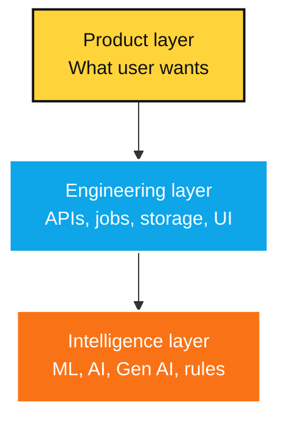

<div class="mt-5 card text-center text-2xl">
  If one layer is weak, the product breaks.
</div>

<!-- Speaker notes: Give examples of failure: great model but bad UI; great UI but bad data; powerful AI but no workflow. This model will help students evaluate projects. -->

---
layout: center
---

# The unbreakable law

## Garbage In, Garbage Out

```text
Good Input -> Analysis / ML / Gen AI -> Useful Output

Bad Input  -> Analysis / ML / Gen AI -> Confident Garbage
```

<div class="mt-8 card-orange text-center text-2xl">
  AI can make bad input sound professional. That is dangerous.
</div>

<!-- Speaker notes: Use this as a strong warning. With Gen AI, poor inputs may not look obviously poor because the output can be fluent, polished, and confident. -->

---
layout: center
---

# Attention to detail starts here

## Data traps are everywhere

<div class="grid grid-cols-3 gap-4 mt-8">
  <v-clicks>
  <div class="card">CSV may not be comma-separated</div>
  <div class="card">Dates may silently parse wrong</div>
  <div class="card">Units may be missing</div>
  <div class="card">Outliers may be real</div>
  <div class="card">Column names may lie</div>
  <div class="card">Nulls may carry meaning</div>
  </v-clicks>
</div>

<div class="mt-8 card-yellow text-center text-2xl">
  Before modeling, investigate.
</div>

<!-- Speaker notes: Give a quick real example: a date parsed as month/day instead of day/month, or a zero that means unavailable rather than actual zero. -->

---
layout: center
---

# Showcase project

## XBoost / Xpower-Boost

<div class="card-blue mt-8 text-3xl text-center">
  A data engineering + ML platform
</div>

<div class="mt-7 card text-xl text-center">
  Built for business analysts working on tabular data in the pharmaceutical commercial excellence domain.
</div>

<v-click>
<div class="mt-6 card-yellow text-2xl text-center">
  Core idea: enrich data, analyze it, train models, understand results, and reuse workflows.
</div>
</v-click>

<!-- Speaker notes: Transition into the main project section. Explain that XBoost is useful because it forces us to talk about real product requirements, not isolated algorithms. -->

---
layout: center
---

# XBoost problem statement

## The user problem

<div class="grid grid-cols-2 gap-5 mt-8">
  <div class="card">
    <h3>Analysts needed to</h3>
    <v-clicks>

- Upload CSV / Excel data
- Clean and transform datasets
- Perform EDA
- Train ML models
- Understand model output
- Reuse monthly workflows

    </v-clicks>
  </div>
  <div class="card-orange text-3xl flex items-center justify-center text-center">
    Users had different levels of data science knowledge.
  </div>
</div>

<!-- Speaker notes: Show empathy for users. The problem is not just technical scale; the system also needs to guide users who may not be data scientists. -->

---
layout: center
---

# XBoost scale

## Not a toy dataset problem

<div class="grid grid-cols-2 gap-5 mt-8">
  <div class="card text-center">
    <div class="big-number">12 x 3</div>
    <p>Small datasets still matter</p>
  </div>
  <div class="card text-center">
    <div class="big-number">70L x 60</div>
    <p>Large datasets need architecture</p>
  </div>
</div>

<div class="mt-7 grid grid-cols-3 gap-3 text-center">
  <v-clicks>
  <div class="card">Unknown schemas</div>
  <div class="card">Many user flows</div>
  <div class="card">Interactive operations</div>
  </v-clicks>
</div>

<div class="mt-7 card-yellow text-center text-2xl">
  No fixed schema. No fixed journey. Many entry and exit points.
</div>

<!-- Speaker notes: Explain 70L as 70 lakh rows, about 7 million rows. Make the architecture problem visible: user freedom creates backend complexity. -->

---
layout: center
---

# XBoost in one sentence

## A platform to enrich data

<style>
.mermaid {
  transform: scale(0.9);
  transform-origin: top center;
  display: flex;
  justify-content: center;
}
</style>


<!-- Speaker notes: Keep this slide simple. This is the mental model for the next 20 slides: every architecture decision supports this lifecycle. -->

---
layout: center
---

# High-level architecture

## Main components

<style>
.mermaid {
  transform: scale(0.85);
  transform-origin: top center;
  display: flex;
  justify-content: center;
}
</style>

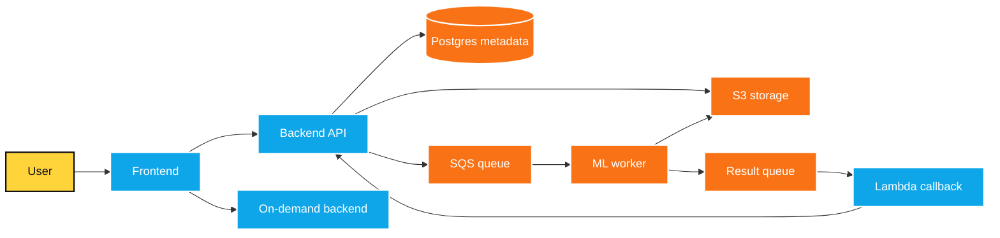

<!-- Speaker notes: Avoid going too deep yet. This is the map. Mention that each component exists because of a real constraint: scale, cost, async jobs, metadata, or user experience. -->

---
layout: center
---

# Frontend choices

## UI for a data platform

<div class="grid grid-cols-4 gap-3 mt-8 text-center">
  <v-clicks>
  <div class="card-yellow">Next.js</div>
  <div class="card-blue">TypeScript</div>
  <div class="card-orange">AG Grid</div>
  <div class="card-yellow">Plotly</div>
  <div class="card-blue">Formik</div>
  <div class="card-orange">Yup</div>
  <div class="card-yellow">SWR</div>
  <div class="card-blue">SCSS Modules</div>
  </v-clicks>
</div>

<div class="mt-8 card text-center text-2xl">
  Data-heavy UI needs structure, not random components.
</div>

<!-- Speaker notes: Explain why frontend matters in data platforms. Analysts need grids, previews, validation, charts, loading states, and clear feedback. -->

---
layout: center
---

# Backend choices

## Python + Django REST Framework

<div class="two-col mt-8">
  <div class="card">
    <h3>Why Python?</h3>
    <v-clicks>

- Data science ecosystem
- Fast development
- Strong library support
- Good for APIs + processing

    </v-clicks>
  </div>
  <div class="card">
    <h3>Backend principles</h3>
    <v-clicks>

- Typed request objects
- Service layer
- Utilities
- Feature-based folders
- Tests

    </v-clicks>
  </div>
</div>

<!-- Speaker notes: Use this slide to show that language choice is contextual. Python worked because the product sat close to data science workflows. -->

---
layout: center
---

# Why feature-based folders?

## Code should match product growth

```text
feature/
|-- views
|-- view_models
|-- services
`-- utils
```

<div class="grid grid-cols-5 gap-3 mt-7 text-center">
  <v-clicks>
  <div class="card">Onboarding</div>
  <div class="card">Testing</div>
  <div class="card">Reuse</div>
  <div class="card">Less searching</div>
  <div class="card">Clear boundaries</div>
  </v-clicks>
</div>

<div class="mt-7 card-yellow text-center text-2xl">
  Folder structure is also system design.
</div>

<!-- Speaker notes: Students often think architecture is only diagrams. Show that architecture also lives in naming, folder structure, boundaries, and where logic is allowed to exist. -->

---
layout: center
---

# Data storage design

## Dataset file is not dataset metadata

<div class="grid grid-cols-5 gap-3 mt-8 text-center">
  <v-clicks>
  <div class="card-yellow">Parquet on S3</div>
  <div class="card-blue">Postgres metadata</div>
  <div class="card-orange">Sample rows</div>
  <div class="card-yellow">Schema JSON</div>
  <div class="card-blue">EFS cache</div>
  </v-clicks>
</div>

<div class="mt-9 card text-center text-2xl">
  Large datasets should not be treated like ordinary database rows.
</div>

<!-- Speaker notes: Explain the distinction between storing data and storing information about the data. Metadata enables fast UI, status tracking, schema display, and workflow replay. -->

---
layout: center
---

# Why Parquet?

## Better format for analytics

<style>
.mermaid {
  transform: scale(0.95);
  transform-origin: top center;
  display: flex;
  justify-content: center;
}
</style>

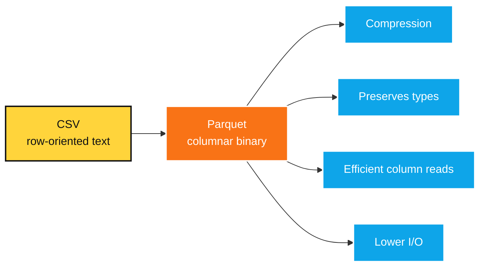

<!-- Speaker notes: Give a simple example: if the user only needs three columns from 60, columnar reads can avoid scanning everything like plain text CSV workflows. -->

---
layout: center
---

# Dynamic schema

## Users can upload anything

<div class="two-col mt-8">
  <div class="card">
    <h3>Problem</h3>
    <v-clicks>

- Unknown column names
- Unknown number of columns
- Multiple data types
- Business meaning may be unclear

    </v-clicks>
  </div>
  <div class="card">
    <h3>Solution</h3>
    <v-clicks>

- Store schema as JSON
- Use typed field objects
- Track display name
- Track type, alias, format

    </v-clicks>
  </div>
</div>

<!-- Speaker notes: Emphasize that no fixed schema means the platform cannot depend on hardcoded columns. The schema itself becomes part of the product state. -->

---
layout: center
---

# Data upload design

## Large upload should bypass backend

<style>
.mermaid {
  transform: scale(0.95);
  transform-origin: top center;
  display: flex;
  justify-content: center;
}
</style>

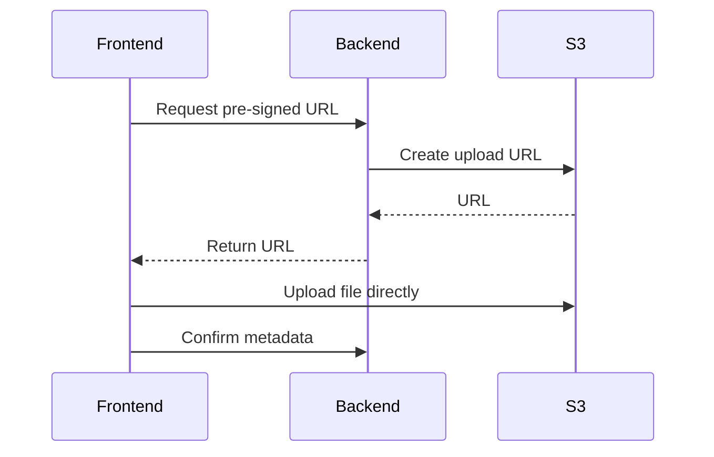

<div class="mt-5 card-yellow text-center text-2xl">
  Avoid blocking backend with huge file uploads.
</div>

<!-- Speaker notes: Explain pre-signed URLs with a simple analogy: the backend gives the browser a temporary permission slip to upload directly to storage. -->

---
layout: center
---

# Multi-file upload

## Real users do not always have one clean file

<div class="two-col mt-8">
  <div class="card">
    <h3>Reality</h3>
    <v-clicks>

- Monthly files
- Regional files
- CSV + Excel splits
- Different columns

    </v-clicks>
  </div>
  <div class="card">
    <h3>Design</h3>
    <v-clicks>

- Zip files on frontend
- Upload once
- Backend reads and concatenates
- Missing uncommon columns become null

    </v-clicks>
  </div>
</div>

<style>
.mermaid {
  transform: scale(0.82);
  transform-origin: top center;
  display: flex;
  justify-content: center;
}
</style>

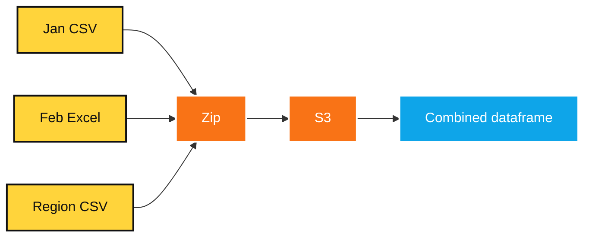

<!-- Speaker notes: Mention that product design must match how business teams actually work. Real data arrives in messy sets, not textbook files. -->

---
layout: center
---

# Recipe concept

## Transformations as reusable knowledge

<div class="grid grid-cols-2 gap-5 mt-8">
  <div class="card">
    <h3>A recipe records</h3>
    <v-clicks>

- Uploaded datasets
- Enrich steps
- Step configuration
- Execution order

    </v-clicks>
  </div>
  <div class="card">
    <h3>Example steps</h3>
    <v-clicks>

- Fill missing values
- Treat outliers
- Bin numbers
- Calculate columns
- Drop columns

    </v-clicks>
  </div>
</div>

<div class="mt-8 card-yellow text-center text-2xl">
  A transformation should not disappear after execution.
</div>

<!-- Speaker notes: Introduce recipe as workflow memory. This is where a one-time manual action becomes reusable platform knowledge. -->

---
layout: center
---

# Recipe run

## Reuse workflow on new data

<style>
.mermaid {
  transform: scale(0.95);
  transform-origin: top center;
  display: flex;
  justify-content: center;
}
</style>

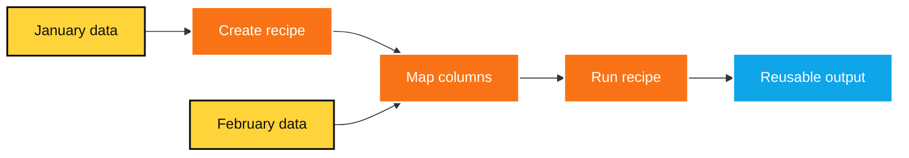

<div class="mt-5 grid grid-cols-4 gap-3 text-center">
  <v-clicks>
  <div class="card">Saves time</div>
  <div class="card">Reduces manual work</div>
  <div class="card">Supports monthly workflows</div>
  <div class="card">Improves reproducibility</div>
  </v-clicks>
</div>

<!-- Speaker notes: Use the monthly data example. Analysts often repeat similar work every month; recipe run converts that repetition into a reliable workflow. -->

---
layout: center
---

# Selective recipe steps

## Looks easy. Is not easy.

<style>
.mermaid {
  transform: scale(0.9);
  transform-origin: top center;
  display: flex;
  justify-content: center;
}
</style>

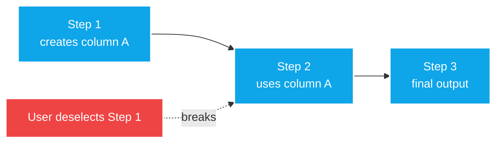

<div class="mt-6 grid grid-cols-4 gap-3 text-center">
  <v-clicks>
  <div class="card">Dependency tracking</div>
  <div class="card">UI feedback</div>
  <div class="card">Safe deselection</div>
  <div class="card">Valid execution path</div>
  </v-clicks>
</div>

<!-- Speaker notes: This is a great engineering lesson. A checkbox in the UI can require dependency graphs, validation logic, and explainable error messages. -->

---
layout: center
---

# Auto-generated features

## Feature engineering using metadata

<div class="two-col mt-7">
  <div class="card">
    <h3>Used</h3>
    <v-clicks>

- Column aliases
- Standard feature templates
- Formation steps
- Default configs

    </v-clicks>
  </div>
  <div class="card">
    <h3>Example</h3>

```text
Email Sent Date
+ Email Open Date
+ Account ID
-> Time taken to open
-> Group into buckets
-> Drop intermediate column
```
  </div>
</div>

<!-- Speaker notes: Explain aliases as semantic hints. If the system knows a column represents a sent date or open date, it can suggest useful derived features. -->

---
layout: center
---

# Undo

## Undo is simple until data is deleted

<div class="grid grid-cols-2 gap-5 mt-8">
  <div class="card">
    <h3>If step adds columns</h3>
    <div class="mt-5 card-yellow text-center">Delete generated columns</div>
  </div>
  <div class="card">
    <h3>If step deletes data</h3>
    <div class="mt-5 card-orange text-center">Restore from backup</div>
  </div>
</div>

<div class="mt-8 card text-center text-2xl">
  Not every data operation is reversible.
</div>

<!-- Speaker notes: Use this to teach state management. Undo requires knowing whether an operation is reversible, destructive, or needs snapshot/restore support. -->

---
layout: center
---

# Preview step

## Users need explainability before ML too

<div class="grid grid-cols-3 gap-4 mt-9 text-center">
  <v-clicks>
  <div class="card-yellow"><h3 style="color:#101012">Input</h3><p style="color:#101012">What data is being used?</p></div>
  <div class="card-blue"><h3 style="color:#FFFFFF">Parameters</h3><p style="color:#FFFFFF">What choices were made?</p></div>
  <div class="card-orange"><h3 style="color:#FFFFFF">Output</h3><p style="color:#FFFFFF">What changed?</p></div>
  </v-clicks>
</div>

<div class="mt-8 card text-center text-2xl">
  If users cannot understand the transformation, they cannot trust the result.
</div>

<!-- Speaker notes: Connect preview to trust. Explainability is not only for models; it is also for data transformations and user actions. -->

---
layout: center
---

# ML worker design

## Heavy jobs should not block API

<style>
.mermaid {
  transform: scale(0.9);
  transform-origin: top center;
  display: flex;
  justify-content: center;
}
</style>

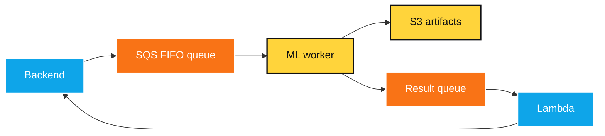

<div class="mt-6 card-yellow text-center text-2xl">
  Training and analysis can be slow, so execution must be async.
</div>

<!-- Speaker notes: Explain why APIs should not wait for long model jobs. Async design improves reliability, retry handling, scaling, and user experience. -->

---
layout: center
---

# On-demand ML compute

## Pay for compute only when needed

<div class="grid grid-cols-4 gap-3 mt-8 text-center">
  <v-clicks>
  <div class="card">Launch EC2 for training</div>
  <div class="card">Attach to ECS cluster</div>
  <div class="card">Run Dockerized worker</div>
  <div class="card">Self-terminate after completion</div>
  </v-clicks>
</div>

<style>
.mermaid {
  transform: scale(0.8);
  transform-origin: top center;
  display: flex;
  justify-content: center;
}
</style>


<!-- Speaker notes: Tie this to cost. Dedicated compute is useful, but always-on compute can waste money. Architecture can be a cost-control tool. -->

---
layout: center
---

# On-demand backend server

## Dedicated compute for heavy operations

<style>
.mermaid {
  transform: scale(0.85);
  transform-origin: top center;
  display: flex;
  justify-content: center;
}
</style>

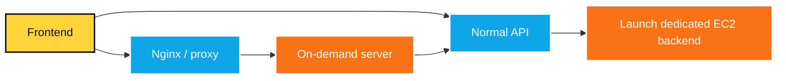

<div class="mt-5 grid grid-cols-3 gap-3 text-center">
  <v-clicks>
  <div class="card">Compute-heavy operations</div>
  <div class="card">Multiple users</div>
  <div class="card">Avoid backend slowdown</div>
  </v-clicks>
</div>

<!-- Speaker notes: Explain that some operations are too heavy for the normal API path. Dedicated compute isolates risk and protects the main app experience. -->

---
layout: center
---

# Explainable AI in XBoost

## Model output must be understandable

<div class="grid grid-cols-5 gap-3 mt-8 text-center">
  <v-clicks>
  <div class="card">Likely segments</div>
  <div class="card">Unlikely segments</div>
  <div class="card">Feature insights</div>
  <div class="card">Cohort analysis</div>
  <div class="card">SHAP explanations</div>
  </v-clicks>
</div>

<div class="mt-10 card-yellow text-center text-3xl">
  Prediction is not enough. Users ask: "Why?"
</div>

<!-- Speaker notes: Give a simple example: a prediction score is less useful if the user cannot understand which drivers influenced the outcome and what action to take. -->

---
layout: center
---

# Gen AI feature in XBoost

## Extract sub-text using examples

<div class="two-col mt-8">
  <div class="card">
    <h3>Problem</h3>
    <p>Users needed custom text extraction, but regex was difficult for novice users.</p>
  </div>
  <div class="card">
    <h3>Solution</h3>
    <v-clicks>

- User gives examples
- GPT generates Python code
- Code applies extraction
- Generated logic is stored for recipe run

    </v-clicks>
  </div>
</div>

<div class="mt-8 card-orange text-center text-2xl">
  Gen AI was used as a workflow enabler, not as magic dust.
</div>

<!-- Speaker notes: Explain the pivot from regex generation to Python code generation. The key learning is to let Gen AI help users express intent while the system handles execution and reuse. -->

---
layout: center
---

# XBoost engineering patterns

## Patterns used for real reasons

<div class="grid grid-cols-4 gap-3 mt-8 text-center">
  <v-clicks>
  <div class="card">Visitor</div>
  <div class="card">Adapter</div>
  <div class="card">Factory</div>
  <div class="card">Bridge</div>
  <div class="card">DTOs</div>
  <div class="card">Registry</div>
  <div class="card">Decorator</div>
  <div class="card">Layered architecture</div>
  </v-clicks>
</div>

<div class="mt-8 card-yellow text-center text-2xl">
  Patterns are useful when they remove real pain.
</div>

<!-- Speaker notes: Warn students not to memorize patterns for interviews only. Patterns matter when they reduce duplication, isolate change, or make workflows extensible. -->

---
layout: center
---

# Key XBoost insight

## ML systems are mostly systems

<div class="two-col mt-8">
  <div class="card">
    <h3>Not just this</h3>

```python
import model
model.fit(X, y)
```
  </div>
  <div class="card">
    <h3>Actually this</h3>

```text
Data contracts + storage + queues
+ workers + transformations + UI
+ monitoring + errors + explanations
```
  </div>
</div>

<div class="mt-8 card-blue text-center text-2xl">
  Successful AI systems need both modeling and software design.
</div>

<!-- Speaker notes: This is one of the most important slides. Model training is a small part of making an AI product useful, reliable, and understandable. -->

---
layout: center
---

# Tradeoffs students should notice

## Production is not textbook-perfect

<div class="grid grid-cols-4 gap-3 mt-8 text-center">
  <v-clicks>
  <div class="card">Cost tradeoffs</div>
  <div class="card">Time constraints</div>
  <div class="card">Partial abstractions</div>
  <div class="card">Framework coupling</div>
  <div class="card">Performance bottlenecks</div>
  <div class="card">Evolving requirements</div>
  <div class="card">Good enough decisions</div>
  <div class="card">Extensibility</div>
  </v-clicks>
</div>

<div class="mt-8 card-yellow text-center text-2xl">
  Engineering is choosing the right compromise consciously.
</div>

<!-- Speaker notes: Normalize tradeoffs. The goal is not perfect architecture; it is clear reasoning, explicit constraints, and decisions that can evolve. -->

---
layout: center
---

# Side Project Showcase

## ForQuiz

### Quiz-led learning, events, and readiness — with measurable outcomes

<div class="mt-8 text-2xl" style="background: rgba(255, 212, 59, 0.95); color: #1a1a1a; padding: 1rem; border-radius: 10px;">
  <b>Core idea:</b> Turn any topic into a live quiz, follow-up practice, and weak-topic insight.
</div>

<v-clicks>

- Run live quiz rooms for classes, clubs, committees, and college events
- Create quizzes manually or with AI from notes, chapters, decks, or briefs
- Launch follow-up campaigns for homework, revision, or readiness checks
- Review results by question, player, topic, batch, segment, and timing

</v-clicks>

<!--
Speaker notes:
Keep this short. This is not a full product pitch. I am showing ForQuiz as a side project that combines backend systems, realtime flows, AI generation, analytics, and product thinking.
-->

---

# ForQuiz Proof Loop

## From source material → participation → insight


<style>
.mermaid {
    transform: scale(0.82);
    transform-origin: top center;
    display: flex;
    justify-content: center;
}
</style>

<v-clicks>

- **For students:** quiz battles, committee events, workshops, fests, revision rounds
- **For faculty:** one chapter becomes class play + homework + weak-topic clarity
- **For organizers:** results can become export-ready proof, not just participation

</v-clicks>

<!--
Speaker notes:
This is the main ForQuiz story. One source can become a live moment and then a follow-up practice loop. The important point is that learning does not end at participation. The analytics should help someone take action.
-->

---
layout: center
---

# Try It In Your College

## One ask before you leave

<div class="grid grid-cols-2 gap-6 mt-8">

<div style="background: rgba(255, 212, 59, 0.95); color: #1a1a1a; padding: 1.2rem; border-radius: 12px;">
<h3 style="color:#1a1a1a;">Use it for events</h3>

<v-clicks>

- Committee quiz battle
- Department activity
- Workshop recap
- Fest or club round
- Placement practice

</v-clicks>
</div>

<div style="background: rgba(55, 118, 171, 0.95); color: white; padding: 1.2rem; border-radius: 12px;">
<h3 style="color:white;">Share it with faculty</h3>

<v-clicks>

- One chapter pilot
- Live class quiz
- Homework campaign
- Weak-topic report
- Batch comparison

</v-clicks>
</div>

</div>

<div class="mt-8 text-2xl text-center" style="background: rgba(255, 255, 255, 0.95); color: #1a1a1a; padding: 1rem; border-radius: 10px;">
  <b>Challenge:</b> Try ForQuiz once in a real event, then introduce it to one faculty member.
</div>

<!-- Optional QR:
<div class="mt-6 flex flex-col items-center">
  <QRCode value="https://your-forquiz-url-here" :size="160" />
  <p class="mt-2 text-lg">Try ForQuiz</p>
</div>
-->

<!--
Speaker notes:
I want students to try ForQuiz in committee events, clubs, fests, or workshops. I also want them to share it with faculty because faculty can use it for chapter revision, homework, and weak-topic tracking.
-->

---
layout: center
---

# Mini showcase

## Multi-Engine Data Profiler

<div class="card-blue mt-7 text-2xl text-center">
  A Python tool to profile tables across multiple engines
</div>

<div class="grid grid-cols-4 gap-3 mt-7 text-center">
  <v-clicks>
  <div class="card-yellow">Snowflake</div>
  <div class="card-blue">Databricks</div>
  <div class="card-orange">DuckDB</div>
  <div class="card-yellow">SQLite</div>
  </v-clicks>
</div>

<div class="grid grid-cols-6 gap-2 mt-7 text-center text-sm">
  <v-clicks>
  <div class="card">Row counts</div>
  <div class="card">Schema</div>
  <div class="card">Min / max</div>
  <div class="card">Null count</div>
  <div class="card">Distinct count</div>
  <div class="card">Harmonized types</div>
  </v-clicks>
</div>

<!-- Speaker notes: This smaller example shows the same principles in a different project: adapters, contracts, metadata, consistency, and testability. -->

---
layout: center
---

# Data Profiler architecture

## Adapter-based thinking

<style>
.mermaid {
  transform: scale(0.82);
  transform-origin: top center;
  display: flex;
  justify-content: center;
}
</style>

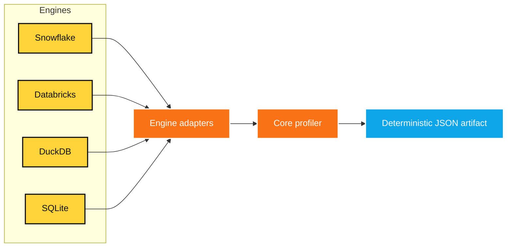

<div class="mt-5 card text-center text-2xl">
  Once you learn clean architecture, it transfers to new projects.
</div>

<!-- Speaker notes: Explain adapter-based thinking. Different engines have different SQL dialects and metadata behavior, but the core output can stay consistent. -->

---
layout: center
---

# Transfer learning for technologies

## Deep learning has transfer learning. So does your brain.

<div class="grid grid-cols-2 gap-4 mt-8 text-xl">
  <v-clicks>
  <div class="card">Django -> FastAPI</div>
  <div class="card">Postgres -> Snowflake</div>
  <div class="card">Pandas -> Polars</div>
  <div class="card">REST API -> Tool API</div>
  <div class="card">Queues -> Agent workflows</div>
  <div class="card">Unit tests -> Evaluation tests</div>
  </v-clicks>
</div>

<div class="mt-8 card-yellow text-center text-2xl">
  You are not starting from zero every time.
</div>

<!-- Speaker notes: This is an encouraging slide. Tell students that learning deeply once makes every future tool easier to understand. -->

---
layout: center
---

# Industry scope

## Data Science roles actually do

<div class="grid grid-cols-3 gap-4 mt-8">
  <v-clicks>
  <div class="card">Problem framing</div>
  <div class="card">Data cleaning</div>
  <div class="card">EDA</div>
  <div class="card">Feature engineering</div>
  <div class="card">Model training</div>
  <div class="card">Experiment tracking</div>
  <div class="card">Evaluation</div>
  <div class="card">Business storytelling</div>
  <div class="card">Deployment collaboration</div>
  </v-clicks>
</div>

<div class="mt-7 card-blue text-center text-2xl">
  Data science is part statistics, part engineering, part communication.
</div>

<!-- Speaker notes: Explain that data science roles vary by company. Some are research-heavy, some are analytics-heavy, and some are engineering-heavy. -->

---
layout: center
---

# Industry scope

## AI / ML work beyond dashboards

<div class="grid grid-cols-3 gap-4 mt-8">
  <v-clicks>
  <div class="card">Classification</div>
  <div class="card">Regression</div>
  <div class="card">Forecasting</div>
  <div class="card">Recommendation systems</div>
  <div class="card">Optimization</div>
  <div class="card">Computer vision</div>
  <div class="card">NLP</div>
  <div class="card">Anomaly detection</div>
  <div class="card">Signal / wave analysis</div>
  </v-clicks>
</div>

<div class="mt-7 card-yellow text-center text-2xl">
  AI is much larger than chatbots.
</div>

<!-- Speaker notes: Give examples from daily life: fraud detection, personalized feeds, traffic prediction, OCR, inventory forecasting, and quality inspection. -->

---
layout: center
---

# Industry scope

## Gen AI work in companies

<div class="grid grid-cols-3 gap-4 mt-8">
  <v-clicks>
  <div class="card">Knowledge assistants</div>
  <div class="card">Document Q&A</div>
  <div class="card">Report generation</div>
  <div class="card">Code assistance</div>
  <div class="card">Insight generation</div>
  <div class="card">Customer support</div>
  <div class="card">Data extraction</div>
  <div class="card">Workflow automation</div>
  <div class="card">Agents with tools</div>
  </v-clicks>
</div>

<div class="source">Source: [McKinsey, The State of AI in 2025](https://www.mckinsey.com/~/media/mckinsey/business%20functions/quantumblack/our%20insights/the%20state%20of%20ai/november%202025/the-state-of-ai-2025-agents-innovation_cmyk-v1.pdf)</div>

<!-- Speaker notes: Emphasize that the strongest Gen AI use cases often sit inside existing workflows, not outside them. -->

---
layout: center
---

# What is hot now?

## Agents are becoming important

<div class="grid grid-cols-3 gap-4 mt-8">
  <v-clicks>
  <div class="card">Plan steps</div>
  <div class="card">Call tools</div>
  <div class="card">Use memory / state</div>
  <div class="card">Coordinate specialists</div>
  <div class="card">Ask for approval</div>
  <div class="card">Complete multi-step workflows</div>
  </v-clicks>
</div>

<div class="mt-8 card-yellow text-center text-2xl">
  Agents are workflow systems around LLMs.
</div>

<div class="source">Source: [OpenAI Agents SDK documentation](https://developers.openai.com/api/docs/guides/agents)</div>

<!-- Speaker notes: Clarify that agents are not just prompts. They need tools, state, orchestration, approvals, and observability. -->

---
layout: center
---

# MCP

## Model Context Protocol

<div class="two-col mt-8">
  <div class="card">
    <h3>MCP helps connect AI assistants to</h3>
    <v-clicks>

- Databases
- Repositories
- Business tools
- File systems
- Developer tools
- Custom APIs

    </v-clicks>
  </div>
  <div class="card-yellow text-3xl flex items-center justify-center text-center">
    A standardized bridge between AI and tools.
  </div>
</div>

<div class="source">Source: [Anthropic, Introducing the Model Context Protocol](https://www.anthropic.com/news/model-context-protocol)</div>

<!-- Speaker notes: Use the USB-C analogy carefully: MCP aims to reduce custom connector work by standardizing how AI applications connect to external systems. -->

---
layout: center
---

# Skills / reusable workflows

## Prompt once is not enough

<div class="grid grid-cols-5 gap-3 mt-8 text-center">
  <v-clicks>
  <div class="card">Instructions</div>
  <div class="card">Examples</div>
  <div class="card">Files</div>
  <div class="card">Code</div>
  <div class="card">Repeatable steps</div>
  </v-clicks>
</div>

<div class="mt-10 card-blue text-center text-3xl">
  The future is not only prompting. It is packaging repeatable workflows.
</div>

<div class="source">Source: [OpenAI Help Center, Skills in ChatGPT](https://help.openai.com/en/articles/20001066-skills-in-chatgpt)</div>

<!-- Speaker notes: Explain skills as a way to package repeated work. This ties directly to recipes in XBoost: workflow memory is valuable. -->

---
layout: center
---

# RAG is not just "add vector DB"

## Robust RAG requires engineering

<div class="grid grid-cols-5 gap-3 mt-7 text-center text-sm">
  <v-clicks>
  <div class="card">Chunking</div>
  <div class="card">Embeddings</div>
  <div class="card">Vector search</div>
  <div class="card">Hybrid search</div>
  <div class="card">Reranking</div>
  <div class="card">Metadata filtering</div>
  <div class="card">Query transformation</div>
  <div class="card">Context compression</div>
  <div class="card">Evaluation</div>
  <div class="card">Guardrails</div>
  </v-clicks>
</div>

<div class="mt-8 card-orange text-center text-2xl">
  A weak RAG pipeline gives confident wrong answers.
</div>

<div class="source">Source: [NirDiamant, RAG Techniques repository](https://github.com/NirDiamant/RAG_TECHNIQUES)</div>

<!-- Speaker notes: Use this to lower hype around vector databases. Retrieval quality, evaluation, metadata, and ranking matter as much as the LLM. -->

---
layout: center
---

# Context engineering

## LLMs can specialize only so much

<style>
.mermaid {
  transform: scale(0.88);
  transform-origin: top center;
  display: flex;
  justify-content: center;
}
</style>

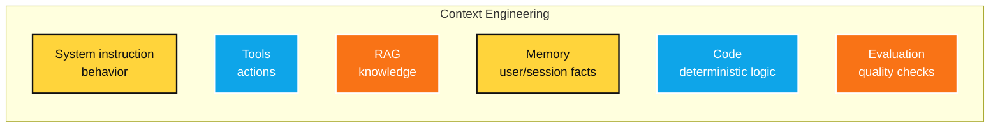

<div class="mt-5 card-yellow text-center text-2xl">
  Do not force the LLM to do every job.
</div>

<!-- Speaker notes: Explain separation of concerns. Some knowledge belongs in RAG, some behavior in instructions, some actions in tools, and deterministic work in code. -->

---
layout: center
---

# Responsible AI

## Production Gen AI needs guardrails

<div class="grid grid-cols-4 gap-3 mt-8 text-center">
  <v-clicks>
  <div class="card">Hallucination</div>
  <div class="card">Data leakage</div>
  <div class="card">Prompt injection</div>
  <div class="card">Unsafe tool use</div>
  <div class="card">Bad evaluation</div>
  <div class="card">Biased outputs</div>
  <div class="card">Over-trust</div>
  <div class="card">Weak monitoring</div>
  </v-clicks>
</div>

<div class="source">Source: [NIST AI RMF Generative AI Profile](https://nvlpubs.nist.gov/nistpubs/ai/NIST.AI.600-1.pdf)</div>

<!-- Speaker notes: Keep this practical, not scary. Responsible AI is about designing systems that acknowledge failure modes and reduce harm. -->

---
layout: center
---

# Skills required

## Learn Python properly

<div class="grid grid-cols-5 gap-3 mt-8 text-center text-sm">
  <v-clicks>
  <div class="card">Syntax deeply</div>
  <div class="card">Comprehensions</div>
  <div class="card">Iterators</div>
  <div class="card">Generators</div>
  <div class="card">itertools</div>
  <div class="card">functools</div>
  <div class="card">Decorators</div>
  <div class="card">OOP</div>
  <div class="card">Dataclasses</div>
  <div class="card">Type hints</div>
  </v-clicks>
</div>

<div class="mt-8 card-yellow text-center text-2xl">
  Python is not just a scripting language. It is your engineering tool.
</div>

<!-- Speaker notes: Encourage students to go beyond syntax tutorials. Python fluency shows up in clean code, debugging, reusable utilities, and readable data workflows. -->

---
layout: center
---

# Skills required

## Data skills are non-negotiable

<div class="grid grid-cols-5 gap-3 mt-8 text-center text-sm">
  <v-clicks>
  <div class="card">SQL</div>
  <div class="card">Joins</div>
  <div class="card">Aggregations</div>
  <div class="card">Window functions</div>
  <div class="card">Data types</div>
  <div class="card">Indexing basics</div>
  <div class="card">Pandas / Polars</div>
  <div class="card">Validation</div>
  <div class="card">File formats</div>
  <div class="card">Warehouses / lakes</div>
  </v-clicks>
</div>

<div class="mt-8 card-orange text-center text-2xl">
  Most AI systems fail before the model because the data layer is weak.
</div>

<!-- Speaker notes: Explain that SQL and data modeling are still extremely relevant in the Gen AI era. Retrieval, evaluation, metrics, and pipelines all depend on data literacy. -->

---
layout: center
---

# Skills required

## Learn the "why", not just APIs

<div class="grid grid-cols-5 gap-3 mt-8 text-center text-sm">
  <v-clicks>
  <div class="card">Train/test split</div>
  <div class="card">Cross-validation</div>
  <div class="card">Metrics</div>
  <div class="card">Overfitting</div>
  <div class="card">Feature engineering</div>
  <div class="card">Target leakage</div>
  <div class="card">Bias / variance</div>
  <div class="card">Interpretation</div>
  <div class="card">Error analysis</div>
  <div class="card">Experiment design</div>
  </v-clicks>
</div>

<div class="mt-8 card-yellow text-center text-2xl">
  Do not just call .fit() and .predict().
</div>

<!-- Speaker notes: Use a simple example of target leakage if time permits. A model can look impressive in notebooks and fail completely in the real world. -->

---
layout: center
---

# Skills required

## AI engineers need backend sense

<div class="grid grid-cols-5 gap-3 mt-8 text-center text-sm">
  <v-clicks>
  <div class="card">REST APIs</div>
  <div class="card">Auth basics</div>
  <div class="card">Databases</div>
  <div class="card">Queues</div>
  <div class="card">Workers</div>
  <div class="card">Caching</div>
  <div class="card">File storage</div>
  <div class="card">Logging</div>
  <div class="card">Docker</div>
  <div class="card">CI/CD + cloud</div>
  </v-clicks>
</div>

<div class="mt-8 card-blue text-center text-2xl">
  Your model is useless if users cannot reliably use it.
</div>

<!-- Speaker notes: Link this back to XBoost: uploads, queues, workers, metadata, and callbacks are backend problems that make AI usable. -->

---
layout: center
---

# Skills required

## Go beyond chat prompts

<div class="grid grid-cols-5 gap-3 mt-7 text-center text-sm">
  <v-clicks>
  <div class="card">Prompt design</div>
  <div class="card">Tool calling</div>
  <div class="card">Agents</div>
  <div class="card">Custom workflows</div>
  <div class="card">Skills</div>
  <div class="card">MCP</div>
  <div class="card">RAG</div>
  <div class="card">Vector DBs</div>
  <div class="card">Evaluation data</div>
  <div class="card">Cost / latency</div>
  </v-clicks>
</div>

<div class="mt-8 card-yellow text-center text-2xl">
  Gen AI engineering is software engineering with probabilistic components.
</div>

<!-- Speaker notes: Make clear that Gen AI engineering still needs architecture: state, tools, logs, evaluation, safety, and cost control. -->

---
layout: center
---

# Roadmap: Month 0-3

## Build fundamentals

<div class="two-col mt-8">
  <div class="card">
    <h3>Goal</h3>
    <v-clicks>

- Python fluency
- SQL fluency
- Git / GitHub
- Basic statistics
- Pandas
- Small clean projects

    </v-clicks>
  </div>
  <div class="card">
    <h3>Projects</h3>
    <v-clicks>

- CSV data cleaner
- Student performance analysis
- Expense tracker API
- Mini EDA report generator

    </v-clicks>
  </div>
</div>

<div class="mt-7 card-yellow text-center text-2xl">
  Output: 3 small, finished GitHub projects.
</div>

<!-- Speaker notes: Emphasize finished over fancy. A small complete project with README and screenshots beats ten half-done notebooks. -->

---
layout: center
---

# Roadmap: Month 3-6

## Build data + backend projects

<div class="two-col mt-8">
  <div class="card">
    <h3>Goal</h3>
    <v-clicks>

- APIs
- Databases
- Data pipelines
- Testing
- Deployment basics

    </v-clicks>
  </div>
  <div class="card">
    <h3>Projects</h3>
    <v-clicks>

- Data profiler for SQLite / CSV
- FastAPI + Postgres backend
- Background job queue
- Dashboard from processed data

    </v-clicks>
  </div>
</div>

<div class="mt-7 card-blue text-center text-2xl">
  Output: 1 solid project with README, tests, and demo.
</div>

<!-- Speaker notes: Encourage project depth. Add testing, input validation, Docker, and deployment to convert a college project into a portfolio project. -->

---
layout: center
---

# Roadmap: Month 6-12

## Build applied AI projects

<div class="two-col mt-8">
  <div class="card">
    <h3>Goal</h3>
    <v-clicks>

- ML pipeline
- RAG system
- Agent workflow
- Evaluation
- Deployment

    </v-clicks>
  </div>
  <div class="card">
    <h3>Projects</h3>
    <v-clicks>

- RAG over college notes
- Resume analyzer with citations
- Agent that queries a database
- Explainability dashboard
- Multi-source data profiler

    </v-clicks>
  </div>
</div>

<div class="mt-7 card-yellow text-center text-2xl">
  Output: 1 big project that would have been difficult before LLM help.
</div>

<!-- Speaker notes: Make the roadmap aspirational but practical. The final project should show architecture, evaluation, data handling, and user-facing output. -->

---
layout: center
---

# How to use LLMs for projects

## Do not just vibe code

<div class="two-col mt-8">
  <div class="card">
    <h3>Good use</h3>
    <v-clicks>

- Ask for explanations
- Ask for alternatives
- Generate test cases
- Review architecture
- Debug with reasoning
- Refactor after understanding

    </v-clicks>
  </div>
  <div class="card">
    <h3>Bad use</h3>
    <v-clicks>

- Copy-paste blindly
- Skip reading code
- Ignore errors
- Fake understanding
- Push secrets to GitHub

    </v-clicks>
  </div>
</div>

<div class="mt-7 card-orange text-center text-2xl">
  Use AI like a senior assistant, not like a brain replacement.
</div>

<!-- Speaker notes: Make this practical. Ask students to explain every line they ship and to use LLMs to strengthen understanding, not bypass it. -->

---
layout: center
---

# Professional habit 1

## Attention to detail means attention to detail

<div class="two-col mt-8">
  <div class="meme-card text-center text-2xl">
    <div class="top">Dear Hiring Manger</div>
    <div>Resume attached: final_final_REAL.pdf</div>
  </div>
  <div class="card">
    <h3>Actually check</h3>
    <v-clicks>

- Spelling
- Company name
- Person name
- Date and time
- Attachments
- Tone

    </v-clicks>
  </div>
</div>

<div class="mt-7 card-yellow text-center text-2xl">
  A typo in a company name can undo a good first impression.
</div>

<!-- Speaker notes: This slide is intentionally memorable. Use it to show that professionalism is not separate from engineering; both require carefulness. -->

---
layout: center
---

# Professional habit 2

## Be proactive in communication

<div class="card mt-8 text-xl">

```text
Talk scheduled: Monday 12-2
Daily standup: 12
```

</div>

<div class="grid grid-cols-3 gap-4 mt-7 text-center">
  <v-clicks>
  <div class="card-yellow">Calendar OOO: 11:30-3</div>
  <div class="card-blue">Slack group message on Friday</div>
  <div class="card-orange">Standup update sent in advance</div>
  </v-clicks>
</div>

<div class="mt-8 card text-center text-2xl">
  Do not leave ambiguity for others to solve.
</div>

<!-- Speaker notes: This is a concrete professional example. Show that proactive communication builds trust and reduces coordination friction. -->

---
layout: center
---

# Finding this presentation

- I have used Slidev for this presentation. Using slidev you can write markdown and generate slides with a lot of flexibility.
- This presentation is available at https://susmitpy.github.io/talks/backend_data_science_ai


---
layout: center
---

# Closing

## What I hope you remember

<div class="grid grid-cols-3 gap-4 mt-8">
  <v-clicks>
  <div class="card">Fundamentals compound</div>
  <div class="card">AI is bigger than Gen AI</div>
  <div class="card">Vibe coding is not engineering</div>
  <div class="card">Projects create real learning</div>
  <div class="card">Backend + data + AI is powerful</div>
  <div class="card">Communication is professionalism</div>
  </v-clicks>
</div>

<div class="mt-10 card-yellow text-center text-3xl">
  Build things. Understand them. Then build bigger things.
</div>

<!-- Speaker notes: End with encouragement. The final sentence should feel like a call to action, especially for students at the beginning of their journey. -->

---
layout: center
class: text-center
---

# Q&A

## Ask me anything

<div class="mt-8 grid grid-cols-4 gap-3 text-center">
  <v-clicks>
  <div class="card">Backend</div>
  <div class="card">Data Science</div>
  <div class="card">AI / Gen AI</div>
  <div class="card">XBoost</div>
  <div class="card">Projects</div>
  <div class="card">Careers</div>
  <div class="card">Skills</div>
  <div class="card">Mistakes to avoid</div>
  </v-clicks>
</div>

<div class="mt-10 card-blue text-3xl text-center">
  Thank you!
</div>

<!-- Speaker notes: Invite questions. If there is silence, seed the room with options: ask about XBoost architecture, roadmaps, Gen AI project ideas, or mistakes to avoid. -->