```mermaid
graph LR
    A[File Upload] --> B[Function Starts]
    B --> C[Count Words]
    C --> D[Return Results]
    D --> E[Function Stops]
    E --> F[💰 Pay Only for Processing Time]
    
    style B fill:#99ff99
```

# Scalable Mini Project
## Async Word Count with Azure

### By Susmit Vengurlekar (@susmitpy)

<div class="text-xs text-gray-400 absolute bottom-10 left-0 right-0 text-center">
The Journey from Simple Idea to Production-Ready Application
</div>

---
src: ./pages/disclaimer.md
---

---
src: ./pages/bug.md
---

---
src: ./pages/about.md
---

---

# Our Story Today

1. **The Problem** - A simple idea that needed to scale
2. **The Challenge** - Why traditional solutions fall short
3. **The Cloud Solution** - Understanding the building blocks
4. **The Azure Advantage** - Why we chose Microsoft's platform
5. **Building Our Solution** - From concept to code
6. **The Magic Happens** - Live demo and results

<style>
li {
    font-size: 1.6rem;
    margin-bottom: 0.5rem;
}
</style>

---

# The Problem: A Simple Yet Scalable Idea 💡

## What if you could...
<div class="text-xl mb-6">

**Upload any text file and instantly get the top 5 most frequent words?**
</div>

## Sounds Simple, Right? 

<v-click>

### But what if...
- **100 users** upload files simultaneously?
- **Files are 100MB** each?
- Users expect **real-time results**?
- You have **zero budget** for servers?

</v-click>

<v-click>

### Suddenly, our "simple" idea becomes a **scalability challenge!**

</v-click>

<style>
li { font-size: 1.4rem; }
</style>

---

# The Traditional Approach (And Why It Fails) 😰

## Option 1: Single Server Solution


### Problems:

<div class="grid grid-cols-2 gap-8">
<div>

- **Server crashes** under load 💥
- **One point of failure** 🎯

</div>
<div>

- **Expensive to maintain** 💰
- **Limited capacity** 📏

</div>
</div>


---

# Enter the Cloud: A Game Changer! ☁️

Think of it like **Uber** for computing - you don't own cars, you just request rides!

<div class="grid grid-cols-2 gap-8 mt-8">
<div>

## Traditional Approach
- Buy physical servers 💰
- Set up data centers 🏢
- Hire IT staff 👥
- Handle maintenance 🔧
- Pay for unused capacity 📊
- **Scale manually** 😵

</div>
<div>

## Cloud Approach
- Rent computing power ☁️
- Access via internet 🌐
- Someone else maintains it 🛠️
- Pay only for what you use 💳
- **Auto-scale instantly** ⚡
- **Focus on your idea** 🎯

</div>
</div>

<div class="text-xl mt-8 text-center">

**For our word count project: Perfect fit!** 🎯
</div>

---

# Cloud Building Blocks for Our Project

<div class="grid grid-cols-2 gap-8 mb-8">
<div>

## 🖥️ **Virtual Machines**
- Like having a computer in the cloud
- Full control over the OS
- ❌ **Not ideal for our project** - too much overhead

</div>
<div>

## ⚡ **Serverless Functions**
- No servers to manage
- Pay only when code runs
- Auto-scaling
- ✅ **Perfect for our word count project!**

</div>
</div>

<div class="text-center">

## ⚡ **Serverless Functions**

<br/>



</div>

---

# Storage: Where Do We Keep the Files?

<div class="grid grid-cols-3 gap-4 mt-8">
<div class="text-center">

## 📁 **Blob Storage**
Store any type of file
- Images, videos, documents
- Unlimited capacity
- Access from anywhere

✅ **Perfect for our text files!**

</div>
<div class="text-center">

## 🗄️ **Databases**
Structured data storage
- SQL databases
- NoSQL databases
- Managed by cloud provider

❌ **Files in DB ? Nope**

</div>
<div class="text-center">

## 💾 **Block Storage**
High-performance storage
- Attached to virtual machines
- Like hard drives
- For operating systems

❌ **We don't have VMs to attach to**

</div>
</div>

<div class="text-center mt-8 text-xl">

**For our project: Blob storage is the clear winner!** 🏆
</div>

---

# The Serverless Revolution for Mini Projects! 🚀

## What is Serverless?

<div class="text-xl mb-6">

**"No servers"** doesn't mean no servers exist - it means **you don't manage them!**
<br>Perfect for students with **mini projects and big dreams!**
</div>

<div class="grid grid-cols-2 gap-8">
<div>

### Traditional Server (❌ For Students)

```mermaid
graph TD
    A[Request] --> B[Always Running Server]
    B --> C[Response]
    B --> D[💰 Always Paying $$$]
    B --> E[😰 Server Management]
```


</div>
<div>

### Serverless Function (✅ Perfect!)

```mermaid
graph TD
    A[File Upload] --> B[Function Starts]
    B --> C[Process File]
    C --> D[Return Results]
    D --> E[Function Stops]
    F[💰 Pay Only for Processing]
    G[🎯 Focus on Code, Not Servers]
```


</div>
</div>

---

# Building Connected Systems: The Integration Story

Functions don't work alone - they need to talk to each other!


<div class="text-center mt-6 text-xl">

**Our project uses:** HTTP requests + File uploads + Real-time notifications! 🎯
</div>

---

# Real-time Communication: The Missing Piece

For our word count project, we needed **instant results**. How do we tell the user when processing is done?

<div class="grid grid-cols-2 gap-8">
<div>

## 📬 **Polling (Traditional Way)**
User keeps asking: "Are you done yet?"


**Problems:** Wasteful, slow, annoying!

</div>
<div>

## 📡 **WebSockets (Our Solution)**
Server tells user: "I'm done!"


**Benefits:**
- Real-time updates
- No wasted requests
- Great user experience!

</div>
</div>

---

# Think Outside the Box! 🤔

<div class="text-center text-2xl mb-8">

## What other ways can we deliver results to users?

</div>

<v-click>

<div class="grid grid-cols-2 gap-8">
<div>

## 📧 **Email Notifications**
- Use Azure SendGrid or Logic Apps
- Send results as email attachment
- Perfect for long-running processes

## 📱 **SMS/Text Messages**
- Integrate with Twilio API
- Quick result summaries
- Great for mobile-first users

</div>
<div>

## 💬 **WhatsApp Business API**
- Rich media support (charts, documents)
- Global reach and familiarity
- Interactive message buttons

## 📞 **Voice Calls**
- Text-to-speech for results
- Accessibility-friendly
- For urgent or critical results

</div>
</div>

</v-click>

<v-click>

<div class="text-center mt-4 text-xl">

**The beauty of serverless:** Each notification method is just another function trigger! 🚀
</div>

</v-click>

---

# In a Nutshell: Our Cloud Stack

<div class="grid grid-cols-2 gap-6">
<div>

## 🔵 **Azure Functions**
- Serverless compute platform
- Supports C#, Python, JavaScript, and more
- **Perfect for our word processing logic!**

## 📦 **Azure Blob Storage**
- Unlimited file storage
- Global accessibility
- **Where we store the uploaded text files**

</div>
<div>

## 📡 **Azure SignalR Service**
- Managed WebSocket service
- Real-time communication made easy
- **How we instantly notify users of results**

## ⚡ **Built-in Integrations**
- Functions trigger automatically on file upload
- No complex configuration needed
- **Everything just works together!**

</div>
</div>


---

# Our Solution: AsyncWordCount Project 

## The Journey: From Idea to Implementation

<div class="text-xl mb-6">

**"What started as a simple word counting idea became a lesson in building scalable, real-time applications"**
</div>

## Why This Project is Special

- **Asynchronous Processing** - Files process in background while user waits
- **Real-time Updates** - User gets instant notifications via WebSocket
- **Serverless Architecture** - Scales from 1 to 1000 users automatically
- **Event-Driven Flow** - Each step elegantly triggers the next
- **Student-Friendly** - Costs almost nothing to run!

<div class="text-center mt-8 text-lg">

**This isn't just a word counter - it's a blueprint for scalable mini projects!** 🎯
</div>

---

# The Complete Flow: How Everything Connects


<div class="text-center mt-4 text-lg">
**11 steps, fully automated, scales infinitely!** 🚀
</div>

---

# The Story Behind Each Code Block

Let me take you through the journey of building this scalable solution, one piece at a time...

<div class="text-center text-xl mt-8">

**"Every line of code tells a story of solving real scalability challenges"**
</div>

<div class="grid grid-cols-2 gap-8 mt-8">
<div>

## 🎯 **What We'll See**
- Real WebSocket setup
- Secure file upload handling
- Automated processing triggers
- Instant result delivery

</div>
<div>

## 💡 **Why It Matters**
- Each pattern is reusable
- Scales to production loads
- Costs pennies to run
- Perfect for portfolios

</div>
</div>

---

# Challenge 1: Real-time Communication 🤔

<div class="text-center text-2xl mb-8">

**"How do we tell the user when their file processing is complete?"**
</div>

## The Dilemma:
- User uploads a file
- Processing happens in the background
- User is waiting... and waiting... 😴
- **How do we notify them instantly when done?**

<v-click>

## 🙋‍♀️ **Audience Question Time!**
### What are some ways we could solve this?

*Think about it... What solutions come to mind?*

</v-click>

---

# Your Solutions vs Reality 💭

<div class="grid grid-cols-2 gap-8">
<div>

## 🤔 **Common Suggestions:**
- Polling: "Are you done yet?"
- Email notifications
- Refresh the page
- SMS alerts
- Show a loading spinner

</div>
<div>

## 😅 **The Problems:**
- **Polling:** Wasteful, slow
- **Email:** Too slow for modern users  
- **Refresh:** Manual, annoying
- **SMS:** Costs money
- **Loading:** User doesn't know if it's stuck

</div>
</div>


<div class="grid grid-cols-2 gap-8 mt-6">
<v-click>
<div>

### 📡 **WebSockets (Our Choice)**
- **Bi-directional** communication
- Real-time, instant updates
- Perfect for interactive apps
- Requires connection management
- Great for chat, gaming, live data

</div>
</v-click>
<v-click>
<div>

### 📤 **Server-Sent Events (SSE)**
- **One-way** server-to-client
- Built into HTML5
- No special libraries needed
- Simpler to implement
- Perfect for notifications, updates

</div>
</v-click>
</div>


---

# Implementation: Setting Up Real-time Connection

**Step 1: Client establishes WebSocket connection**

```javascript
// The client's first move: establish connection
const negotiateSignalR = async () => {
    const response = await axios.post(
        negotiateEndpoint, 
        null, 
        {
            headers: {
                'userid': userId,
                'x-functions-key': functionKey
            }
        }
    )
    const connectionInfo = response.data;
    connectToSignalR(
        connectionInfo.url, 
        connectionInfo.accessToken
    );
};
```

---

# Implementation: WebSocket Negotiation Function

**Step 2: Azure securely manages connections**

```csharp
[Function("negotiate")]
public async Task<HttpResponseData> Negotiate(
    [HttpTrigger(AuthorizationLevel.Function, "post")] HttpRequestData req,
    [SignalRConnectionInfoInput(HubName = "serverless", UserId = "{headers.userid}")] 
    MyConnectionInfo connectionInfo)
{
    var userId = req.Headers
        .FirstOrDefault(h => h.Key == "userid")
        .Value.FirstOrDefault();
    
    var response = req.CreateResponse(HttpStatusCode.OK);
    response.Headers.Add("Access-Control-Allow-Origin", "*");
    
    await response.WriteAsJsonAsync(new { 
        url = connectionInfo.Url, 
        accessToken = connectionInfo.AccessToken 
    });

    return response;
}
```

---

# Challenge 2: Secure File Uploads 🔐

<div class="text-center text-2xl mb-8">

**"How do we let users upload files without exposing our storage credentials?"**
</div>

## The Security Dilemma:
- Users need to upload files to our cloud storage
- We can't give them our storage account keys! 🔑
- We don't want files going through our servers (expensive!)
- But we need to control access and prevent abuse

<v-click>

## 🙋‍♀️ **Audience Question Time!**
### How would you solve this security puzzle?

</v-click>

---

# Your Security Ideas 🛡️

<div class="grid grid-cols-2 gap-8">
<div>

## 🤔 **Common Approaches:**
- Give users storage keys (⚠️ dangerous!)
- Route uploads through our server
- Create user accounts with permissions
- Use API keys
- Time-limited tokens

</div>
<div>

## 🎯 **The Reality:**
- **Storage keys:** Too much access
- **Through server:** Expensive, slow
- **User accounts:** Complex setup
- **API keys:** Still too much access
- **Time-limited tokens:** 🏆 **Getting warm!**

</div>
</div>

<v-click>

<div class="text-center mt-8">

## ⭐ **Our Solution: SAS Tokens!**
**Shared Access Signatures - like temporary, limited parking passes**

*Time-limited, permission-specific, user-specific access*

</div>

</v-click>

---

# How SAS Tokens Work 🎟️
<div class="grid grid-cols-2 gap-8 items-center">
<div class="text-center">

### 🎟️ **SAS Tokens = Smart Tickets**
- Like a **temporary parking pass**
- Specific permissions only
- Auto-expires for security
- User-specific access

```mermaid{scale:0.8}
graph TD
    A[User: 'I want to upload!'] --> B[Function: Generate SAS Token]
    B --> C[Token Properties:<br/>• 1 hour expiry<br/>• Write-only access<br/>• Specific filename]
    C --> D[User: Direct upload to Azure Storage]
    D --> E[Azure: Validates token & accepts file]
    E --> F[Token expires automatically]
```

</div>
<div class="text-center">



</div>
</div>


---

# Implementation: Secure File Upload Strategy

**Step 1: Generate secure, time-limited upload permissions**

```csharp
private string GenerateUri(string userId)
{
    string storageConnectionString = Environment.GetEnvironmentVariable("AzureWebJobsStorage");
    var blobServiceClient = new BlobServiceClient(storageConnectionString);
    var containerClient = blobServiceClient.GetBlobContainerClient("text-file-uploads");

    var blobName = $"{userId}_{Guid.NewGuid()}.txt";
    var blobClient = containerClient.GetBlobClient(blobName);

    var sasBuilder = new BlobSasBuilder
    {
        BlobContainerName = "text-file-uploads",
        BlobName = blobName,
        Resource = "b",
        ExpiresOn = DateTime.UtcNow.AddHours(1)
    };

    sasBuilder.SetPermissions(BlobSasPermissions.Write);
    return blobClient.GenerateSasUri(sasBuilder).ToString();
}
```

---

# Implementation: Upload URL Generator

**Step 2: Provide secure upload endpoints**

```csharp
[Function("GetFileUploadURL")]
public IActionResult Run(
    [HttpTrigger(AuthorizationLevel.Function, "post")] HttpRequest req, 
    [FromBody] ReqData data)
{
    _logger.LogInformation("C# HTTP trigger function processed a request.");

    var uri = GenerateUri(data.userId);
    return new OkObjectResult(new
    {
        uri = uri.ToString()
    });
}

public record ReqData(string userId);
```

---

# Challenge 3: Automated Processing 🤖

<div class="text-center text-2xl mb-8">

**"How do we automatically process files when uploaded AND notify the right user?"**
</div>

## The Automation Challenge:
- File gets uploaded to storage
- System must detect the upload automatically
- Process the file without human intervention  
- Find the correct user to notify
- Send results in real-time

<v-click>

## 🙋‍♀️ **Final Audience Question!**
### How would you trigger processing and identify users?

</v-click>

---

# Event-Driven Solutions 🚀

<div class="grid grid-cols-2 gap-8">
<div>

## 🤔 **Common Ideas:**
- Poll storage for new files
- Use file naming conventions
- Database tracking
- Scheduled jobs to check
- Event triggers

</div>
<div>

## ⚡ **The Best Approach:**
- **Polling:** Wasteful, slow
- **File naming:** 🎯 Smart for user ID!
- **Database:** Adds complexity
- **Scheduled jobs:** Delayed processing
- **Event triggers:** 🏆 **Perfect!**

</div>
</div>

<v-click>

<div class="text-center mt-8">

## 🪄 **Our Solution: Blob Triggers + Smart Naming!**
**Azure automatically triggers function on file upload**

*Filename contains user ID - perfect identification!*

</div>

</v-click>

---

# Implementation: The Automation Masterpiece!

**Step 3: Fully automated processing with user notification**

```csharp
[Function(nameof(OnFileUpload))]
[SignalROutput(HubName = "serverless")]
public async Task<SignalRMessageAction> Run(
    [BlobTrigger("text-file-uploads/{name}", Connection = "AzureWebJobsStorage")] 
    Stream stream, string name)
{
    using var blobStreamReader = new StreamReader(stream);
    var content = await blobStreamReader.ReadToEndAsync();
    
    var top5Words = getTop5Words(content);
    _logger.LogInformation($"Top 5 words in {name}: {string.Join(", ", 
        top5Words.Select(x => $"{x.Key} ({x.Value})"))}");

    var userId = name.Split('_')[0];
    
    return new SignalRMessageAction("newMessage", [top5Words])
    {
        UserId = userId
    };
}
```

---

# The Side Project we just explored 

<h2>Async Word Count </h2>

<div class="flex justify-between mt-6">
  <div class="w-1/2 pl-1 flex flex-col justify-top">
    <p class="text-3xl mb-4">Let's see it in action</p>
    <a href="https://youtu.be/1_YNMmNs1T8" class="text-2xl break-words">https://youtu.be/1_YNMmNs1T8</a>
  </div>
  <div class="w-1/2 flex flex-col ml-5 items-center justify-center">
    <p class="text-xl mb-4">Github Repo:</p>
    
  </div>
</div>

---
src: ./pages/connect.md
---

---
src: ./pages/qa.md
---
