```mermaid
graph LR
    A[File Upload] --> B[Function Starts]
    B --> C[Count Words]
    C --> D[Return Results]
    D --> E[Function Stops]
    E --> F[💰 Pay Only for Processing Time]
    
    style B fill:#99ff99
```

# Scalable Mini Project
## Async Word Count with Azure

### By Susmit Vengurlekar (@susmitpy)

<div class="text-xs text-gray-400 absolute bottom-10 left-0 right-0 text-center">
The Journey from Simple Idea to Production-Ready Application
</div>

---
src: ./pages/disclaimer.md
---

---
src: ./pages/bug.md
---

---
src: ./pages/about.md
---

---

# Our Story Today

1. **The Problem** - A simple idea that needed to scale
2. **The Challenge** - Why traditional solutions fall short
3. **The Cloud Solution** - Understanding the building blocks
4. **The Azure Advantage** - Why we chose Microsoft's platform
5. **Building Our Solution** - From concept to code
6. **The Magic Happens** - Live demo and results

<style>
li {
    font-size: 1.6rem;
    margin-bottom: 0.5rem;
}
</style>

---

# The Problem: A Simple Yet Scalable Idea 💡

## What if you could...
<div class="text-xl mb-6">

**Upload any text file and instantly get the top 5 most frequent words?**
</div>

## Sounds Simple, Right? 

<v-click>

### But what if...
- **100 users** upload files simultaneously?
- **Files are 100MB** each?
- Users expect **real-time results**?
- You have **zero budget** for servers?

</v-click>

<v-click>

### Suddenly, our "simple" idea becomes a **scalability challenge!**

</v-click>

<style>
li { font-size: 1.4rem; }
</style>

---

# The Traditional Approach (And Why It Fails) 😰

## Option 1: Single Server Solution


### Problems:

<div class="grid grid-cols-2 gap-8">
<div>

- **Server crashes** under load 💥
- **One point of failure** 🎯

</div>
<div>

- **Expensive to maintain** 💰
- **Limited capacity** 📏

</div>
</div>


---

# Enter the Cloud: A Game Changer! ☁️

Think of it like **Uber** for computing - you don't own cars, you just request rides!

<div class="grid grid-cols-2 gap-8 mt-8">
<div>

## Traditional Approach
- Buy physical servers 💰
- Set up data centers 🏢
- Hire IT staff 👥
- Handle maintenance 🔧
- Pay for unused capacity 📊
- **Scale manually** 😵

</div>
<div>

## Cloud Approach
- Rent computing power ☁️
- Access via internet 🌐
- Someone else maintains it 🛠️
- Pay only for what you use 💳
- **Auto-scale instantly** ⚡
- **Focus on your idea** 🎯

</div>
</div>

<div class="text-xl mt-8 text-center">

**For our word count project: Perfect fit!** 🎯
</div>

---

# Cloud Building Blocks for Our Project

<div class="grid grid-cols-2 gap-8 mb-8">
<div>

## 🖥️ **Virtual Machines**
- Like having a computer in the cloud
- Full control over the OS
- ❌ **Not ideal for our project** - too much overhead

</div>
<div>

## ⚡ **Serverless Functions**
- No servers to manage
- Pay only when code runs
- Auto-scaling
- ✅ **Perfect for our word count project!**

</div>
</div>

<div class="text-center">

## ⚡ **Serverless Functions**

<br/>



</div>

---

# Storage: Where Do We Keep the Files?

<div class="grid grid-cols-3 gap-4 mt-8">
<div class="text-center">

## 📁 **Blob Storage**
Store any type of file
- Images, videos, documents
- Unlimited capacity
- Access from anywhere

✅ **Perfect for our text files!**

</div>
<div class="text-center">

## 🗄️ **Databases**
Structured data storage
- SQL databases
- NoSQL databases
- Managed by cloud provider

❌ **Files in DB ? Nope**

</div>
<div class="text-center">

## 💾 **Block Storage**
High-performance storage
- Attached to virtual machines
- Like hard drives
- For operating systems

❌ **We don't have VMs to attach to**

</div>
</div>

<div class="text-center mt-8 text-xl">

**For our project: Blob storage is the clear winner!** 🏆
</div>

---

# The Serverless Revolution for Mini Projects! 🚀

## What is Serverless?

<div class="text-xl mb-6">

**"No servers"** doesn't mean no servers exist - it means **you don't manage them!**
<br>Perfect for students with **mini projects and big dreams!**
</div>

<div class="grid grid-cols-2 gap-8">
<div>

### Traditional Server (❌ For Students)

```mermaid
graph TD
    A[Request] --> B[Always Running Server]
    B --> C[Response]
    B --> D[💰 Always Paying $$$]
    B --> E[😰 Server Management]
```


</div>
<div>

### Serverless Function (✅ Perfect!)

```mermaid
graph TD
    A[File Upload] --> B[Function Starts]
    B --> C[Process File]
    C --> D[Return Results]
    D --> E[Function Stops]
    F[💰 Pay Only for Processing]
    G[🎯 Focus on Code, Not Servers]
```


</div>
</div>

---

# Building Connected Systems: The Integration Story

Functions don't work alone - they need to talk to each other!


<div class="text-center mt-6 text-xl">

**Our project uses:** HTTP requests + File uploads + Real-time notifications! 🎯
</div>

---

# Real-time Communication: The Missing Piece

For our word count project, we needed **instant results**. How do we tell the user when processing is done?

<div class="grid grid-cols-2 gap-8">
<div>

## 📬 **Polling (Traditional Way)**
User keeps asking: "Are you done yet?"


**Problems:** Wasteful, slow, annoying!

</div>
<div>

## 📡 **WebSockets (Our Solution)**
Server tells user: "I'm done!"


**Benefits:**
- Real-time updates
- No wasted requests
- Great user experience!

</div>
</div>

---

# Why Azure? The Platform Choice Story

<div class="grid grid-cols-2 gap-6">
<div>

## 🔵 **Azure Functions**
- Serverless compute platform
- Supports C#, Python, JavaScript, and more
- **Perfect for our word processing logic!**

## 📦 **Azure Blob Storage**
- Unlimited file storage
- Global accessibility
- **Where we store the uploaded text files**

</div>
<div>

## 📡 **Azure SignalR Service**
- Managed WebSocket service
- Real-time communication made easy
- **How we instantly notify users of results**

## ⚡ **Built-in Integrations**
- Functions trigger automatically on file upload
- No complex configuration needed
- **Everything just works together!**

</div>
</div>

<div class="text-center mt-8 text-xl">
**Plus: Free tier perfect for student projects!** 🎓💰
</div>

---

# Our Solution: AsyncWordCount Project 

## The Journey: From Idea to Implementation

<div class="text-xl mb-6">
**"What started as a simple word counting idea became a lesson in building scalable, real-time applications"**
</div>

## Why This Project is Special

- **Asynchronous Processing** - Files process in background while user waits
- **Real-time Updates** - User gets instant notifications via WebSocket
- **Serverless Architecture** - Scales from 1 to 1000 users automatically
- **Event-Driven Flow** - Each step elegantly triggers the next
- **Student-Friendly** - Costs almost nothing to run!

<div class="text-center mt-8 text-lg">
**This isn't just a word counter - it's a blueprint for scalable mini projects!** 🎯
</div>

---

# The Complete Flow: How Everything Connects


<div class="text-center mt-4 text-lg">
**11 steps, fully automated, scales infinitely!** 🚀
</div>

---

# The Story Behind Each Code Block

Let me take you through the journey of building this scalable solution, one piece at a time...

<div class="text-center text-xl mt-8">
**"Every line of code tells a story of solving real scalability challenges"**
</div>

<div class="grid grid-cols-2 gap-8 mt-8">
<div>

## 🎯 **What We'll See**
- Real WebSocket setup
- Secure file upload handling
- Automated processing triggers
- Instant result delivery

</div>
<div>

## 💡 **Why It Matters**
- Each pattern is reusable
- Scales to production loads
- Costs pennies to run
- Perfect for portfolios

</div>
</div>

---

# Chapter 1: Setting Up Real-time Connection

**The Challenge:** "How do we tell the user when their file is processed?"

<div class="grid grid-cols-2 gap-4">
<div>

```javascript
// The client's first move: establish connection
const negotiateSignalR = async () => {
    const response = await axios.post(
        negotiateEndpoint, 
        null, 
        {
            headers: {
                'userid': userId,
                'x-functions-key': functionKey
            }
        }
    )
    const connectionInfo = response.data;
    connectToSignalR(
        connectionInfo.url, 
        connectionInfo.accessToken
    );
};
```

</div>
<div>

**The Story:**

🎬 **Scene:** User opens our app

🔹 App generates unique user ID

🔹 Requests secure connection to Azure SignalR

🔹 Gets back WebSocket URL and access token

🔹 **Result:** Real-time pipeline established!

**Scalability Win:** Supports unlimited concurrent users! 🚀

</div>
</div>

---

# Chapter 2: The WebSocket Negotiation Function

**The Challenge:** "How does Azure securely manage real-time connections for each user?"

```csharp
[Function("negotiate")]
public async Task<HttpResponseData> Negotiate(
    [HttpTrigger(AuthorizationLevel.Function, "post")] HttpRequestData req,
    [SignalRConnectionInfoInput(HubName = "serverless", UserId = "{headers.userid}")] 
    MyConnectionInfo connectionInfo)
{
    var userId = req.Headers
        .FirstOrDefault(h => h.Key == "userid")
        .Value.FirstOrDefault();
    
    _logger.LogInformation($"Connected to {userId}");

    var response = req.CreateResponse(HttpStatusCode.OK);
    response.Headers.Add("Access-Control-Allow-Origin", "*");
    
    await response.WriteAsJsonAsync(new { 
        url = connectionInfo.Url, 
        accessToken = connectionInfo.AccessToken 
    });

    return response;
}
```

**The Magic:** Azure handles all the complex WebSocket management for us!
- ✅ Secure token generation
- ✅ User-specific channels  
- ✅ Auto-scaling connections
- ✅ **We just focus on business logic!**

---

# Chapter 3: Secure File Upload Strategy

**The Challenge:** "How do we let users upload files without compromising security?"

```csharp
private string GenerateUri(string userId)
{
    string storageConnectionString = Environment.GetEnvironmentVariable("AzureWebJobsStorage");
    var blobServiceClient = new BlobServiceClient(storageConnectionString);
    var containerClient = blobServiceClient.GetBlobContainerClient("text-file-uploads");

    var blobName = $"{userId}_{Guid.NewGuid()}.txt";
    var blobClient = containerClient.GetBlobClient(blobName);

    var sasBuilder = new BlobSasBuilder
    {
        BlobContainerName = "text-file-uploads",
        BlobName = blobName,
        Resource = "b",
        ExpiresOn = DateTime.UtcNow.AddHours(1)
    };

    sasBuilder.SetPermissions(BlobSasPermissions.Write);
    return blobClient.GenerateSasUri(sasBuilder).ToString();
}
```

**The Solution:** **SAS (Shared Access Signature) Tokens**
- � Time-limited (1 hour only)
- 🎯 User-specific filenames
- ✍️ Write-only permissions
- � **User uploads directly to Azure, bypassing our servers!**

---

# Chapter 4: The Upload URL Generator

**The Challenge:** "How do we provide upload access without exposing our storage keys?"

```csharp
[Function("GetFileUploadURL")]
public IActionResult Run(
    [HttpTrigger(AuthorizationLevel.Function, "post")] HttpRequest req, 
    [FromBody] ReqData data)
{
    _logger.LogInformation("C# HTTP trigger function processed a request.");

    var uri = GenerateUri(data.userId);
    return new OkObjectResult(new
    {
        uri = uri.ToString()
    });
}

public record ReqData(string userId);
```

**The Story:**
1. 📞 **User:** "I want to upload a file!"
2. 🎟️ **Function:** "Here's your secure, temporary upload ticket!"
3. � **User:** Uploads directly to Azure Storage (not through our servers!)

**Scalability Win:** Our servers never handle file content - Azure does! 💪

---

# Chapter 5: The Core Algorithm

**The Challenge:** "How do we efficiently find the most frequent words?"

```csharp
public Dictionary<string, int> getTop5Words(string content)
{
    var words = content.Split(' ');
    var wordCount = new Dictionary<string, int>();
    
    foreach (var word in words)
    {
        if (wordCount.ContainsKey(word))
        {
            wordCount[word]++;
        }
        else
        {
            wordCount[word] = 1;
        }
    }
    
    return wordCount
        .OrderByDescending(x => x.Value)
        .Take(5)
        .ToDictionary(x => x.Key, x => x.Value);
}
```

**The Algorithm Story:**
1. 📝 Split text into words
2. � Count each word's frequency  
3. 🏆 Sort by count (highest first)
4. 🎯 Take top 5 winners

**Scalability Note:** Works efficiently even for large files! 📈

---

# Chapter 6: The Automation Masterpiece! ✨

**The Challenge:** "How do we automatically process files and notify the right user?"

```csharp
[Function(nameof(OnFileUpload))]
[SignalROutput(HubName = "serverless")]
public async Task<SignalRMessageAction> Run(
    [BlobTrigger("text-file-uploads/{name}", Connection = "AzureWebJobsStorage")] 
    Stream stream, string name)
{
    using var blobStreamReader = new StreamReader(stream);
    var content = await blobStreamReader.ReadToEndAsync();
    
    var top5Words = getTop5Words(content);
    _logger.LogInformation($"Top 5 words in {name}: {string.Join(", ", 
        top5Words.Select(x => $"{x.Key} ({x.Value})"))}");

    var userId = name.Split('_')[0];
    
    return new SignalRMessageAction("newMessage", [top5Words])
    {
        UserId = userId
    };
}
```

**The Beautiful Automation:**
1. � **File uploaded** → Function automatically awakens
2. 📖 **Reads content** → Processes the words  
3. 🎯 **Extracts user ID** from filename
4. 📡 **Sends results** directly to that specific user
5. � **Function sleeps** → Zero cost until next upload!

**This is serverless magic at its finest!** 🪄

---

# Why This Architecture is Powerful

<div class="grid grid-cols-2 gap-6">
<div>

## 🎯 **Event-Driven**
- Each action triggers the next
- No polling or waiting
- Efficient resource usage

## ⚡ **Serverless**
- No server management
- Auto-scaling
- Pay only for execution time

## 🔒 **Secure**
- SAS tokens for file upload
- Function-level authorization
- User-specific results

</div>
<div>

## 🚀 **Real-time**
- WebSocket communication
- Instant result delivery
- Great user experience

## 🔧 **Maintainable**
- Small, focused functions
- Clear separation of concerns
- Easy to debug and extend

## 💰 **Cost-Effective**
- No idle server costs
- Scales to zero when not used
- Perfect for student projects!

</div>
</div>

---

# Let's See It In Action! 🎬

<div class="flex items-center justify-between">
    <div class="w-2/3">
        <h2 class="text-2xl mb-4">Demo Time!</h2>
        <p class="text-lg mb-4">We'll watch the complete flow in action:</p>
        <ul class="text-base space-y-2">
            <li>✅ User selects a text file</li>
            <li>✅ System processes it asynchronously</li>
            <li>✅ Real-time results appear</li>
            <li>✅ Top 5 most frequent words displayed</li>
        </ul>
        <p class="text-xl mt-6 font-bold">
            YouTube Demo: https://youtu.be/1_YNMmNs1T8
        </p>
    </div>
    <div class="w-1/3">
        
    </div>
</div>

---

# Explore the Complete Code

<div class="flex items-center justify-between h-full">
    <div class="w-3/5">
        <h2 class="text-3xl mb-6">Want to dive deeper?</h2>
        <div class="text-xl space-y-4">
            <p>🔗 Complete source code available on GitHub</p>
            <p>📚 Detailed README with setup instructions</p>
            <p>🚀 Deploy it yourself and experiment</p>
            <p>🔧 Modify it for your own projects</p>
        </div>
        <div class="mt-8 p-4 bg-blue-100 rounded-lg">
            <p class="text-lg font-bold">GitHub Repository:</p>
            <p class="text-base break-all">https://github.com/susmitpy/talks/tree/main/AsyncWordCount</p>
        </div>
    </div>
    <div class="w-2/5 flex justify-center">
        
    </div>
</div>

---

# Key Takeaways for Your Journey

<div class="grid grid-cols-2 gap-8">
<div>

## 🎓 **For Students**
- Start with simple serverless functions
- Cloud platforms have generous free tiers
- Focus on solving real problems
- Build a portfolio of cloud projects

## 🔮 **Future Opportunities**
- Cloud skills are in high demand
- Serverless is the future of development
- Great for startups and side projects
- Easy to scale from prototype to production

</div>
<div>

## 🛠️ **Next Steps**
1. Create a free Azure account
2. Try Azure Functions tutorials
3. Build your own file processing app
4. Experiment with different triggers
5. Add more Azure services

## 💡 **Project Ideas**
- Image resizer
- PDF text extractor
- Email notification system
- Data backup automation

</div>
</div>

---

# Thank You! 

<div class="grid grid-cols-2 gap-8 items-center h-full">
<div>

## Questions? 🤔

**Let's discuss:**
- Cloud computing concepts
- Azure Functions
- Serverless architecture
- Your project ideas
- Career in cloud development

</div>
<div class="text-center">

## Connect With Me

**GitHub:** @susmitpy

**Project Demo:** https://youtu.be/1_YNMmNs1T8

**Source Code:** github.com/susmitpy/talks

<div class="mt-8">

</div>

</div>
</div>

---
src: ./pages/connect.md
---
