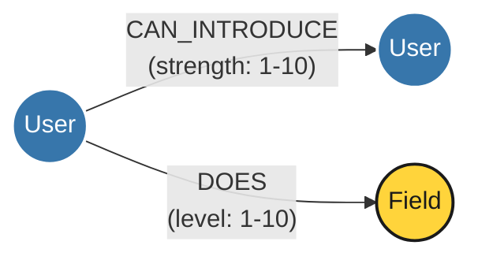
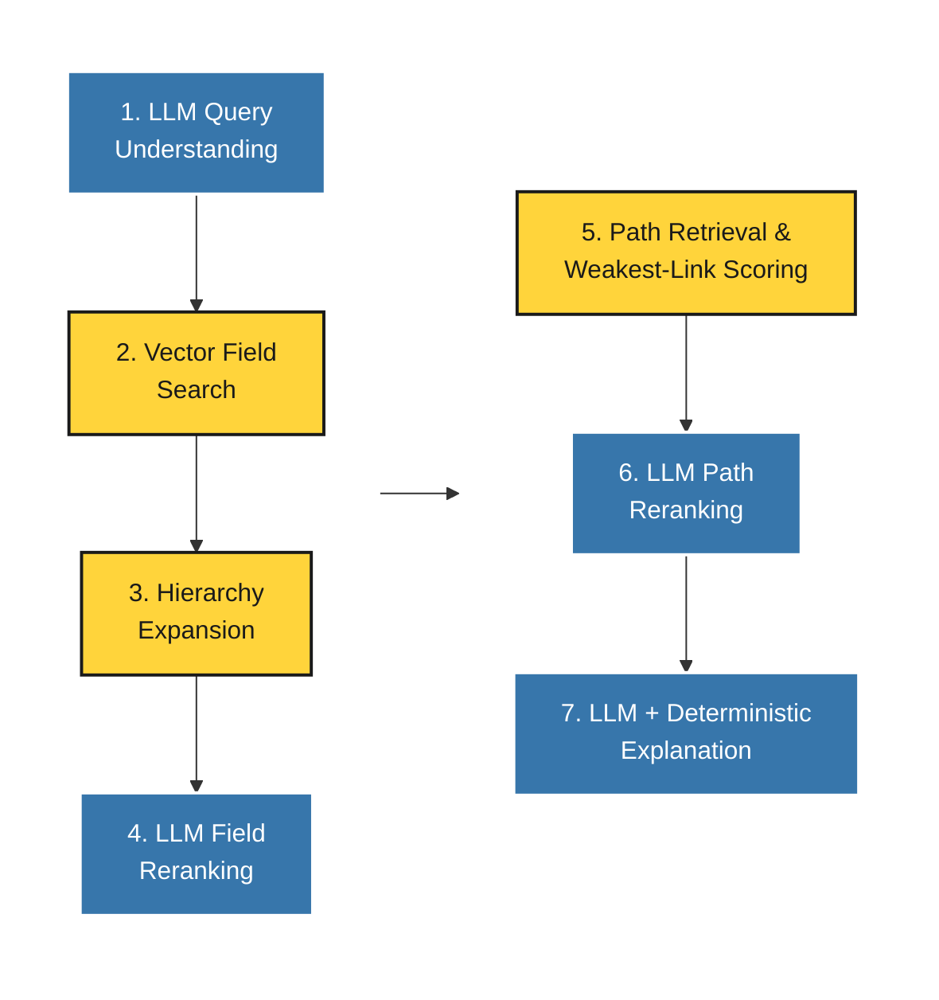
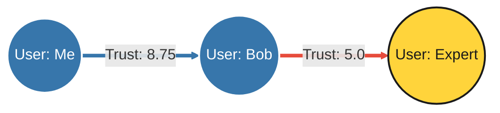
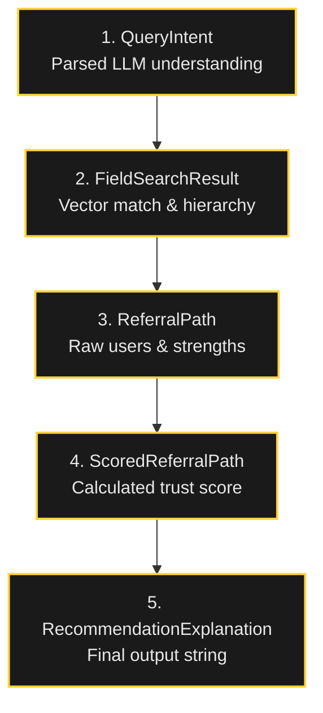

<style>
:root {
  /* Theme Colors */
  --slidev-theme-primary: #FFFFFF;
  --slidev-theme-secondary: #FFD43B; /* Python Yellow */
  --slidev-theme-accent: #3776AB;   /* Python Blue */
  --slidev-theme-background: #1a1a1a; /* Solid colors only, no gradients */
  --slidev-theme-foreground: #E8E8E8;
  --slidev-code-background: rgba(13, 17, 23, 0.95);
}

h1, h2, h3, h4, h5, h6, p, a, table {
  color: var(--slidev-theme-foreground);
}

li {
  color: var(--slidev-theme-foreground);
  font-size: 1.5rem;
  margin-bottom: 1.2rem;
  line-height: 1.5;
}

ul, ol {
  padding-left: 2rem;
}

.callout {
  background: rgba(255, 212, 59, 0.95);
  color: #1a1a1a;
  padding: 1rem;
  border-radius: 8px;
  font-size: 1.5rem;
}
</style>

<!-- Override style for the first slide -->
<div class="h-full flex flex-col justify-center items-center">
  <div style="color: white !important; text-shadow: 2px 2px 8px rgba(0,0,0,0.7); text-align: center;">
    <h1 style="color: white !important; font-size: 3.5rem;">Community Connect</h1>
    <h2 style="color: white !important; background: transparent !important;">System Architecture & Flow</h2>
  </div>
</div>

---
src: ./pages/disclaimer.md
---

---
src: ./pages/about.md
---

---
layout: default
---

# The Story

<v-clicks>

- **The Problem**: Cold outreach rarely works. Finding an expert is hard, but getting them to respond is harder.
- **The Complication**: You might know someone who knows someone, but tracing that path manually is impossible across large networks.
- **The Solution**: **Community Connect**. A platform to find experts in specific fields and discover the best *trusted* introduction paths to them.

</v-clicks>

---
layout: default
---

# Agenda: Peeling Back the Layers

<v-clicks>

1. **Layer 1:** High-Level System Overview
2. **Layer 2:** The Knowledge Graph & Data Ingestion
3. **Layer 3:** The Deterministic Query Pipeline
4. **Layer 4:** Agentic LLM Enhancements
5. **Layer 5:** Algorithms & Nitty-Gritties Deep Dive

</v-clicks>

---
layout: center
---

# Layer 1: High-Level System Overview

---
layout: default
---

# The Two Primary Flows

Community Connect operates via two main engines:

<v-clicks>

1. **Data Ingestion (Seeding)**
   - Builds a deterministic knowledge graph.
   - Contains users, expertise, network connections, and a hierarchical taxonomy of fields.

2. **Query Pipeline**
   - A 6-stage routing process.
   - Takes a natural language query -> maps to a field -> finds intro paths -> scores by trust -> returns recommendation.

</v-clicks>

---
layout: center
---

# Layer 2: The Knowledge Graph

---
layout: default
---

# The Neo4j Schema

<div class="flex justify-center items-center mt-10">



</div>

---
layout: default
---

# Data Ingestion: The Seed Process

The `community-connect seed` process deterministically builds the Neo4j graph in six phases:

<v-clicks>

1. **Field Hierarchy Generation**: Taxonomy of domains, groups, and leaf fields (e.g., "Startup Law").
2. **User Generation**: Profiles assigned a `trust_normalizer` (6.0 - 10.0).
3. **Expertise Generation**: `DOES` relationships linking Users -> Fields (Level 1-10).
4. **Introduction Generation**: `CAN_INTRODUCE` edges between Users (Strength 1-10).
5. **Embedding Generation**: Text embeddings for Field nodes (`BAAI/bge-small-en-v1.5`, 384-dim).
6. **Neo4j DB Initialization**: Multi-transaction write of nodes, relationships, and vector index.

</v-clicks>

<style>
    li {
        font-size: 1.3rem;
    }
    </style>

---
layout: center
---

# Layer 3: The Deterministic Pipeline

---
layout: default
---

# The Deterministic Query Pipeline

Guarantees predictable, repeatable results *without* relying on generative AI.

<v-clicks>

1. **Vector-Based Field Retrieval**: Query embedded -> Neo4j vector index queried via cosine similarity.
2. **Hierarchy Expansion**: Pulls in parent (95% score) and child (90% score) fields for robust matching.
3. **Path Retrieval**: Cypher breadth-first search to find simple paths (max depth: 3 hops).
4. **Weakest-Link Path Scoring**: Path scored by the lowest normalized trust value.
5. **Ranking**: Trust Score (Desc) → Path Depth (Asc) → Expertise Level (Desc).
6. **Deterministic Explanation**: Output structured explanation (expert, field, path, score).

</v-clicks>

<style>
    li {
        font-size: 1.3rem;
    }
    </style>


---
layout: default
---

# Hierarchy Expansion (Internal Step)

To ensure robust matching, we don't just stop at the direct vector match.

<div class="flex justify-center mt-10 gap-4 text-center items-center">
  <div class="p-4 rounded-lg flex-1" style="background: rgba(255, 212, 59, 0.2); border: 2px solid #FFD43B;">
    <div class="text-xl font-bold text-[#FFD43B]">Parent Field</div>
    <div class="text-lg">e.g., Legal</div>
    <div class="text-md mt-2 text-gray-400">Assigned Score: 95%</div>
  </div>
  <div class="text-4xl text-[#3776AB]">→</div>
  <div class="p-6 rounded-lg flex-1 transform scale-110" style="background: rgba(55, 118, 171, 0.4); border: 2px solid #3776AB;">
    <div class="text-2xl font-bold text-[#3776AB]">Matched Field</div>
    <div class="text-xl">e.g., Startup Law</div>
    <div class="text-md mt-2 text-white">Base Vector Score: 100%</div>
  </div>
  <div class="text-4xl text-[#3776AB]">→</div>
  <div class="p-4 rounded-lg flex-1" style="background: rgba(255, 212, 59, 0.2); border: 2px solid #FFD43B;">
    <div class="text-xl font-bold text-[#FFD43B]">Child Field</div>
    <div class="text-lg">e.g., Series A Law</div>
    <div class="text-md mt-2 text-gray-400">Assigned Score: 90%</div>
  </div>
</div>

---
layout: default
---

# Why Weakest-Link?

<div class="callout mt-8">
  <b>Audience Question:</b> Why do we score paths based on the "weakest link" instead of just adding or averaging the connection strengths?
</div>

<v-clicks>

- **Analogy**: A chain is only as strong as its weakest link.
- If you have a great connection to Bob (10/10), but Bob barely knows the Expert (2/10)...
- ...your actual chance of a successful warm intro is 2/10.

</v-clicks>

---
layout: center
---

# Layer 4: Agentic LLM Enhancements

---
layout: default
---

# Agentic LLM Overlays

Optional AI capabilities sit on top of the deterministic pipeline. Safety is maintained through strict validation.

<v-clicks>

1. **Query Understanding**: Extracts intent, domain hints, and constraints. Can ask clarifying questions.
2. **Field Candidate Reranking**: LLM reviews expanded candidate fields and reorders them based on context.
3. **Referral Path Reranking**: LLM reviews deterministic paths and can prioritize based on nuance (e.g., "fundraising expert"), adding rationale.
4. **Explanation Enhancement**: Rewrites final explanation into natural text.
   - 🛡️ **Safety**: Regex validators ensure no hallucinated depths, scores, or experts! Fallback to deterministic if validation fails.

</v-clicks>

<style>
    li {
        font-size: 1.3rem;
        margin-bottom: 1.5rem;
    }
</style>
---
layout: default
---

# Query Understanding (Internal LLM Step)

Before searching the graph, an LLM parses the messy human intent.

<div class="mt-8 bg-[#2a2a2a] p-6 rounded-lg border-l-4 border-[#3776AB]">
  <div class="text-2xl italic text-gray-300">
    "I need a lawyer who knows about raising seed money ASAP, preferably in NY."
  </div>
</div>

<div class="grid grid-cols-3 gap-6 mt-12 text-center">
  <div class="p-6 bg-[#1a1a1a] border-2 border-[#FFD43B] rounded-xl shadow-lg">
    <div class="text-xl font-bold text-[#FFD43B] mb-2">Extracted Intent</div>
    <div class="text-lg">"lawyer", "seed money"</div>
  </div>
  <div class="p-6 bg-[#1a1a1a] border-2 border-[#FFD43B] rounded-xl shadow-lg">
    <div class="text-xl font-bold text-[#FFD43B] mb-2">Domain Hints</div>
    <div class="text-lg">Legal, Fundraising</div>
  </div>
  <div class="p-6 bg-[#1a1a1a] border-2 border-[#FFD43B] rounded-xl shadow-lg">
    <div class="text-xl font-bold text-[#FFD43B] mb-2">Constraints</div>
    <div class="text-lg">Urgent (ASAP), Location (NY)</div>
  </div>
</div>

---
layout: default
---

# End-to-End Flow (LLM Enabled)

<div class="flex justify-center mt-4 transform scale-150 origin-top">



</div>

<div class="text-center mt-30">

*(Blue = LLM Overlay, Yellow = Deterministic Core)*

</div>

<style>
  
    </style>

---
layout: center
---

# Layer 5: Algorithms & Nitty-Gritties

---
layout: default
---

# Algorithm: Trust Score Normalization

Raw relationship strengths (1-10) are deceptive. Some give 10s freely, others are strict.

**Solution**: Normalize based on the source user's `trust_normalizer`.

```python
normalized_strength = min(10.0, raw_strength / trust_normalizer * 10)
```

<v-clicks>

**Example:**
- User A has a strict normalizer of `8.0`.
- User A rates User B a `7`.
- `min(10.0, 7 / 8.0 * 10) = 8.75`
- The normalized strength is a strong **8.75**.

</v-clicks>

---
layout: default
---

# Algorithm: Weakest-Link Path Scoring

A referral is only as strong as its weakest connection.

<div class="mt-10 flex justify-center scale-200">



</div>

<v-clicks>

<div class="mt-24 text-center p-2 bg-[#e74c3c] bg-opacity-20 rounded-lg border-2 border-[#e74c3c]">
  <span class="text-2xl">Overall Path Trust Score = <b>5.0</b></span>
  <p class="mt-2 text-xl">The connection from Bob to Expert is the bottleneck.</p>
</div>

</v-clicks>

---
layout: default
---

# Data Transformations (Core DTOs)

Data transitions through type-safe structures at each pipeline stage:





<style>
.mermaid {
    transform: scale(0.75);
    transform-origin: top center;
    display: flex;
    justify-content: center;
}
</style>


---
layout: default
---

# Graph Path Finding (Cypher)

Path retrieval uses a constrained Cypher traversal to keep performance at `O(V+E)` for the local subgraph.

```cypher
// Max depth bounded to 3 hops
MATCH intro_path = (start:User {id: $start_user_id})-[:CAN_INTRODUCE*1..3]->(expert:User)

// Expert must have expertise in the matched field
MATCH (expert)-[does:DOES]->(field:Field {id: $field_id})

// ... additional constraints to ensure simple paths (no cycles)
```

---
src: ./pages/qa.md
---

---
src: ./pages/connect.md
---
