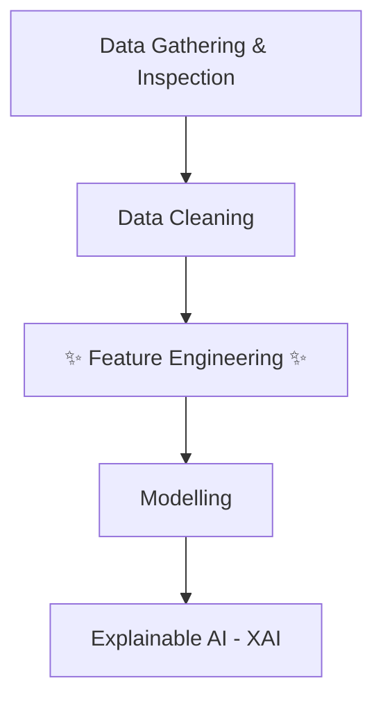

<style>
:root {
  /* Python Official Colors */
  --python-blue: #3776AB;
  --python-yellow: #FFD43B;
  --python-dark: #1e1e1e;
  --python-darker: #0d1117;
  
  /* Theme Colors */
  --slidev-theme-primary: #FFFFFF;
  --slidev-theme-secondary: #FFD43B;
  --slidev-theme-accent: #3776AB;
  --slidev-theme-background: linear-gradient(135deg, #2b2b2b 0%, #1a1a1a 100%);
  --slidev-theme-foreground: #E8E8E8;
  --slidev-code-background: rgba(13, 17, 23, 0.95);
  --slidev-code-foreground: #f0f6fc;
}

.slidev-layout {
  background: var(--slidev-theme-background);
  color: var(--slidev-theme-foreground);
}

/* Headers with Python colors */
h1, h2, h3, h4 {
  color: #FFFFFF;
  font-weight: 600;
  text-shadow: 2px 2px 4px rgba(0, 0, 0, 0.8);
}

h1 {
  color: #FFD43B;
  padding-bottom: 0.5rem;
  display: inline-block;
}

h2 {
  color: #3776AB;
  border-radius: 8px;
}

h3 {
  color: #FFD43B;
}

div, p, li {
  color: #E8E8E8;
  font-size: 1.15rem;
}

/* Links */
a {
  color: #FFD43B;
  text-decoration: none;
  border-bottom: 2px solid #FFD43B;
  transition: all 0.3s ease;
}

a:hover {
  color: #3776AB;
  border-bottom-color: #3776AB;
}

/* Code blocks */
pre, code {
  font-family: 'Fira Code', 'JetBrains Mono', monospace;
}

pre {
  background: var(--slidev-code-background) !important;
  border: 2px solid #3776AB;
  border-radius: 8px;
  padding: 1rem;
}

code {
  color: #FFD43B;
  border-radius: 4px;
}

/* Custom boxes and callouts */
.slidev-page {
  background: var(--slidev-theme-background);
}

/* Table styling */
table {
  border-collapse: collapse;
  width: 100%;
  background: rgba(255, 255, 255, 0.95);
  border-radius: 8px;
  overflow: hidden;
}

th {
  background: #3776AB;
  color: #FFFFFF;
  padding: 0.75rem;
  font-weight: 600;
}

td {
  padding: 0.75rem;
  border-bottom: 1px solid #ddd;
  color: #1e1e1e;
}

tr:last-child td {
  border-bottom: none;
}

/* Re-apply background image only on the first slide */
.slidev-layout.text-center {
  background: var(--slidev-theme-background);
}
</style>

<!-- Override style for the first slide -->
<div class="h-full flex flex-col justify-center items-center">
  <div style="color: white !important; text-shadow: 2px 2px 8px rgba(0,0,0,0.7);">
    <h1 style="color: white !important; font-size: 3.5rem; font-weight: 700;">Feature Engineering - Backbone of Data Science</h1>
    <h2 style="color: white !important; background: transparent !important; font-size: 2.2rem;">The Secret Sauce for Ultra Pro Tier Models</h2>
    <h3 style="color: white !important; margin-top: 1.5rem;">By Susmit Vengurlekar (@susmitpy)</h3>
  </div>
</div>

---
src: ./pages/disclaimer.md
---

---
src: ./pages/about.md
---

---
src: ./pages/ice_breaker.md
---

---

# The Unbreakable Law of Data Science

<div class="grid grid-cols-5 gap-4 mt-16 text-2xl items-center">
  <div class="col-span-1 p-4 bg-green-600 text-white rounded font-semibold">Good Input</div>
  <div class="col-span-1 text-5xl text-center text-yellow-400">➡️</div>
  <div class="col-span-1 p-4 text-white rounded font-semibold" style="background: #3776AB;">Analysis, ML, Gen AI</div>
  <div class="col-span-1 text-5xl text-center text-yellow-400">➡️</div>
  <div class="col-span-1 p-4 bg-green-600 text-white rounded font-semibold">Awesome Output</div>

  <div class="col-span-1 p-4 bg-red-600 text-white rounded font-semibold">Garbage Input</div>
  <div class="col-span-1 text-5xl text-center text-yellow-400">➡️</div>
  <div class="col-span-1 p-4 text-white rounded font-semibold" style="background: #3776AB;">Analysis, ML, Gen AI</div>
  <div class="col-span-1 text-5xl text-center text-yellow-400">➡️</div>
  <div class="col-span-1 p-4 bg-red-600 text-white rounded font-semibold">Garbage Output</div>
</div>

<h2 class="mt-16" style="color: #FFD43B !important; background: transparent !important; font-size: 2.5rem;">GARBAGE IN, GARBAGE OUT.</h2>

---

# Our Roadmap: The ML Project Flow



<style>
  .mermaid {
    font-family: 'trebuchet ms', verdana, arial;
    scale: 1;
    text-align: center;
  }
</style>

---

# Step 1: The Great Assumptions

## Initial Data Traps

<br/>

### Before you write a single line of feature engineering code, you must first stop and **question your assumptions** about the raw data.

<br/>

### This is where projects fail before they even begin.

---

# Trap 1

<br/>
<div class="text-3xl" style="color: #1a202c; background: rgba(255, 212, 59, 0.95); padding: 1rem; border-radius: 8px; font-weight: bold; border: 3px solid #3776AB;">
  <b>Audience Question:</b> What does the "C" in "CSV" stand for?
</div>

<v-click>
  <p class="text-center text-2xl mt-4">Everyone says "Comma". But the real world is messy.</p>
  <p class="text-center text-xl">Even if a file is named `report.csv`, the separator could be anything!</p>

  <div class="p-4 rounded mt-4">
  <pre class="text-lg"><code>Python,Dart,Go
Python	Dart	Go
Python|Dart|Go
Python;Dart;Go</code></pre>
  </div>
</v-click>

<v-click>
  <div class="text-xl p-4 rounded border-2" style="background: rgba(13, 17, 23, 0.95); border-color: #FFD43B;">
    <b style="color: #FFD43B;">The Takeaway:</b> Never assume the separator. <b>Always inspect the raw file first.</b> Hardcoding `sep=','` is a bug waiting to happen. The real meaning is "Character-Separated Values."
  </div>
</v-click>

---

# Trap 2

<div class="text-xl" >
You're analyzing an international sales report. Your <code>price</code> column, which should contain the number <em>One Thousand</em>, looks like this in different rows:
</div>

<div class="grid grid-cols-3 gap-4 text-center mt-4 text-2xl font-mono">
  <div class="p-6 rounded" style="background: rgba(13, 17, 23, 0.95); border: 2px solid #3776AB;">
    1 000,00
  </div>
  <div class="p-6 rounded" style="background: rgba(13, 17, 23, 0.95); border: 2px solid #3776AB;">
    1.000,00
  </div>
  <div class="p-6 rounded" style="background: rgba(13, 17, 23, 0.95); border: 2px solid #3776AB;">
    1,000.00
  </div>
</div>

<v-click>
  <div class="mt-3 text-2xl" style="color: #1a202c; background: rgba(255, 212, 59, 0.95); padding: 1rem; border-radius: 8px; font-weight: bold; border: 3px solid #3776AB;">
    <b>Audience Question:</b> What happens if you just load this and convert to a number? What will your program probably think `1,000.00` is? What about `1,000`? - what if it's `One` ?
  </div>
</v-click>

<v-click>
  <div class="mt-2 text-xl p-4 rounded border-2" style="background: rgba(13, 17, 23, 0.95); border-color: #FFD43B;">
    <b style="color: #FFD43B;">The Takeaway:</b> Numbers are not universal. Different cultures use different decimal and thousand separators. You must investigate and explicitly tell your code how to parse these numbers to avoid massive errors.
  </div>
</v-click>

---

# Trap 3

<div class="text-xl" >
Let's look at a common trap with a library we all love: `pandas`.
</div>

<div class="grid grid-cols-2 gap-8 items-center mt-1">

<!-- Left side: The Python Code -->
<div class="col-span-1">

```python
import pandas as pd

# Assuming today is September 27, 2025
df = pd.DataFrame({
    "Date": pd.to_datetime(["17/11/1998"]),
    
    "Time": pd.to_datetime(["11:00"]),
    
    "DateTime": pd.to_datetime(
        ["17/11/1998 11:00"]
    ),
})

print(df.iloc)
```

</div>

<!-- Right side: The Output Table -->
<div class="col-span-1 p-4 rounded">
  <pre class="text-lg leading-relaxed"><code>Date       1998-11-17 00:00:00
<span class="font-bold" style="color: #FFD43B;">Time       2025-09-27 11:00:00</span>
DateTime   1998-11-17 11:00:00
  </code></pre>
</div>
</div>

<v-click>
  <div class="mt-1 text-2xl p-4 rounded border-2">
    <b style="color: #FFD43B;">The Disaster:</b> Because `pd.to_datetime` only had a time, it <b>used today's date as a default!</b> This is a silent data corruption bug that can poison your entire dataset.
  </div>
</v-click>

---

# Trap 4

<div class="text-xl" >
You are asked to find the most effective warehouse robot based on its daily operational data.
</div>

<div style="color: #1a202c;" class="mt-4">

| Robot Model | Distance Covered |
| ----------- | ---------------- |
| Robot A     | 900,000          |
| Robot B     | 7,500            |
| Robot C     | 10                |

</div>

<br/>

<div class="text-2xl" style="color: #1a202c; background: rgba(255, 212, 59, 0.95); padding: 1rem; border-radius: 8px; font-weight: bold; border: 3px solid #3776AB;">
  <b>Audience Question:</b> Based on this table, which robot looks like the winner in terms of distance covered? Which looks like the loser?
</div>

---

# Trap 4 (Contd.)

<div style="color: #1a202c;">

| Robot Model | Distance Covered |
| ----------- | ---------------- |
| Robot A     | 900,000          |
| Robot B     | 9,500            |
| Robot C     | 10               |

</div>

<div class="text-l mt-2 p-2 rounded border-2" style="background: rgba(13, 17, 23, 0.95); border-color: #FFD43B;">
<b style="color: #FFD43B;">The Trap:</b> You weren't told the units! The <code>Distance Covered</code> is in different scales.
Let's convert them all to metres:
<ul>
<li class="mt-2"><b>Robot A:</b> Traveled 900,000 <b>centimetres</b> = <b>9,000 metres</b>.</li>
<li><b>Robot B:</b> Traveled 9,500 <b>metres</b>.</li>
<li><b>Robot C:</b> Traveled 10 <b>kilometres</b> = <b>10,000 metres</b>.</li>
</ul>
So, Robot C is actually the winner, and Robot A is the loser! Not the other way around.
</div>


---

# Step 2: Data Cleaning - The Janitorial Work

<div class="text-2xl" >
We must clean our data before we can use it. The work of a Data Janitor is critical.
</div>

- Handling Missing Values
- Detecting & Handling Outliers
- Removing Duplicate Rows
- Data Validation

<style>
  li {
    font-size: 2.5rem;
  }
</style>


---

# Step 2: Data Cleaning - The Janitorial Work (Contd.)

<div class="mt-2 text-2xl" style="color: #1a202c; background: rgba(255, 212, 59, 0.95); padding: 1rem; border-radius: 8px; font-weight: bold; border: 3px solid #3776AB;">
  <b>Audience Question:</b> We're analyzing student commute times. Most are 30-90 mins, but one student takes 3 hours (180 mins)! This is an outlier. What should we do with it?
</div>

<v-click>
<div class="mt-2 text-2xl p-4 rounded border-2" style="background: rgba(13, 17, 23, 0.95); border-color: #FFD43B;">
  <b style="color: #FFD43B;">The Answer: Investigate!</b> Don't just delete.
  <br/>- Is it a typo for "18.0"? (Fix it)
  <br/>- Is it a genuine case of a student living very far away? (Keep it, it's valuable information!)
  <br/>
  The right action depends on the story behind the data point.
</div>
</v-click>

---

# Step 3: Feature Engineering - The Main Event!

<div>
This is where we stop being data janitors and become <b>data artists</b>.
It's where we create signal from noise by:

<ul style="list-style-type: disc; margin-left: 2rem;">

<li> <b>Generating</b> brand new, powerful features from thin air. </li>
<li> <b>Transforming</b> existing data to reveal hidden patterns. </li>

</ul>

</div>

<div class="mt-8">
This is the skill that separates you from someone who just knows how to call `.fit()` and `.predict()`.
</div>

<style>
  li {
    font-size: 1.8rem;
  }
  div {
    font-size: 1.8rem;
  }
</style>

---

# Generating Features: The Brainstorm

<div class="text-3xl" >

You have a dataset from a food delivery app with only **three** columns:

`customer_id`, `restaurant_name`, `order_timestamp`

</div>

<v-click>
  <div class="mt-8 text-2xl" style="color: #1a202c; background: rgba(255, 212, 59, 0.95); padding: 1rem; border-radius: 8px; font-weight: bold; border: 3px solid #3776AB;">
    <b>Audience Brainstorm:</b> What new, killer features can you create from just this data to predict if a customer will order again? Shout them out!
  </div>
</v-click>

<v-clicks>
<div class="mt-4 text-left text-2xl pl-20">

- **Customer Features:** `order_frequency`, `favorite_restaurant`, `time_since_last_order`...
- **Time Features:** `is_weekend`, `is_lunchtime`, `is_late_night`...
- **Restaurant Features:** `restaurant_popularity`...
</div>
</v-clicks>

---

# Generating Features: Simple Derivations
<div class="text-2xl" >
Often, the most powerful features are simple combinations of existing ones.
</div>

<div class="grid grid-cols-2 gap-8 mt-8">

<div class="p-4 rounded" style="background: rgba(13, 17, 23, 0.95); border: 2px solid #3776AB;">
<h3 class="!border-none !p-0" style="color: #FFD43B !important;">Combining Features</h3>
You have `height_cm` and `weight_kg`. By themselves, they are just numbers. Together, they can form a well-understood medical metric.

`BMI = weight_kg / (height_cm / 100)**2`

This is a classic example of creating a feature that contains more domain-specific information than its parts.
<p class="text-sm mt-2" style="color: #9E9E9E;"> 

*(Fun Fact: A BMI calculator was once someone's final year engineering project!)*</p>
</div>

<div class="p-4 rounded" style="background: rgba(13, 17, 23, 0.95); border: 2px solid #3776AB;">
<h3 class="!border-none !p-0" style="color: #FFD43B !important;">Metadata Features</h3>
The absence of data can be a feature itself! For any column, you can create a new feature that signals if the data was missing.

`has_middle_name = ~df['middle_name'].isnull()`

This can capture patterns like "people who don't provide a middle name are less likely to convert." You can also create features like `%_null_columns_per_row`.
</div>
</div>

---

# Generating Features: Unpacking Datetime
<div class="text-2xl" >
A single `order_timestamp` column is a treasure chest. Don't just leave it as is; unpack it!

**`2002-07-22 11:00:00`** can become:
</div>


<div class="grid grid-cols-3 gap-4 mt-6 text-xl">
  <div class="p-3 rounded" style="background: rgba(55, 118, 171, 0.2); border: 2px solid #3776AB;">Year: 2002</div>
  <div class="p-3 rounded" style="background: rgba(55, 118, 171, 0.2); border: 2px solid #3776AB;">Month: 07</div>
  <div class="p-3 rounded" style="background: rgba(55, 118, 171, 0.2); border: 2px solid #3776AB;">Day: 22</div>
  <div class="p-3 rounded" style="background: rgba(55, 118, 171, 0.2); border: 2px solid #3776AB;">Hour: 11</div>
  <div class="p-3 rounded" style="background: rgba(55, 118, 171, 0.2); border: 2px solid #3776AB;">Quarter: 3</div>
  <div class="p-3 rounded" style="background: rgba(55, 118, 171, 0.2); border: 2px solid #3776AB;">Day of Week: 0 (Mon)</div>
  <div class="p-3 rounded" style="background: rgba(55, 118, 171, 0.2); border: 2px solid #3776AB;">Week of Year: 30</div>
  <div class="p-3 rounded" style="background: rgba(55, 118, 171, 0.2); border: 2px solid #3776AB;">Is Weekend?: False</div>
  <div class="p-3 rounded" style="background: rgba(55, 118, 171, 0.2); border: 2px solid #3776AB;">Time of Day: Morning</div>
</div>

<div class="mt-8 text-2xl">
Each new feature allows the model to find patterns like "orders peak on weekend evenings" or "sales are lower in Q2."
</div>

---

# Generating Features: Deep <s>Learning</s> Thinking
<div class="text-2xl" >
Good feature engineering is about seeing the hidden relationships in your data. It's like doing the "thinking" for the model.
</div>

<div class="p-3 rounded mt-2">
<pre>Mr. Tony Almeida 38
Mrs. Michelle Almeida 36
Mr. Jack Bauer 42
Ms. Kim Jack Bauer 18
</pre></div>

<v-click>
<div class="mt-2 text-xl">

- **`Gender`**: Derived from the title (`Mr.`, `Mrs.`, `Ms.`).
- **`Family_Name`**: Extracted from the full name (`Almeida`, `Bauer`).
- **`Potential_Relationship`**: A flag for people sharing a `Family_Name`.
- **`Age_Bucket`**: Grouping ages into bins like `Teenager`, `Adult`, `Middle-Aged`.
- **`Is_Married`**: Derived from title (`Mrs.`).
</div>
</v-click>

---

# Generating Features: The Power of Aggregation
<div class="text-2xl" >

With regards to our food delivery data: `customer_id`, `order_id`, `order_timestamp`, `order_value`

We can use `GROUP BY` to create a new, rich dataset:

</div>

```python
# Aggregate to the customer level
customer_features = df.groupby('customer_id').agg(
    total_orders=('order_id', 'count'),
    total_spent=('order_value', 'sum'),
    avg_basket_size=('order_value', 'mean'),
    first_order_date=('order_timestamp', 'min'),
    last_order_date=('order_timestamp', 'max')
)
```

<v-click>
<div class="mt-4 text-2xl">
This gives you game-changing features like <code>time_since_last_order</code> or <code>avg_monthly_orders</code>. These are far more predictive for customer churn than a single transaction.

</div>
</v-click>

<style>
  code {
    font-size: 1rem;
  }
</style>

---

# Transforming Numerical Data: The Toolkit
<div class="text-2xl" >
Not all numerical data is ready for a model. We often need to transform it to reveal patterns.
</div>

- **Binning / Discretization**: Grouping numbers into categories.
- **Power Transformations (Log, Reciprocal)**: Taming skewed data.
- **Cyclical Transformation**: Making time circular.
- **Polynomial & Interaction Features**: Creating context between features.
- **Scaling (Standard, Min-Max)**: Putting features on the same racetrack.

<style>
  li {
    font-size: 1.7rem;
  }
</style>

---

# Numerical Transformations in Action

<div class="grid grid-cols-2 gap-2 text-left">

<div class="p-2 rounded" style="background: rgba(13, 17, 23, 0.95); border: 2px solid #3776AB;">
<h3 class="!border-none !p-0" style="color: #FFD43B !important;">Binning</h3>
<p>Grouping `Age` into bins like `(18-25)`, `(26-40)` can simplify the model's job and reduce the impact of outliers.
</p>
</div>

<div class="p-2 rounded" style="background: rgba(13, 17, 23, 0.95); border: 2px solid #3776AB;">
<h3 class="!border-none !p-0" style="color: #FFD43B !important;">Log Transformation</h3>
<p>For skewed data like `Income`, a log transform `log(income)` pulls in high-value outliers, helping the model focus on the bulk of the data.
</p>
</div>

<div class="p-2 rounded" style="background: rgba(13, 17, 23, 0.95); border: 2px solid #3776AB;">
<h3 class="!border-none !p-0" style="color: #FFD43B !important;">Cyclical Transformation</h3>
<p>To a model, `Hour 23` is far from `Hour 0`. We map time onto a circle to capture this cyclical nature.

```markdown
Given a cyclical feature `x` 
with a total cycle length `X`:

angle = 2π * (x / X)

sin_x = sin(angle); cos_x = cos(angle)
```

</p>
</div>

<div class="p-2 rounded" style="background: rgba(13, 17, 23, 0.95); border: 2px solid #3776AB;">
<h3 class="!border-none !p-0" style="color: #FFD43B !important;">Interaction Features</h3>
<p>Creating `feature_A * feature_B`. This gives context, like `has_pool * is_in_desert` for house prices. Also called "Feature Mixer".
</p>
</div>
</div>

<style>
  p {
    font-size: 1.3rem;
  }
</style>

---

# Transforming Categorical Data: The Toolkit
<div class="text-2xl" >
Models speak in numbers. Encoding is the process of translating categories into a language models understand.
</div>

- **Ordinal Encoder**: For categories with a clear order.
- **Count Encoder**: Based on frequency.
- **One-Hot Encoder**: The default, but can be explosive.
- **Binary Encoder**: A clever way to handle high cardinality.
- **Target / CatBoost Encoders**: Powerful but risky methods using the target variable.

<style>
  li {
    font-size: 2rem;
  }
</style>

---

# Categorical Encoders: The Workhorses

<div class="grid grid-cols-3 gap-4 mt-6">

<div class="p-4 rounded text-left" style="background: rgba(13, 17, 23, 0.95); border: 2px solid #3776AB;">
<h3 class="!border-none !p-0" style="color: #FFD43B !important;">Ordinal Encoder</h3>
<p>
Use when order matters.
<br/>
`B.Tech -> 1`
`M.Tech -> 2`
`PhD -> 3`
<br/><br/>
<b>Warning:</b> Do NOT use `sklearn.LabelEncoder` for features! It can assign arbitrary order. Use `sklearn.OrdinalEncoder`.
</p>
</div>

<div class="p-4 rounded text-left" style="background: rgba(13, 17, 23, 0.95); border: 2px solid #3776AB;">
<h3 class="!border-none !p-0" style="color: #FFD43B !important;">Count Encoder</h3>
<p>
Replace category with its frequency.
<br/>
`Mumbai -> 5000`
`Delhi -> 4500`
`Pune -> 2000`
<br/><br/>
Useful for capturing the popularity or rarity of a category.
</p>
</div>

<div class="p-4 rounded text-left" style="background: rgba(13, 17, 23, 0.95); border: 2px solid #3776AB;">
<h3 class="!border-none !p-0" style="color: #FFD43B !important;">One-Hot Encoder</h3>
<p>
Create a new column for each category with a 1 or 0.
<br/>

| City_Mumbai | City_Delhi |
|-------------|-------------|
| 1           | 0           |
| 0           | 1           |

The gold standard for nominal data, but creates many columns if you have many categories.
</p>
</div>
</div>

<style>
  p {
    font-size: 1.2rem;
  }
</style>

---

# Advanced Encoding: Taming High Cardinality with Binary
<div class="text-2xl" >
One-Hot Encoding 100 cities would create 100 columns. Binary Encoding is a clever trick to reduce this dramatically.
</div>
<div class="grid grid-cols-2 gap-6 mt-4">
<!-- Left Side: Steps 1 & 2 -->
<div class="p-3 rounded" style="background: rgba(13, 17, 23, 0.95); border: 2px solid #3776AB;">
<h3 class="!text-xl !border-none !p-0 !m-0" style="color: #FFD43B !important;">Step 1 & 2: Number & Convert</h3>
<p class="!text-lg">First, assign an integer to each category, then find its binary representation.</p>
<div class="mt-2 text-center">
<div class="text-sm">

| City      | Integer | Binary |
|-----------|---------|--------|
| Mumbai    | 1       | 01     |
| Delhi     | 2       | 10     |
| Bengaluru | 3       | 11     |

</div>
</div>
</div>
<!-- Right Side: Step 3 -->
<div class="p-3 rounded" style="background: rgba(13, 17, 23, 0.95); border: 2px solid #3776AB;">
<h3 class="!text-xl !border-none !p-0 !m-0" style="color: #FFD43B !important;">Step 3: Split into Columns</h3>
<p class="!text-lg">Finally, each binary digit becomes its own feature column.</p>
<div class="mt-2 text-center">

<div class="text-sm">

| City      | b2 | b1 |
|-----------|----|----|
| Mumbai    | 0  | 1  |
| Delhi     | 1  | 0  |
| Bengaluru | 1  | 1  |

</div>
</div>
</div>
</div>
---

# The Cardinal Sin: Target Leakage
<div class="text-xl" >
Target leakage is when your model uses information that would not be available at the time of prediction. It's cheating, and it creates models that are useless in the real world.
</div>

<div class="p-2 rounded border-2 text-left" style="background: rgba(13, 17, 23, 0.95); border-color: #FFD43B;">
<h5 class="!border-none !p-0" style="color: #FFD43B;">Example 1: The Impossible Feature</h5>
You build a model to predict employee churn with 99.9% accuracy. Your killer feature is `days_since_last_paycheck`. Of course, people who have churned stop getting paychecks. This feature is a direct result of the target!
<hr class="opacity-30 my-4"/>
<h5 class="!border-none !p-0" style="color: #FFD43B;">Example 2: The Pre-Split Mistake</h5>
A more subtle but common mistake is processing data before splitting it.

```python
# WRONG! This is target leakage!
scaler = StandardScaler()
df['feature'] = scaler.fit_transform(df[['feature']]) # Leaks info from test set into training set
X_train, X_test, y_train, y_test = train_test_split(X, y)

# CORRECT!
X_train, X_test, y_train, y_test = train_test_split(X, y)
scaler = StandardScaler()
X_train['feature'] = scaler.fit_transform(X_train[['feature']]) # Fit ONLY on train
X_test['feature'] = scaler.transform(X_test[['feature']]) # Transform test with train's knowledge
```
</div>

---

# Step 4 - Part 1: Choosing the Right Metric
<div class="text-xl" >
A model is only as good as the yardstick you measure it with. The metric must match the business problem.
</div>

<div style="font-size: 1.2rem;">

- **For Classification (Is it A or B?):**
  - **Accuracy:** The simple default. What percentage did we get right?
  - **Precision vs. Recall:** Crucial for imbalanced problems. Is it worse to have a false positive (spam filter blocks a good email) or a false negative (spam gets through)?

- **For Regression (How much?):**
  - **MAE vs. MSE:** Do you want to penalize big errors more? A ₹10 error and a ₹1 lakh error are treated very differently by **MSE**.
  - **RMSLE:** Are you forecasting sales? This metric punishes under-predicting more than over-predicting, because running out of stock is a bigger disaster than having a little extra.

</div>

---

# Step 4 - Part 2: The Modelling Process
<div class="text-xl" >
With our features engineered and our metric chosen, it's time to build.
</div>

<div class="grid grid-cols-3 gap-6 mt-8 text-center">
  <div class="p-4 rounded" style="background: rgba(13, 17, 23, 0.95); border: 2px solid #3776AB;">
    <h3 class="!text-2xl !border-none !p-0" style="color: #FFD43B !important;">1. The Model Zoo</h3>
    <p class="!text-xl">Don't just use one algorithm. Test several (e.g., Logistic Regression, Random Forest, XGBoost) to see which performs best on your data.</p>
  </div>
  <div class="p-4 rounded" style="background: rgba(13, 17, 23, 0.95); border: 2px solid #3776AB;">
    <h3 class="!text-2xl !border-none !p-0" style="color: #FFD43B !important;">2. Cross-Validation</h3>
    <p class="!text-xl">The golden rule. Test your model on multiple slices of your data to ensure its performance is stable and not just a lucky fluke. This prevents cheating!</p>
  </div>
  <div class="p-4 rounded" style="background: rgba(13, 17, 23, 0.95); border: 2px solid #3776AB;">
    <h3 class="!text-2xl !border-none !p-0" style="color: #FFD43B !important;">3. Tune Hyperparameters</h3>
    <p class="!text-xl">Once you've chosen your best model, fine-tune its settings to squeeze out the last drops of performance.</p>
  </div>
</div>


---

# Step 5: Explainable AI (XAI) - "But WHY?"


  <div class="mt-8 text-2xl" style="color: #1a202c; background: rgba(255, 212, 59, 0.95); padding: 1rem; border-radius: 8px; font-weight: bold; border: 3px solid #3776AB;">
    <b>Audience Question:</b> Imagine you built an AI agent to screen job candidates. Your manager applies for a promotion and gets rejected. The skip manager demands to know why. How do you explain the model's decision?
  </div>


<v-click>
<div class="mt-8 text-2xl p-4 rounded" style="background: rgba(13, 17, 23, 0.95); border: 2px solid #FFD43B;">
  <b style="color: #FFD43B;">The Risk:</b> Silent bias and discrimination. Without XAI, you can't trust your model, and you can't fix it. Good features make for good explanations.
</div>
</v-click>


---

## Opening the Black Box: Two Tools for Your XAI Toolkit

<div class="grid grid-cols-2 gap-6 text-left mt-2">
<!-- SHAP Column -->
<div class="p-4 rounded-lg" style="background: rgba(13, 17, 23, 0.95); border: 2px solid #3776AB;">
<h3 class="!text-3xl !border-none !p-0" style="color: #FFD43B !important;">SHAP</h3>
<p class="text-sm font-mono">(SHapley Additive exPlanations)</p>
<hr class="opacity-30 my-2"/>
<p><b>Answers:</b> "How much did each feature push the prediction away from the average?"</p>
<p class="mt-4">Based on game theory, it provides mathematically fair and consistent feature contributions.</p>
<div class="mt-4 p-3 rounded" style="background: rgba(0, 0, 0, 0.5); border: 2px solid #4CAF50;">
<b style="color: #4CAF50;">Use When:</b> You need high accuracy and a guarantee that the explanations are consistent across the whole model.
</div>
</div>
<!-- LIME Column -->
<div class="p-4 rounded-lg" style="background: rgba(13, 17, 23, 0.95); border: 2px solid #3776AB;">
<h3 class="!text-3xl !border-none !p-0" style="color: #FFD43B !important;">LIME</h3>
<p class="text-sm font-mono">(Local Interpretable Model-agnostic Explanations)</p>
<hr class="opacity-30 my-2"/>
<p><b>Answers:</b> "What simple rules did the model follow for *this specific prediction*?"</p>
<p class="mt-4">It trains a simple, temporary model (like linear regression) on the area around a single data point to approximate the complex model's behavior.</p>
<div class="mt-4 p-3 rounded" style="background: rgba(0, 0, 0, 0.5); border: 2px solid #4CAF50;">
<b style="color: #4CAF50;">Use When:</b> You need a quick, intuitive explanation for any model type (including images/text) and are focused on local, not global, truth.
</div>
</div>
</div>


---

# Conclusion

## Key Takeaways

- **Garbage In, Garbage Out.** This is your new mantra. Question every assumption about your raw data.

- Feature Engineering is **Prompt Engineering for structured data**. You are creatively guiding your model to a better answer.

- Don't just be a model user who calls `.fit()`. Be a **Feature Artist**. That's how you become irreplaceable in the age of AI agents.

<style>
  li {
    font-size: 1.6rem !important;
    line-height: 1.8 !important;
    margin-bottom: 1.5rem !important;
  }
  
  li * {
    font-size: 1.6rem !important;
    line-height: 1.8 !important;
  }
</style>
---
src: ./pages/connect.md
---

---
src: ./pages/qa.md
---