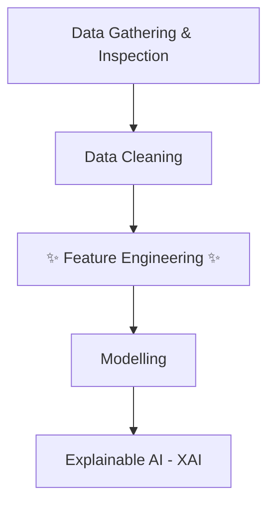

<style>
:root {
  /* Mumbai Python Blue & Yellow Color Theme */
  --slidev-theme-primary: #f0f6fc; /* Primary text color */
  --slidev-theme-secondary: #3776AB; /* Python Blue */
  --slidev-theme-accent: #FFD43B; /* Python Yellow */
  --slidev-theme-background: #0d1117; /* GitHub Dark Background */
  --slidev-theme-foreground: #f0f6fc; /* Main text color */
  --slidev-code-background: #011627; /* A darker code background */
  --slidev-code-foreground: #d6deeb;
}

.slidev-layout {
  background-color: var(--slidev-theme-background);
  color: var(--slidev-theme-foreground);
}

/* Style headers */
h1, h2, h3, h4 {
  color: var(--slidev-theme-foreground);
  font-weight: 600;
}

h1 {
  color: var(--slidev-theme-secondary); /* Blue for main titles */
  border-bottom: 2px solid var(--slidev-theme-accent);
  padding-bottom: 0.5rem;
  display: inline-block;
}

/* Style links */
a {
  color: var(--slidev-theme-accent);
  text-decoration: none;
  border-bottom: 1px dotted var(--slidev-theme-accent);
}

a:hover {
  color: #fff2a8; /* Lighter yellow on hover */
}

/* Style code blocks */
pre, code {
  font-family: 'Fira Code', 'JetBrains Mono', monospace;
}

pre {
  background: var(--slidev-code-background) !important;
  border: 1px solid #30363d;
  border-radius: 8px;
}

/* Mermaid diagram styling */
.mermaid {
    background-color: var(--slidev-theme-background);
    color: white;
    padding: 1rem;
    border-radius: 8px;
    display: flex;
    justify-content: center;
    scale: 1.1;
}

/* Override slidev-layout to not use background image on all slides */
.slidev-page {
  background-color: var(--slidev-theme-background);
}

/* Re-apply background image only on the first slide (intro layout) */
.slidev-layout.text-center {
  background-image: var(--slidev-background-image);
  background-repeat: no-repeat;
  background-size: cover;
  background-position: center;
}
</style>

<!-- Override style for the first slide to be prominent over the background image -->
<div class="h-full flex flex-col justify-center items-center">
  <div style="color: white !important; text-shadow: 2px 2px 8px rgba(0,0,0,0.7);">
    <h1 style="color: white !important; font-size: 3.5rem; font-weight: 700;">Feature Engineering</h1>
    <h2 style="color: white !important; font-size: 2.2rem;">The Secret Sauce for Ultra Pro Tier Models</h2>
    <h3 style="color: white !important; margin-top: 1.5rem;">By Susmit Vengurlekar (@susmitpy)</h3>
  </div>
</div>

---
src: ./pages/disclaimer.md
---

---
src: ./pages/about.md
---

---
src: ./pages/ice_breaker.md
---

# The Unbreakable Law of Data Science

<div class="grid grid-cols-5 gap-4 mt-16 text-2xl items-center">
  <div class="col-span-1 p-4 bg-green-200 text-black rounded">Good Input</div>
  <div class="col-span-1 text-5xl text-center">➡️</div>
  <div class="col-span-1 p-4 bg-blue-200 text-black rounded">Analysis & ML</div>
  <div class="col-span-1 text-5xl text-center">➡️</div>
  <div class="col-span-1 p-4 bg-green-200 text-black rounded">Awesome Output</div>

  <div class="col-span-1 p-4 bg-red-200 text-black rounded">Garbage Input</div>
  <div class="col-span-1 text-5xl text-center">➡️</div>
  <div class="col-span-1 p-4 bg-blue-200 text-black rounded">Analysis & ML</div>
  <div class="col-span-1 text-5xl text-center">➡️</div>
  <div class="col-span-1 p-4 bg-red-200 text-black rounded">Garbage Output</div>
</div>

<h2 class="mt-16" style="color: var(--slidev-theme-accent);">GARBAGE IN, GARBAGE OUT.</h2>

---

# Our Roadmap: The ML Project Flow



<div class="mt-8 text-xl">
Today, we're focusing on the hero of this story: **Feature Engineering**.
</div>

---

# Step 1: The Great Assumptions

## Initial Data Traps

Before you write a single line of feature engineering code, you must first stop and **question your assumptions** about the raw data.

This is where projects fail before they even begin.

---

# The Separator Assumption

<br/>
<div class="text-3xl" style="color: var(--slidev-theme-accent);">
  <b>Audience Question:</b> What does the "C" in "CSV" stand for?
</div>

<v-click>
  <p class="text-center text-2xl mt-4">Everyone says "Comma". But the real world is messy.</p>
  <p class="text-center text-xl">Even if a file is named `report.csv`, the separator could be anything!</p>

  <div class="p-4 bg-gray-800 rounded mt-4">
  <pre class="text-lg"><code>Python,Dart,Go
Python	Dart	Go
Python|Dart|Go
Python;Dart;Go</code></pre>
  </div>
</v-click>

<v-click>
  <div class="mt-8 text-xl p-4 bg-gray-900 rounded border" style="border-color: var(--slidev-theme-accent);">
    <b>The Takeaway:</b> Never assume the separator. <b>Always inspect the raw file first.</b> Hardcoding `sep=','` is a bug waiting to happen. The real meaning is "Character-Separated Values."
  </div>
</v-click>

---

# The Numeric Format Assumption

You're analyzing an international sales report. Your `price` column, which should contain the number *One Thousand*, looks like this in different rows:

<div class="grid grid-cols-3 gap-4 text-center mt-8 text-2xl font-mono">
  <div class="p-6 bg-gray-800 rounded">
    1 000,00
  </div>
  <div class="p-6 bg-gray-800 rounded">
    1.000,00
  </div>
  <div class="p-6 bg-gray-800 rounded">
    1,000.00
  </div>
</div>

<v-click>
  <div class="mt-8 text-3xl" style="color: var(--slidev-theme-accent);">
    <b>Audience Question:</b> What happens if you just load this and convert to a number? What will your program probably think `1,000.00` is? What about `1.000,00`?
  </div>
</v-click>

<v-click>
  <div class="mt-8 text-xl p-4 bg-gray-900 rounded border" style="border-color: var(--slidev-theme-accent);">
    <b>The Takeaway:</b> Numbers are not universal. Different cultures use different decimal and thousand separators. You must investigate and explicitly tell your code how to parse these numbers to avoid massive errors.
  </div>
</v-click>

---

# The Time Assumption

Let's look at a common trap with a library we all love: `pandas`.

<div class="grid grid-cols-2 gap-8 items-center mt-6">

<!-- Left side: The Python Code -->
<div class="col-span-1">

```python
import pandas as pd

# Assuming today is September 27, 2025
df = pd.DataFrame({
    "Date": pd.to_datetime(["17/11/1998"]),
    
    "Time": pd.to_datetime(["11:00"]),
    
    "DateTime": pd.to_datetime(
        ["17/11/1998 11:00"]
    ),
})

print(df.iloc)
```

</div>

<!-- Right side: The Output Table -->
<div class="col-span-1 p-4 bg-gray-800 rounded">
  <pre class="text-lg leading-relaxed"><code>Date       1998-11-17 00:00:00
<span class="text-red-400 font-bold">Time       2025-09-27 11:00:00</span>
DateTime   1998-11-17 11:00:00
  </code></pre>
</div>
</div>

<v-click>
  <div class="mt-8 text-2xl p-4 bg-gray-900 rounded border" style="border-color: var(--slidev-theme-accent);">
    <b>The Disaster:</b> Because `pd.to_datetime` only had a time, it <b>used today's date as a default!</b> This is a silent data corruption bug that can poison your entire dataset.
  </div>
</v-click>

---

# The Currency & Unit Assumption

You are asked to find the marketing channel with the best Return on Investment (ROI).

| Marketing Channel | Marketing Expense | Sales Achieved |
| ----------------- | ----------------- | -------------- |
| Social Media      | 90,000            | $1,500         |
| Google Ads        | 7,000             | $3,500         |
| TV Commercial     | 500,000           | $10,000        |

<br/>
<v-click>
<div class="mt-8 text-3xl" style="color: var(--slidev-theme-accent);">
  <b>Audience Question:</b> Based on this table, which channel looks like the winner? Which looks like the loser?
</div>
</v-click>

<v-click>
<div class="mt-8 text-xl p-4 bg-gray-900 rounded border border-red-400">
  <b>The Trap:</b> You weren't told the units! The `Marketing Expense` is in Indian Rupees (₹) and `Sales Achieved` is in US Dollars ($).
  <br/><br/>
  With an exchange rate of ~₹83 to $1:
  - **Google Ads:** Cost ~$84, earned $3,500. **(Massive ROI)**
  - **TV Commercial:** Cost ~$6,000, earned $10,000. **(Good ROI)**
  <br/><br/>
  Without asking about units and currency, your analysis would be completely wrong.
</div>
</v-click>

---

# Step 2: Data Cleaning - The Janitorial Work

We must clean our data before we can use it. The work of a Data Janitor is critical.

- Handling Missing Values
- Detecting & Handling Outliers
- Removing Duplicate Rows
- Data Validation

<v-click>
<div class="mt-8 text-3xl" style="color: var(--slidev-theme-accent);">
  <b>Audience Question:</b> We're analyzing student commute times. Most are 30-90 mins, but one student takes 3 hours (180 mins)! This is an outlier. What should we do with it?
</div>
</v-click>

<v-click>
<div class="mt-8 text-xl p-4 bg-gray-900 rounded border" style="border-color: var(--slidev-theme-accent);">
  <b>The Answer: Investigate!</b> Don't just delete.
  <br/>- Is it a typo for "18.0"? (Fix it)
  <br/>- Is it a genuine case of a student living very far away? (Keep it, it's valuable information!)
  <br/><br/>
  The right action depends on the story behind the data point.
</div>
</v-click>

---

# Step 3: Feature Engineering - The Main Event!

This is where we stop being data janitors and become **data artists**.

It's where we create signal from noise by:

- **Generating** brand new, powerful features from thin air.
- **Transforming** existing data to reveal hidden patterns.

<div class="mt-8 text-2xl">
This is the skill that separates you from someone who just knows how to call `.fit()` and `.predict()`.
</div>

---

# Generating Features: The Brainstorm

### The Scenario:
You have a dataset from a food delivery app with only **three** columns:
`customer_id`, `restaurant_name`, `order_timestamp`

<v-click>
<div class="mt-8 text-3xl" style="color: var(--slidev-theme-accent);">
  <b>Audience Brainstorm:</b> What new, killer features can you create from just this data to predict if a customer will order again? Shout them out!
</div>
</v-click>

<v-clicks>
<div class="mt-4 text-left text-xl pl-20">
- **Customer Features:** `order_frequency`, `favorite_restaurant`, `time_since_last_order`...
- **Time Features:** `is_weekend`, `is_lunchtime`, `is_late_night`...
- **Restaurant Features:** `restaurant_popularity`...
</div>
</v-clicks>

---

# Generating Features: Simple Derivations

Often, the most powerful features are simple combinations of existing ones.

<div class="grid grid-cols-2 gap-8 mt-8">

<div class="p-4 bg-gray-800 rounded">
<h3 class="!border-none !p-0">Combining Features</h3>
You have `height_cm` and `weight_kg`. By themselves, they are just numbers. Together, they can form a well-understood medical metric.

`BMI = weight_kg / (height_cm / 100)**2`

This is a classic example of creating a feature that contains more domain-specific information than its parts.
<p class="text-sm text-gray-400 mt-2">*(Fun Fact: A BMI calculator was once someone's final year engineering project!)*</p>
</div>

<div class="p-4 bg-gray-800 rounded">
<h3 class="!border-none !p-0">Metadata Features</h3>
The absence of data can be a feature itself! For any column, you can create a new feature that signals if the data was missing.

`has_middle_name = ~df['middle_name'].isnull()`

This can capture patterns like "people who don't provide a middle name are less likely to convert." You can also create features like `%_null_columns_per_row`.
</div>
</div>

---

# Generating Features: Unpacking Datetime

A single `order_timestamp` column is a treasure chest. Don't just leave it as is; unpack it!

**`1998-11-17 11:00:00`** can become:

<div class="grid grid-cols-3 gap-4 mt-6 text-xl">
  <div class="p-3 bg-gray-800 rounded">Year: `1998`</div>
  <div class="p-3 bg-gray-800 rounded">Month: `11`</div>
  <div class="p-3 bg-gray-800 rounded">Day: `17`</div>
  <div class="p-3 bg-gray-800 rounded">Hour: `11`</div>
  <div class="p-3 bg-gray-800 rounded">Quarter: `4`</div>
  <div class="p-3 bg-gray-800 rounded">Day of Week: `1` (Tue)</div>
  <div class="p-3 bg-gray-800 rounded">Week of Year: `47`</div>
  <div class="p-3 bg-gray-800 rounded">Is Weekend?: `False`</div>
  <div class="p-3 bg-gray-800 rounded">Time of Day: `Morning`</div>
</div>

<div class="mt-8 text-2xl">
Each new feature allows the model to find patterns like "orders peak on weekend evenings" or "sales are lower in Q2."
</div>

---

# Generating Features: "Deep Learning" Thinking

Good feature engineering is about seeing the hidden relationships in your data. It's like doing the "thinking" for the model.

Given this dataset:
<div class="p-3 bg-gray-800 rounded mt-2">
<pre><code>Mr. Tony Almeida 38
Mrs. Michelle Almeida 36
Mr. Jack Bauer 42
Ms. Kim Jack Bauer 18
</code></pre>
</div>

<v-click>
<div class="mt-6 text-xl">
A great data scientist doesn't just see names and numbers. They see patterns and create new, high-signal features:

- **`Gender`**: Derived from the title (`Mr.`, `Mrs.`, `Ms.`).
- **`Family_Name`**: Extracted from the full name (`Almeida`, `Bauer`).
- **`Potential_Relationship`**: A flag for people sharing a `Family_Name`.
- **`Age_Bucket`**: Grouping ages into bins like `Teenager`, `Adult`, `Middle-Aged`.
- **`Is_Married`**: Derived from title (`Mrs.`).
</div>
</v-click>

---

# Generating Features: The Power of Aggregation

You can create powerful customer-level features by aggregating their transaction history.

Starting with our food delivery data: `customer_id`, `order_timestamp`, `order_value`

We can use `GROUP BY` to create a new, rich dataset:

```python
# Aggregate to the customer level
customer_features = df.groupby('customer_id').agg(
    total_orders=('order_id', 'count'),
    total_spent=('order_value', 'sum'),
    avg_basket_size=('order_value', 'mean'),
    first_order_date=('order_timestamp', 'min'),
    last_order_date=('order_timestamp', 'max')
)
```

<v-click>
<div class="mt-4 text-xl">
This gives you game-changing features like `time_since_last_order` or `avg_monthly_orders`. These are far more predictive for customer churn than a single transaction.
</div>
</v-click>

---

# Transforming Numerical Data: The Toolkit

Not all numerical data is ready for a model. We often need to transform it to reveal patterns.

- **Binning / Discretization**: Grouping numbers into categories.
- **Power Transformations (Log, Reciprocal)**: Taming skewed data.
- **Cyclical Transformation**: Making time circular.
- **Polynomial & Interaction Features**: Creating context between features.
- **Scaling (Standard, Min-Max)**: Putting features on the same racetrack.

---

# Numerical Transformations in Action

<div class="grid grid-cols-2 gap-6 mt-4 text-left">

<div class="p-4 bg-gray-800 rounded">
<h3 class="!border-none !p-0">Binning</h3>
Grouping `Age` into bins like `(18-25)`, `(26-40)` can simplify the model's job and reduce the impact of outliers.
</div>

<div class="p-4 bg-gray-800 rounded">
<h3 class="!border-none !p-0">Log Transformation</h3>
For skewed data like `Income`, a log transform `log(income)` pulls in high-value outliers, helping the model focus on the bulk of the data.
</div>

<div class="p-4 bg-gray-800 rounded">
<h3 class="!border-none !p-0">Cyclical Transformation</h3>
To a model, `Hour 23` is far from `Hour 0`. We map time onto a circle using `sin` and `cos` so the model understands that midnight follows 11 PM.
</div>

<div class="p-4 bg-gray-800 rounded">
<h3 class="!border-none !p-0">Interaction Features</h3>
Creating `feature_A * feature_B`. This gives context, like `has_pool * is_in_desert` for house prices. Also called "Feature Mixer".
</div>
</div>

---

# Transforming Categorical Data: The Toolkit

Models speak in numbers. Encoding is the process of translating categories into a language models understand.

- **Ordinal Encoder**: For categories with a clear order.
- **Count Encoder**: Based on frequency.
- **One-Hot Encoder**: The default, but can be explosive.
- **Binary Encoder**: A clever way to handle high cardinality.
- **Target / CatBoost Encoders**: Powerful but risky methods using the target variable.

---

# Categorical Encoders: The Workhorses

<div class="grid grid-cols-3 gap-4 mt-6">

<div class="p-4 bg-gray-800 rounded text-left">
<h3 class="!border-none !p-0">Ordinal Encoder</h3>
Use when order matters.
<br/>
`B.Tech -> 1`
`M.Tech -> 2`
`PhD -> 3`
<br/><br/>
<b>Warning:</b> Do NOT use `sklearn.LabelEncoder` for features! It can assign arbitrary order. Use `sklearn.OrdinalEncoder`.
</div>

<div class="p-4 bg-gray-800 rounded text-left">
<h3 class="!border-none !p-0">Count Encoder</h3>
Replace category with its frequency.
<br/>
`Mumbai -> 5000`
`Delhi -> 4500`
`Pune -> 2000`
<br/><br/>
Useful for capturing the popularity or rarity of a category.
</div>

<div class="p-4 bg-gray-800 rounded text-left">
<h3 class="!border-none !p-0">One-Hot Encoder</h3>
Create a new column for each category with a 1 or 0.
<br/>
`City_Mumbai | City_Delhi`
`1 | 0`
`0 | 1`
<br/><br/>
The gold standard for nominal data, but creates many columns if you have many categories.
</div>
</div>

---

# Advanced Encoding: Taming High Cardinality with Binary

What if you have 100s of categories (e.g., `cities`)? One-Hot Encoding would create 100s of new columns!

**Binary Encoding is the solution:**

1.  **Assign Integers**: Each category gets a number. `Mumbai -> 1`, `Delhi -> 2`, `Bengaluru -> 3`
2.  **Convert to Binary**: Convert those numbers to their binary form. `1 -> 01`, `2 -> 10`, `3 -> 11`
3.  **Split into Columns**: Create new columns for each binary digit.

| City      | b2 | b1 |
| --------- | :- | :- |
| Mumbai    | 0  | 1  |
| Delhi     | 1  | 0  |
| Bengaluru | 1  | 1  |

<div class="mt-4 text-xl">
We encoded 3 categories into just 2 columns. To encode **100** categories, you would only need **7** columns (since 2^7 = 128), saving you from the "curse of dimensionality".
</div>

---

# The Cardinal Sin: Target Leakage

Target leakage is when your model uses information that would not be available at the time of prediction. It's cheating, and it creates models that are useless in the real world.

<div class="p-6 bg-gray-900 rounded border border-red-500 mt-8 text-left">
<h3 class="text-red-400 !border-none !p-0">Example 1: The Impossible Feature</h3>
You build a model to predict employee churn with 99.9% accuracy. Your killer feature is `days_since_last_paycheck`. Of course, people who have churned stop getting paychecks. This feature is a direct result of the target!
<hr class="opacity-30 my-4"/>
<h3 class="text-red-400 !border-none !p-0">Example 2: The Pre-Split Mistake</h3>
A more subtle but common mistake is processing data before splitting it.

```python
# WRONG! This is target leakage!
scaler = StandardScaler()
df['feature'] = scaler.fit_transform(df[['feature']]) # Leaks info from test set into training set
X_train, X_test, y_train, y_test = train_test_split(X, y)

# CORRECT!
X_train, X_test, y_train, y_test = train_test_split(X, y)
scaler = StandardScaler()
X_train['feature'] = scaler.fit_transform(X_train[['feature']]) # Fit ONLY on train
X_test['feature'] = scaler.transform(X_test[['feature']]) # Transform test with train's knowledge
```
</div>

---

# Step 4: Modelling & Metrics

Choosing your weapon and how you'll measure victory.

- **The Task**: Classification (Yes/No?), Regression (How much?), or Clustering (Group them!).
- **The Metric**:
  - **For Classification**: Precision vs Recall (trade-off between false positives and false negatives), or simply Accuracy (overall correctness).
  - **MAE vs MSE**: MSE punishes big errors *way* more. Use it when you can't afford to be wildly wrong.
  - **RMSLE**: Punishes under-predicting more than over-predicting. Perfect for sales forecasting, where running out of stock is a disaster.
  - **For Clustering**: Silhouette Score, Davies-Bouldin Index, etc., to measure how well-separated the clusters are.
- **The Process**: Build a **Model Zoo**, use **Cross-Validation** (don't cheat!), and **Tune** your parameters.

---

# Step 5: Explainable AI (XAI) - "But WHY?"

Your model works. It's 95% accurate. But then your boss asks... **"WHY did it reject this loan application?"**

<v-click>
  <div class="mt-8 text-3xl" style="color: var(--slidev-theme-accent);">
    <b>Audience Question:</b> Imagine you built an AI agent to screen job candidates. Why is XAI an absolute necessity? What could go horribly wrong if you can't explain why someone was rejected?
  </div>
</v-click>

<v-click>
<div class="mt-8 text-xl p-4 bg-gray-800 rounded">
  <b>The Risk:</b> Silent bias and discrimination. Without XAI, you can't trust your model, and you can't fix it. Good features make for good explanations.
</div>
</v-click>


---

### Opening the Black Box: Two Tools for Your XAI Toolkit

<br/>

<div class="grid grid-cols-2 gap-2 text-left">

<!-- SHAP Column -->
<div class="p-6 bg-gray-800 rounded-lg border" style="border-color: var(--slidev-theme-secondary);">
  <h3 class="!text-3xl !border-none !p-0" style="color: var(--slidev-theme-secondary);">SHAP</h3>
  <p class="text-sm font-mono">(SHapley Additive exPlanations)</p>
  <hr class="opacity-30 my-1"/>
  <p>Answers: "How much did each feature contribute to this specific prediction compared to the average?"</p>
  <p><strong>How it works:</strong> It cleverly tests the model with different combinations of features to see how each one impacts the output. It's rooted in game theory to ensure the contributions are fair.</p>
  <div class="p-3 bg-gray-900 rounded">
    <code>Final Prediction = Avg. Prediction + Σ(SHAP values)</code>
  </div>
</div>

<!-- LIME Column -->
<div class="p-6 bg-gray-800 rounded-lg border" style="border-color: var(--slidev-theme-accent);">
  <h3 class="!text-3xl !border-none !p-0" style="color: var(--slidev-theme-accent);">LIME</h3>
  <p class="text-sm font-mono">(Local Interpretable Model-agnostic Explanations)</p>
  <hr class="opacity-30 my-4"/>
  <p>Answers: "Can you explain this complex model's behavior around this one prediction by using a simpler model?"</p>
  <p><strong>How it works:</strong> It creates a new, temporary dataset of points around your single prediction, gets the model's outputs for them, and then trains a simple, interpretable model (like Linear Regression) on just that tiny neighborhood.</p>
</div>

</div>


---

# Conclusion

### Key Takeaways

1.  **Garbage In, Garbage Out.** This is your new mantra. Question every assumption about your raw data.

2.  Feature Engineering is **Prompt Engineering for structured data**. You are creatively guiding your model to a better answer.

3.  Don't just be a model user who calls `.fit()`. Be a **Feature Artist**. That's how you become irreplaceable in the age of AI agents.

---
src: ./pages/connect.md
---

---
src: ./pages/qa.md
---
