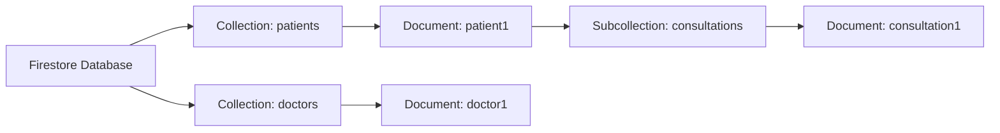
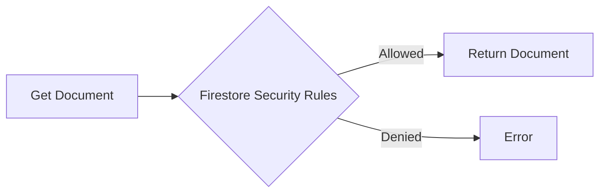

# Firestore Security Rules - Securing your firestore db

### By Susmit Vengurlekar (@susmitpy)


<style>
    .slidev-layout {
        background-color: white;
    }

    h1 {
        color: black !important;
    }
    h3 {
        color: black;
    }
</style>

---
src: ./pages/about.md
---

---
layout: image
image: /firestore/ai.jpg
backgroundSize: contain
---

---

# Agenda

1. What is Firebase Firestore ?
2. Why Firestore Security Rules ?
3. Basics of Firestore Security Rules
4. Firestore Security Rules - Examples
5. Rules Playground for testing
6. Best Practices for Access Control Lists


<style>
    li {
        font-size: 2.2em;
    }
</style>


---

# What is Firestore ?

* Document oriented NoSQL database

* Can be directly accessed from the client side

<br/> <br/>



<style>
    p {
        line-height: 1.10em;
    }
    li {
        font-size: 2.2em;
    }
</style>

--- 

# Why should you secure your Firestore DB ?

- You need to include firebase config in your client side code

```js
const FIREBASE_CONFIG = {
    apiKey: "AIzaPodk9k38Vx9e5S0Ceg4414_6Uq5GxleI",
    authDomain: "dummy.firebaseapp.com",
    projectId: "dummy",
    storageBucket: "dummy.appspot.com",
    messagingSenderId: "123290572890",
    appId: "1:123290572890:web:b6a9947ba1typ7b8a4ac77",
    measurementId: "G-E51DK3PKQ7"
}
```

<style>
    li {
        font-size: 1.6em;
    }

    code {
        font-size: 1.9em;
    }
</style>

---

# Why should you secure your Firestore DB ?

- It is visible in the Sources tab in dev tools

<div class="flex items-center justify-center">


</div>

<style>
    li {
        font-size: 1.6em;
    }

</style>


---

# Why should you secure your Firestore DB ?

- The API key is visible in payload of requests

<div class="flex">


</div>

<style>
    li {
        font-size: 1.6em;
    }

</style>


---

# Why should you secure your Firestore DB ?

- The Form Data reveals the structure of your database

<div class="flex">


</div>

<style>

    li {
        font-size: 1.6em;
    }

    .flex {
        justify-content: center;
    }

</style>


---

# Where does Firestore Security Rules fit ?

```js
const docSnap = await getDoc(doc(db, 'doctors', doctorId));
```

<div class="">



</div>

<style>
    code {
        font-size: 2em
    }

    .mermaid {
        display: flex;
        justify-content: center;
        margin-top: 4em;
    }
</style>

---
layout: image
image: /firestore/easy.jpg
backgroundSize: contain
---

---

# Authentication vs Authorization

- Authentication: Who are you ?

- Authorization: What can you do ?

- You are authenticated to join devfest, but not authorized to just take swag and leave

<style>
    p {
        line-height: 1.10em;
    }
    li {
        font-size: 2.5em;
    }
</style>

---

# Basics of Firestore Security Rules

<ul>
  <li>read
    <ul>
      <li>list - documents in a collection </li>
      <li>get - single document</li>
    </ul>
  </li>
  <li>write
    <ul>
      <li>create</li>
      <li>update</li>
      <li>delete</li>
    </ul>
  </li>
  <li> By default, all access is denied </li>
</ul>

<style>
    li {
        font-size: 1.3em;
    }
</style>


---

# Basics of Firestore Security Rules

<ul>
<li>request - incoming request</li>
<li>resource - document being accessed</li>
<li>request.resource - document being written </li>
<li> request.auth - authentication details </li>
</ul>


<style>
    li {
        font-size: 2.5em;
    }
</style>


---

# Firestore Security Rules - Examples

## Fully Secured

<div class="mt-4">

```js
rules_version = '2';
service cloud.firestore {
  match /databases/{database}/documents {
    match /{document=**} {
      allow read, write: if false;
    }
  }
}
```

</div>

<style>
    code {
        font-size: 2em;
    }
</style>

---

# Firestore Security Rules - Examples

## Authentication Check

<div class="mt-4">

```js
match /doctors/{doctorId} {
    allow read, write: if request.auth != null;
}
```

</div>

<style>
    code {
        font-size: 2.5em;
    }
</style>


---

# Firestore Security Rules - Examples

## Can access own document

<div class="flex flex-col items-center justify-center mt-4">

```js
match /doctors/{doctorId} {
    allow read, write: if (request.auth != null
                 && request.auth.uid == doctorId);
}
```

</div>

<style>
    code {
        font-size: 2.5em;
    }
</style>


---

# Firestore Security Rules - Examples

## Preventing Impersonation

<div class="flex flex-col items-center justify-center mt-4">

```js
match /leaves/{leaveId} {
    allow write: if request.auth != null && (
        request.auth.uid == (
             request.resource.data.doctor_id
    )); 
}
```

</div>

<style>
    code {
        font-size: 2.8em;
    }
</style>


---

# Firestore Security Rules - Examples

## Is requester's uid in allowed list ?

<div class="flex flex-col items-center justify-center mt-4">

```js
match /patients/{patientId}{
    allow read: if request.auth != null && (
        request.auth.uid 
            in 
                resource.data.doctorIds);
}
```

</div>

<style>
    code {
        font-size: 2.8em;
    }
</style>

---

# Firestore Security Rules - Examples

## Restrict access by sign in provider

- Normal users sign in via phone
- Admins sign in via email

<div class="flex flex-col items-center justify-center mt-4">

```js
match /payouts/{payoutId} {
    allow read, write: if request.auth != null && (
        request.auth.token.firebase.sign_in_provider
            == 'password'
    );
}
```

</div>

<style>
    code {
        font-size: 2.3em;
    }
    li {
        font-size: 1.5em;
    }
</style>


---
layout: image
image: /firestore/more.jpg
backgroundSize: contain
---

---

# Firestore Security Rules - Some More Examples

## Auth Custom Claims and Functions

<div class="flex flex-col items-center justify-center mt-4">

```js
function isSignedIn(){
    return request.auth != null;
}

function isDoctor(){
    return request.auth.token.is_doctor;
}

match /store/KVStore {
    allow get, update: if isSignedIn() && isDoctor();
}
```

</div>

<style>
    code {
        font-size: 1.9em;
    }
</style>

---

# Firestore Security Rules - Some More Examples

## Nesting Rules & Reading a document

<div class="flex flex-col items-center justify-center mt-4">

```js
match /patients/{patientId}{
    match /consultations/{consultationId} {
    allow read, write: if request.auth != null && (
        request.auth.uid in 
            (
            get(/databases/$(database)/documents/patients/$(patientId)
            ).data
             .doctorIds)
        )
    }
}
```

</div>

<style>
    code {
        font-size: 1.8em;
    }
</style>

---

# Firestore Security Rules - Some More Examples

## Restrict update to specific fields

<div class="flex flex-col items-center justify-center mt-4">

```js
match /patients/{patientId}{
    allow update: if isSignedIn() && 
        isDoctor() && (
        request.resource.data
            .diff(resource.data)
            .affectedKeys()
            .hasOnly(['medicalNotes'])
        );
}
```

</div>

<style>
    code {
        font-size: 2.2em;
    }
</style>

---

# Rules Playground for testing

- Easy way to simulate requests and test rules

<div class="flex mt-4">
    
</div>

<style>

    li {
        font-size: 1.6em;
    }

</style>

---

# Best Practices for Access Control Lists

- Deny by default
- Allow only what is necessary (least privilege)
- Analogy: Document your work as if your manager is going to try every way to give a bad review

<div class="flex items-center justify-center w-1/2 mx-auto mt-4">
    
</div>


<style>
    li {
        font-size: 1.4em;
    }
</style>

---
src: ./pages/connect.md
---


---

# Thank You !

- Access the Slides at https://susmitpy.github.io/talks/firestore_rules

<style>
    li {
        font-size: 2.3em;
    }
</style>
