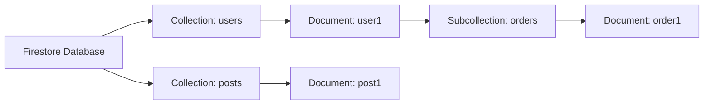
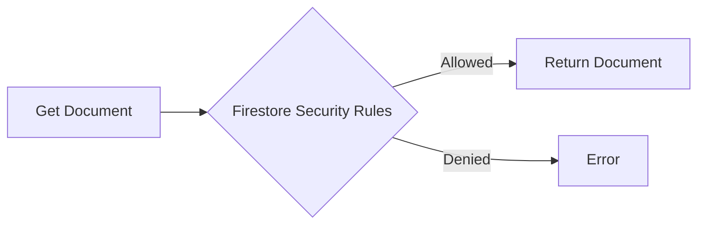

# Firestore Security Rules - Securing your firestore db

### By Susmit Vengurlekar (@susmitpy)

---
src: ./pages/about.md
---

---
layout: image
image: /firestore/ai.jpg
backgroundSize: contain
---

---

# Agenda

1. What is Firebase and Firebase Firestore ?
2. Why Firestore Security Rules ?
3. Basics of Firestore Security Rules
4. Firestore Security Rules - Examples
5. Rules Playground for testing
6. Best Practices for Access Control Lists


<style>
    li {
        font-size: 1.6em;
    }
</style>

---

# What is Firebase ?

- Firebase is a backend as a service (BaaS) that provides a number of services to help you build your app without managing the infrastructure

- Client and Admin SDKs

- Realtime Database, Firestore, Cloud Storage, Authentication, Hosting and more

<style>
    p {
        line-height: 1.10em;
    }
    li {
        font-size: 1.6em;
    }
</style>

---

# What is Firestore ?

* Document oriented NoSQL database

* Can be directly accessed from the client side



<style>
    p {
        line-height: 1.10em;
    }
    li {
        font-size: 1.6em;
    }
</style>

--- 

# Why should you secure your Firestore DB ?

- In a web app, you can't hide the API key or the document you are fetching which reveals the structure of your database

<div class="flex flex-row gap-6">

  <div class="w-1/2">
  
```js
const FIREBASE_CONFIG = {
    apiKey: "AIzaPodk9k38Vx9e5S0Ceg4414_6Uq5GxleI",
    authDomain: "dummy.firebaseapp.com",
    projectId: "dummy",
    storageBucket: "dummy.appspot.com",
    messagingSenderId: "123290572890",
    appId: "1:123290572890:web:b6a9947ba1typ7b8a4ac77",
    measurementId: "G-E51DK3PKQ7"
}
```
  
  </div>
  
  <div class="w-1/2" v-click>
    
  </div>
  
</div>

<div class="flex flex-row gap-6 mt-4">
  <div class="w-1/2" v-click>
    
  </div>
  <div class="w-1/2" v-click>
    
  </div>
</div>

<style>
    li {
        font-size: 0.9em;
    }
</style>


---

# Where does Firestore Security Rules fit ?

```js
const eventSnap = await getDoc(doc(db, 'events', eventId));
```



<style>
    code {
        font-size: 2em
    }
</style>

---
layout: image
image: /firestore/easy.jpg
backgroundSize: contain
---

---

# Authentication vs Authorization

- Authentication: Who are you ?

- Authorization: What can you do ?

- In google meet during a lecture, as a student you can join if you are authenticated, but you are not authorized to mute the teacher

<style>
    p {
        line-height: 1.10em;
    }
    li {
        font-size: 2em;
    }
</style>

---

# Basics of Firestore Security Rules

<ul>
  <li>read
    <ul>
      <li>list - documents in a collection </li>
      <li>get - single document</li>
    </ul>
  </li>
  <li>write
    <ul>
      <li>create</li>
      <li>update</li>
      <li>delete</li>
    </ul>
  </li>
  <li> By default, all access is denied </li>
</ul>

<style>
    li {
        font-size: 1.2em;
    }
</style>


---

# Basics of Firestore Security Rules

<ul>
<li>request - incoming request</li>
<li>resource - document being accessed</li>
<li>request.resource - document being written </li>
<li> request.auth - authentication details </li>
</ul>


<style>
    li {
        font-size: 1.6em;
    }
</style>


---

# Firestore Security Rules - Examples

<div class="flex flex-row">
<div class="flex flex-col">

<v-click>

#### Fully Secured

```js
rules_version = '2';
service cloud.firestore {
  match /databases/{database}/documents {
    match /{document=**} {
      allow read, write: if false;
    }
  }
}
```

</v-click>

<v-click>

#### Authentication Check

```js
match /rooms/{roomId} {
    allow read, write: if request.auth != null;
}
```

</v-click>

<v-click>

#### Can access own document

```js
match /users/{userId} {
    allow read, write: if (request.auth != null
                 && request.auth.uid == userId);
}
```
</v-click>
</div>

<div class="flex flex-col">

<v-click>

#### Preventing Impersonation

```js
match /events/{document=**} {
    allow write: if request.auth != null && (
        request.auth.uid == request.resource.data.organizer_id
    ); 
}
```
</v-click>

<v-click>
<br/><br/>
 
#### Is requester's uid in allowed list ?

```js
match /Patients/{patientId}{
    allow read: if (request.auth.uid in resource.data.doctorIds);
}
```
</v-click>

<v-click>

#### Restrict access to email-password users

```js
match /config/{secretId} {
    allow read, write: if (
        request.auth.token.firebase.sign_in_provider == 'password'
    );
}
```
</v-click>

</div>

</div>

---
layout: image
image: /firestore/more.jpg
backgroundSize: contain
---

---

# Firestore Security Rules - Some More Examples

<div class="flex flex-col">

<div class="flex flex-row justify-evenly">

<div>

<v-click>

### Auth Custom Claims and Functions

```js
function isSignedIn(){
    return request.auth != null;
}

function isDoctor(){
    return request.auth.token.is_doctor;
}

match /Store/KVStore {
    allow get, update: if isSignedIn() && isDoctor();
}
```

</v-click>

</div>

<div class="mr-3">

<v-click>

### Nesting Rules & Reading a document

```js
match /Patients/{patientId}{
    match /Consultations/{consultationId} {
    allow read, write: if (
        request.auth.uid in 
            (
            get(/databases/$(database)/documents/Patients/$(patientId)
            ).data
             .doctorIds)
        )
    }
}
```

</v-click>

</div>

</div>

<div>

<v-click>

### Restrict update to specific fields

```js
match /events/{document=**} {
    allow update: if (
        request.resource.data.diff(resource.data).affectedKeys().hasOnly(['clicks'])
        );
}
```

</v-click>

</div>

</div>

---

# Rules Playground for testing

<div class="flex mx-auto my-auto">
    
</div>


---

# Best Practices for Access Control Lists

- Deny by default
- Allow only what is necessary (least privilege)
- Approach of write exam such that the evaluator wants to fail you

<div class="flex w-1/2 mx-auto mt-4">
    
</div>


<style>
    li {
        font-size: 1.6em;
    }
</style>

---
src: ./pages/connect.md
---


---

# Thank You !

- Access the Slides at https://susmitpy.github.io/talks/firestore_rules

<style>
    li {
        font-size: 1.6em;
    }
</style>
