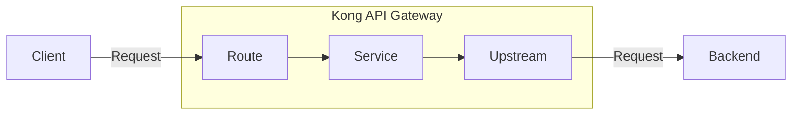
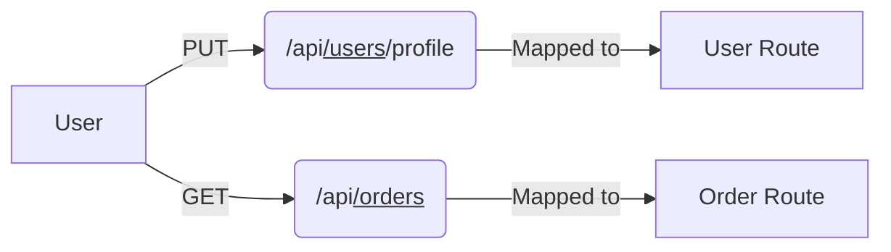
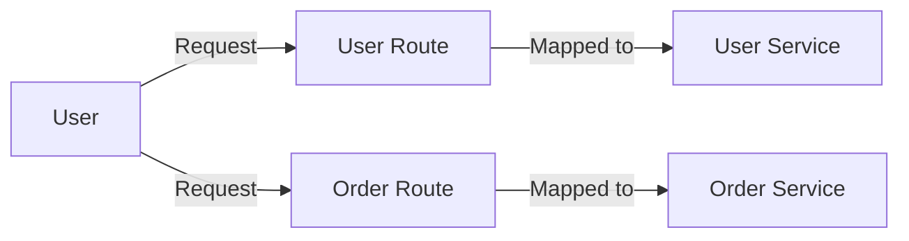
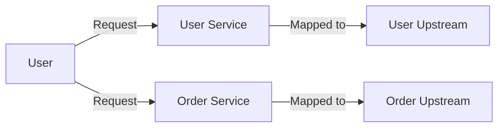
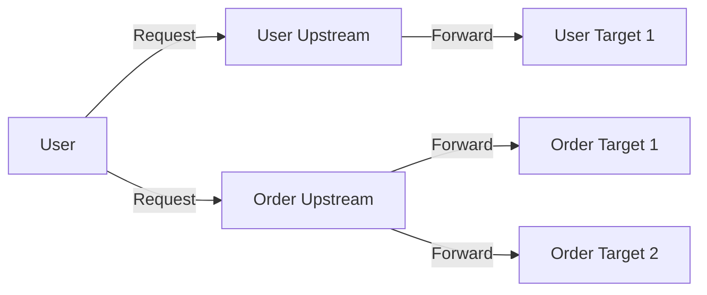
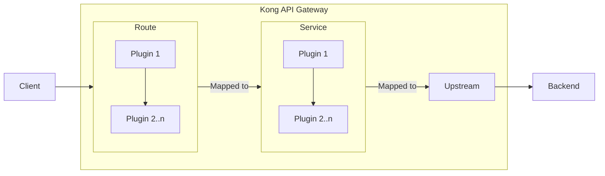

# Auth with Kong API Gateway

### By Susmit Vengurlekar (@susmitpy)

---
src: ./pages/disclaimer.md
---

---
src: ./pages/bug.md
---

---
src: ./pages/about.md
---

---
src: ./pages/ice_breaker.md
---

---

# Dissecting Kong API Gateway

---

# Dissecting Kong API Gateway

## Routes

 

---

# Dissecting Kong API Gateway

## Services

 

---

# Dissecting Kong API Gateway

## Upstreams

 

---

# Dissecting Kong API Gateway

## Upstream Targets

 

---

# Dissecting Kong API Gateway

## Plugins

 

---

# Let's Explore someone's Side Project

<h2>Kong API Gateway with Fast API, Open Telemetry and OpenObserve in Docker </h2>

  

    <a href="https://github.com/susmitpy/docker-kong-fastapi-otel-openobserve">https://github.com/susmitpy/docker-kong-fastapi-otel-openobserve</a>
  

  

    
  

---
src: ./pages/connect.md
---

---

# Common between me and previous speaker (Amandeep)

* Talked about Kong

* Both of us are from India

* Both of us are not engineers (by degree)

<v-click>

## There is one more thing in common, raise your hand if you know what it is

</v-click>

---

## We both are from DG Ruparel College, Mumbai
 

  

    <SlidevVideo autoplay>
      <source src="/ruparel meme.mp4" type="video/mp4" />
    </SlidevVideo>
  

  

    
  

---
src: ./pages/qa.md
---
