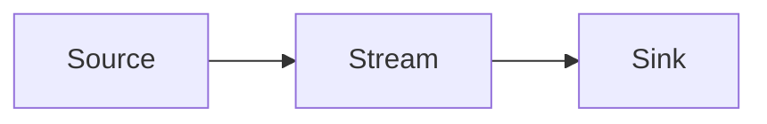
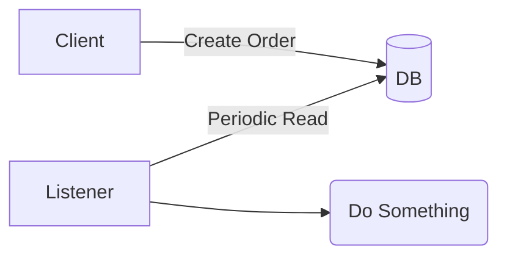
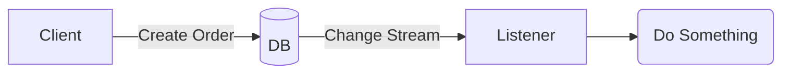
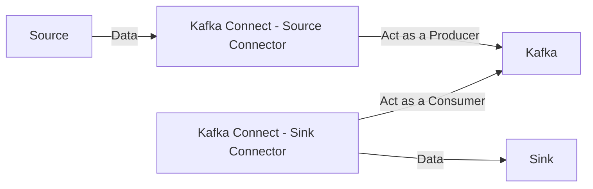
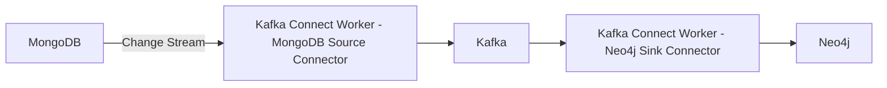

# Tracking Changes with MongoDB Change Stream

### By Susmit Vengurlekar (@susmitpy)

---
src: ./pages/bug.md
---

---
src: ./pages/disclaimer.md
---

---
src: ./pages/about.md
---

---

<div class="flex flex-col h-full">
<h1>Something is common between the speakers today</h1>
<v-click>
<Youtube id="MvBV3uzbe9I" class="mx-auto my-auto w-full h-full p-4"/>
</v-click>
</div>


---

# Agenda

1. What is a Stream 
2. Change Data Capture
3. Intro to MongoDB 
4. Intro to MongoDB Replica Sets
5. Intro to MongoDB Change Stream
6. Intro to Kafka
7. Intro to Neo4j
9. Intro to Kafka Connect
10. One Use Case
11. Live Demo
12. Q&A 

<style>
    li {
        font-size: 1.2em;
    }
</style>

---

# What is a Stream

- A sequence of data elements made available over time
- Flow of data from one point to another

<br/>



<style>
    li {
        font-size: 1.5em;
    }
</style>

---

# Change Data Capture (CDC)

### Ingesting changes from a source database system

- Batch Oriented CDC - Periodic Updates

<br/>



- Continuous CDC - Capturing changes in data as they occur

<br/>



<style>
    li {
        font-size: 1.3em;
    }
</style>


---

<div class="flex flex-col h-full">
<h1>Intro to MongoDB</h1>
<h3>Terminology Mapping</h3>
<Youtube id="GV9VBwH_h1U" class="mx-auto my-auto w-full h-full p-4"/>
</div>


---

# Intro to MongoDB

- Document-oriented NoSQL database
- Schema On Read
- Rich Querying and Indexing capabilities
- Powerful Aggregation Framework


<style>
    li {
        font-size: 1.5em;
    }
</style>

---

# Indexing, Querying and Aggregation in MongoDB

### Indexing and Querying
```js
db.orders.createIndex({ customerId: 1, orderDate: -1 })

db.orders.find(
  {
    customerId: "C12345",
    orderDate: {
      $gte: ISODate("2023-01-01"),
      $lte: ISODate("2023-12-31")
    }
  }
).sort({ orderDate: -1 })
```

### Aggregation
```js
db.orders.aggregate([
  { $group: { _id: "$customerId", totalSpent: { $sum: "$amount" } } },
  { $sort: { totalSpent: -1 } },
  { $limit: 5 }
])
```

---

# Intro to MongoDB Replica Sets

- What is a Replica Set?
    - A group of MongoDB servers that maintain the same data set
    - Provides data redundancy and high availability

<v-click>

- Primary and Secondary Nodes
    - Primary handles all write operations
    - Secondaries replicate data from the primary

- Automatic Failover
    - If primary fails, a secondary is automatically elected as the new primary

</v-click>

<style>
    li {
        font-size: 1.2em;
    }
</style>

---

# Intro to MongoDB Change Stream

- Real-time data changes
- Can be consumed by applications
- Capture inserts, updates, and deletes
- Resumable - Every change event has a resume token
- Works only with Replica Sets and Sharded Clusters

<style>
    li {
        font-size: 1.5em;
    }
</style>

---

# Intro to Kafka

- open-source distributed event streaming platform which is Fault Tolerant & Scalable
- Can act like a Pub-Sub system as well as a message queue

<div class="flex items-center justify-center">
  
</div>

<style>
    li {
        font-size: 1.2em;
    }
</style>

---

# Intro to Neo4j

- Graph database
- Labels, Nodes, Relationships, and Properties
- Native Graph Storage: Store data using pointers on disk
- Cypher Query Language


<style>
    li {
        font-size: 1.2em;
    }
</style>

---

# Intro to Kafka Connect

- Tool for scalably and reliably streaming data between Apache Kafka and other data systems
- Connectors for various data sources and sinks
- Kafka Connect workers are JVM processes

<br/>


<style>
    li {
        font-size: 1.2em;
    }
</style>

---

# E-commerce Use Case

- Primary Data Store: MongoDB
- Data Store for Recommendations: Neo4j
- But then, we can listen for changes and directly write to Neo4j, why Kafka?

<v-click>

- Decouple MongoDB and Neo4j
    - Data Buffer in case of spikes
    - Allows for downtime of Neo4j
    - Replayability
    - Can configure Dead Letter Queue for failed messages
    - One more thing
</v-click>

<v-click>

### Gave me a chance to setup slighly more complex demo and have more content in the talk

</v-click>

<style>
    li {
        font-size: 1.1em;
    }
</style>

---

# MongoDB to Kafka to Neo4j



<br/> 
<v-click>

## Enough of Slides, Let's see some code, some configuration and get things working.
<br/>

<div class="flex flex-row gap-4">

<div class="flex flex-col">
<p> Scan the QR Code for the demo github repo</p>
<p>Github Repo: susmitpy/mongodb-kafka-neo4j</p>
</div>
</div>

</v-click>

---
src: ./pages/connect.md
---

---
src: ./pages/qa.md
---
