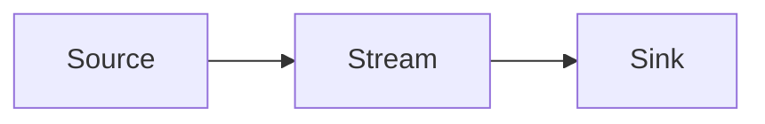
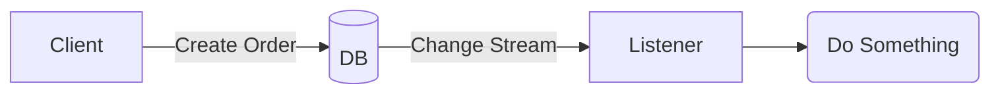
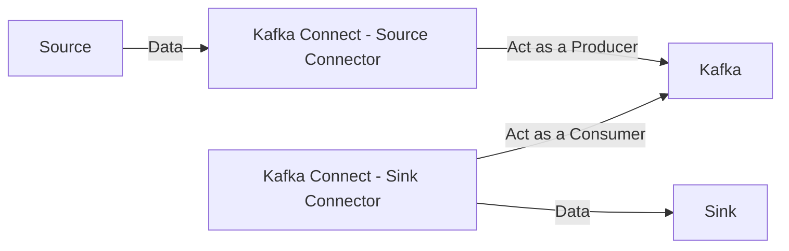
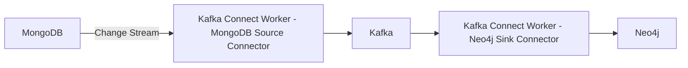

# Tracking Changes with MongoDB Change Stream

### By Susmit Vengurlekar (@susmitpy)

---
src: ./pages/bug.md
---

---
src: ./pages/disclaimer.md
---

---
src: ./pages/about.md
---

---

# Agenda

1. What is a Stream 
2. Change Data Capture
3. Intro to MongoDB
4. Intro to MongoDB Change Stream
5. Intro to Kafka
6. Intro to Neo4j
7. ⁠Intro to Kafka Connect
8. One Use Case
9. Live Demo
10. Q&A 

---

# What is a Stream

- A sequence of data elements made available over time
- Flow of data from one point to another

 

---

# Change Data Capture (CDC)

- Capturing changes in data as they occur
- Capturing inserts, updates, and deletes

 

---

# Intro to MongoDB

- Does not need introduction 

<v-click>

- Document-oriented NoSQL database
- Schema On Read
</v-click>

---

# Intro to MongoDB Change Stream

- Real-time data changes
- Can be consumed by applications
- Capture inserts, updates, and deletes

---

# Intro to Kafka

- open-source distributed event streaming platform which is Fault Tolerant & Scalable
- Can act like a Pub-Sub system as well as a message queue

  

---

# Intro to Neo4j

- Graph database
- Labels, Nodes, Relationships, and Properties
- Native Graph Storage: Store data using pointers on disk
- Cypher Query Language

---

# Intro to Kafka Connect

- Tool for scalably and reliably streaming data between Apache Kafka and other data systems
- Connectors for various data sources and sinks
- Kafka Connect workers are JVM processes

 

---

# E-commerce Use Case

- Primary Data Store: MongoDB
- Data Store for Recommendations: Neo4j
- But then, we can listen for changes and directly write to Neo4j, why Kafka?

<v-click>

- Decouple MongoDB and Neo4j
    - Data Buffer in case of spikes
    - Allows for downtime of Neo4j
    - Replayability
    - Can configure Dead Letter Queue for failed messages
    - One more thing
</v-click>

<v-click>

### Gave me a chance to setup slighly more complex demo and have more content in the talk

</v-click>

---

# MongoDB to Kafka to Neo4j

  
<v-click>

## Enough of Slides, Let's see some code, some configuration and get things working.
 

 Scan the QR Code for the demo github repo

Github Repo: susmitpy/mongodb-kafka-neo4j

</v-click>

---
src: ./pages/connect.md
---

---
src: ./pages/qa.md
---
