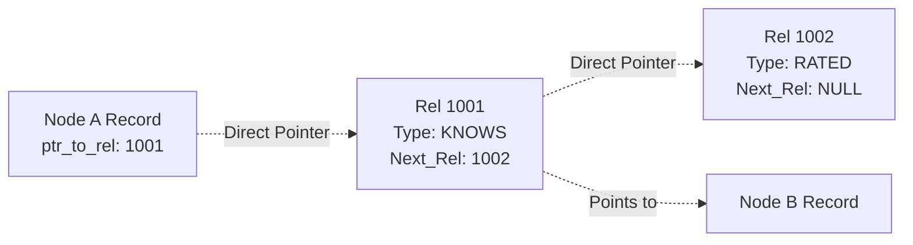
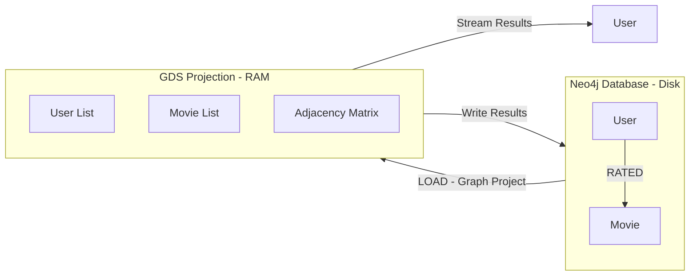

<style>
:root {
  /* Neo4j Official Colors */
  --neo-blue: #008cc1;
  --neo-dark: #0b2942;
  --neo-orange: #f9c013;
  --neo-light-blue: #e3f2fd;
  
  /* Theme Colors */
  --slidev-theme-primary: #FFFFFF;
  --slidev-theme-secondary: var(--neo-orange);
  --slidev-theme-accent: var(--neo-blue);
  --slidev-theme-background: linear-gradient(135deg, #0b2942 0%, #051923 100%);
  --slidev-theme-foreground: #E8E8E8;
  --slidev-code-background: rgba(13, 17, 23, 0.95);
}

.slidev-layout {
  background: var(--slidev-theme-background);
  color: var(--slidev-theme-foreground);
}

h1, h2, h3, h4 {
  color: #FFFFFF;
  font-weight: 600;
  text-shadow: 2px 2px 4px rgba(0, 0, 0, 0.5);
}

h1 {
  color: var(--neo-orange);
}

h2 {
  color: var(--neo-blue);
}

h3 {
  color: var(--neo-orange);
}

div, p, li {
  color: #E8E8E8;
  font-size: 1.1rem;
}

a {
  color: var(--neo-orange);
  text-decoration: none;
  border-bottom: 1px solid var(--neo-orange);
}

pre {
  background: var(--slidev-code-background) !important;
  border: 1px solid var(--neo-blue);
  border-radius: 8px;
}

.audience-question {
  background: rgba(249, 192, 19, 0.15);
  border-left: 5px solid var(--neo-orange);
  padding: 1rem;
  margin: 1rem 0;
  border-radius: 4px;
}

.highlight {
  color: var(--neo-orange);
  font-weight: bold;
}
</style>

<div class="h-full flex flex-col justify-center items-center">
  <div style="text-shadow: 4px 2px 10px rgba(0,0,0,0.8);">
    <p class="mt-8 pt-8 opacity-80 text-white text-2xl">By Susmit Vengurlekar</p>
  </div>
</div>


---
src: ./pages/about.md
---


---
src: ./pages/disclaimer.md
---


---

# Agenda

- **1. Introduction**: The "Why" behind Graphs vs SQL.
- **2. Neo4j Internals**: Why is it so fast? (Index-Free Adjacency).
- **3. Setup & Syntax**: Cypher basics.
- **4. Data Loading**: Building our movie database.
- **5. Basic Recommendations**: Popularity, Content-Based, and Collaborative Filtering.
- **6. Graph Data Science (GDS)**: Node Similarity & Personalized PageRank.
- **7. Practice & Resources**: How to keep learning.

<style>
li {
    font-size: 1.7rem;
}
</style>

<!-- Speaker notes
Here is our roadmap for today. We'll start with the theory, move to hands-on setup, and then dive deep into recommendation engines.
-->

---

# The Problem with SQL for Recommendations

<div class="grid grid-cols-2 gap-4">

<div>
<p class="highlight">The Scenario:</p>
"Friends of my Friends who like movies I haven't seen yet."

<v-click>
<div class="mt-4 p-4 bg-gray-800 rounded border border-red-500">
<p class="text-red-400 font-bold">In SQL (Relational DB):</p>
<ul>
  <li>Massive <b>JOINs</b> required.</li>
  <li>User → Friends → FoF → Ratings → Movies.</li>
  <li>Slow, complex, and expensive (O(n) or worse).</li>
</ul>
</div>
</v-click>
<v-click>
<div class="mt-2 p-2 bg-gray-800 rounded border border-green-500">
<p class="text-green-400 font-bold">In Graph (Neo4j):</p>
<p>We just "walk" the connections. Millisecond responses (O(1) traversal).</p>
</div>
</v-click>

</div>

<div class="flex flex-col items-center justify-center">

</div>

</div>

<!-- Speaker notes
Traditional databases struggle with many-to-many relationships at scale. 
Every join adds complexity and slows down the query. 
In a graph, relationships are first-class citizens.
-->

---
layout: image
image: https://raw.githubusercontent.com/susmitpy/neo4j_recommender_workshop/main/public/knowledge_graph.png
---

# What is a Knowledge Graph?

<style>
  h1 {
    color: var(--neo-dark);
    text-shadow: 2px 2px 4px rgba(0, 0, 0, 0.5);
  }
</style>

<!-- Speaker notes
A knowledge graph organizes data as a network of entities and relationships. 
It's how humans think – connecting concepts together.
-->

---
layout: image
image: https://raw.githubusercontent.com/susmitpy/neo4j_recommender_workshop/main/public/neo_intro.jpeg
---

# How KG looks in Neo4j

<style>
  h1 {
    color: var(--neo-dark);
    text-shadow: 2px 2px 4px rgba(0, 0, 0, 0.5);
  }
</style>

<!-- Speaker notes
A knowledge graph organizes data as a network of entities and relationships. 
It's how humans think – connecting concepts together.
-->

---
layout: section
---

# 2. Neo4j Internals
## Why is it so fast?

---

# Index-Free Adjacency

In SQL, the DB scans an index (like the back of a book) to find rows.
In Neo4j, data is stored as a <span class="highlight">Linked List</span> on disk.

<div class="mt-8">



</div>

<v-click>
<div class="audience-question mt-4">
<b>The Magic:</b> Neo4j doesn't "search." It just "chases pointers." 
This converts a search problem into a traversal problem.
</div>
</v-click>

<!-- Speaker notes
This is the core differentiator. Instead of computing joins at query time, Neo4j stores the connections physically on disk.
-->

---
layout: section
---

# 3. Setup & Syntax
## Getting Started with Cypher

---

# Hands-on: Get the Environment

<div class="grid grid-cols-2 gap-4">

<div class="text-sm">

1.  Go to [sandbox.neo4j.com](https://sandbox.neo4j.com)
2.  Signup (avoid social login if shared)
3.  Create Project → Select <span class="highlight">"Graph Data Science"</span>
4.  Click **"Open"** (Neo4j Browser)
5.  Check "Connection Details" for credentials
6.  <span class="text-red-400">Remember to terminate after workshop!</span>

</div>

<div class="flex items-center justify-center">
<div class="p-6 bg-white rounded shadow-lg">
  
  <p class="text-black text-center mt-2 font-bold">Neo4j Sandbox</p>
</div>
</div>

</div>

<style>
  li {
    font-size: 1.5rem;
  }
</style>

<!-- Speaker notes
The Neo4j Sandbox is a free, temporary instance that comes pre-configured. 
The GDS sandbox includes the library we'll need for advanced analytics.
-->

---

# Cypher: The Language of Graphs

Cypher is <span class="highlight">ASCII Art</span>. You draw what you want to find.

<v-clicks>

- `()` represents a **Node**.
- `--` represents a **Relationship**.
- `-->` represents a **Directed Relationship**.
- `[]` contains **Relationship details**.

</v-clicks>

<div class="grid grid-cols-2 gap-4 mt-8">

<v-click>
<div class="p-4 bg-gray-800 rounded">
<p class="text-blue-300">SQL:</p>
<code class="p-2">SELECT name FROM users WHERE id = 1</code>
</div>
</v-click>

<v-click>
<div class="p-4 bg-gray-800 rounded">
<p class="text-green-300">Cypher:</p>
<code class="p-2">MATCH (u:User {id: 1}) RETURN u.name</code>
</div>
</v-click>

</div>

<style>
  li {
    font-size: 1.5rem;
  }
  </style>

<!-- Speaker notes
Cypher is designed to be intuitive. If you can draw it on a whiteboard, you can write it in Cypher.
-->

---

# Step 0: Clean Slate

Before we begin, ensure your database is empty.

```cypher
MATCH (n) DETACH DELETE n;
```


<div class="audience-question mt-4">
<b>Pro-Tip:</b> <code>DETACH DELETE</code> removes both the nodes and any relationships connected to them.
</div>

<!-- Speaker notes
Always start with a clean slate during a workshop to ensure your results match the instructor's.
-->

---
layout: section
---

# 4. Data Loading
## Building the Recommender

---

# A.0 Basics (Hands-on)

1. **Create Test Data**:
```cypher
CREATE (u:User {name: "Alice"})
CREATE (m:Movie {title: "The Matrix"});
```

<v-clicks>

<div>

2. **Verify**:
```cypher
MATCH (n) RETURN n;
```

</div>

<div>

3. **Task: Connect them (Rating)**:
```cypher
MATCH (m:Movie {title: "The Matrix"})
MERGE (u:User {name: "Alice"})-[r:RATED]->(m)
SET r.rating = 5;
```

</div>

</v-clicks>

<style>
  code {
    border-radius: 4px;
    font-size: 1.5rem;
  }
  li {
    font-size: 1.6rem;
  }
</style>

<!-- Speaker notes
Let's try some basic operations. Notice how MERGE works differently than CREATE.
-->

---

# The `MERGE` Pitfall

<div class="audience-question">
<b>What happened?</b> Check your graph: <code>MATCH (n) RETURN n</code>. 
Do you see <b>two</b> Alices?
</div>

<v-click>

**Why ???**
&nbsp; `MERGE` matches the **entire pattern**. Since "Alice connected to Matrix" didn't exist, Neo4j created the *entire pattern*-including a brand new Alice node!

</v-click>

<v-click>

**The Correct Way:**
```cypher
MATCH (m:Movie {title: "The Matrix"})
MERGE (u:User {name: "Alice"})      // Find or Create Alice first
MERGE (u)-[r:RATED]->(m)            // Then connect them
SET r.rating = 5;
```

</v-click>

<style>
  p {
    font-size: 1.6rem;
    line-height: 1.5;
  }
  code {
    font-size: 1.3rem;
    border-radius: 4px;
  }
  .audience-question {
    font-size: 1.4rem;
  }
</style>

<!-- Speaker notes
MERGE is "Get or Create". If you merge a relationship pattern, it looks for the exact connection. If not found, it creates everything in that pattern.
-->

---

# A.1 Create Constraints

Constraints ensure data integrity (like Primary Keys).

```cypher {all|2,3|4,5|6,7|all}
// Ensure uniqueness
CREATE CONSTRAINT user_id IF NOT EXISTS FOR (u:User) 
  REQUIRE u.userId IS UNIQUE;
CREATE CONSTRAINT movie_id IF NOT EXISTS FOR (m:Movie) 
  REQUIRE m.movieId IS UNIQUE;
CREATE CONSTRAINT genre_name IF NOT EXISTS FOR (g:Genre) 
  REQUIRE g.name IS UNIQUE;

// Check your work
SHOW CONSTRAINTS;
SHOW INDEXES;
```

<v-click>
<div class="mt-4 opacity-70 text-xl">
Note: An index is auto-created for all unique constraints.
</div>
</v-click>

<style>
  code {
    font-size: 1.3rem;
    border-radius: 4px;
  }
</style>

<!-- Speaker notes
We need these constraints before loading large datasets to prevent duplicates and speed up lookup.
-->

---

# A.2 Load Movies & Genres

We will load a CSV from GitHub, split the genres, and connect them.

```cypher
LOAD CSV WITH HEADERS FROM
  "https://raw.githubusercontent.com/susmitpy/neo4j_recommender_workshop/refs/
  heads/main/ml-latest-small/movies.csv"
AS row
WITH row, toInteger(row.movieId) AS movieId

// Create Movie
MERGE (m:Movie {movieId: movieId})
SET m.title = row.title

// Handle Genres (Action|Adventure -> [Action, Adventure])
WITH m, row.genres AS genres
UNWIND split(genres, "|") AS genre
MERGE (g:Genre {name: genre})
MERGE (m)-[:IN_GENRE]->(g);
```

<style>
  code {
    font-size: 1.1rem;
    border-radius: 4px;
  }
</style>

<!-- Speaker notes
UNWIND is like a for-each loop. It takes a list and creates a row for each element.
-->

---

# A.3 Load Ratings

Connecting `User` nodes to `Movie` nodes.

```cypher
LOAD CSV WITH HEADERS FROM
  "https://raw.githubusercontent.com/susmitpy/neo4j_recommender_workshop/refs/
  heads/main/ml-latest-small/ratings.csv"
AS row
WITH toInteger(row.userId) AS userId, 
     toInteger(row.movieId) AS movieId, 
     toFloat(row.rating) AS rating

MATCH (m:Movie {movieId: movieId})
MERGE (u:User {userId: userId})
MERGE (u)-[r:RATED]->(m)
SET r.rating = rating;
```

<v-click>
<div class="audience-question mt-4">
<b>Verify:</b> <code>MATCH p=(u:User {userId:300})-[:RATED]->(m:Movie) RETURN p LIMIT 10</code>
</div>
</v-click>

<style>
  code {
    font-size: 1.1rem;
    border-radius: 4px;
  }
</style>

<!-- Speaker notes
Now we're populating the actual relationships. This is where the graph starts to take shape.
-->

---
layout: section
---

# 5. Basic Recommendations
## Cypher Power

---

# Rec Engine 0: Popularity

The "Trending" List - what is everyone watching?

<div class="audience-question">
<b>Task:</b> Find the top 10 movies with the most ratings.
</div>

```cypher
MATCH (m:Movie)<-[:RATED]-(u) 
RETURN m.title, count(u) as reviews 
ORDER BY reviews DESC
LIMIT 10;
```

<v-click>
<p class="mt-4 text-sm opacity-80">Simple, but not personalized.</p>
</v-click>

<style>
  code {
    font-size: 1.3rem;
    border-radius: 4px;
  }
  p {
    font-size: 1.1rem;
  }
</style>

<!-- Speaker notes
This is the most basic recommendation: "What's popular right now?"
-->

---

# Rec Engine 1: Content-Based

*"You liked The Matrix? Here are other Action/Sci-Fi movies."*

<div class="grid grid-cols-2 gap-4">
<div>

</div>
<div class="text-sm">

```cypher{all|1,2,3|4|5|6,7,8|9|10|all}
MATCH 
(m:Movie {title: "Toy Story 1995"})
      -[:IN_GENRE]->(g:Genre)
MATCH (rec:Movie)-[:IN_GENRE]->(g)
WHERE rec <> m
RETURN rec.title, 
  collect(g.name) as sharedGenres, 
  count(g) as overlap
ORDER BY overlap DESC
LIMIT 10;
```

</div>
</div>

<style>
  code {
    font-size: 1.2rem;
    border-radius: 4px;
  }
</style>

<!-- Speaker notes
Content-based filtering looks at the attributes of the items you've interacted with.
-->

---

# Rec Engine 2: Collaborative Filtering

*"People who liked Toy Story also liked..."*

<div class="grid grid-cols-2 gap-4 my--2">
<div>

</div>
<div class="text-sm">

```cypher{all|1,2|3,4,5|6,7,8,9|10,11,12,13,14|all}
MATCH 
(m:Movie {title: "Toy Story 1995"})
// 2. Find users who liked it
MATCH (u:User)-[r1:RATED]->(m) 
WHERE r1.rating > 3
// Find other movies those users 
// liked
MATCH (u)-[r2:RATED]->(rec:Movie) 
WHERE r2.rating > 3 AND rec <> m
// 4. Rank by frequency
RETURN rec.title, 
  count(u) as frequent
ORDER BY frequent DESC
LIMIT 10;
```

</div>
</div>

<style>
  code {
    font-size: 1.2rem;
    border-radius: 4px;
  }
</style>

<!-- Speaker notes
Collaborative filtering uses the "wisdom of the crowd". It finds users similar to you and suggests what they liked.
-->

---
layout: section
---

# 6. Graph Data Science (GDS)
## Advanced Graph Analytics

---

# The Graph Projection

Neo4j stores data on **Disk**. GDS algorithms run in **RAM**.

<div class="mt-8">



</div>

<v-click>
<div class="audience-question mt-4">
We take a snapshot of the graph, load it into RAM, and run our math there.
</div>
</v-click>

<!-- Speaker notes
This separation allows GDS to run high-performance algorithms without impacting the transactional database.
-->

---

# Node Similarity (Jaccard Index)

How do we know if Movie A and Movie B are similar?

<v-clicks>

- **Movie A viewers:** `[Alice, Bob, Charlie]`
- **Movie B viewers:** `[Alice, Bob, David]`
- **Intersection (Same):** `[Alice, Bob]` (Count: 2)
- **Union (All unique):** `[Alice, Bob, Charlie, David]` (Count: 4)
- <span class="highlight">Similarity Score:</span> 2 / 4 = **0.5 (50%)**

</v-clicks>

<style>
  li {
    font-size: 1.7rem;
  }
</style>

---

# C.1: Create the Projection

```cypher
CALL gds.graph.drop('myGraph', false);

CALL gds.graph.project(
  'myGraph',                // Name of graph in memory
  ['User', 'Movie'],        // Nodes to load
  {
    // Treat rating as a two-way street
    RATED: {orientation: 'UNDIRECTED'} 
  }
);
```

<style>
  code {
    font-size: 1.2rem;
    border-radius: 4px;
  }
</style>

<!-- Speaker notes
We drop the graph first just in case it already exists. We use UNDIRECTED because similarity doesn't care about direction.
-->

---

# C.2: Run Node Similarity

```cypher
CALL gds.nodeSimilarity.stream('myGraph')
YIELD node1, node2, similarity
WHERE similarity > 0.1
RETURN gds.util.asNode(node1).title AS Movie_A,
       gds.util.asNode(node2).title AS Movie_B,
       similarity
ORDER BY similarity DESC
LIMIT 10;
```

<v-click>
<div class="audience-question mt-4">
<b>Result:</b> You now have a mathematical similarity score between every pair of movies.
</div>
</v-click>

<style>
  code {
    font-size: 1.2rem;
    border-radius: 4px;
  }
</style>


<!-- Speaker notes
This compares every movie to every other movie based on the set of users who rated them.
-->

---

# Personalized PageRank (PPR)

The "Random Walk" approach.

<v-clicks>

- **Logic:** Start at "Inception", randomly walk to users, then to other movies.
- **Transitive:** Captures relationships through chains (User A → Movie B → User C → Movie D).
- **Result:** Movies you visit most frequently are the most relevant.

</v-clicks>

<v-click>
<div class="mt-8">

```cypher
MATCH (source:Movie {title: "Inception (2010)"})
CALL gds.pageRank.stream('myGraph', {
  maxIterations: 20, dampingFactor: 0.85, 
  sourceNodes: [source]
})
YIELD nodeId, score
WITH gds.util.asNode(nodeId) AS movie, score
WHERE movie:Movie AND movie.title <> "Inception (2010)"
RETURN movie.title, score ORDER BY score DESC LIMIT 10;
```

</div>
</v-click>

<style>
  li {
    font-size: 1.2rem;
  }
  code {
    font-size: 1.2rem;
  }
</style>

<!-- Speaker notes
PageRank was originally for ranking websites. Personalized PageRank "biases" the walk towards a specific starting node.
-->

---
layout: section
---

# Wait! What about AI?

<v-clicks>

- **RAG (Retrieval-Augmented Generation):** Knowledge Graphs provide structured context and relationships to LLMs.
- **Vector Search:** Neo4j supports vector embeddings and similarity searches.
- **LLM Graph Builder:** Tools like [LLM Graph Builder](https://neo4j.com/labs/genai-ecosystem/llm-graph-builder/) help automate graph construction.
- **MCP Server:** Neo4j now has an MCP server for AI agents!

</v-clicks>

<v-click>
<div class="audience-question mt-8">
AI that doesn't hallucinate and understands the context of your data.
</div>
</v-click>

<style>
  li {
    font-size: 1.4rem;
    text-align: left;
  }
</style>

<!-- Speaker notes
Knowledge Graphs are the perfect partner for LLMs. They provide a "ground truth" that models can query for reliable information.
-->

---
layout: section
---

# Want to practice more?

---

# Learning Resources

<div class="flex flex-col">

<div>

- 🎓 **Graph Academy**: [graphacademy.neo4j.com](https://graphacademy.neo4j.com)
- 📚 **Official Docs**: [neo4j.com/docs](https://neo4j.com/docs)
- 📝 **Cypher Refcard**: [neo4j.com/docs/cypher-refcard](https://neo4j.com/docs/cypher-refcard/current/)
- 🎖️ **Certifications**: Become a Neo4j Certified Professional!

</div>

<div class="p-4 bg-gray-800 rounded mt-4">
<p class="highlight mb-2">Local Setup (Docker):</p>
<pre class="text-xs p-4">
git clone https://github.com/susmitpy/neo4j_recommender_workshop.git
cd neo4j_recommender_workshop
docker-compose up -d
</pre>
<p class="text-xs mt-2">Access at: <code>http://localhost:7474</code></p>
</div>

</div>

<style>
  li {
    font-size: 1.3rem;
  }
  p {
    font-size: 1.1rem;
  }
</style>

<!-- Speaker notes
Graph Academy is excellent and free. I highly recommend the Cypher Fundamentals and GDS courses.
-->

---
src: ./pages/qa.md
---

---
src: ./pages/connect.md
---
