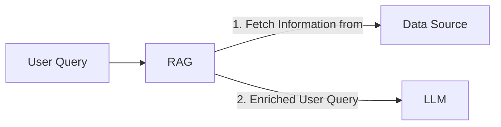
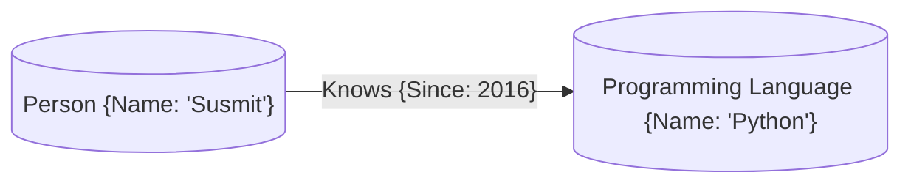

# QnA on Private Knowledge Graph using Neo4j

### By Susmit Vengurlekar


<div class="text-xs text-gray-400 absolute bottom-10 left-0 right-0 text-center">
Gentle Reminder: Start screen recording
</div>


---
src: ./pages/disclaimer.md
---

---
src: ./pages/bug.md
---


---
src: ./pages/about.md
---


---

# Agenda

* What is LLM ?
* What is RAG ?
* What is a Knowledge Graph?
* Intro to Neo4j
* Demo Time
  - Asking questions to LLM
  - Setting up RAG based pipeline
  - Asking questions to RAG + LLM

<style>
  li {
    font-size: 1.8rem;
  }
</style>

--- 

# What is LLM ?

- LLM is a Language Model that is trained on a large corpus of text data
- It works by predicting the next token given a sequence of tokens in a recursive manner

### Example

- Input sequence: "The quick brown"
- Predict next token: "fox"
- Updated sequence: "The quick brown fox"
- Predict next token: "jumps"
- Repeat the process

Stop when output length reaches a certain threshold or a special token is predicted


<style>
  li {
    font-size: 1.5rem;
  }
  p {
    font-size: 1.3rem;
  }
</style>

<!-- 
I think it  
I think it is  
I think it is very

 -->

--- 

# What is RAG ?

* RAG stands for Retrieval Augmented Generation
* It is used to get more context to feed into LLM



<style>
  li {
    font-size: 2rem;
  }
</style>

---

# What is a Knowledge Graph?

- A Knowledge Graph is a graph database that stores information in the form of nodes and edges
- Nodes represent entities and edges represent relationships between entities
- Properties can be attached to nodes and edges

### Example



<style>
  li {
    font-size: 1.5rem;
  }
</style>

---

# Intro to Neo4j

- Graph database
- Labels, Nodes, Relationships, and Properties
- Native Graph Storage: Store data using pointers on disk
- Cypher Query Language
- Create only directed relationships, but traverse them any way.


<style>
    li {
        font-size: 1em;
    }
</style>

---

# Intro to Neo4j - Cypher Query Language

### To find all actors who acted in the movie "The Matrix"

<br/>

### Instead of this
```sql
SELECT actors.name
FROM actors
 	LEFT JOIN acted_in ON acted_in.actor_id = actors.id
	LEFT JOIN movies ON movies.id = acted_in.movie_id
WHERE movies.title = "The Matrix"
```

### You can write this
```cypher
MATCH (actor:Actor)-[:ACTED_IN]->(movie:Movie {title: 'The Matrix'})
RETURN actor.name
```

<style>
    code {
        font-size: 1.5em;
    }
</style>

---

# Intro to Neo4j - Cypher Query Language

### Recommending users based on common interests and friends

```cypher
MATCH 
    (curr_user: User {user_id: 1}) - [chi:HAS_INTEREST]
       -> (i:Interest) <- [ohi:HAS_INTEREST] - (other_user: User)
WHERE
    ID(curr_user) <> ID(other_user) AND
    NOT EXISTS ((curr_user) - [:HAS_AFFINITY] -> (other_user)) AND
    NOT EXISTS ((curr_user) - [:HAS_DECLINED] - (other_user))
OPTIONAL MATCH    
    (curr_user) - [cha:HAS_AFFINITY] -> (u:User) <- [oha:HAS_AFFINITY] - (other_user)
WITH
    other_user.user_id as user_id, COUNT(distinct i) AS common_interests,
    COUNT(distinct u) AS common_affinities
RETURN
    user_id
ORDER BY
    common_interests DESC,
    common_affinities DESC
LIMIT 6
```

<style>
    code {
        font-size: 1.2em;
    }
</style>

---

# Demo Time

- Asking questions to LLM
- Setting up RAG based pipeline
- Asking questions to RAG + LLM

<style>
    li {
        font-size: 1.8em;
    }
</style>

---
src: ./pages/connect.md
---

---
src: ./pages/qa.md
---
