```mermaid
graph LR
    A[File Upload] --> B[Function Starts]
    B --> C[Count Words]
    C --> D[Return Results]
    D --> E[Function Stops]
    E --> F[💰 Pay Only for Processing Time]
```

<style>
:root {
  --slidev-theme-primary: #f1f5f9;
  --slidev-theme-secondary: #1e40af;
  --slidev-theme-accent: #60a5fa;
  --slidev-theme-background: #1e293b;
  --slidev-theme-foreground: #f1f5f9;
  --slidev-code-background: #0f172a;
  --slidev-code-foreground: #e2e8f0;
}

.slidev-layout {
  background: linear-gradient(135deg, #1e293b 0%, #334155 50%, #475569 100%);
  color: #f1f5f9;
}

.dark .slidev-layout {
  background: linear-gradient(135deg, #0f172a 0%, #1e293b 50%, #334155 100%);
}

/* Override slide backgrounds */
.slidev-page {
  background: linear-gradient(135deg, #1e293b 0%, #334155 100%) !important;
}

/* Style headers with white/light text for contrast */
h1, h2, h3 {
  color: #f1f5f9;
}

h1 {
    font-weight: 700;
}

/* Override headers on first slide to be white */
.slidev-layout.text-center h1,
.slidev-layout.text-center h2,
.slidev-layout.text-center h3 {
  color: white !important;
}

/* Style code blocks */
pre {
  background: #0f172a !important;
  border: 1px solid #334155;
}

/* Style links */
a {
  color: #60a5fa;
}

a:hover {
  color: #93c5fd;
}
</style>

<div style="color: white !important;">  
    <h1 style="color: white !important;">Scalable Mini Project</h1>
    <h2 style="color: white !important;">Real-time Word Count with Azure</h2>
    <h3 style="color: white !important;">By Susmit Vengurlekar (@susmitpy)</h3>

</div>

<div class="text-xs text-gray-400 absolute bottom-10 left-0 right-0 text-center">
The Journey from Simple Idea to Production-Ready Application
</div>


---
src: ./pages/disclaimer.md
---

---
src: ./pages/about.md
---

---
src: ./pages/ice_breaker.md
---

---

# Our Story Today

1. **The Problem** - A simple word count idea that must scale to 100 users
2. **Traditional vs Cloud** - Why servers fail and serverless wins
3. **Serverless Foundation** - Functions, storage, and real-time magic
4. **Three Real Challenges** - Interactive problem-solving with audience
5. **Implementation** - From security to automation with actual code
6. **Demo Time** - See RealTimeWordCount in action!

<style>
li {
    font-size: 1.6rem;
    margin-bottom: 0.5rem;
}
</style>

---

# The Problem: A Simple Yet Scalable Idea 💡

## What if you could...
<div class="text-xl mb-6">

**Upload any text file and instantly get the top 5 most frequent words?**
</div>

## Sounds Simple, Right? 

<v-click>

### But what if...
-- **100 users** upload files simultaneously?
-- **Files are 100MB** each?
-- Users expect **real-time results**?
-- You only pay for compute time — no idle server costs?

</v-click>

<v-click>

### Suddenly, our "simple" idea becomes a **scalability challenge!**

</v-click>

<style>
li { font-size: 1.4rem; }
</style>

---

# The Traditional Approach (And Why It Fails) 😰

## Option 1: Single Server Solution


---

# Enter the Cloud: A Game Changer! ☁️

Think of it like **Uber** for computing - you don't own cars, you just request rides!

<div class="grid grid-cols-2 gap-8 mt-8">
<div>

## Traditional Approach
- Buy physical servers 💰
- Set up data centers 🏢
- Hire IT staff 👥
- Handle maintenance 🔧
- Pay for unused capacity 📊
- **Scale manually** 😵

</div>
<div>

## Cloud Approach
- Rent computing power ☁️
- Access via internet 🌐
- Someone else maintains it 🛠️
- Pay only for what you use 💳
- **Auto-scale instantly** ⚡
- **Focus on your idea** 🎯

</div>
</div>

<div class="text-xl mt-8 text-center">

**For our word count project: Perfect fit!** 🎯
</div>

---

# Cloud Building Blocks for Our Project

<div class="grid grid-cols-2 gap-8 mb-8">
<div>

## 🖥️ **Virtual Machines**
- Like having a computer in the cloud
- Full control over the OS
- ❌ **Not ideal for our project** - too much overhead

</div>
<div>

## ⚡ **Serverless Functions**

- No server provisioning or management overhead
- Pay only when code runs
- Auto-scaling
- ✅ **Perfect for our word count project!**

</div>
</div>

<div class="text-center">

## ⚡ **Serverless Functions**

<br/>



</div>

---

# Storage: Where Do We Keep the Files?

<div class="grid grid-cols-3 gap-4 mt-8">
<div class="text-center">

## 📁 **Blob Storage**
Store any type of file
- Images, videos, documents
- Massive capacity
- Access from anywhere

✅ **Perfect for our text files!**

</div>
<div class="text-center">

## 🗄️ **Databases**
Structured data storage
- SQL databases (supports BLOB fields)
- NoSQL databases
- Managed by cloud provider

❌ **Storing files in DB is possible but generally not recommended**

</div>
<div class="text-center">

## 💾 **Block Storage**
High-performance storage
- Attached to virtual machines
- Like hard drives
- For operating systems

❌ **We don't have VMs to attach to**

</div>
</div>

<div class="text-center mt-8 text-xl">

**For our project: Blob storage is the clear winner!** 🏆
</div>


---

# Building Connected Systems: The Integration Story

Team members don't work alone - they need to talk to each other!


<div class="text-center mt-6 text-xl">

**Our project uses:** HTTP requests + File uploads + Real-time notifications! 🎯
</div>


---

# Implementation Walkthrough

## Three Real Challenges:
1. **Real-time Communication** - How to notify users instantly?
2. **Secure File Uploads** - How to let users upload files without exposing credentials?
3. **Automated Processing** - How to process files automatically and notify users?

<div class="text-center text-5xl mt-8">

Let's Go!  🚀
</div>

<style>
li { font-size: 1.8rem; }
</style>

---

# Challenge 1: Real-time Communication 🤔

<div class="text-center text-2xl mb-8">

**"How do we tell the user when their file processing is complete?"**
</div>

## The Dilemma:
- User uploads a file
- Processing happens in the background
- User is waiting... and waiting... 😴
- **How do we notify them instantly when done?**

<v-click>

## 🙋‍♂️🙋‍♀️ **Audience Question Time!**
### What are some ways we could solve this?

*Think about it... What solutions come to mind?*

</v-click>

---

# Challenge 1: Real-time Communication


<div class="grid grid-cols-2 gap-8">
<div>

## 📧 **Email Notifications**
- Use Azure Communication Services - Email or Azure SendGrid (Twilio)
- Send results as email attachment
- Perfect for long-running processes

## 📱 **SMS/Text Messages**
- Use Azure Communication Services - SMS or Integrate with Twilio API
- Quick result summaries
- Great for mobile-first users

</div>
<div>

## 💬 **WhatsApp Business API**
- Rich media support (charts, documents)
- Global reach and familiarity
- Azure Communication Services Messaging SDK or simple API calls


## 📞 **Voice Calls**
- Use Azure Communication Services - Call Automation API
- Text-to-speech using Azure Cognitive Services
- For urgent or critical results

</div>
</div>


---

# Challenge 1: Real-time Communication

<div class="grid grid-cols-2 gap-8 mt-6">

<div>

### 📡 **WebSockets (Our Choice)**
- **Bi-directional** communication
- Real-time, instant updates
- Perfect for interactive apps
- Requires connection management
- Great for chat, gaming, live data
- **✅ Works with Azure Functions + SignalR**

</div>

<v-click>
<div>

### 📤 **Server-Sent Events (SSE)**

- **Who can explain this to all of us?** 🤔
- I am not prepared to explain this today, audience needs to help!

</div>
</v-click>
</div>


---

# Why WebSockets Over SSE? The Technical Reality

<div class="text-center text-xl mb-8">

**SSE would be simpler, but Azure Functions has a fundamental limitation...**
</div>

<div class="grid grid-cols-2 gap-8">
<div>

## 📤 **Server-Sent Events Requirements**
- Long-lived HTTP connections
- Server keeps connection open
- Streams data over time
- **Needs always-running server**

### Perfect for:
- VM with Node.js/Python server
- Azure App Service
- Container Apps

</div>
<div>

## ⚡ **Azure Functions Reality**
- Designed for short-lived operations
- Stateless by design
- Auto-shutdown when idle
- **Can't maintain long connections**

### Solution:
- Use **Azure SignalR Service**
- Managed WebSocket infrastructure
- Functions trigger SignalR messages
- Best of both worlds!

</div>
</div>

<div class="text-center mt-4 text-lg">

**Sometimes architecture choices are driven by platform limitations, not just best practices!** 🎯
</div>

---

# Implementation: Setting Up Real-time Connection

**Client establishes WebSocket connection**

```javascript
// The client's first move: establish connection
const negotiateSignalR = async () => {
    const response = await axios.post(
        negotiateEndpoint, 
        null, 
        {
            headers: {
                'userid': userId,
                'x-functions-key': functionKey
            }
        }
    )
    const connectionInfo = response.data;
    connectToSignalR(
        connectionInfo.url, 
        connectionInfo.accessToken
    );
};
```

---

# Implementation: WebSocket Negotiation Function

**Azure securely manages connections**

```csharp
[Function("negotiate")]
public async Task<HttpResponseData> Negotiate(
    [HttpTrigger(AuthorizationLevel.Function, "post")] HttpRequestData req,
    [SignalRConnectionInfoInput(HubName = "serverless", UserId = "{headers.userid}")] 
    MyConnectionInfo connectionInfo)
{
    var userId = req.Headers
        .FirstOrDefault(h => h.Key == "userid")
        .Value.FirstOrDefault();
    
    var response = req.CreateResponse(HttpStatusCode.OK);
    response.Headers.Add("Access-Control-Allow-Origin", "*");
    
    await response.WriteAsJsonAsync(new { 
        url = connectionInfo.Url, 
        accessToken = connectionInfo.AccessToken 
    });

    return response;
}
```

---

# Challenge 2: Secure File Uploads 🔐

<div class="text-center text-2xl mb-8">

**"How do we let users upload files without exposing our storage credentials?"**
</div>

## The Security Dilemma:
- Users need to upload files to our cloud storage
- We can't give them our storage account keys! 🔑
- We don't want files going through our servers (expensive!)
- But we need to control access and prevent abuse

<v-click>

## 🙋‍♂️🙋‍♀️ **Audience Question Time!**
### How would you solve this security puzzle?

</v-click>

---

# Some Security Ideas 🛡️

<div class="grid grid-cols-2 gap-8">
<div>

## 🤔 **Common Approaches:**
- Give users storage keys (⚠️ dangerous!)
- Route uploads through our server
- Create user accounts with permissions
- Use API keys
- Time-limited tokens

</div>
<div>

## 🎯 **The Reality:**
- **Storage keys:** Too much access
- **Through server:** Expensive, slow
- **User accounts:** Complex setup
- **API keys:** Still too much access
- **Time-limited tokens:** 🏆 **Getting warm!**

</div>
</div>

<v-click>

<div class="text-center mt-8">

## ⭐ **Our Solution: SAS Tokens!**
**Shared Access Signatures - like temporary, limited parking passes**

*Time-limited, permission-specific, user-specific access*

</div>

</v-click>

---

# How SAS Tokens Work 🎟️
<div class="grid grid-cols-2 gap-8 items-center">
<div class="text-center">

### 🎟️ **SAS Tokens = Smart Tickets**
- Like a **temporary parking pass**
- Specific permissions only
- Auto-expires for security
- User-specific access

```mermaid{scale:0.8}
graph TD
    A[User: 'I want to upload!'] --> B[Function: Generate SAS Token]
    B --> C[Token Properties:<br/>• 15 minute expiry<br/>• Write-only access<br/>• Specific filename]
    C --> D[User: Direct upload to Azure Storage]
    D --> E[Azure: Validates token & accepts file]
    E --> F[Token expires automatically]
```

</div>
<div class="text-center">



</div>
</div>


---

# Implementation: Secure File Upload Strategy

**Generate secure, time-limited upload permissions**

```csharp
private string GenerateUri(string userId)
{
    string storageConnectionString = Environment.GetEnvironmentVariable("AzureWebJobsStorage");
    var blobServiceClient = new BlobServiceClient(storageConnectionString);
    var containerClient = blobServiceClient.GetBlobContainerClient("text-file-uploads");

    var blobName = $"{userId}_{Guid.NewGuid()}.txt";
    var blobClient = containerClient.GetBlobClient(blobName);

    var sasBuilder = new BlobSasBuilder
    {
        BlobContainerName = "text-file-uploads",
        BlobName = blobName,
        Resource = "b",
        ExpiresOn = DateTime.UtcNow.AddMinutes(15) // Shorter expiry for security
    };

    sasBuilder.SetPermissions(BlobSasPermissions.Write);
    return blobClient.GenerateSasUri(sasBuilder).ToString();
}
```

---

# Implementation: Upload URL Generator

**Provide secure upload endpoints**

```csharp
[Function("GetFileUploadURL")]
public IActionResult Run(
    [HttpTrigger(AuthorizationLevel.Function, "post")] HttpRequest req, 
    [FromBody] ReqData data)
{
    _logger.LogInformation("C# HTTP trigger function processed a request.");

    var uri = GenerateUri(data.userId);
    return new OkObjectResult(new
    {
        uri = uri.ToString()
    });
}

public record ReqData(string userId);
```

---

# Challenge 3: Automated Processing 🤖

<div class="text-center text-2xl mb-8">

**"How do we automatically process files when uploaded AND notify the right user?"**
</div>

## The Automation Challenge:
- File gets uploaded to storage
- System must detect the upload automatically
- Process the file without human intervention  
- Find the correct user to notify
- Send results in real-time

<v-click>

## 🙋‍♂️🙋‍♀️ **Final Audience Question!**
### How would you trigger processing and identify users?

</v-click>

---

# Event-Driven Solutions 🚀

<div class="grid grid-cols-2 gap-8">
<div>

## 🤔 **Common Ideas:**
- Poll storage for new files
- Use file naming conventions
- Database tracking
- Scheduled jobs to check
- Event triggers

</div>
<div>

## ⚡ **The Best Approach:**
- **Polling:** Wasteful, slow
- **File naming:** 🎯 Smart for user ID!
- **Database:** Adds complexity
- **Scheduled jobs:** Delayed processing
- **Event triggers:** 🏆 **Perfect!**

</div>
</div>

<v-click>

<div class="text-center mt-8">

## 🪄 **Our Solution: Blob Triggers + Smart Naming!**
**Azure automatically triggers function on file upload**

*Filename contains user ID - perfect identification!*

</div>

</v-click>

---

# Implementation: The Automation Masterpiece!

**Fully automated processing with user notification**

```csharp
[Function(nameof(OnFileUpload))]
[SignalROutput(HubName = "serverless")]
public async Task<SignalRMessageAction> Run(
    [BlobTrigger("text-file-uploads/{name}", Connection = "AzureWebJobsStorage")] 
    Stream stream, string name)
{
    using var blobStreamReader = new StreamReader(stream);
    var content = await blobStreamReader.ReadToEndAsync();
    
    var top5Words = getTop5Words(content);
    _logger.LogInformation($"Top 5 words in {name}: {string.Join(", ", 
        top5Words.Select(x => $"{x.Key} ({x.Value})"))}");

    var userId = name.Split('_')[0];
    
    return new SignalRMessageAction("newMessage", [top5Words])
    {
        UserId = userId
    };
}
```

---

# In a Nutshell: Our Cloud Stack

<div class="grid grid-cols-2 gap-6">
<div>

## 🔵 **Azure Functions**
- Serverless compute platform
- Supports C#, Python, JavaScript, and more
- **Perfect for our word processing logic!**

## 📦 **Azure Blob Storage**
- Massive file storage
- Global accessibility
- **Where we store the uploaded text files**

</div>
<div>

## 📡 **Azure SignalR Service**
- Managed WebSocket service
- Real-time communication made easy
- **How we instantly notify users of results**

## ⚡ **Built-in Integrations**
- Functions trigger automatically on file upload
- Some configuration needed (CORS, auth, etc.)
- **Multiple services working together**

</div>
</div>

---

# The Complete Flow: How Everything Connects

```mermaid
graph TD
    U[👤 User] -->|1. Select Text File| C[💻 Client App]
    C -->|2. Generate Unique ID| C
    C -->|3. Setup WebSocket Connection| W[📡 SignalR Service]
    C -->|4. Request Upload URL| F1[⚡ Azure Function: GetFileUploadUrl]
    F1 -->|5. Return Secure Upload URL| C
    C -->|6. Upload File to Storage| B[📦 Blob Storage]
    B -->|7. Auto-Trigger on Upload| F2[⚡ Azure Function: OnFileUpload]
    F2 -->|8. Process & Count Words| F2
    F2 -->|9. Send Results in Real-time| W
    W -->|10. Instant Notification| C
    C -->|11. Display Top 5 Words| U
```



<div class="text-center mt-4 text-lg">

**11 steps, fully automated, scales efficiently!** 🚀
</div>


---

# The Side Project we just explored 

<h2>Real-time Word Count</h2>

<div class="flex justify-between mt-6">
  <div class="w-1/2 pl-1 flex flex-col justify-top">
    <p class="text-3xl mb-4">Let's see it in action</p>
    <a href="https://youtu.be/1_YNMmNs1T8" class="text-2xl break-words">https://youtu.be/1_YNMmNs1T8</a>
  </div>
  <div class="w-1/2 flex flex-col ml-5 items-center justify-center">
    <p class="text-xl mb-4">Github Repo:</p>
    
  </div>
</div>

---
src: ./pages/connect.md
---

---
src: ./pages/qa.md
---
