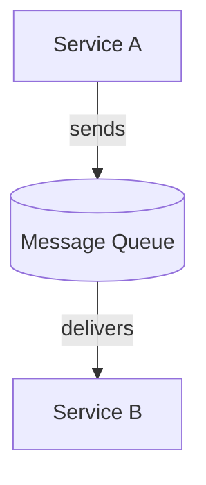
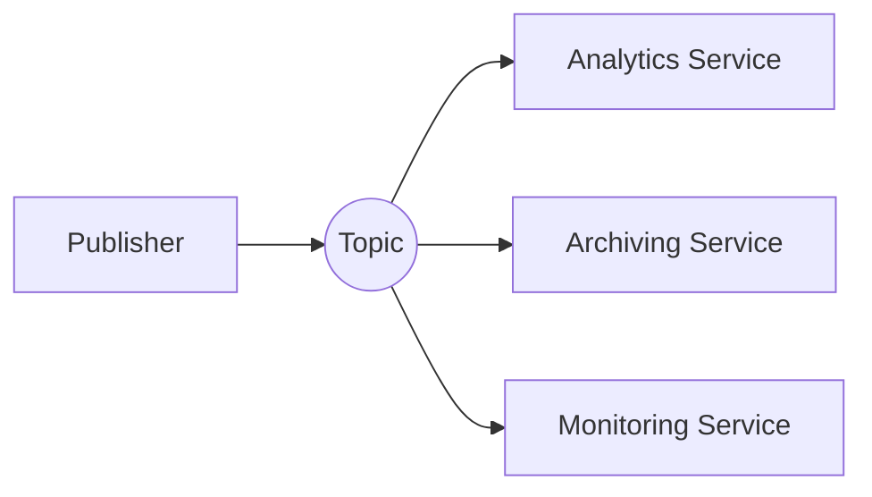
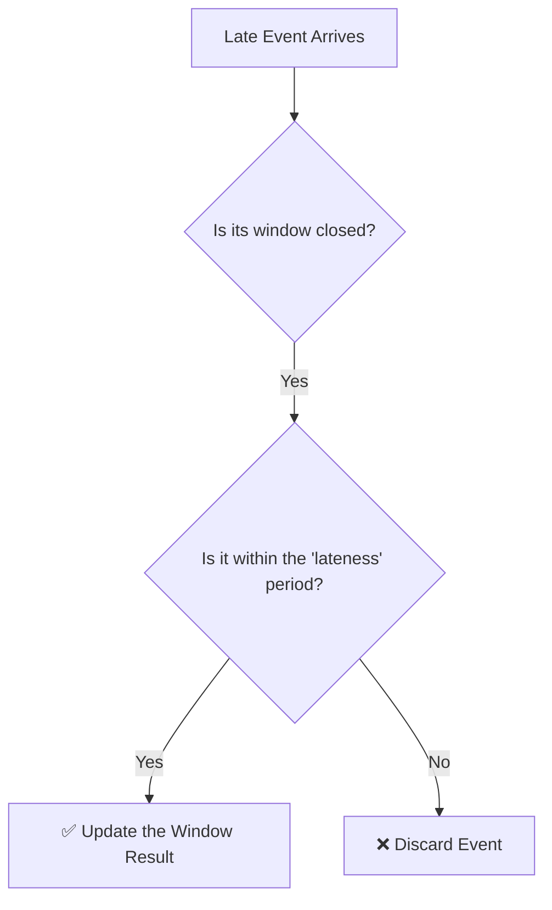
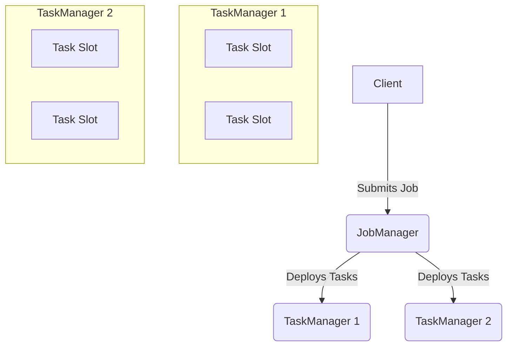

<style>
:root {
  /* IIT Bombay Inspired Theme */
  --iitb-blue: #004A99;
  --iitb-accent: #007bff;
  --iitb-light: #f8f9fa;
  --iitb-dark: #001f3f;

  /* Theme Colors */
  --slidev-theme-primary: var(--iitb-light);
  --slidev-theme-secondary: var(--iitb-accent);
  --slidev-theme-accent: var(--iitb-accent);
  --slidev-theme-background: linear-gradient(135deg, var(--iitb-dark) 0%, #002b5c 100%);
  --slidev-theme-foreground: var(--iitb-light);
  --slidev-code-background: rgba(13, 17, 23, 0.95);
  --slidev-code-foreground: #f0f6fc;
}

.slidev-layout {
  background: var(--slidev-theme-background);
  color: var(--slidev-theme-foreground);
}

/* Headers */
h1, h2, h3, h4 {
  color: var(--iitb-light);
  font-weight: 600;
  text-shadow: 1px 1px 3px rgba(0, 0, 0, 0.7);
}

h1 {
  color: #FFFFFF !important;
  border-bottom: 3px solid var(--iitb-accent);
  padding-bottom: 0.5rem;
  display: inline-block;
}

h2 {
  color: var(--iitb-accent);
}

/* General Text */
p, li {
  color: #e8e8e8;
  font-size: 1.25rem;
}

/* Links */
a {
  color: var(--iitb-accent);
  text-decoration: none;
  border-bottom: 2px solid var(--iitb-accent);
  transition: all 0.3s ease;
}

a:hover {
  color: #66b3ff;
  border-bottom-color: #66b3ff;
}

/* Code blocks */
pre {
  background: var(--slidev-code-background) !important;
  border: 2px solid var(--iitb-blue);
  border-radius: 8px;
}

/* Table styling */
table {
  width: 100%;
  background: rgba(0, 31, 63, 0.8);
  border-radius: 8px;
  overflow: hidden;
}

th {
  background: var(--iitb-blue);
  color: #FFFFFF;
  padding: 0.75rem;
}

td {
  padding: 0.75rem;
  border-top: 1px solid var(--iitb-blue);
}

/* Re-apply background image only on the first slide */
.slidev-layout.text-center {
  background: var(--slidev-theme-background);
}
</style>

<!-- Override style for the first slide -->
<div class="h-full flex flex-col justify-center items-center">
  <div style="color: white !important; text-shadow: 2px 2px 8px rgba(0,0,0,0.8);">
    <h1 style="color: white !important; font-size: 3.5rem; font-weight: 700; border-color: white;">Real-Time Click-Through Rate Analysis with Flink & Kafka</h1>
    <h3 style="color: white !important; margin-top: 1.5rem;">By Susmit Vengurlekar</h3>
  </div>
</div>

<!--
Welcome, everyone. Today we're diving into the world of real-time data to solve a critical business problem in digital advertising. We'll build a complete streaming pipeline from scratch.
-->

---
src: ./pages/disclaimer.md
---

---
src: ./pages/about.md
---
r
---

# Agenda
<div class="grid grid-cols-2 gap-8 mt-8 text-left">
  <div>
    <ol class="text-xl space-y-2">
      <li>The Problem: Why CTR Matters</li>
      <li>Why Real-Time? Batch vs. Streaming</li>
      <li>Foundational Pattern: Message Queuing</li>
      <li>Foundational Pattern: Pub-Sub</li>
      <li>Introduction to Apache Kafka</li>
      <li>Kafka Architecture: Built for Resilience</li>
      <li>Understanding Streams & Windows</li>
      <li>The Problem: Out-of-Order Events</li>
      <li>The Solution: Watermarks</li>
    </ol>
  </div>
  <div>
    <ol class="text-xl space-y-2" start="10">
      <li>The Refinement: Allowed Lateness</li>
      <li>Introduction to Apache Flink</li>
      <li>Flink Architecture: How it Works</li>
      <li>System Architecture</li>
      <li>Components</li>
      <li>PyFlink Logic Walkthrough</li>
      <li>Demo</li>
      <li>Q&A</li>
    </ol>
  </div>
</div>

<!--
Today, we're going on a journey. We'll start with the 'why'—the business problem. Then, we'll cover the fundamental building blocks like Kafka and the core concepts of stream processing. Finally, we'll dive into our specific Flink architecture and see it all come together in a live demo.
-->

---

# The Problem: The Pulse of Advertising

## Why Every Second Counts

<div class="text-5xl font-bold p-6 my-8 bg-slate-800 rounded-lg border-2 border-cyan-400">
  CTR = (Clicks / Impressions) * 100%
</div>

Businesses need real-time CTR to:
- 🚀 Optimize live campaigns
- 📉 Detect underperforming ads instantly
- 💰 Allocate budget effectively

<!--
In digital advertising, everything comes down to this simple formula: Click-Through Rate. It tells us how effective our ads are. Businesses need this number *now*, not tomorrow, to make critical decisions that directly impact their revenue. Waiting for an overnight batch job is simply too slow.
-->

---

# Why Real-Time? Batch vs. Streaming

<div class="grid grid-cols-2 gap-8 mt-12 text-center text-2xl">
  <div>
    <p class="text-6xl">🕒</p>
    <h3 class="mt-4">Batch Processing</h3>
    <p>The Past</p>
    <p class="text-xl opacity-80">Delayed Insights (Hours)</p>
    <p class="text-xl font-mono">"What happened?"</p>
  </div>
  <div>
    <p class="text-6xl">⚡</p>
    <h3 class="mt-4">Streaming Processing</h3>
    <p>The Present</p>
    <p class="text-xl opacity-80">Live Feedback Loop (Seconds)</p>
    <p class="text-xl font-mono">"What is happening now?"</p>
  </div>
</div>

<!--
This is the core difference. With batch, you're looking at a photograph of the past. You can react to what happened yesterday. With streaming, you're looking at a live video feed. You can adapt and optimize *as it happens*, creating a powerful feedback loop.
-->

---

# Foundational Pattern: Message Queuing

## One-to-One Communication

<div class="mt-8">



</div>

<p class="mt-8 text-2xl">
  <b>Analogy:</b> A Post Office Mailbox 📬
</p>
<p class="text-xl">
  Decouples services. The sender doesn't need to wait for the receiver.
</p>

<!--
Before we talk about Kafka, let's understand a basic pattern: message queuing. Think of it like a mailbox. Service A can drop off a message without waiting for Service B to be ready to pick it up. This decouples them and makes the system more resilient.
-->

---

# Foundational Pattern: Pub-Sub

## One-to-Many Broadcast

<div class="mt-8">



</div>

<p class="mt-8 text-2xl">
  <b>Analogy:</b> A Radio Broadcast 📻
</p>
<p class="text-xl">
  A single event can be consumed by many different services for different purposes.
</p>

<!--
The other key pattern is Publish-Subscribe. This is like a radio broadcast. A publisher sends a message to a topic, and any service that has 'tuned in' to that topic receives a copy. One message, many independent listeners.
-->

---

# Introduction to Apache Kafka

## The Central Nervous System for Data

<div class="grid grid-cols-2 gap-8 items-center mt-8">
  <div class="text-left">
    <h3>Key Features:</h3>
    <ul class="list-disc pl-8 mt-4 text-2xl">
      <li>Combines Queuing & Pub-Sub</li>
      <li>Distributed & Fault-Tolerant</li>
      <li>Immutable, Replayable Log</li>
    </ul>
  </div>
  <div>
    
  </div>
</div>

<!--
So where does Kafka fit in? It's a distributed streaming *platform* that gives us the best of both worlds. It acts as the reliable, scalable backbone for all real-time data moving through our system. It's not just a pipe; it's a durable storage system for streams.
-->

---

# Kafka Architecture: Built for Resilience

```mermaid
graph TD
    subgraph Topic: "Campaign Ads"
        direction LR
        P1["Partition 0 (Leader)<br/>Broker 1"]
        P1_R1["Partition 0 (Follower)<br/>Broker 2"]
        P1_R2["Partition 0 (Follower)<br/>Broker 3"]
        P1 -- "replicates to" --> P1_R1
        P1 -- "replicates to" --> P1_R2
    end
    Producer --> P1
    Consumer --> P1
```

- A topic is split into **Partitions** for parallelism.
- Each partition is replicated across multiple **Brokers** (servers).
- One replica is the **Leader** (handles reads/writes); others are **Followers**.
- If a Leader fails, a Follower is automatically elected as the new Leader.

<!--
This is why Kafka is so resilient. A topic is broken into partitions, and each partition is copied across multiple machines. If the machine hosting the leader fails, the system automatically fails over to a replica. This ensures zero data loss and high availability.
-->

---

# Understanding Streams & Windows

## Taming an Infinite Flow

<div class="mt-12 text-2xl">
  <p>An unbounded stream of events:</p>
  <p class="font-mono mt-2 tracking-widest">... ● ● ● ● ● ● ● ● ● ● ● ● ...</p>
  
  <v-click>
    <p class="mt-12">Windows create finite slices for aggregation:</p>
    <p class="font-mono mt-2 tracking-widest text-cyan-400">... [● ● ● ●] [● ● ● ●] [● ● ● ●] ...</p>
  </v-click>
</div>

<!--
A stream is, by definition, infinite. You can't just aggregate 'all' the events. So how do we analyze it? We apply a 'window'—a finite boundary, usually based on time. We're essentially creating micro-batches from the stream to perform calculations.
-->

---

# The Problem: Out-of-Order Events

## The Messiness of Reality

Events don't always arrive in the order they occurred due to network latency, device issues, etc.

<div class="p-4 mt-8 bg-slate-800 rounded font-mono text-lg text-center">
  <p>Actual Event Order: (10:02:59), (10:03:01)</p>
  <v-click>
    <p class="mt-4">Arrival Order at Processor:</p>
    <p class="text-yellow-400">Event @ 10:03:01 arrives</p>
    <p class="text-red-500">Event @ 10:02:59 arrives LATE!</p>
  </v-click>
</div>

<v-click>
<h3 class="mt-8">Question: How does our system know when a time window (e.g., 10:00-10:05) is "complete"?</h3>
</v-click>

<!--
In a perfect world, events arrive perfectly ordered. In the real world, they don't. This creates a huge problem: how does our system know it has received all the data for a specific time window before calculating the result?
-->

---

# The Solution: Watermarks

## Flink's Event-Time Clock

A **Watermark** is a special message in the stream that acts as a progress indicator.

<div class="p-6 mt-8 bg-slate-800 rounded text-2xl border-l-4 border-cyan-400">
  It is a declaration: <br/>
  <em class="text-cyan-400">"I am now confident all events before timestamp `T` have arrived."</em>
</div>

This allows Flink to safely close windows and emit results.

<!--
Flink solves this with watermarks. A watermark is a timestamp that essentially says, 'Okay, I've waited long enough for late data, it's safe to close the window for 10:00 to 10:05 and emit the result.' This allows Flink to make progress without waiting forever.
-->

---

# The Refinement: Allowed Lateness

## Handling Stragglers

**What if an event is *very* late and arrives after its window is closed?**

<div class="mt-8">



</div>

**Allowed Lateness:** A grace period that lets Flink accept late events and **update** the previously emitted result for that window.

<!--
But what if an event is exceptionally late? We can configure an 'allowed lateness' period. This tells Flink to keep the state for a window around for a bit longer. If a straggler arrives within this period, Flink will re-calculate and emit an updated result.
-->

---

# Introduction to Apache Flink

## The Brain of the Operation 🧠

**What is it?** A stateful stream processing framework.

<div class="mt-8 text-left pl-20">
  <h3>Superpowers:</h3>
  <ul class="list-disc pl-8 mt-4 text-2xl">
    <li><b>Stateful:</b> Remembers information across events (e.g., running counts).</li>
    <li><b>Exactly-Once Guarantees:</b> Ensures correctness, even with failures.</li>
    <li><b>PyFlink:</b> The powerful Python API we're using today.</li>
  </ul>
</div>

<!--
If Kafka is the nervous system, Flink is the brain. It's where the stateful computation happens. Its ability to maintain state reliably and guarantee exactly-once processing makes it ideal for our analytics workload.
-->

---

# Flink Architecture: How it Works


- **JobManager (The Brain):** Coordinates the entire job execution.
- **TaskManagers (The Muscle):** Worker processes that execute the actual data processing tasks in parallel **Slots**.

<!--
A Flink cluster consists of a coordinating JobManager and one or more TaskManagers that do the actual work. The JobManager takes our Python script, compiles it into a job graph, and distributes the parallel tasks to the available slots on the TaskManagers.
-->

---

# System Architecture

## The End-to-End Pipeline

```mermaid
graph TD
    subgraph Data Generation
        A[Go Producer]
    end
    subgraph Transport Layer
        B((Apache Kafka))
    end
    subgraph Real-Time Processing
        C[Apache Flink <br/> (PyFlink Job)]
    end
    subgraph Storage
        D[/File Sink (Results)/]
    end
    A -- "impressions, clicks" --> B;
    B -- "reads streams" --> C;
    C -- "writes CTR" --> D;
```
<p class="mt-4 text-center">Fully containerized with Docker Compose for easy deployment.</p>

<!--
Now let's put it all together for our project. This is the complete data flow, from generation to storage, orchestrated by our key technologies. The entire system runs inside Docker containers, making it portable and easy to run.
-->

---

# Components

## A Look Under the Hood

<div class="grid grid-cols-2 gap-6 mt-8 text-left">
  <div class="p-4 bg-slate-800 rounded-lg">
    <h3 class="text-cyan-400">Go Producer</h3>
    <p>Generates synthetic impressions & clicks with realistic random delays.</p>
  </div>
  <div class="p-4 bg-slate-800 rounded-lg">
    <h3 class="text-cyan-400">Apache Kafka</h3>
    <p>Acts as a durable buffer, ingesting events on `impressions` and `clicks` topics.</p>
  </div>
  <div class="p-4 bg-slate-800 rounded-lg">
    <h3 class="text-cyan-400">PyFlink Job</h3>
    <p>The core logic: joins streams, applies windows, and calculates CTR.</p>
  </div>
  <div class="p-4 bg-slate-800 rounded-lg">
    <h3 class="text-cyan-400">File Sink</h3>
    <p>Persists the final results to the filesystem with exactly-once guarantees.</p>
  </div>
</div>

<!--
Let's zoom in on each part. The producer is our data simulator. Kafka is our highly-available message bus. The Flink job is where the magic happens. And the File Sink is our destination, ensuring results are saved reliably.
-->

---

# PyFlink Logic Walkthrough

<div class="text-left mt-8 pl-12">
  <ol class="text-2xl space-y-4">
    <li><span class="text-cyan-400">1. Source:</span> Read from Kafka `impressions` and `clicks` topics.</li>
    <li><span class="text-cyan-400">2. Interval Join:</span> Match clicks to impressions if `impr_id` matches AND the click occurs within 15 seconds.</li>
    <li><span class="text-cyan-400">3. Window:</span> Group matched pairs into 30-second Tumbling Windows by `campaign_id`.</li>
    <li><span class="text-cyan-400">4. Aggregate:</span> For each window, count impressions, count clicks, and calculate `CTR`.</li>
    <li><span class="text-cyan-400">5. Sink:</span> Write the results to a CSV file.</li>
  </ol>
</div>

<!--
Inside the Flink job, we follow these logical steps. We source the data, then perform an interval join—this is crucial for correctly attributing a click to an impression. After that, we window the data, run our aggregations, and sink the final result.
-->

---

# Demo

## Let's See It in Action!

<div class="grid grid-cols-2 gap-8 items-center mt-8">
  <div class="text-left">
    <h3>Let's Run It!</h3>
    <ol class="list-decimal pl-6 mt-4 text-xl space-y-3">
      <li>
        <b>Start Pipeline:</b>
        <pre><code class="text-sm">bash run_demo.sh</code></pre>
      </li>
      <li>
        <b>Monitor Flink UI:</b>
        <a href="http://localhost:8081" target="_blank">http://localhost:8081</a>
      </li>
      <li>
        <b>View Live Results:</b>
        <pre><code class="text-sm">python read_results.py</code></pre>
      </li>
    </ol>
  </div>
  <div class="text-center">
    
    <p class="mt-4">
      <a href="https://github.com/susmitpy/stream_analytics_adtech_ctr" target="_blank">
        github.com/susmitpy/stream_analytics_adtech_ctr
      </a>
    </p>
  </div>
</div>

<!--
Now for the fun part. You can run this entire pipeline on your own machine with a single command. I'm going to kick it off now. We'll see the producer start sending data, and then we'll switch to the Flink UI to watch the job graph process it in real-time. You can follow along by scanning this QR code.
-->

---
src: ./pages/connect.md
---

---
src: ./pages/qa.md
---
