<!-- Override style for the first slide -->

  

    <h1 style="color: white !important; font-size: 3.5rem; font-weight: 700; border-color: white;">Real-Time Click-Through Rate Analysis with Flink & Kafka</h1>
    <h3 style="color: white !important; margin-top: 1.5rem;">By Susmit Vengurlekar</h3>
  

<!--
Welcome, everyone. Today we're diving into the world of real-time data to solve a critical business problem in digital advertising. We'll build a complete streaming pipeline from scratch.
-->

---
src: ./pages/disclaimer.md
---

---
src: ./pages/about.md
---
r
---

# Agenda

  

    <ol class="text-xl space-y-2">
      <li>The Problem: Why CTR Matters</li>
      <li>Why Real-Time? Batch vs. Streaming</li>
      <li>Foundational Pattern: Message Queuing</li>
      <li>Foundational Pattern: Pub-Sub</li>
      <li>Introduction to Apache Kafka</li>
      <li>Kafka Architecture: Built for Resilience</li>
      <li>Understanding Streams & Windows</li>
      <li>The Problem: Out-of-Order Events</li>
      <li>The Solution: Watermarks</li>
    </ol>
  

  

    <ol class="text-xl space-y-2" start="10">
      <li>The Refinement: Allowed Lateness</li>
      <li>Introduction to Apache Flink</li>
      <li>Flink Architecture: How it Works</li>
      <li>System Architecture</li>
      <li>Components</li>
      <li>PyFlink Logic Walkthrough</li>
      <li>Demo</li>
      <li>Q&A</li>
    </ol>
  

<!--
Today, we're going on a journey. We'll start with the 'why'—the business problem. Then, we'll cover the fundamental building blocks like Kafka and the core concepts of stream processing. Finally, we'll dive into our specific Flink architecture and see it all come together in a live demo.
-->

---

# The Problem: The Pulse of Advertising

## Why Every Second Counts

  CTR = (Clicks / Impressions) * 100%

  Businesses need real-time CTR to:

- 🚀 Optimize live campaigns
- 📉 Detect underperforming ads instantly
- 💰 Allocate budget effectively

<!--
In digital advertising, everything comes down to this simple formula: Click-Through Rate. It tells us how effective our ads are. Businesses need this number *now*, not tomorrow, to make critical decisions that directly impact their revenue. Waiting for an overnight batch job is simply too slow.
-->

---

# Why Real-Time? Batch vs. Streaming

  

    
🕒

    Batch Processing
    
The Past

    
Delayed Insights (Hours)

    
"What happened?"

  

  

    
⚡

    Streaming Processing
    
The Present

    
Live Feedback Loop (Seconds)

    
"What is happening now?"

  

<!--
This is the core difference. With batch, you're looking at a photograph of the past. You can react to what happened yesterday. With streaming, you're looking at a live video feed. You can adapt and optimize *as it happens*, creating a powerful feedback loop.
-->

---
layout: two-cols-header
---

# Foundational Pattern: Message Queuing

## One-to-One Communication

::left::

::right::

  <b>Analogy:</b> A Post Office Mailbox 

  Decouples services. The sender doesn't need to wait for the receiver.

<!--
Before we talk about Kafka, let's understand a basic pattern: message queuing. Think of it like a mailbox. Service A can drop off a message without waiting for Service B to be ready to pick it up. This decouples them and makes the system more resilient.
-->

---
layout: two-cols-header
---

# Foundational Pattern: Pub-Sub

## One-to-Many Broadcast

::left::

::right::

  <b>Analogy:</b> A Radio Broadcast 📻

  A single event can be consumed by many different services for different purposes.

<!--
The other key pattern is Publish-Subscribe. This is like a radio broadcast. A publisher sends a message to a topic, and any service that has 'tuned in' to that topic receives a copy. One message, many independent listeners.
-->

---

# Introduction to Apache Kafka

## The Holding Area for Data

  

    Key Features:
    <ul class="list-disc pl-8 mt-4">
      <li>Combines Queuing & Pub-Sub</li>
      <li>Distributed & Fault-Tolerant</li>
      <li>Immutable, Replayable Log</li>
    </ul>
  

  

    
  

<!--
So where does Kafka fit in? It's a distributed streaming *platform* that gives us the best of both worlds. It acts as the reliable, scalable backbone for all real-time data moving through our system. It's not just a pipe; it's a durable storage system for streams.
-->

---

# Partition Replication

---
layout: two-cols-header
---

# Kafka Architecture: Built for Resilience

::left::

::right::

<ul class="text-2xl space-y-4">
  <li>A topic is split into <b>Partitions</b> for parallelism.</li>
  <li>Each partition is replicated across multiple <b>Brokers</b> (servers).</li>
  <li>One replica is the <b>Leader</b> (handles reads/writes); others are <b>Followers</b>.</li>
  <li>If a Leader fails, a Follower is automatically elected as the new Leader.</li>
</ul>

<!--
This is why Kafka is so resilient. A topic is broken into partitions, and each partition is copied across multiple machines. If the machine hosting the leader fails, the system automatically fails over to a replica. This ensures zero data loss and high availability.
-->

---

# Consumer Groups

## A partition can only be read by one consumer in a group

---

# What is a Stream

  

  <v-click>
    

      <h2 class="text-lg font-semibold mb-2">Nature's Stream</h2>
      
    

    </v-click>
    <v-click>
    

      <h2 class="text-lg font-semibold mb-2">Data Stream</h2>
      
    

    </v-click>
  

  <!-- Footer Text -->
  <v-after>
  <h4 class="mt-4 text-center text-sm font-medium">
    Not all streams are the same
  </h4>
  </v-after>

---

# Understanding Streams & Windows

## Taming an Infinite Flow

  
An unbounded stream of events:

  
... ● ● ● ● ● ● ● ● ● ● ● ● ...

   
  
  <v-click>
    
Windows create finite slices for aggregation:

    
... [● ● ● ●] [● ● ● ●] [● ● ● ●] ...

  </v-click>

<!--
A stream is, by definition, infinite. You can't just aggregate 'all' the events. So how do we analyze it? We apply a 'window'—a finite boundary, usually based on time. We're essentially creating micro-batches from the stream to perform calculations.
-->

---

# Types of Windows

## Slicing by Fixed Time vs. User Activity

  <!-- Tumbling Window -->
  

    <h3>Tumbling</h3>
    <pre class="text-2xl text-cyan-400 mt-4"><code>[● ● ●] [● ● ●]</code></pre>
    
Fixed-size, non-overlapping chunks of time.

    

    
<b>Use Case:</b> A report of total clicks every 30 seconds.

  

  <!-- Session Window -->
  

    <h3>Session</h3>
    <pre class="text-2xl text-cyan-400 mt-4"><code>[● ●]   [● ● ● ●]</code></pre>
    
Groups events by activity, closes after an inactivity gap.

    

    
<b>Use Case:</b> Analyzing a user's entire visit to a website until they go idle.

  

<!--

Let's look at two fundamentally different ways to slice a stream.

On the left, we have **Tumbling Windows**, which is what we'll use in our demo. Think of these as perfectly even, separate chunks. Each event belongs to exactly one window. They're perfect for simple, periodic reports, like counting clicks every 30 seconds.

On the right, we have **Session Windows**, which are completely different. They aren't based on clock time at all. Instead, they group events together based on user activity. The window stays open as long as events keep coming and only closes after a defined period of inactivity. This is perfect for understanding user behavior within a single visit.

-->

---

# Types of Windows

## Analyzing Rolling Time Frames

  <!-- Hopping Window -->
  

    <h3>Hopping</h3>
    <pre class="text-2xl text-cyan-400 mt-4"><code>[● ● ● ●]   [● ● ● ●]</code></pre>
    
Triggered by a fixed **TIME** interval (the 'hop').

    

    
<b>Use Case:</b> A dashboard showing sales in the last 10 minutes, updated every 5 minutes.

  

  <!-- Sliding Window -->
  

    <h3>Sliding</h3>
    <pre class="text-xl text-cyan-400 mt-4"><code>[● ● ● ●]   [○ ● ● ● ●]</code></pre>
    
Triggered by a new **EVENT** arriving.

    

    
<b>Use Case:</b> A real-time alert if a user makes 5 purchases in the last 1 minute.

  

<!--
Now let's look at windows that overlap. The key difference is what *triggers* the update.

A **Hopping Window** is driven by **time**. Think of a clock on the wall. Every 5 minutes, it tells the system: "Okay, time's up! Calculate a result for the last 10 minutes." The computation happens at a fixed, predictable rhythm, making it great for periodic dashboard updates.

A **Sliding Window**, on the other hand, is driven by **events**. The window moves forward *every time a new event arrives*. When a new event comes in, the oldest event in the window is pushed out. This provides a truly continuous, always-up-to-date view, which is perfect for systems that need to react instantly, like fraud detection or real-time alerting.
-->

---

# Introduction to Apache Flink

## The Brain of the Operation 🧠

**What is it?** A stateful stream processing framework.

  Superpowers:
  <ul class="list-disc pl-8 mt-4">
    <li><b>Stateful:</b> Remembers information across events (e.g., running counts).</li>
    <li><b>Exactly-Once Guarantees:</b> Ensures correctness, even with failures.</li>
    <li><b>PyFlink:</b> The powerful Python API we're using today.</li>
  </ul>

<!--
If Kafka is the nervous system, Flink is the brain. It's where the stateful computation happens. Its ability to maintain state reliably and guarantee exactly-once processing makes it ideal for our analytics workload.
-->

---

# Flink Architecture: How it Works

- **JobManager (The Brain):** Coordinates the entire job execution.
- **TaskManagers (The Muscle):** Worker processes that execute the actual data processing tasks in parallel **Slots**.

<!--
A Flink cluster consists of a coordinating JobManager and one or more TaskManagers that do the actual work. The JobManager takes our Python script, compiles it into a job graph, and distributes the parallel tasks to the available slots on the TaskManagers.
-->

---

# Recap of Kafka Example

---

# How Flink reads from Kafka

```mermaid
flowchart LR
  KA[(Kafka Partition A–M)] --> S1[Source Subtask #1]
  KB[(Kafka Partition N–Z)] --> S2[Source Subtask #2]

  S1 -->|map/filter| S1a[Parallel stream]
  S2 -->|map/filter| S2a[Parallel stream]

  S1a -->|keyBy userId| KX[Keyed Operator\n window/agg/join p=2]
  S2a -->|keyBy userId| KX

  KX --> OUT[(Sink / Dashboard / DB)]
```

---

# The Problem: Out-of-Order Events

## The Messiness of Reality

Events don't always arrive in the order they occurred due to network latency, device issues, etc

  
Actual Event Order (10:00:00 - 10:05:00 window): (10:02:59), (10:03:01)

  <v-click>
    
Arrival Order at Processor:

    
Event @ 10:03:01 arrives

    
Event @ 10:02:59 arrives LATE!

  </v-click>

<v-click>
<h3 class="mt-8">Question: How does our system know when a time window (e.g., 10:00-10:05) is "complete"?</h3>
</v-click>

<!--
In a perfect world, events arrive perfectly ordered. In the real world, they don't. This creates a huge problem: how does our system know it has received all the data for a specific time window before calculating the result?
-->

---

# The Solution: Watermarks

## Flink's Event-Time Clock

A **Watermark** is a special message in the stream that acts as a progress indicator.

  It is a declaration:  
  <em class="text-cyan-400">"I am now confident all events before timestamp `T` have arrived."</em>

This allows Flink to safely close windows and emit results.

<v-click>

Watermark is defined to be 10 seconds behind the latest event time

  WATERMARK FOR event_time AS event_time - INTERVAL '10' SECOND

</v-click>

<!--
Flink solves this with watermarks. A watermark is a timestamp that essentially says, 'Okay, I've waited long enough for late data, it's safe to close the window for 10:00 to 10:05 and emit the result.' This allows Flink to make progress without waiting forever. For example, in our code, we can define a watermark that lags 10 seconds behind the maximum event time we've seen.
-->

---

# Watermarks in Action: The Flow of Time

## Let’s trace a few events with a 10-second watermark delay and a 30-second tumbling window (`10:00:00 – 10:00:30`)

| Event  | Event Time | Processing Time | Max Event Time | Current Watermark (= maxET − 10 s) | System Action                                        |
| :----- | :--------- | :-------------- | :------------- | :--------------------------------- | :--------------------------------------------------- |
| **E1** | 10:00:15   | 10:00:16        | 10:00:15       | **10:00:05**                       | Buffer E1 (assign to window 00-30)                   |
| **E2** | 10:00:25   | 10:00:26        | 10:00:25       | **10:00:15**                       | Buffer E2; watermark advances                        |
| **E3** | 10:00:18   | 10:00:27        | 10:00:25       | **10:00:15**                       | Buffer E3; watermark holds                 |
| **E4** | 10:00:42   | 10:00:43        | 10:00:42       | **10:00:32**                       | ✅ **Trigger window 00-30**; Buffer E4 in next window |

---

# What if the Stream Stops? Idle Source Problem

No new events ➞ No new watermarks ➞ Stuck windows & no results!

  <!-- Solution A: The Flink Way -->
  

    Solution A: Configure Idleness in Flink
    
Flink can detect when a source partition is idle and automatically advance its watermark.

    

      <pre><code>WatermarkStrategy
  .forBoundedOutOfOrderness(...)
  .withIdleness(Duration.ofMinutes(1));</code></pre>
    

    

    
<b>Best for:</b> Simplicity. The logic is self-contained within the Flink job, requiring no changes to the data producer.

  

  <!-- Solution B: The Producer Way -->
  

    Solution B: Send Heartbeat Messages
    
The data producer sends periodic dummy messages with a current timestamp to keep watermarks flowing.

    

    
<b>Best for:</b> Portability. This pattern works with any stream processing engine, not just Flink.

  

<!--
So, watermarks are great, but they have a critical dependency: they only advance when new events arrive. What happens if our ad campaign goes quiet for a few minutes and there are no new impressions or clicks? Our windows will get stuck and we'll never see a result for that period.

There are two excellent ways to solve this.

First, the easiest way is directly in Flink. We can configure our source to detect 'idleness'. If it doesn't see a new message on a partition for, say, one minute, it will automatically advance the watermark for us. It's a simple, powerful configuration.

Another very robust approach is to solve this at the source. We can modify our Go producer to send a 'heartbeat' message every 30 seconds, even if there are no real events. This dummy message contains a current timestamp, and its only job is to keep the watermarks flowing through the system.

The choice between these depends on your architecture. The Flink solution is quick and self-contained. The heartbeat solution is more portable if you ever switch processing engines.
-->

---

# Allowed Lateness

## Handling Stragglers

**What if an event is *very* late and arrives after its window is closed?**

```mermaid
graph LR
    A[Late Event Arrives] --> B{Is its window closed?};
    B -- Yes --> C{Is it within the 'lateness' period?};
    C -- Yes --> D[✅ Update the Window Result];
    C -- No --> E[❌ Discard Event];
```

**Allowed Lateness:** A grace period that lets Flink accept late events and **update** the previously emitted result for that window. Works only for retractable sinks.

<!--
But what if an event is exceptionally late? We can configure an 'allowed lateness' period. This tells Flink to keep the state for a window around for a bit longer. If a straggler arrives within this period, Flink will re-calculate and emit an updated result.
-->

---

# System Architecture

## The End-to-End Pipeline

 

<!--
Now let's put it all together for our project. This is the complete data flow, from generation to storage, orchestrated by our key technologies. The entire system runs inside Docker containers, making it portable and easy to run.
-->

---

# Components

## A Look Under the Hood

  

    <h3 class="text-cyan-400">Go Producer</h3>
    
Generates synthetic impressions & clicks with realistic random delays.

  

  

    <h3 class="text-cyan-400">Apache Kafka</h3>
    
Acts as a durable buffer, ingesting events on `impressions` and `clicks` topics.

  

  

    <h3 class="text-cyan-400">PyFlink Job</h3>
    
The core logic: joins streams, applies windows, and calculates CTR.

  

  

    <h3 class="text-cyan-400">File Sink</h3>
    
Persists the final results to the filesystem with exactly-once guarantees.

  

<!--
Let's zoom in on each part. The producer is our data simulator. Kafka is our highly-available message bus. The Flink job is where the magic happens. And the File Sink is our destination, ensuring results are saved reliably.
-->

---

# PyFlink Logic Walkthrough

  <ol class="text-2xl space-y-4">
    <li>Source: Read from Kafka `impressions` and `clicks` topics.</li>
    <li>Interval Join: Match clicks to impressions if `impr_id` matches AND the click occurs within 15 seconds.</li>
    <li>Window: Group matched pairs into 30-second Tumbling Windows by `campaign_id`.</li>
    <li>Aggregate: For each window, count impressions, count clicks, and calculate `CTR`.</li>
    <li>Sink: Write the results to a partitioned CSV file.</li>
  </ol>

<!--
Inside the Flink job, we follow these logical steps. We source the data, then perform an interval join—this is crucial for correctly attributing a click to an impression. After that, we window the data, run our aggregations, and sink the final result.
-->

---

# Demo

## Let's See It in Action!

  

    <h3>Let's Run It!</h3>
    <ol class="list-decimal pl-6 mt-4 text-xl space-y-3">
      <li>
        <b>Start Pipeline:</b>
        <pre><code class="text-sm">sh run_demo.sh</code></pre>
      </li>
      <li>
        <b>Monitor Flink UI:</b>
        <a href="http://localhost:8081" target="_blank"> http://localhost:8081</a>
      </li>
      <li>
        <b>View Results:</b>
        <pre><code class="text-sm">python read_results.py</code></pre>
      </li>
    </ol>
  

  

    
    

      <a href="https://github.com/susmitpy/stream_analytics_adtech_ctr" target="_blank">
        github.com/susmitpy/stream_analytics_adtech_ctr
      </a>
    

  

<!--
Now for the fun part. You can run this entire pipeline on your own machine with a single command. I'm going to kick it off now. We'll see the producer start sending data, and then we'll switch to the Flink UI to watch the job graph process it in real-time. You can follow along by scanning this QR code.
-->

---
src: ./pages/connect.md
---

---
src: ./pages/qa.md
---
