<!-- Override style for the first slide -->

  

    <h1 style="color: white !important; font-size: 3.5rem; font-weight: 700; border-color: white;">Real-Time Click-Through Rate Analysis with Flink & Kafka</h1>
    <h3 style="color: white !important; margin-top: 1.5rem;">By Susmit Vengurlekar</h3>
  

<!---
1. "Hello everyone, and welcome. My name is Susmit Vengurlekar."
2. "Today, we're going to dive into a fascinating and highly practical topic: building a system for real-time Click-Through Rate analysis using some of the most powerful tools in the data streaming world: Apache Flink and Apache Kafka."
3. "We'll see how we can go from a continuous stream of user impressions and clicks to live, actionable business insights."
-->

---
src: ./pages/disclaimer.md
---

---
src: ./pages/about.md
---

---

# Agenda

  

    <ol class="text-xl space-y-2">
      <li>The Problem: Why CTR Matters</li>
      <li>Why Real-Time? Batch vs. Streaming</li>
      <li>Foundational Patterns: Queuing & Pub-Sub</li>
      <li>Introduction to Apache Kafka</li>
      <li>Kafka Architecture: Resilience & Parallelism</li>
      <li>Understanding Streams & Windows</li>
      <li>Introduction to Apache Flink</li>
      <li>Flink Architecture: How it Works</li>
    </ol>
  

  

    <ol class="text-xl space-y-2" start="9">
      <li>The Problem: Out-of-Order Events</li>
      <li>The Solution: Watermarks</li>
      <li>Handling Idle Streams</li>
      <li>Allowed Lateness</li>
      <li>System Architecture</li>
      <li>Components</li>
      <li>PyFlink Logic Walkthrough</li>
      <li>Demo</li>
      <li>Q&A</li>
    </ol>
  

<!---
1. "Here's our roadmap for today. We'll start with the 'why' – understanding the business problem of CTR."
2. "Then, we'll build up our technical foundation, starting with core patterns like message queues and pub-sub, which will lead us directly into Apache Kafka."
3. "Next, we'll get into the heart of stream processing, talking about streams, windows, and how to handle the complexities of real-world data with Flink's watermarking system."
4. "Finally, we'll put it all together, look at the system architecture, walk through the code logic, and see a live demo. We'll wrap up with a Q&A."
-->

---

# The Problem: The Pulse of Advertising

## Why Every Second Counts

  CTR = (Clicks / Impressions) * 100%

  Businesses need real-time CTR to:

- 🚀 Optimize live campaigns
- 📉 Detect underperforming ads instantly
- 💰 Allocate budget effectively

<!---
1. "So, what problem are we trying to solve? At the core of online advertising is a simple but vital metric: the Click-Through Rate, or CTR."
2. "It's the percentage of people who saw an ad (an impression) and actually clicked on it. The formula is simple: Clicks divided by Impressions."
3. "But the *timing* of this metric is critical. Businesses can't wait hours or days for this data. They need to know *right now* if a campaign is working to optimize ad spend, pull underperforming ads, and react to market changes instantly."
-->

---

# Why Real-Time? Batch vs. Streaming

  

    
🕒

    Batch Processing
    
The Past

    
Delayed Insights (Hours)

    
"What happened?"

  

  

    
⚡

    Streaming Processing
    
The Present

    
Live Feedback Loop (Seconds)

    
"What is happening now?"

  

<!---
1. "This need for immediacy highlights a fundamental shift in data processing."
2. "Historically, we used Batch Processing. We'd collect data over a period—like a day—and then run a big job overnight. This answers the question, 'What happened yesterday?' It's historical analysis."
3. "Streaming Processing, on the other hand, analyzes data as it arrives, moment by moment. It gives us a live feedback loop, answering the question, 'What is happening *right now*?' This allows us to be proactive instead of reactive."
-->

---
layout: two-cols-header
---

# Foundational Pattern: Message Queuing

## One-to-One Communication

::left::

::right::

  <b>Analogy:</b> A Post Office Mailbox 

  Decouples services. The sender doesn't need to wait for the receiver.

<!---
1. "To build a streaming system, we need a way for different services to communicate reliably. The first foundational pattern is the Message Queue."
2. "Think of it like a post office mailbox. A producer service sends a message to the queue and can immediately move on. It doesn't need to know if the consumer is ready or even online."
3. "Later, a consumer service comes and picks up the message. This decouples the services, making the whole system more resilient. It’s a one-to-one communication channel."
-->

---
layout: two-cols-header
---

# Foundational Pattern: Pub-Sub

## One-to-Many Broadcast

::left::

::right::

  <b>Analogy:</b> A Radio Broadcast 📻

  A single event can be consumed by many different services for different purposes.

<!---
1. "The second key pattern is Publish-Subscribe, or Pub-Sub. This is a one-to-many broadcast model."
2. "The analogy here is a radio station. A publisher broadcasts a message to a central 'topic', not to any specific receiver."
3. "Multiple subscribers can then tune into that topic to receive a copy of the message. This is incredibly powerful because the same event—like a user click—can be used by an analytics service, an archiving service, and a monitoring service simultaneously, without them knowing about each other."
-->

---

# Introduction to Apache Kafka

## The Holding Area for Data

  

    Key Features:
    <ul class="list-disc pl-8 mt-4">
      <li>Combines Queuing & Pub-Sub</li>
      <li>Distributed & Fault-Tolerant</li>
      <li>Immutable, Replayable Log</li>
    </ul>
  

  

    
  

<!---
1. "So, where does Apache Kafka fit in? Kafka is a distributed streaming platform that brilliantly combines both of these patterns."
2. "It allows for both point-to-point delivery like a queue and broadcast capabilities like pub-sub. But its real power comes from being a distributed, fault-tolerant, and replayable log."
3. "This means data is stored safely across multiple machines, and if something goes wrong, you can 'replay' the data stream. It’s the perfect backbone for a reliable real-time pipeline."
-->

---

# Partition Replication

<!---
1. "Let's quickly visualize how Kafka achieves its fault tolerance. This slide shows a core concept: replication."
2. "Kafka doesn't just store data in one place; it makes copies of it across different servers, which it calls brokers."
3. "We'll see on the next slide how this leader-and-follower model prevents data loss."
-->

---
layout: two-cols-header
---

# Kafka Architecture: Built for Resilience

::left::

::right::

<ul class="text-2xl space-y-4">
  <li>A topic is split into <b>Partitions</b> for parallelism.</li>
  <li>Each partition is replicated across multiple <b>Brokers</b> (servers).</li>
  <li>One replica is the <b>Leader</b> (handles reads/writes); others are <b>Followers</b>.</li>
  <li>If a Leader fails, a Follower is automatically elected as the new Leader.</li>
</ul>

<!---
1. "Let's break that down. A single data feed in Kafka is called a Topic. For performance, a topic is split into multiple Partitions."
2. "Each partition is then replicated across several servers, or Brokers. One of these replicas is elected the 'Leader'—it handles all the new data."
3. "The other replicas are 'Followers' that just copy the leader. The magic is, if the leader's server fails, Kafka automatically elects one of the followers to become the new leader. This makes the system incredibly resilient to hardware failure."
-->

---

# Consumer Groups

## A partition can only be read by one consumer in a group

<!---
1. "Kafka also gives us massive scalability on the reading side using a concept called Consumer Groups."
2. "You can have multiple instances of your application running, all belonging to the same group. Kafka ensures that each partition is consumed by exactly ONE consumer within that group."
3. "This means if you have a topic with 4 partitions, you can run up to 4 instances of your service to process the data in parallel. If you need to re-process the data for a different purpose, you just create a *new* consumer group, as shown here with the 'Archiving' group."
-->

---

# What is a Stream

  

  <v-click>
    

      <h2 class="text-lg font-semibold mb-2">Nature's Stream</h2>
      
    

    </v-click>
    <v-click>
    

      <h2 class="text-lg font-semibold mb-2">Data Stream</h2>
      
    

    </v-click>
  

  <!-- Footer Text -->
  <v-after>
  <h4 class="mt-4 text-center text-sm font-medium">
    Not all streams are the same
  </h4>
  </v-after>

<!---
1. "So we've talked about the pipes—Kafka—now let's talk about what flows through them: streams."
2. "On the left, we have a stream in nature: a continuous, unbounded flow of water. On the right, a data stream: a continuous, unbounded flow of events."
3. "The key takeaway is that, unlike a file or a database table, a stream has no end. And we need special techniques to handle this infinite nature."
-->

---

# Understanding Streams & Windows

## Taming an Infinite Flow

  
An unbounded stream of events:

  
... ● ● ● ● ● ● ● ● ● ● ● ● ...

   
  
  <v-click>
    
Windows create finite slices for aggregation:

    
... [● ● ● ●] [● ● ● ●] [● ● ● ●] ...

  </v-click>

<!---
1. "So, how do you perform calculations like 'count' or 'average' on an infinite stream? You can't. The number would just go up forever."
2. "The solution is to impose boundaries. We create finite, manageable slices of the stream called 'windows'."
3. "By doing this, we can change the question from 'How many clicks have happened ever?' to 'How many clicks happened in the last 30 seconds?' This is the fundamental concept behind nearly all stream processing."
-->

---

# Types of Windows

## Slicing by Fixed Time vs. User Activity

  <!-- Tumbling Window -->
  

    <h3>Tumbling</h3>
    <pre class="text-2xl text-cyan-400 mt-4"><code>[● ● ●] [● ● ●]</code></pre>
    
Fixed-size, non-overlapping chunks of time.

    

    
<b>Use Case:</b> A report of total clicks every 30 seconds.

  

  <!-- Session Window -->
  

    <h3>Session</h3>
    <pre class="text-2xl text-cyan-400 mt-4"><code>[● ●]   [● ● ● ●]</code></pre>
    
Groups events by activity, closes after an inactivity gap.

    

    
<b>Use Case:</b> Analyzing a user's entire visit to a website until they go idle.

  

<!---
1. "There are several ways to create these windows. Let's look at two common types."
2. "On the left are **Tumbling Windows**, which are what we'll use in our demo. They are fixed-size, non-overlapping chunks. Think of them as a perfect grid slicing up time. An event belongs to exactly one window."
3. "On the right are **Session Windows**, which are defined by user activity. A window opens when a user does something and closes only after a period of inactivity. This is great for analyzing a user's entire visit as a single unit."
-->

---

# Types of Windows

## Analyzing Rolling Time Frames

  <!-- Hopping Window -->
  

    <h3>Hopping</h3>
    <pre class="text-2xl text-cyan-400 mt-4"><code>[● ● ● ●]   [● ● ● ●]</code></pre>
    
Triggered by a fixed **TIME** interval (the 'hop').

    

    
<b>Use Case:</b> A dashboard showing sales in the last 10 minutes, updated every 5 minutes.

  

  <!-- Sliding Window -->
  

    <h3>Sliding</h3>
    <pre class="text-xl text-cyan-400 mt-4"><code>[● ● ● ●]   [○ ● ● ● ●]</code></pre>
    
Triggered by a new **EVENT** arriving.

    

    
<b>Use Case:</b> A real-time alert if a user makes 5 purchases in the last 1 minute.

  

<!---
1. "We can also have windows that overlap. The key difference between these two is what *triggers* the calculation."
2. "A **Hopping Window** is time-triggered. It has a size (e.g., 10 minutes) and a 'hop' (e.g., 5 minutes). Every 5 minutes, a new window is created covering the last 10 minutes of data. This is perfect for dashboards."
3. "A **Sliding Window**, however, is event-triggered. A window of a fixed size moves with each new event. This is ideal for things that require an immediate reaction, like detecting if a user made 5 purchases in the last 1 minute."
-->

---

# Introduction to Apache Flink

## The Brain of the Operation 🧠

**What is it?** A stateful stream processing framework.

  Superpowers:
  <ul class="list-disc pl-8 mt-4">
    <li><b>Stateful:</b> Remembers information across events (e.g., running counts).</li>
    <li><b>Exactly-Once Guarantees:</b> Ensures correctness, even with failures.</li>
    <li><b>PyFlink:</b> The powerful Python API we're using today.</li>
  </ul>

<!---
1. "If Kafka is the circulatory system of our pipeline, Apache Flink is the brain. It's the engine that will actually perform our windowed calculations."
2. "Flink is a true stream processing framework, and its superpowers are threefold."
3. "First, it's **Stateful**. It can remember things, like the running count of clicks in a window. Second, it provides **Exactly-Once Guarantees**, which is a fancy way of saying it's extremely accurate and won't miscount data even if machines fail. And finally, it has a fantastic Python API called **PyFlink**, which is what we'll be using."
-->

---

# Flink Architecture: How it Works

- **JobManager (The Brain):** Coordinates the entire job execution.
- **TaskManagers (The Muscle):** Worker processes that execute the actual data processing tasks in parallel **Slots**.

<!---
1. "At a high level, a Flink cluster has two types of components."
2. "The **JobManager** is the brain. It receives your code, figures out how to execute it, and coordinates the whole process."
3. "The **TaskManagers** are the muscle. They are the worker nodes that actually run your code on the data. Each TaskManager has multiple 'Slots', allowing it to perform several tasks in parallel."
-->

---

# Recap of Kafka Example

<!---
1. "Just to quickly remind you of the Kafka consumer group model we saw earlier..."
2. "We have multiple consumers in a group processing data in parallel from different partitions."
3. "Now let's see how Flink's architecture maps directly onto this."
-->

---

# How Flink reads from Kafka

```mermaid
flowchart LR
  KA[(Kafka Partition A–M)] --> S1[Source Subtask #1]
  KB[(Kafka Partition N–Z)] --> S2[Source Subtask #2]

  S1 -->|map/filter| S1a[Parallel stream]
  S2 -->|map/filter| S2a[Parallel stream]

  S1a -->|keyBy userId| KX[Keyed Operator\n window/agg/join p=2]
  S2a -->|keyBy userId| KX

  KX --> OUT[(Sink / Dashboard / DB)]
```

<!---
1. "This is how Flink achieves parallelism. When you tell Flink to read from a Kafka topic, it will spin up a parallel 'source' task for each Kafka partition."
2. "Simple operations like mapping or filtering can happen in parallel, with no communication needed."
3. "But when you do a grouping operation, like our `keyBy('campaign_id')`, Flink performs a network shuffle to ensure all events for the same key end up on the same machine. This is what makes stateful operations like windowing possible."
-->

---

# The Problem: Out-of-Order Events

## The Messiness of Reality

Events don't always arrive in the order they occurred due to network latency, device issues, etc

  
Actual Event Order (10:00:00 - 10:05:00 window): (10:02:59), (10:03:01)

  <v-click>
    
Arrival Order at Processor:

    
Event @ 10:03:01 arrives

    
Event @ 10:02:59 arrives LATE!

  </v-click>

<v-click>
<h3 class="mt-8">Question: How does our system know when a time window (e.g., 10:00-10:05) is "complete"?</h3>
</v-click>

<!---
1. "Now we get to one of the hardest problems in stream processing: reality is messy."
2. "Just because an event happened at 10:02, doesn't mean it will arrive at our processor at 10:02. Due to network lag or mobile device issues, events often arrive out of order."
3. "As you can see, the event from 10:02 arrived *after* the event from 10:03. This creates a huge problem: How does our system ever know that it has received all the data for the 10:00 to 10:05 window and that it's safe to calculate the result?"
-->

---

# The Solution: Watermarks

## Flink's Event-Time Clock

A **Watermark** is a special message in the stream that acts as a progress indicator.

  It is a declaration:  
  <em class="text-cyan-400">"I am now confident all events before timestamp `T` have arrived."</em>

This allows Flink to safely close windows and emit results.

<v-click>

Watermark is defined to be 10 seconds behind the latest event time

  WATERMARK FOR event_time AS event_time - INTERVAL '10' SECOND

</v-click>

<!---
1. "Flink's elegant solution to this problem is called Watermarks."
2. "A Watermark is a special message that flows through the data stream. It's Flink's internal clock, but it's based on the timestamps of the data itself, not the wall clock on the server."
3. "A watermark with a timestamp 'T' is a declaration from Flink saying, 'I am now confident that we will not see any more events with a timestamp earlier than T.' This signal gives Flink the confidence it needs to close a window and finalize the result."
-->

---

# Watermarks in Action: The Flow of Time

## Let’s trace a few events with a 10-second watermark delay and a 30-second tumbling window (`10:00:00 – 10:00:30`)

| Event  | Event Time | Processing Time | Max Event Time | Current Watermark (= maxET − 10 s) | System Action                                        |
| :----- | :--------- | :-------------- | :------------- | :--------------------------------- | :--------------------------------------------------- |
| **E1** | 10:00:15   | 10:00:16        | 10:00:15       | **10:00:05**                       | Buffer E1 (assign to window 00-30)                   |
| **E2** | 10:00:25   | 10:00:26        | 10:00:25       | **10:00:15**                       | Buffer E2; watermark advances                        |
| **E3** | 10:00:18   | 10:00:27        | 10:00:25       | **10:00:15**                       | Buffer E3; watermark holds                 |
| **E4** | 10:00:42   | 10:00:43        | 10:00:42       | **10:00:32**                       | ✅ **Trigger window 00-30**; Buffer E4 in next window |

<!---
1. "Let's walk through this. We have a 10-second watermark delay and a 30-second window."
2. "Event E1 arrives with a time of 10:00:15. This is the latest event we've seen, so Flink sets the watermark to 10 seconds before that: 10:00:05."
3. "E2 arrives at 10:00:25. This is our new max time, so the watermark advances to 10:00:15."
4. "E3 arrives. It's an out-of-order event at 10:00:18, but that's okay. It's not later than our max time of 25, so the watermark doesn't move. The event is correctly placed in the 0-30 second window."
5. "Finally, E4 arrives at 10:00:42. The new max time advances the watermark to 10:00:32. As soon as the watermark passes the end of our window (10:00:30), Flink says 'Aha! This window is complete,' and it triggers the calculation for that window."
-->

---

# What if the Stream Stops? Idle Source Problem

No new events ➞ No new watermarks ➞ Stuck windows & no results!

  <!-- Solution A: The Flink Way -->
  

    Solution A: Configure Idleness in Flink
    
Flink can detect when a source partition is idle and automatically advance its watermark.

    

      <pre><code>WatermarkStrategy
  .forBoundedOutOfOrderness(...)
  .withIdleness(Duration.ofMinutes(1));</code></pre>
    

    

    
<b>Best for:</b> Simplicity. The logic is self-contained within the Flink job, requiring no changes to the data producer.

  

  <!-- Solution B: The Producer Way -->
  

    Solution B: Send Heartbeat Messages
    
The data producer sends periodic dummy messages with a current timestamp to keep watermarks flowing.

    

    
<b>Best for:</b> Portability. This pattern works with any stream processing engine, not just Flink.

  

<!---
1. "This leads to a critical edge case. Watermarks only advance when new events arrive. What happens if there's no activity for a few minutes? Our windows will get stuck and never trigger!"
2. "There are two great solutions. Solution A is the Flink way: you can simply configure your source to detect idleness. If no message comes for a minute, Flink will automatically advance the watermark for you. It's clean and self-contained."
3. "Solution B is to solve it at the source. You can have your data producer send a periodic 'heartbeat' message. This dummy event's only job is to carry a fresh timestamp to keep the watermarks flowing. This pattern is more portable across different stream processors."
-->

---

# Allowed Lateness

## Handling Stragglers

**What if an event is *very* late and arrives after its window is closed?**

```mermaid
graph LR
    A[Late Event Arrives] --> B{Is its window closed?};
    B -- Yes --> C{Is it within the 'lateness' period?};
    C -- Yes --> D[✅ Update the Window Result];
    C -- No --> E[❌ Discard Event];
```

**Allowed Lateness:** A grace period that lets Flink accept late events and **update** the previously emitted result for that window. Works only for retractable sinks.

<!---
1. "But what if an event is *extremely* late? What if it arrives after the watermark has already closed its window?"
2. "By default, Flink would just drop this event. But we can configure a grace period called 'Allowed Lateness'."
3. "If a late event arrives and its window is closed, Flink checks if it's still within this grace period. If it is, Flink will actually process the event and emit an *updated result* for the window. This is a powerful feature for improving accuracy, but it requires your downstream system, like a database, to be able to handle updates."
-->

---

# System Architecture

## The End-to-End Pipeline

 

<!---
1. "Okay, let's put all those concepts together and look at our final system architecture."
2. "It's a clean, linear pipeline. We start with a Go Producer generating our impression and click data."
3. "That data is sent to Apache Kafka, which acts as our durable, high-throughput transport layer."
4. "Our PyFlink job reads from Kafka, performs the real-time join and windowed CTR calculation."
5. "And finally, the results are written out to a file sink on the filesystem."
-->

---

# Components

## A Look Under the Hood

  

    <h3 class="text-cyan-400">Go Producer</h3>
    
Generates synthetic impressions & clicks with realistic random delays.

  

  

    <h3 class="text-cyan-400">Apache Kafka</h3>
    
Acts as a durable buffer, ingesting events on `impressions` and `clicks` topics.

  

  

    <h3 class="text-cyan-400">PyFlink Job</h3>
    
The core logic: joins streams, applies windows, and calculates CTR.

  

  

    <h3 class="text-cyan-400">File Sink</h3>
    
Persists the final results to the filesystem with exactly-once guarantees.

  

<!---
1. "Here's a closer look at each component's role."
2. "The **Go Producer** is a simple application designed to mimic real-world ad traffic, even introducing random delays to simulate out-of-order events."
3. "**Kafka** acts as the central nervous system and buffer for our data."
4. "The **PyFlink Job** is the core logic engine where all the stateful computation happens."
5. "And the **File Sink** is our destination. Flink ensures that even when writing to something as simple as a file, it does so with exactly-once guarantees, meaning no duplicate or missing results."
-->

---

# PyFlink Logic Walkthrough

  <ol class="text-2xl space-y-4">
    <li>Source: Read from Kafka `impressions` and `clicks` topics.</li>
    <li>Interval Join: Match clicks to impressions if `impr_id` matches AND the click occurs within 15 seconds.</li>
    <li>Window: Group matched pairs into 30-second Tumbling Windows by `campaign_id`.</li>
    <li>Aggregate: For each window, count impressions, count clicks, and calculate `CTR`.</li>
    <li>Sink: Write the results to a partitioned CSV file.</li>
  </ol>

<!---
1. "Let's walk through the five logical steps inside the Flink job itself."
2. "First, we define our **Sources**: we connect to the 'impressions' and 'clicks' topics in Kafka."
3. "Second, we perform an **Interval Join**. This is key. We match a click to an impression if they share the same ID *and* the click happened within 15 seconds of the impression. This prevents us from associating a click with an ad someone saw yesterday."
4. "Third, we apply a 30-second Tumbling **Window** to the stream of matched pairs, grouping them by campaign."
5. "Fourth, we **Aggregate**. Within each window, we simply count the unique impressions and clicks to calculate the CTR."
6. "Finally, our **Sink** writes these final results to a CSV file."
-->

---

# Demo

## Let's See It in Action!

  

    <h3>Let's Run It!</h3>
    <ol class="list-decimal pl-6 mt-4 text-xl space-y-3">
      <li>
        <b>Start Pipeline:</b>
        <pre><code class="text-sm">sh run_demo.sh</code></pre>
      </li>
      <li>
        <b>Monitor Flink UI:</b>
        <a href="http://localhost:8081" target="_blank"> http://localhost:8081</a>
      </li>
      <li>
        <b>View Results:</b>
        <pre><code class="text-sm">python read_results.py</code></pre>
      </li>
    </ol>
  

  

    
    

      <a href="https://github.com/susmitpy/stream_analytics_adtech_ctr" target="_blank">
        github.com/susmitpy/stream_analytics_adtech_ctr
      </a>
    

  

<!---
1. "Now for the fun part. Let's see this all in action."
2. "The entire pipeline is containerized with Docker, so it's very easy to run. The `run_demo.sh` script will start Kafka, Zookeeper, Flink, and submit our job."
3. "You can monitor the job's progress and see the data flowing through the Flink UI at localhost:8081."
4. "And the `read_results.py` script will continuously tail the output files, so we can see our real-time CTR results as they are computed."
5. "You can find all the code at the GitHub link on the screen."
-->

---
src: ./pages/connect.md
---

---
src: ./pages/qa.md
---
