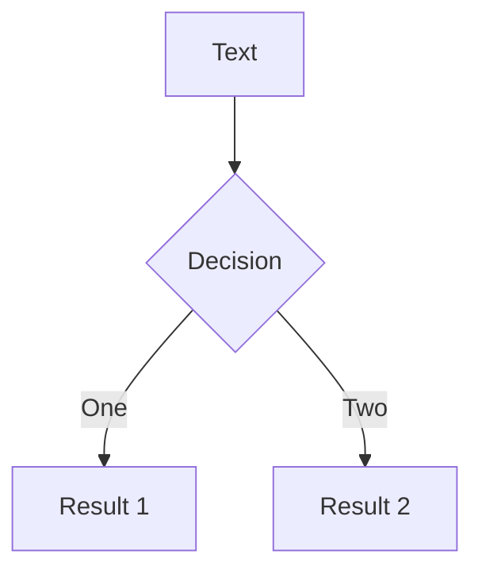

# Title of talk

### By Susmit Vengurlekar


---
src: ./pages/about.md

---


---
src: ./pages/agenda.md
---

---

# Some Code


```python
from dataclasses import dataclass
from typing import Union

@dataclass
class ViewModel:
    column: str
    fill_with_const: bool
    val: Union[str, int, float]

request_data = {
  "column": "Column A",
  "fill_with_const": False,
  "val": "mean"
}

view_model = ViewModel(**request_data)
``` 


---

# Components

<div grid="~ cols-2 gap-4">
<div>

<!-- ./components/Counter.vue -->
<Counter :count="10" m="t-4" />
<Youtube id="V05Pz1tVovs" />

</div>
<div>


<Tweet id="1487415883962019840" scale="0.65" />

</div>
</div>


---

# Diagrams




---

# Editor

```python {monaco}
from dataclasses import dataclass

@dataclass
class ViewModel:
    column: str
    fill_with_const: bool
    val: Union[str, int, float]

request_data = {
  "column": "Column A",
  "fill_with_const": False,
  "val": "mean"
}

view_model = ViewModel(**request_data)
```

---
src: ./pages/connect.md
---
r


---
src: ./pages/qa.md
---
